# Monolithic to Microservice Cloud Native Development - Autonomous Microservice Data Structure Configuration

  

## Introduction

In this lab you will use your Oracle Cloud Trial Account to upload a Data Pump export file to Object Storage and leverage SQL Developer to import the Data Pump export file into an Autonomous Transaction Processing (ATP) Database.

## Lab 100 Objectives

- Clone GIT Repository.
- Create Object Storage Bucket and Upload Data Pump Export File to the Bucket.
- Create an Oracle Cloud Infrastructure (OCI) User and Generate Auth Token.
- Setup SQL Developer Connection to Autonomous Transaction Processing (ATP) Database.
- Create ATP Database user and DBMS_CLOUD Credential.
- Import Data into ATP Database using SQL Developer Data Pump Import Wizard.
- Download and Review Data Pump Import Log.

# Clone GIT Repository

## Download Workshop Artifacts

### **STEP 1**: Open a Terminal Window and Clone GIT Repository

**In the VirtualBox Client Image**, complete the following step to clone the GIT Repository.

  - Right-click on the Desktop and select ```Open Terminal```

	

  - Within the open Terminal Window, issue the following GIT Command

	```
	git clone https://github.com/derekoneil/monolithic-to-microservice.git
	```

	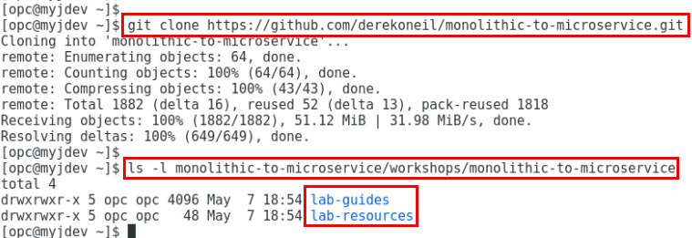

	**Note:**  The GIT clone creates the ```monolithic-to-microservice``` directory which contains contents used throughout the labs. You can validate the clone by entering the following command.

    ```
    ls -l monolithic-to-microservice/workshops/monolithic-to-microservice/
	```

# Object Storage Setup, OCI User Creation and Auth Token Generation

## Initial Preparations

### **STEP 2**: Log in to your OCI dashboard and Switch Regions

  - Open a new browser in the client window by selecting **Applications --> Firefox**.

  
  - From any browser go to

    [https://cloud.oracle.com/en_US/sign-in](https://cloud.oracle.com/en_US/sign-in)

  - Enter your **Cloud Account Name** in the input field and click the **Next** button.

	

  - Enter your **Username** and **Password** in the input fields and click **Sign In**.

	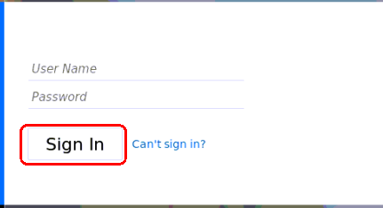
	
  - You are presented with the Oracle Cloud Infrastructure (OCI) Dashboard/Portal

    

  - To switch Regions, click on the Region Drop-Down in the upper right-hand corner and select **us-phoenix-1**

    
	
### **STEP 3**: Create Object Storage Bucket

  - Click the **Menu icon** in the upper left corner to open the navigation menu. Under the **Core Infrastructure** section, select **Object Storage** then **Object Storage** .

	

  - Select the **Compartment** `monoTOmicro` and click **Create Bucket**

	

  - In the **Bucket Name** field, enter `atpData` and click **Create Bucket**

	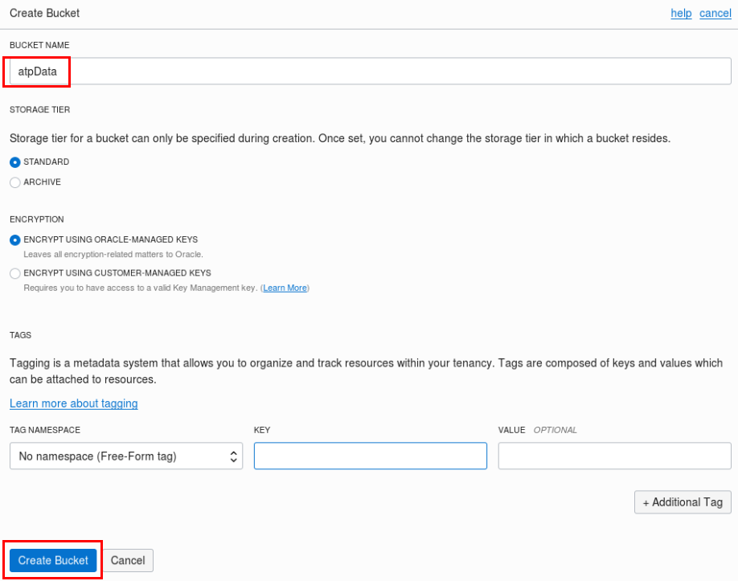

  - In a moment, your new Object Storage Bucket will show up in the list. Once it appears click on the `atpData` bucket url to view the details.

	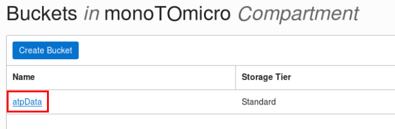

### **STEP 4**: Upload Data Pump File into Object Storage Bucket

  - Next click **Upload Objects**

	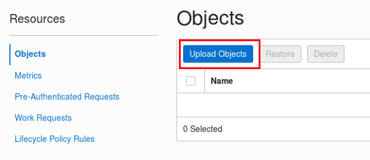

  - Click on the **select files** link, Navigate to the Data Pump DMP file in `.../monolithic-to-microservice/workshops/monolithic-to-microservice/lab-resources/database/expdp_alpha121.dmp` included in the GIT repository you cloned earlier. Click **Open**.

    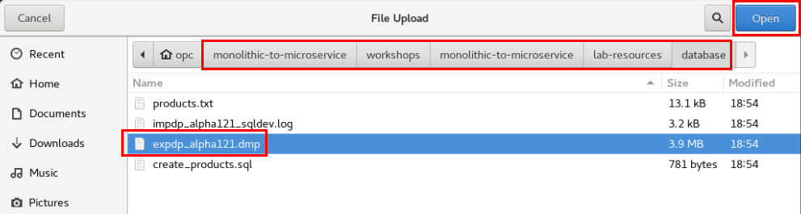

- Click **Upload Objects**.

    

- Click **Close**.

    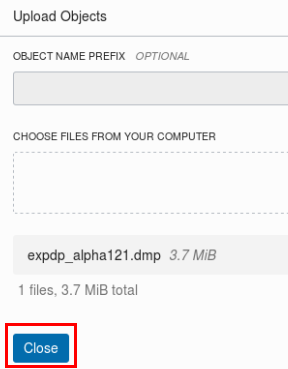

- In a moment, the file will be uploaded to Object Storage.

	

 - We will now collect Object Storage information for later use in **Step 12**.  Open a text editor in the client window by selecting **Applications --> Accessories --> Text Editor**. 

	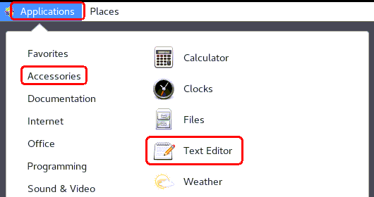

- Click the **triple dot** for the newly uploaded dump file and select **View Object Details**,

	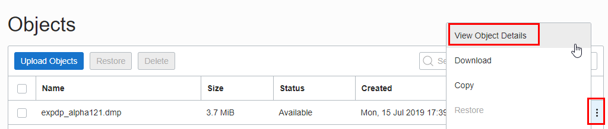

- **Highlight the entire URL_PATH** and while highlighted right-click **Copy**. Save this URL to the text editor (`Should be all on one line`). We'll use it later during the data pump database import. Click the **close** link. 

	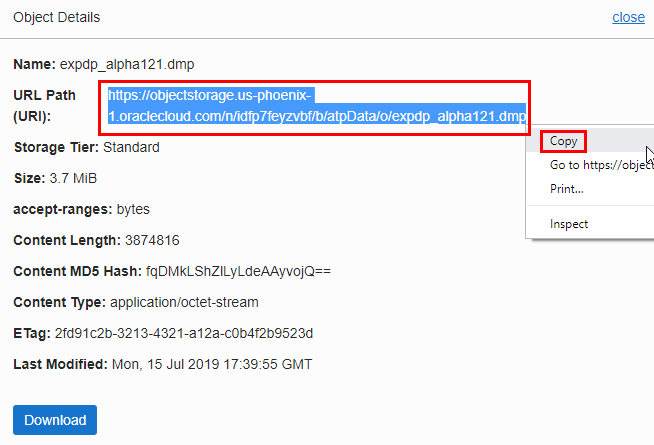

### **STEP 5**: Create OCI User

  - Click the **Menu icon** in the upper left corner to open the navigation menu. Under the **Governance and Administration** section, select **Identity** and select **Users**.

	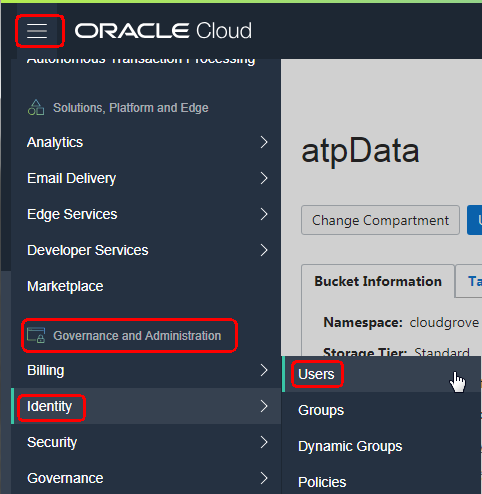

  - Click **Create User**

	

  - Enter the **Name** `impdp-ATP` and desired **Description** and click **Create**

	

  - In a moment, your new user will show up in the list. Once it appears click on the new user `impdp-ATP`.

	

  - Select the **Resource** `Groups` and click **Add User to Group**

	

  - Select the `Administrators` group and click **Add**

	

### **STEP 6**: Generate Auth Token for OCI User

  - For the new user `impdp-ATP`, select the **Resource** `Auth Tokens` and click **Generate Token**

	

  - Enter a **Description** and click **Generate Token**

	

  - Click **Copy** and save the value of the **Generated Token** in a text document. You will need it later when executing the **DBMS_CLOUD.create_credential** package. Click **Close** after copying the token.

	

# Setup SQL Developer Connection to ATP, Create Database User and DBMS_CLOUD Credential in ATP

## Connection to the Cloud Database

### **STEP 7**: Download ATP Wallet Zip File

  - Click the **Menu icon** in the upper left corner to open the navigation menu. Under the **Database** section, select **Autonomous Transaction Processing**.

	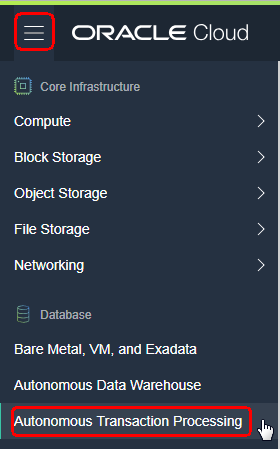

  - Select the **AlphaOffice** ATP Database

	

  - Click **DB Connection**

	

  - Click **Download**

	

  - Enter the **Password** `a1phaOffice1_` and click **Download**

	  **NOTE: There are TWO 1's in the Password... No L's...**

	

  - Select `Save File` and Click **OK**

	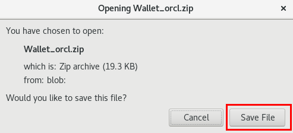

  - The **Wallet_orcl.zip** file was Downloaded to the directory `/home/opc/Downloads/`

	

  - As information, the ATP Wallet file **Wallet_orcl.zip** contains the following files

	

### **STEP 8**: Create SQL Developer Connection to ATP Database

  - Open **SQL Developer** available in the VNC Session or VirtualBox Client Image by **double-clicking** on the Desktop Icon.

	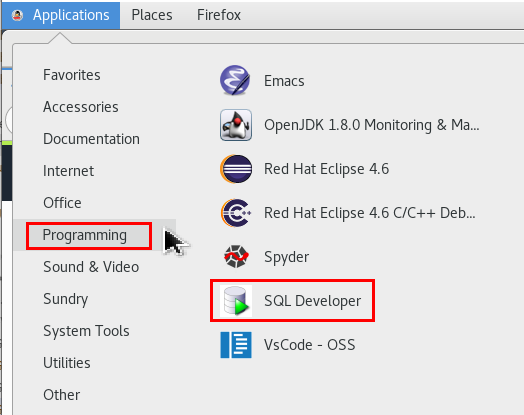  

  - In the **Connections** Pane, Click 

	

  - Enter/Select the following values, click **Test**. After a `Success` **Status**, click **Save**, then **Connect**.

	- **Connection Name:**  ```atp-AlphaOffice-Admin```
	- **Username:**  ```admin```
	- **Password:**  ```a1phaOffice1_```
	- Select ```Save Password```
	- **Connection Type:**  ```Cloud Wallet```
	- **Configuration File:**  The ```Wallet_orcl.zip``` you downloaded in the previous step

	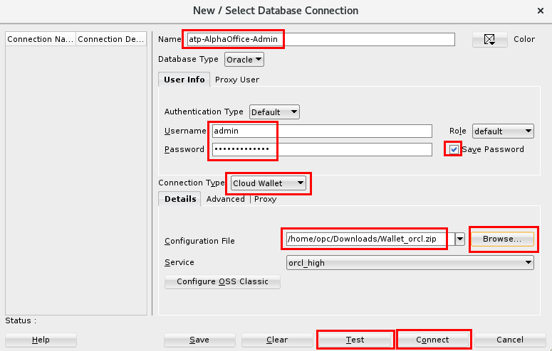

### **STEP 9**: Create Database User in ATP Database

  - You should see the **SQL Developer Worksheet** open. Once opened execute the following SQL Statements to create the `alpha` database user.

	```
	create user alpha identified by "a1phaOffice1_";
	grant dwrole to alpha;
	```

	

### **STEP 10**: Create DBMS_CLOUD Credential

  - In the same **SQL Developer Worksheet**, execute the following SQL Statements to create the **DBMS_CLOUD Credential** `impdp_OBJ_STORE` **using the Auth Token you generated in STEP 6**. Look for the PL/SQL procedure to be successfully completed.

	```
	begin
	  DBMS_CLOUD.create_credential(
		credential_name => 'impdp_OBJ_STORE',
		username => 'impdp-ATP',
		password => 'Auth Token Generated in STEP 6'
	  );
	end;
	/
	```

	

# Import Data Pump Export file into ATP Databse and Download/Inspect Data Pump Log File

## Populate the Database

### **STEP 11**: Add DBA View and ATP SQL Developer Connection

  - In **SQL Developer**, click on the menu **View** and select **DBA**

	

  - You will now see the **DBA** pane in the lower, left side of **SQL Developer**

	

  - Next, you will add the **Connection** you created in STEP 8 to the **DBA** pane. Click  below **DBA**, select the Connection `atp-AlphaOffice-Admin` and click **OK**

	

  - Now you will see the connection in the **DBA** pane.

	

### **STEP 12**: Import Data into ATP Instance using Data Pump Import Wizard

  - Expand the `atp-AlphaOffice-Admin` connection under the **DBA** pane until the **Data Pump** section is expanded.

	

  - Right-click on **Import Jobs** and select **Data Pump Import Wizard...**

	

  - On **Step 1** of the **Import Wizard**, select and/or enter the following and click **Next**.  You will use the **URL PATH** value you saved in the text editor at the end of **Step 4**.

	**Example:** Your value for **File Names or URI** will be different.

	- **Type of Import:** ```Full```
	- **Credentials or Directories:** ```IMPDP_OBJ_STORE``` (Created in STEP 10)
	- **File Names or URI:** ```<PASTE YOUR URL HERE.. example is shown>: https://objectstorage.us-phoenix-1.oraclecloud.com/n/idfp7feyzvbf/b/atpData/o/expdp_alpha121.dmp``` (Saved from STEP 4)

	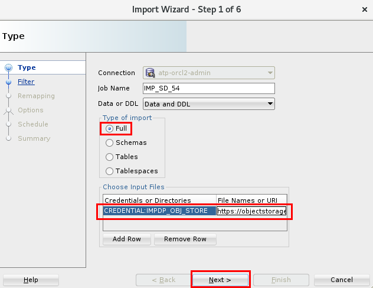

  - It can take a minute for the **Next** button to be enabled.  You will see a `Waiting...` message until the **Next** button is enabled.

	 **NOTE: If you get an error on the import double check that you entered the proper USERNAME and AUTH TOKEN in the prodecure in Step 10. If you have to create another DBMS_CLOUD credential you can always give the CREDENTIAL NAME a new name and use that new name here in Step 12. Also verify that your `impdp-ATP` user has been put into the Administrators Group (Step 5). If these all look good and it still doesn't read you can use this Public facing URL for the `File Names or URI` parameter:** 

	```
	https://objectstorage.us-ashburn-1.oraclecloud.com/p/wechxc-Li-TVh3K_wXU8NvwmSBHS8ka9lfP104OXN9s/n/natdcshjumpstartprod/b/atpData/o/expdp_alpha121.dmp
	```

 - On **Step 2** accept the Defaults and click **Next**.  

	

  - Accept the Defaults and click **Next** on **Step 3** of the **Import Wizard**.

	

  - Accept the Defaults and click **Next** on **Step 4** of the **Import Wizard**.

	

  - Accept the Defaults and click **Next** on **Step 5** of the **Import Wizard**.

	

  - Review the **Summary** and click **Finish** on **Step 6** of the **Import Wizard**.

	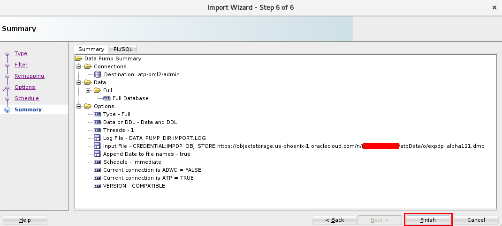

	

  - Once the **Setting up Data Pump job** window closes, click on the **Import Job** to monitor the **State** of the Import. The state will transition from `EXECUTING` to a state of `COMPLETING` to a final state of `NOT RUNNING`. Be sure to click the Refresh icon  to get the latest **State**.

	

  - To verify the **Data Pump** import job created and loaded the tables, run the following SQL statement

	```
	select table_name, num_rows from all_tables where owner = 'ALPHA' order by 1;
	```

	

**This completes the Lab!**

**You are ready to proceed to [Lab 200](LabGuide200Virtual.md)**
	
### **STEP 13**: Review Data Pump Import Log (OPTIONAL)

If you wish to view the output of Data Pump import log, please follow the below steps.

The **DBMS_CLOUD** package provides the **LIST_FILES** and **PUT_OBJECTS** subprogams which allow you to interact with an **Autonomous Transaction Processing Database**

  - To view what files are in the Data Pump directory `DATA_PUMP_DIR`, issue the following command in **SQL Developer**.

	```
	SELECT * FROM DBMS_CLOUD.LIST_FILES('DATA_PUMP_DIR');
	```

	

  - To view the **Data Pump** import log file `IMPORT-18_50_00.LOG` just created by the **Import Job** executed in the previous step, we leverage the **PUT_OBJECTS** subprogram to copy the file from the ATP database to an **Object Storage Bucket** where we can download and review it. Execute the following command in **SQL Developer**

	**Note:** Your values for **REGION** , **OBJECT_STORAGE_NAMESPACE** and **file_name** may/will be different.
	
	```
	BEGIN
	  DBMS_CLOUD.PUT_OBJECT(
		credential_name => 'impdp_OBJ_STORE',
		object_uri => 'https://swiftobjectstorage.{REGION}.oraclecloud.com/v1/{OBJECT_STORAGE_NAMESPACE}/atpData/impdp_alpha121_sqldev.log',
		directory_name  => 'DATA_PUMP_DIR',
		file_name => 'IMPORT-18_50_00.LOG');
	END;
	/
	```

	

  - If you navigate to **Object Storage Bucket** `atpData`, you will now see the file `impdp_alpha121_sqldev.log` file. Click  to the right of the object name and select **Download**.

	

  - Once downloaded, open it using a text editor to review the import messages. You will notice the **Import Job Name** `IMP_SD_84-18_49_56` in **SQL Developer** is also referenced in the log file.

	