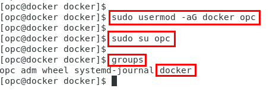

# Monolithic to Microservice Cloud Native Development - Building, Containerizing Java REST Services

  

## Introduction
In this lab you will deploy a Java application using Docker. This will require you to modify a couple of configuration files so that the application queries your specific Autonomous Transaction Processing (ATP) database instance you created in Lab 050 and populated with a schema using SQL Developer in Lab 100.

## Lab 200 Objectives

- SSH into the Compute Instance
- Create a baseline Docker image and then deploy a java REST application
- Customize the container to connect to your ATP DB and save a new image
- Run a Docker container based off of your new image

# Log into  your Trial Account

## Your Trial Account

### **STEP 1**: Log in to your OCI dashboard and Switch Regions

- If your not logged into your trail account, re-login by going to:

    [https://cloud.oracle.com/en_US/sign-in](https://cloud.oracle.com/en_US/sign-in)

- Enter your **Cloud Account Name** in the input field and click **Next**.

  

- Enter your **Username** and **Password** in the input fields and click **Sign In**.

  

- You are presented with the Oracle Cloud Infrastructure (OCI) Dashboard/Portal

  

- To switch Regions, click on the Region Drop-Down in the upper right-hand corner and select **us-phoenix-1**

  
  
# Deploy the AlphaOffice REST Services using Docker

In this section you will clone a github repository that contains a Java REST Application. Then, you will modify the configuration to point to your ATP database. After successful testing you will create a new Docker image.

## Deploy AlphaOffice REST Services

### **STEP 2**: Copy the DB Wallet file into the proper Location

- Before we get into pulling down the completed java .war of the application a couple of screen shots will be helpful to get you a sense of what's going on in the application. The application will be deployed into an application server (Glassfish) and be listening on port 8080 on the following URI's depending. The REST call coming in will determine the method called:

    - restCall
    - restCall/{product-id}

  GET, PUT, PATCH, DELETE and POST methods are supported taking JSON formatted input:

  

- The source code for this is here:  
    [RestCall](https://github.com/Sasankaa/alpha-office-product-catalog-webservice/blob/master/AlphaProductsRestService/src/java/com/oracle/ws/RestCallResource.java)

- The appropriate method determining what operation to do with your ATP database is in the ATPDBUtils class. A connection is made to the database (You will update a configuration properties file further on in this lab to tell the program what DB to connect to) and the operation is carried out:

  

- The source code for this is here:  
    [ATPDBUtils](https://github.com/Sasankaa/alpha-office-product-catalog-webservice/blob/master/AlphaProductsRestService/src/java/com/oracle/db/ATPDBUtils.java)

- **In a Terminal Window within the VNC session** change directory into the location you cloned the GitHub repository in Lab 100. **Type**:

  ```
  cd /home/opc/monolithic-to-microservice/workshops/monolithic-to-microservice/lab-resources/docker
  ```

- Type **ls** to see the baseline **glassfish_module** directory, a **AlphaProductsRestService.war** file, **dbconfig.properties**, **sqlnet.ora** and a **Dockerfile**:

  ```
  ls
  ```
  

- Copy the database wallet file you downloaded in Lab 100 (Recall that the file is in `/home/opc/Downloads`) to `/home/opc/monolithic-to-microservice/workshops/monolithic-to-microservice/lab-resources/docker`:

  **NOTE the "dot" at the end of the next command**

  ```
  cp /home/opc/Downloads/Wallet_orcl.zip .
  ```

- Now type **ls**. You should see your wallet file in the directory before proceeding.

  

### **STEP 3**: Edit your ATP instance specific information

In this step you are going to edit the `dbconfig.properties` file to add your database instance connection name.

- Using **vi** edit the **dbconfig.properties** file and add your connection property.

  ```
  vi dbconfig.properties
  ```

- From the OCI console select the **hamburger menu** in the upper left hand side on the page. Click the **Autonomous Transaction Processing** link:

  

- Ensure that your in the **momoTOmicro** Compartment:

  

- Click the link of your database:

  

- Click the **DB Connection** button:

  

- Here you find the connection strings associated with your database:

  


  We will be using the **MEDIUM** connection name in the application.

- In vi edit the **dbconfig.properties** `dbinstance` parameter to contain the **orcl_MEDIUM** connection string and save the file:

  

- _If your NOT using the default wallet name of `Wallet_orcl.zip` then you will also need to edit the **Dockerfile**_ to point to your instance specific wallet, otherwise, you can skip ahead to Step 11.

- If applicable, **edit** the following two locations within the `Dockerfile` (In this example mattoATP is the name of the ATP instance and respective wallet file):

  

### **STEP 4**: Build the Docker image

The docker build will take a baseline java ready docker image from Docker Hub, add the Glassfish 4.1.1 application server along with your ATP DB instance wallet file and then extract the **AlphaProductsRestService.war** inside the container. The application server will be running on port 8080. If you recall you opened port 8080 in the Networking Security List earlier in this lab so access from the internet can occur.

- Grant the `opc` user temporary permission to use the docker daemon. **Type** the following commands to enable:

  ```
  sudo usermod -aG docker opc
  sudo su opc
  groups
  ```
  - You will now see that the docker group id is now associated with the opc user. 

  

- **Type:**

  ```
  docker build -t alphaoffice .
  ```

  The build will take a few minutes and should be successful:

  

    ...

  

- **Here's a more annotated version of the Dockerfile so you can see what the steps are doing while building the `alphaoffice` image**:

  ```
  # Grab a baseline, java capable Docker image that we will add to:

  FROM        java:8-jdk

  #Set Environment variables that will be visible inside the Docker container when it is spun up from the alphaoffice Docker image. These directory references will be seen inside the container when it is running:

  ENV         JAVA_HOME         /usr/lib/jvm/java-8-openjdk-amd64
  ENV         GLASSFISH_HOME    /usr/local/glassfish4
  ENV         PATH              $PATH:$JAVA_HOME/bin:$GLASSFISH_HOME/bin
  ENV         TNS_ADMIN         /usr/local/wallet_DB/

  #Run a sequence of commands to install needed programs like zip, curl, etc:

  RUN         apt-get update && \
              apt-get install -y curl unzip zip inotify-tools && \
              rm -rf /var/lib/apt/lists/*

  #Download and install the Glassfish server. Make directories for the DB Wallet and the REST application that we will be copying into the image. Then, do some directory module cleanup to accomodate the requirements of the AlphaProductsRestService.war (Java REST application):

  RUN         curl -L -o /tmp/glassfish-4.1.zip https://download.oracle.com/glassfish/4.1.1/release/glassfish-4.1.1.zip && \
              unzip /tmp/glassfish-4.1.zip -d /usr/local && \
              rm -rf /usr/local/glassfish4/glassfish/domains/domain1/osgi-cache/felix && \
  #           rm -rf /usr/local/glassfish4/glassfish/modules/jackson* && \
              rm -f /tmp/glassfish-4.1.zip && \
              mkdir /usr/local/wallet_DB && \
              mkdir /usr/local/alpha

  #Copy local (HOST-based) files into the docker image directories:
 
  COPY AlphaProductsRestService.war /usr/local/alpha
  COPY Wallet_orcl.zip /usr/local/wallet_DB

  #Unzip the DB Wallet and REST application .jar files into their respective directories: 

  RUN         unzip /usr/local/wallet_DB/Wallet_orcl.zip -d /usr/local/wallet_DB/ && \
              cd /usr/local/alpha && \
              jar xvf /usr/local/alpha/AlphaProductsRestService.war && \
              rm /usr/local/alpha/AlphaProductsRestService.war

  #Copy a modifed version of sqlnet.ora from the (HOST) into the Wallet directory. This tells the DB connection to use Oracle TNS connection lookups (Noted with the TNS_ADMIN environment variable set earlier in the Dockerfile). Also copy some required .jar files from the (HOST) to support the application:

  COPY sqlnet.ora /usr/local/wallet_DB
  COPY glassfish_module/* /usr/local/glassfish4/glassfish/modules/

  *Glassfish server will use port 8080 for the application deployments:

  EXPOSE      8080

  WORKDIR     /usr/local/glassfish4

  #Iniital docker container startup command. Verbose flag causes the Glassfish server process to remain in the foreground:
  
  CMD         asadmin start-domain --verbose
  ```


- Typing **docker images** reveals the new image:

  ```
  docker images
  ```

  

- Start a container based on the alphaoffice image mapping port 8080 to the same port on the HOST naming the container alphaoffice. **Type OR Copy and Paste**:

  ```
  docker run -d --name alphaoffice -p=8080:8080 alphaoffice
  ```
  

- **docker ps** shows the running container. You'll note the asadmin command we stipulated in the CMD of the Dockerfile build is executed and running (This starts up the Glassfish app server):

  ```
  docker ps
  ```

  

### **STEP 5**: Copy the database properties file into the container

In this step you will copy the `dbconfig.properties` file modifed in a previous step into the running container. Then you will go into the container and verify all the copied and modied files look good and are in their proper locations.

**NOTE:** All of this could be executed automatically at build time but we want you to give a feel for docker commands and what's going on inside the newly executed container.

- **Type OR Copy and Paste** the following:

  ```
  docker cp dbconfig.properties alphaoffice:/usr/local/alpha/WEB-INF/classes/com/oracle/db/
  ```  

  

### **STEP 6**: Verify files inside the container and deploy the AlphaProductsRestService application

- **Type OR Copy and Paste:**

  ```
  docker exec --env COLUMNS=`tput cols` -it alphaoffice bash
  ```

   You'll notice you're now inside the docker container:

    

- We need to verify our `dbconfig.properties` and `sqlnet.ora` files made it into the environment. In the `sqlnet.ora` file DIRECTORY should be set to $TNS_ADMIN and in the `dbconfig.properties` file the dbinstance parameter should reflect your database connection string. **Type OR Copy and Paste** the following commands:

  ```
  cat /usr/local/wallet_DB/sqlnet.ora
  cat /usr/local/alpha/WEB-INF/classes/com/oracle/db/dbconfig.properties
  ```

- You should see the changes reflected in the outputs:

  

- Bundle up a new .war file by running the following commands:

  ```
  cd /usr/local/alpha
  jar -cvf AlphaProductsRestService.war *
  ```  

- Copy the .war file to the Glassfish application server directory for auto deployment. **Type OR Copy and Paste:**

  ```
  cp AlphaProductsRestService.war /usr/local/glassfish4/glassfish/domains/domain1/autodeploy/AlphaProductsRestService.war
  ```

- Confirm the application was deployed by **typing** the following:

  ```
  cd /usr/local/glassfish4/bin
  ./asadmin

  - Once inside the Glassfish admin tool type:
    list-applications
  ```

  - The application should show as deployed:

    

- **Type: `exit` twice** to get out of the admin tool and the container.

    

- In a browser, test the application by using the Public IP Address of the VM instance. The first time you test the endpoint. It may take several seconds before you see data returned...

  ```
  http://<YOUR-PUBLIC-IP>:8080/AlphaProductsRestService/webresources/restCall/
  ```
  Example:
  `http://129.213.109.189:8080/AlphaProductsRestService/webresources/restCall/`


  

- Now, test querying one product by adding the Product ID to the REST call:

  ```
   http://<YOUR-PUBLIC-IP>:8080/AlphaProductsRestService/webresources/restCall/1050
  ```

  Example:
  `http://129.213.109.189:8080/AlphaProductsRestService/webresources/restCall/1050`

  

- At any point you can check the container logs by typing:

  ```
  docker logs alphaoffice
  ```

- If everything looks OK then commit a new docker image with the completed application deployment. **Type:**

  ```
  docker commit alphaoffice alphaoffice-rest
  ```
- Typing **docker images** will show the new image created:

  

 - Stop and remove the original container by executing the following:

   ```
   docker stop alphaoffice
   docker rm alphaoffice
   ```

- Fire up a container using the new `alphaoffice-rest` image:

  ```
  docker run -d --name alphaoffice -p=8080:8080 alphaoffice-rest
  ```

- You should again be able to go to the REST URL and see data returned from your ATP database.

  ```
  http://<YOUR-PUBLIC-IP>:8080/AlphaProductsRestService/webresources/restCall/
  ```

- This new docker image will be used in Lab 300.

**This completes the Lab!**

**You are ready to proceed to [Lab 300](LabGuide300.md)**
