# Monolithic to Microservice Cloud Native Development - Building, Containerizing Java REST Services

  

## Introduction
In this lab you will create ssh key pairs, login into your Trial, create a VCN (Virtual Compute Network), create a new compute instance and install docker / git into the instance.

## Lab 200 Objectives

- Create the baseline infrastructure to support a Compute instance
- Create a SSH key pair
- SSH into the instance: Install Docker and GIT
- Create a baseline Docker image and then deploy a java REST application
- Customize the container to connect to your ATP DB and save a new image
- Run a Docker container based off of your new image

# Log into  your Trial Account and Create Infrastructure

You will create all required infrastructure components within your Trail account.

## Your Trial Account

### **STEP 1**: Log in to your OCI dashboard and Switch Regions

- If your not logged into your trail account, re-login by going to:

    [https://cloud.oracle.com/en_US/sign-in](https://cloud.oracle.com/en_US/sign-in)

- Enter your **Cloud Account Name** in the input field and click **Next**.

  

- Enter your **Username** and **Password** in the input fields and click **Sign In**.

  

- You are presented with the Oracle Cloud Infrastructure (OCI) Dashboard/Portal

  

- To switch Regions, click on the Region Drop-Down in the upper right-hand corner and select **us-phoenix-1**

  
  
### **STEP 2**: Create a Virtual Compute Network

We need a default VCN to define our networking within the `monoTOmicro` compartment. This is where Subnets and Security Lists are defined for each Availablity Domain in your Tenancy. Oracle Cloud Infrastructure is hosted in regions and availability domains. A region is a localized geographic area, and an availability domain is one or more data centers located within a region. A region is composed of several availability domains. Availability domains are isolated from each other, fault tolerant, and very unlikely to fail simultaneously. Because availability domains do not share infrastructure such as power or cooling, or the internal availability domain network, a failure at one availability domain is unlikely to impact the availability of the others.

All the availability domains in a region are connected to each other by a low latency, high bandwidth network, which makes it possible for you to provide high-availability connectivity to the Internet and customer premises, and to build replicated systems in multiple availability domains for both high-availability and disaster recovery.

- Click the **hamburger icon** in the upper left corner to open the navigation menu. Under the **Networking** section of the menu, click **Virtual Cloud Networks**

    

- Select your compartment:

    

- Click **Create Virtual Cloud Network**.

    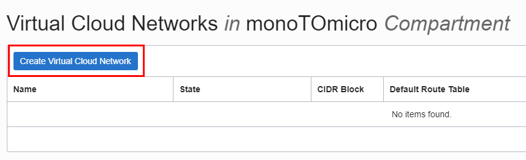

- Fill in and/or select the follow values as highlighted below:

    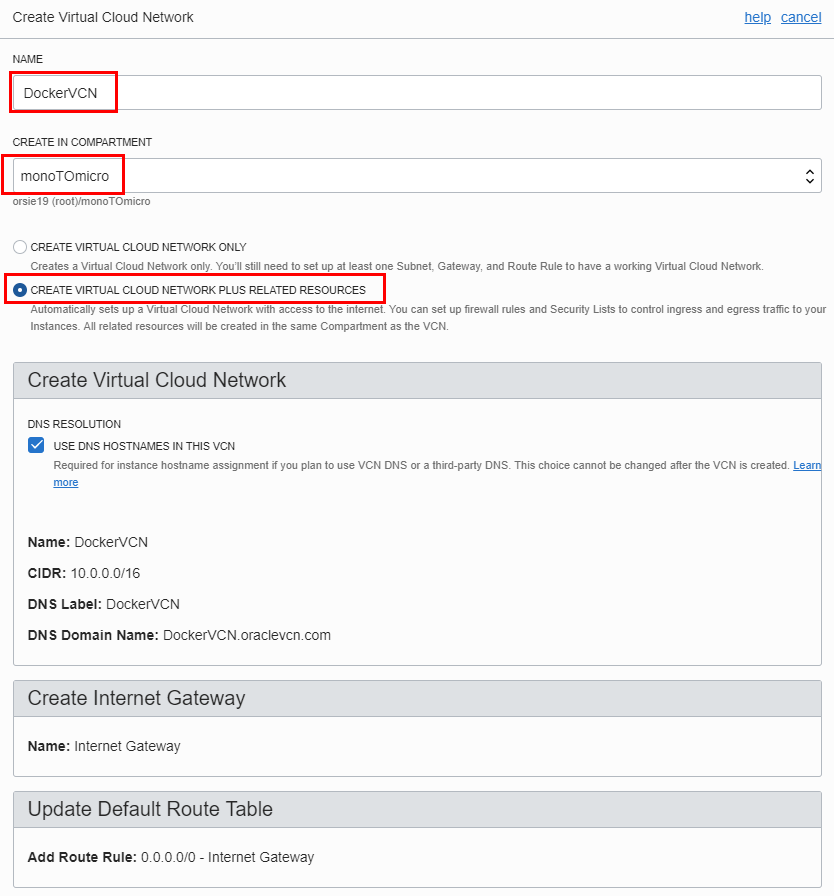

    

- Click **Create Virtual Cloud Network**

- Click **Close** on the details page:

    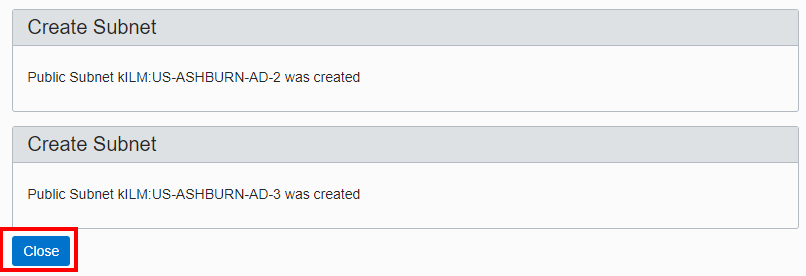

- You will see:

    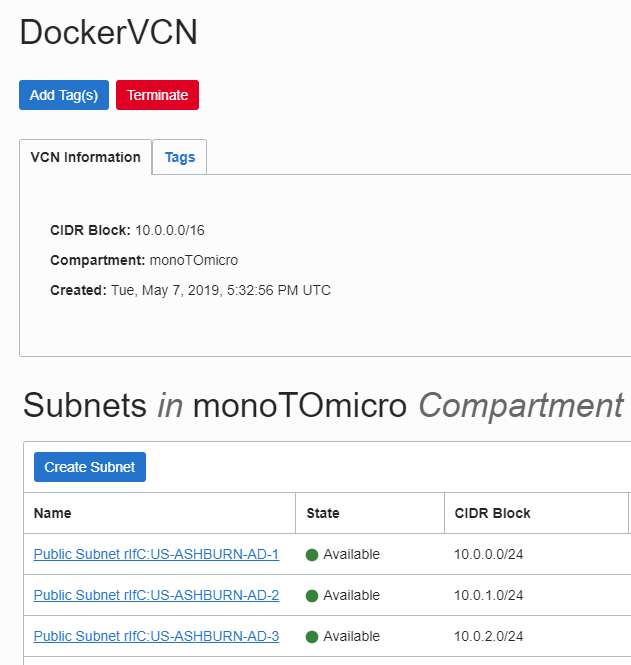

### **STEP 3**: Add a Security List entry

A security list provides a virtual firewall for an instance, with ingress and egress rules that specify the types of traffic allowed in and out. Each security list is enforced at the instance level. However, you configure your security lists at the subnet level, which means that all instances in a given subnet are subject to the same set of rules. The security lists apply to a given instance whether it's talking with another instance in the VCN or a host outside the VCN.

- Click the **Security Lists** link:

    

- Click on the **Default Security List for DockerVCN** link:

    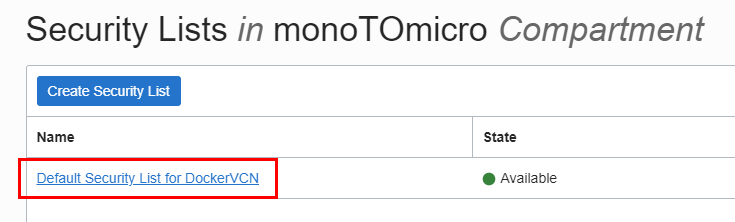

  **NOTE:** For the purposes of the upcoming Docker application deployment we need to add an Ingress Rule that allows access from the Internet to port 8080.

- Click **Add Ingress Rules**:

  **`NOTE: DO NOT EDIT AN ALREADY EXISTING RULE, ADD A NEW ONE`**

  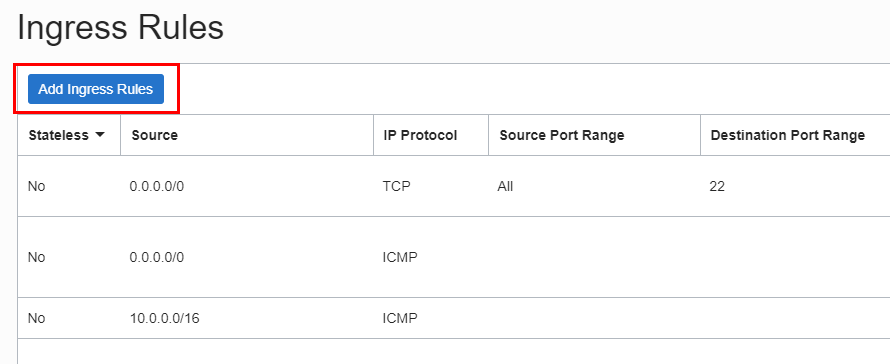

- In the dialog **Enter the following** and then click the **Add Ingress Rules** button:

  **NOTE:** Leave all other values at default.

  ```
  Source CIDR: 0.0.0.0/0
  Destination Port Range: 8080
  ```

  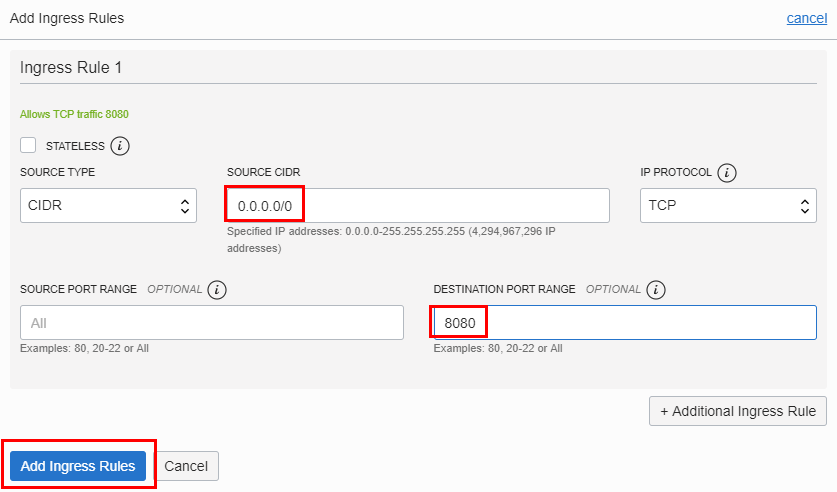

- Your Ingress Rules should look like:

    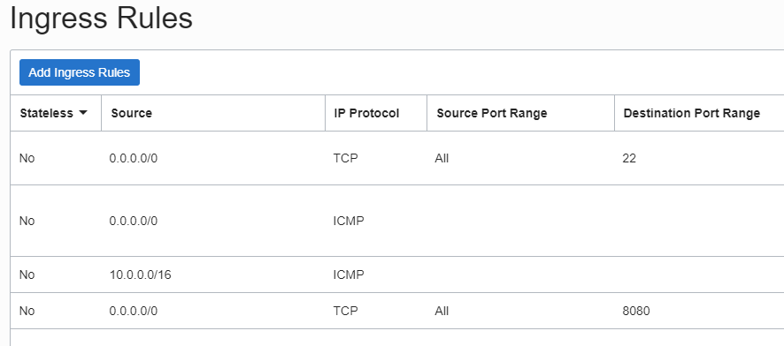

### **STEP 4**: Create SSH Key Pair

Before we create the Compute instance that will contain Docker and application deployments we need to create a ssh key pair so we'll be able to securely connect to the instance and do the Docker installation, etc. **We'll use the VNC session OR Virtual Box Client Image to do this... depending on whether your in the Instructor Led or Virtual version of this Workshop**.

- **In the VNC or Client Image Session**: Open a Terminal and navigate to your home directory.

  ```
  cd /home/opc
  ```

  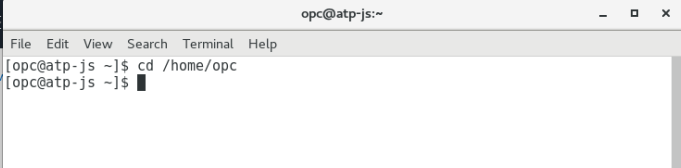

- **Type** the following: (**You don't have to worry about any passphrases. Press enter to proceed without a passphrase.**)

  ```
  ssh-keygen -b 2048 -t rsa -f dockerkey
  ```

- Your key pair is now in the current directory:

  

- Open up the pubic key file in an editor (vi) by typing **vi** in the terminal window.

  ```
  vi dockerkey.pub
  ```

  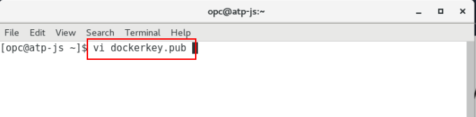

- **Select and Copy** the entire contents. This will be used in the Compute instance creation in the next Step.   

    

- Press the  **Escape Key** and type **wq!** to exit vi.

### **STEP 5**: Create a Compute Instance

- Go back to your OCI console and from the hamburger menu in the upper left hand corner select **Compute-->Instances**.

  

- Click **Create Instance**.

 

- **Type or Select** the following in the **Create Compute Instance** section of the dialog:

  ```
  Name: Docker
  Availability Domain: AD 1 (Use default AD 1)
  Boot Volume: Oracle-Provided OS Image
  Image Operating System: Oracle Linux 7.6 (Default)
  Shape Type: Virtual Machine (Default)
  Shape: VM.Standard.E2.2
  ```

- For the Instance Shape click on the **Change Shape** button. 

  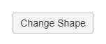

- Select the shape **VM.Standard.E2.2** and click **Select Shape**.

  **NOTE: If the VM.Standard.E2.2 shape is not availible then select VM.Standard2.2**

  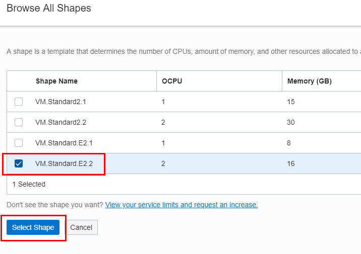

- After entering the _Docker_ instance details your screen should look like:

   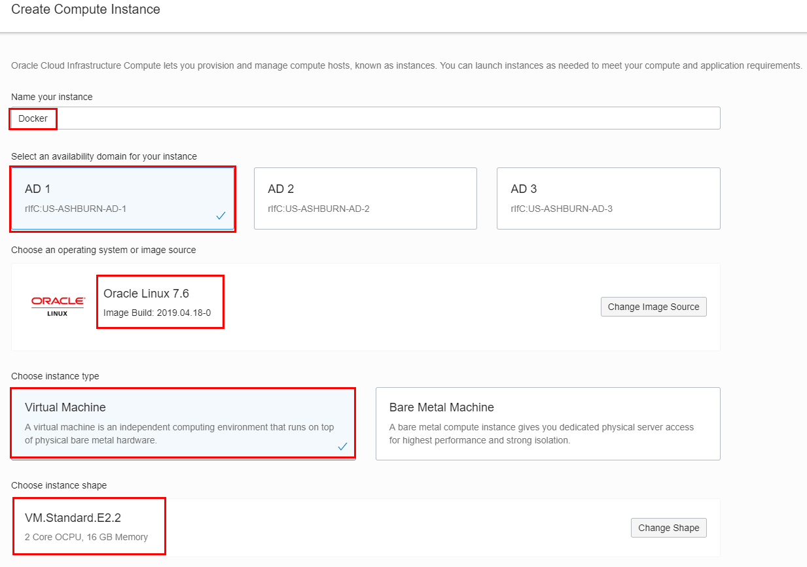

- Scroll down furthur on the page to insert your PUBLIC SSH Key
**NOTE:** You will paste the public key you copied in Step 4 into the SSH KEY field by selecting the **Paste SSH Keys** radio button. `The public key should all be on ONE LINE`

   

- In the Configure networking section you will take ALL of the defaults as shown:

   

- Click **Create**

  After a few minutes you should see a running instance with a Public IP Address. _**Copy the Public IP Address** and save it off into a text editor, we will be using this IP in the next step._

   


### **STEP 6**: SSH into the Instance and install Docker

- Set the correct permissions for the docker key by **Typing OR Copy and Pasting** the following commands in your terminal window. Make sure the dockerkey file has the permissions of **600** (chmod 600 dockerkey) and ssh into the compute instance `substituting your IP address`.

  Example:

  ```
  cd /home/opc
  chmod 600 dockerkey
  ssh -i ./dockerkey opc@<Paste in Your Public IP>
  ```

  

### **STEP 7**: Install and configure Docker and GIT

Docker and GIT are required for the subsuquent labs. You will install the Docker engine, enable it to start on re-boot, grant docker privledges to the `opc` user and finally install GIT.

- **Type** the following:

  ```
  sudo -s
  yum install docker-engine
  ```

- _During the **yum install docker-engine** command press **Y** when asked if installation is ok._ Screenshot at the end of the Docker installation:

   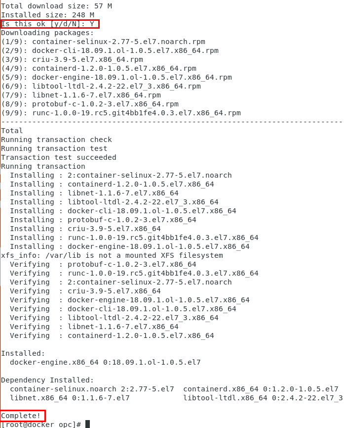

- Next grant the proper privileges to the opc user.
  ```
  usermod -aG docker opc
  systemctl enable docker
  systemctl start docker
  ```

   

- **Type** the following, select **Y** when asked if it is ok to install:

  ```
  yum install git
  ```

- Screenshot at the end of the GIT installation:

   

- **Type** the following to verify good installations:

  ```
  su - opc
  docker version
  docker images
  git --version
  ```

   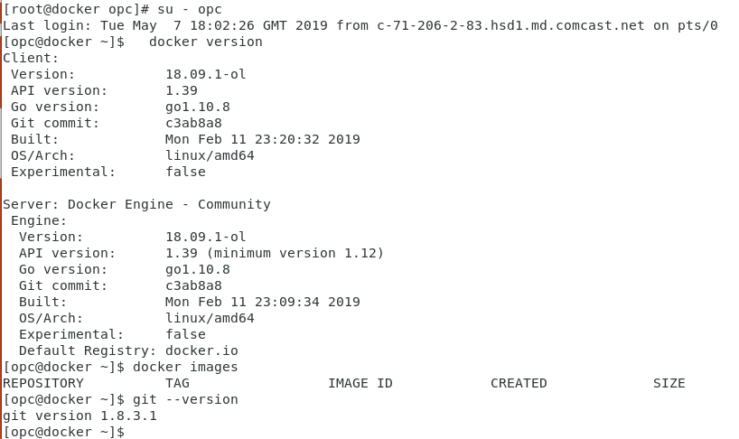

### **STEP 8**: Edit /etc/sysconfig/selinux

Set the server to Permissive mode and also ensure that permissive mode survives re-boots by editing `/etc/sysconfig/selinux`

- Using vi, change the SELINUX line to **permissive**. **Type** the following: (**NOTE**: You need to be the root user to edit this file)

  ```
  sudo -s
  vi /etc/sysconfig/selinux
  ```

- After the changes are made save the file and exit out of vi.

  **NOTE:** If new to vi, press the letter `i` to edit text. To save press Escape, then type `:wq!`.

   

- Now, **Type** the following:

  ```
  setenforce 0
  sestatus
  ```

- Verify that your server is in permissive mode.

   

- **Type** the following to exit out of `root` and go back and verify that you're now the `opc` user:

  ```
  exit
  whoami
  ```

  


# Deploy the AlphaOffice REST Services using Docker

In this section you will clone a github repository that contains a Java REST Application. Then, you will modify the configuration to point to your ATP database. After successful testing you will create a new Docker image.

## Deploy AlphaOffice REST Services

### **STEP 9**: Clone the git repository and copy the wallet file

- Before we get into pulling down the completed java .war of the application a couple of screen shots will be helpful to get you a sense of what's going on in the application. The application will be deployed into an application server (Glassfish) and be listening on port 8080 on the following URI's depending. The REST call coming in will determine the method called:

    - restCall
    - restCall/{product-id}

  GET, PUT, PATCH, DELETE and POST methods are supported taking JSON formatted input:

  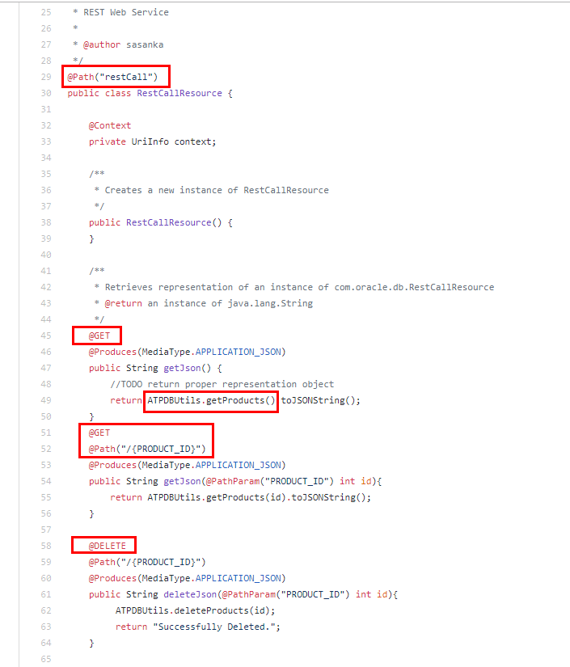

- The source code for this is here:  
    [RestCall](https://github.com/Sasankaa/alpha-office-product-catalog-webservice/blob/master/AlphaProductsRestService/src/java/com/oracle/ws/RestCallResource.java)

- The appropriate method determining what operation to do with your ATP database is in the ATPDBUtils class. A connection is made to the database (You will update a configuration properties file further on in this lab to tell the program what DB to connect to) and the operation is carried out:

  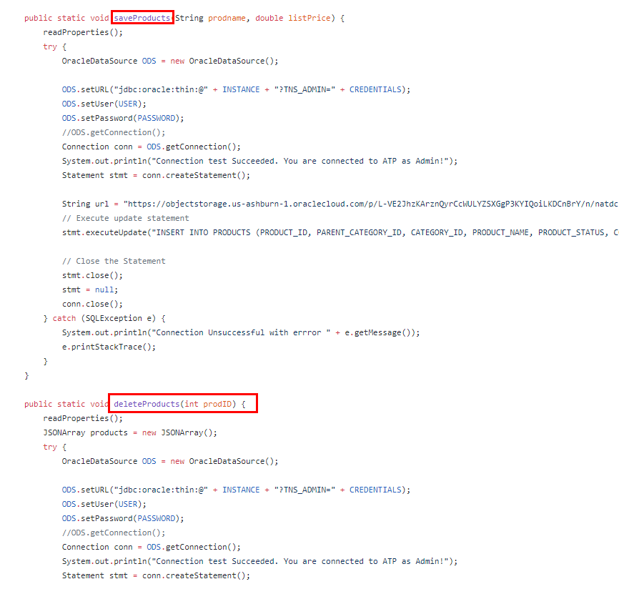

- The source code for this is here:  
    [ATPDBUtils](https://github.com/Sasankaa/alpha-office-product-catalog-webservice/blob/master/AlphaProductsRestService/src/java/com/oracle/db/ATPDBUtils.java)

- Clone the git repository to your newly created OCI VM (Docker). This repo contains support files and the baseline Alpha Office application that you will modify to connect to your ATP database.

- **Type OR Copy and Paste**:

  ```
  cd ~
  git clone https://github.com/derekoneil/monolithic-to-microservice.git
  ```

  

- From the directory you just cloned the repository into **Type**:

  ```
  cd /home/opc/monolithic-to-microservice/workshops/monolithic-to-microservice/lab-resources/docker
  ```

- Type **ls** to see the baseline **glassfish_module** directory, a **AlphaProductsRestService.war** file, **dbconfig.properties**, **sqlnet.ora** and a **Dockerfile**:

  ```
  ls
  ```
  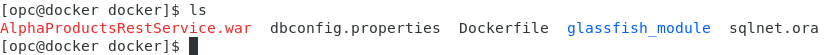

- **From the VNC session or Client Virtual Box image** (depending on whether or doing the Instructor Led or Virtual version of this workshop): Open up a new Terminal windw by right-clicking on the Desktop and selecting **Open Terminal**:

  


- Copy the database wallet file you downloaded in Lab 100 (Recall that the file is in `/home/opc/Downloads`). You will scp this wallet file to the `/home/opc/monolithic-to-microservice/workshops/monolithic-to-microservice/lab-resources/docker` directory in the new OCI VM (Docker):

  ```
  scp -i ./dockerkey /home/opc/Downloads/Wallet_orcl.zip opc@<YOUR-PUBLIC-IP>:/home/opc/monolithic-to-microservice/workshops/monolithic-to-microservice/lab-resources/docker
  ```

  Example: (**The default wallet name is Wallet_orcl.zip**)

  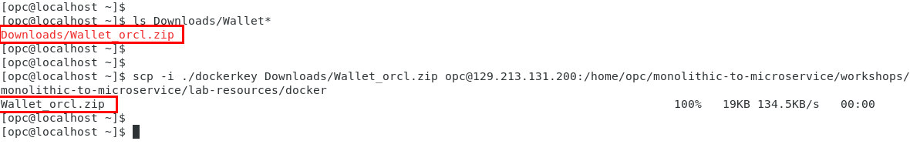

- **Now, Return to the SSH session into your OCI VM (Docker).** and type **ls**. You should see your wallet file in the directory before proceeding.

  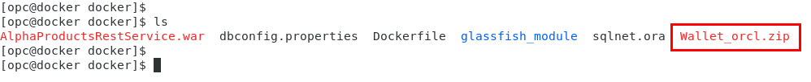

### **STEP 10**: Edit your ATP instance specific information

In this step you are going to edit the `dbconfig.properties` file to add your database instance connection name.

- Using **vi** edit the **dbconfig.properties** file and add your connection property.

  ```
  vi dbconfig.properties
  ```

- From the OCI console select the **hamburger menu** in the upper left hand side on the page. Click the **Autonomous Transaction Processing** link:

  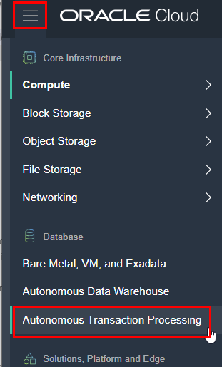

- Ensure that your in the **momoTOmicro** Compartment:

  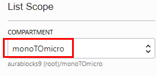

- Click the link of your database:

  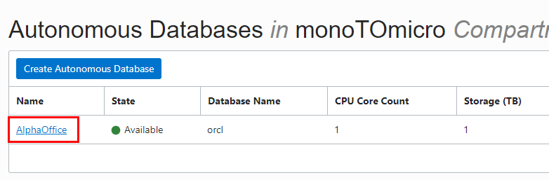

- Click the **DB Connection** button:

  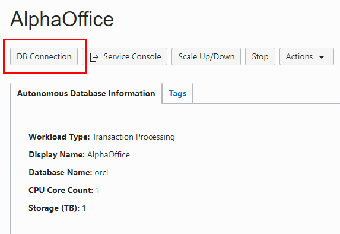

- Here you find the connection strings associated with your database:

  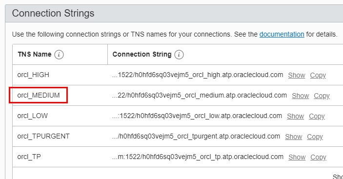


  We will be using the **MEDIUM** connection name in the application.

- In vi edit the **dbconfig.properties** `dbinstance` parameter to contain the **orcl_MEDIUM** connection string and save the file:

  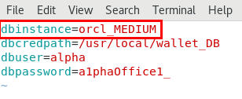

- _If your NOT using the default wallet name of `Wallet_orcl.zip` then you will also need to edit the **Dockerfile**_ to point to your instance specific wallet, otherwise, you can skip ahead to Step 11.

- If applicable, **edit** the following two locations within the `Dockerfile` (In this example mattoATP is the name of the ATP instance and respective wallet file):

  

### **STEP 11**: Build the Docker image

The docker build will take a baseline java ready docker image from Docker Hub, add the Glassfish 4.1.1 application server along with your ATP DB instance wallet file and then extract the **AlphaProductsRestService.war** inside the container. The application server will be running on port 8080. If you recall you opened port 8080 in the Networking Security List earlier in this lab so access from the internet can occur.

- **Type:**

  ```
  docker build -t alphaoffice .
  ```

  The build will take a few minutes and should be successful:

  

    ...

  

- **Here's a more annotated version of the Dockerfile so you can see what the steps are doing while building the `alphaoffice` image**:

  ```
  # Grab a baseline, java capable Docker image that we will add to:

  FROM        java:8-jdk

  #Set Environment variables that will be visible inside the Docker container when it is spun up from the alphaoffice Docker image. These directory references will be seen inside the container when it is running:

  ENV         JAVA_HOME         /usr/lib/jvm/java-8-openjdk-amd64
  ENV         GLASSFISH_HOME    /usr/local/glassfish4
  ENV         PATH              $PATH:$JAVA_HOME/bin:$GLASSFISH_HOME/bin
  ENV         TNS_ADMIN         /usr/local/wallet_DB/

  #Run a sequence of commands to install needed programs like zip, curl, etc:

  RUN         apt-get update && \
              apt-get install -y curl unzip zip inotify-tools && \
              rm -rf /var/lib/apt/lists/*

  #Download and install the Glassfish server. Make directories for the DB Wallet and the REST application that we will be copying into the image. Then, do some directory module cleanup to accomodate the requirements of the AlphaProductsRestService.war (Java REST application):

  RUN         curl -L -o /tmp/glassfish-4.1.zip https://download.oracle.com/glassfish/4.1.1/release/glassfish-4.1.1.zip && \
              unzip /tmp/glassfish-4.1.zip -d /usr/local && \
              rm -rf /usr/local/glassfish4/glassfish/domains/domain1/osgi-cache/felix && \
  #           rm -rf /usr/local/glassfish4/glassfish/modules/jackson* && \
              rm -f /tmp/glassfish-4.1.zip && \
              mkdir /usr/local/wallet_DB && \
              mkdir /usr/local/alpha

  #Copy local (HOST-based) files into the docker image directories:
 
  COPY AlphaProductsRestService.war /usr/local/alpha
  COPY Wallet_orcl.zip /usr/local/wallet_DB

  #Unzip the DB Wallet and REST application .jar files into their respective directories: 

  RUN         unzip /usr/local/wallet_DB/Wallet_orcl.zip -d /usr/local/wallet_DB/ && \
              cd /usr/local/alpha && \
              jar xvf /usr/local/alpha/AlphaProductsRestService.war && \
              rm /usr/local/alpha/AlphaProductsRestService.war

  #Copy a modifed version of sqlnet.ora from the (HOST) into the Wallet directory. This tells the DB connection to use Oracle TNS connection lookups (Noted with the TNS_ADMIN environment variable set earlier in the Dockerfile). Also copy some required .jar files from the (HOST) to support the application:

  COPY sqlnet.ora /usr/local/wallet_DB
  COPY glassfish_module/* /usr/local/glassfish4/glassfish/modules/

  *Glassfish server will use port 8080 for the application deployments:

  EXPOSE      8080

  WORKDIR     /usr/local/glassfish4

  #Iniital docker container startup command. Verbose flag causes the Glassfish server process to remain in the foreground:
  
  CMD         asadmin start-domain --verbose
  ```


- Typing **docker images** reveals the new image:

  ```
  docker images
  ```

  

- Start a container based on the alphaoffice image mapping port 8080 to the same port on the HOST naming the container alphaoffice. **Type OR Copy and Paste**:

  ```
  docker run -d --name alphaoffice -p=8080:8080 alphaoffice
  ```
  

- **docker ps** shows the running container. You'll note the asadmin command we stipulated in the CMD of the Dockerfile build is executed and running (This starts up the Glassfish app server):

  ```
  docker ps
  ```

  

### **STEP 12**: Copy the database properties file into the container

In this step you will copy the `dbconfig.properties` file modifed in a previous step into the running container. Then you will go into the container and verify all the copied and modied files look good and are in their proper locations.

**NOTE:** All of this could be executed automatically at build time but we want you to give a feel for docker commands and what's going on inside the newly executed container.

- **Type OR Copy and Paste** the following:

  ```
  docker cp dbconfig.properties alphaoffice:/usr/local/alpha/WEB-INF/classes/com/oracle/db/
  ```  

  

### **STEP 13**: Verify files inside the container and deploy the AlphaProductsRestService application

- **Type OR Copy and Paste:**

  ```
  docker exec --env COLUMNS=`tput cols` -it alphaoffice bash
  ```

   You'll notice you're now inside the docker container:

    

- We need to verify our `dbconfig.properties` and `sqlnet.ora` files made it into the environment. In the `sqlnet.ora` file DIRECTORY should be set to $TNS_ADMIN and in the `dbconfig.properties` file the dbinstance parameter should reflect your database connection string. **Type OR Copy and Paste** the following commands:

  ```
  cat /usr/local/wallet_DB/sqlnet.ora
  cat /usr/local/alpha/WEB-INF/classes/com/oracle/db/dbconfig.properties
  ```

- You should see the changes reflected in the outputs:

  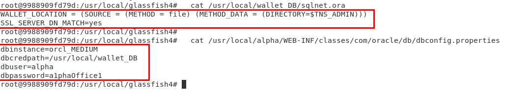

- Bundle up a new .war file by running the following commands:

  ```
  cd /usr/local/alpha
  jar -cvf AlphaProductsRestService.war *
  ```  

- Copy the .war file to the Glassfish application server directory for auto deployment. **Type OR Copy and Paste:**

  ```
  cp AlphaProductsRestService.war /usr/local/glassfish4/glassfish/domains/domain1/autodeploy/AlphaProductsRestService.war
  ```

- Confirm the application was deployed by **typing** the following:

  ```
  cd /usr/local/glassfish4/bin
  ./asadmin

  - Once inside the Glassfish admin tool type:
    list-applications
  ```

  - The application should show as deployed:

    

- **Type: `exit` twice** to get out of the admin tool and the container.

    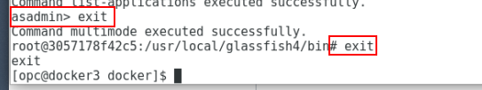

- In a browser, test the application by using the Public IP Address of the VM instance. The first time you test the endpoint. It may take several seconds before you see data returned...

  ```
  http://<YOUR-PUBLIC-IP>:8080/AlphaProductsRestService/webresources/restCall/
  ```
  Example:
  `http://129.213.109.189:8080/AlphaProductsRestService/webresources/restCall/`


  

- Now, test querying one product by adding the Product ID to the REST call:

  ```
   http://<YOUR-PUBLIC-IP>:8080/AlphaProductsRestService/webresources/restCall/1050
  ```

  Example:
  `http://129.213.109.189:8080/AlphaProductsRestService/webresources/restCall/1050`

  

- At any point you can check the container logs by typing:

  ```
  docker logs alphaoffice
  ```

- If everything looks OK then commit a new docker image with the completed application deployment. **Type:**

  ```
  docker commit alphaoffice alphaoffice-rest
  ```
- Typing **docker images** will show the new image created:

  

 - Stop and remove the original container by executing the following:

   ```
   docker stop alphaoffice
   docker rm alphaoffice
   ```

- Fire up a container using the new `alphaoffice-rest` image:

  ```
  docker run -d --name alphaoffice -p=8080:8080 alphaoffice-rest
  ```

- You should again be able to go to the REST URL and see data returned from your ATP database.

  ```
  http://<YOUR-PUBLIC-IP>:8080/AlphaProductsRestService/webresources/restCall/
  ```

- This new docker image will be used in Lab 300.

**This completes the Lab!**

**You are ready to proceed to [Lab 300](LabGuide300.md)**
