# Monolithic to Microservice Cloud Native Development - Low Code, Microservice Mobile Development

  

## Introduction

In this lab you will use Oracle Visual Builder which is a cloud-based software development Platform as a Service (PaaS) and a hosted environment for your application development infrastructure. It provides an open-source standards-based solution to develop, collaborate on, and deploy applications within Oracle Cloud. You will build on the previous labs using the REST points exposed by the AlphaOffice application to OKE in Lab 300.

**_To log issues_**, click here to go to the [github oracle](https://github.com/oracle/learning-library/issues/new) repository issue submission form.

## Lab 400 Objectives

- Create a Mobile Application.
- Access the REST services you deployed in Lab 300 on OKE.
- Deploy the mobile application to your phone (Android based).

## Required Artifacts

- Lab 300 needs to be completed with the AlphaOffice REST application deployed.

- **Works better with the Chrome browser so do this Lab outside of the VNC session of Labs 100, 200 an 300**.

# Login in and Create the Application

## Verify the VBCS Instance

### **STEP 1**: Check the creation of the instance from Lab 050

- From the OCI Console open the **My Services Dashboard** by clicking on the **hamburger** menu in the upper left hand side of the page and selecting it.

  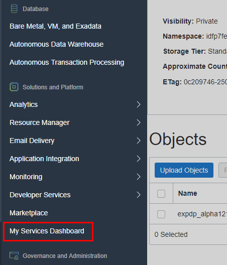

- From the Dashboard **click the hamburger menu** in the Visual Builder Cloud Service pane, **right-click on Open Service Console** and select **Open link in new tab**.

  

- From the Instances tab you should see the monoTOmicro instance you created in Lab 050. Drilling down in the **Instance Create and Delete History** should show a successfull creatation status:

  

  

- **Click the hamburger menu** of the instance and select **Open Visual Builder Home Page**.

  

- On the Welcome page click **+ New Applcation**.

  

- In the Create Application dialog enter:

  ```
  Product Catalog
  ```

- Ensure that the default template is **Empty Application**. Click **Finish**.

  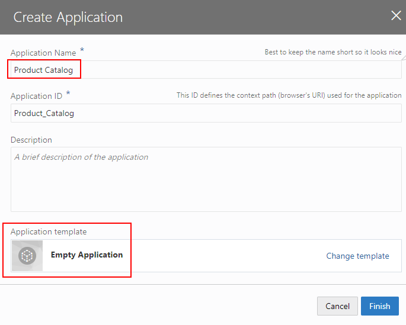

- An initial page will show. Now you will begin to create the components used in the application.

  

### **STEP 2**: Create Service Connections

Service Connections are REST endpoints pointing to various services. In this step you will reference REST endpoints from the application deployment you created in Lab 300. We will create endpoints for GET, GET/{id}, POST, PUT and DELETE/{id}.

- If not already opened click on the **Navigator icon** near the upper left hand side of the web page. This will expand the pane. You can click the **X** on the Welcome tab to close it. Finally, click on the **Service Connections** icon.

  

- Click **+ Service Connection** and then click **Define by Endpoint**. 

  

  

- Leave the Method as **GET**. From Lab 300 **Copy and Paste the URL** used to test the REST endpoint that retrieved all of the AlphaOffice Product Catalog records. (In this example:  `http://129.213.168.190/AlphaProductsRestService/webresources/restCall`) into the URL field. Leave the Action Hint at **Get Many**:

  

- Click **Next**.

- Select the **Test** tab and click **Send**. The request should return all of the records (shown in the Response). If successful, click the **Copy to Reponse Body** button.

  

- Click **Create**.

  

- Click the **Endpoints** tab to see the created GET. Click **+ Endpoint** to add another.

  

- Create another **GET** method with the PATH having a **suffix** of **restCall/{id}**. Set the Action Hint dropdown to **Get One**.

  

- Click the **Test** tab. For the URL Parameter enter **1027**. Click **Send**. One record is returned with the PRODUCT_ID of `1027`. If successfull, Click the **Copy to Reponse Body** button.

  

- Click **Add**.

  

- Click the **Endpoints** tab to see the created methods thus far.

- This time we will be creating a POST method which inserts a record into the database. Create a **POST** method with the PATH having a **suffix** of **restCall**. Set the Action Hint dropdown to **Create**.

  

- Click the **Test** tab. **Copy and Paste** the following payload into the **Request Body** section:

  ```
  {
    "LIST_PRICE": 11.99,
    "PRODUCT_ID": null,
    "PRODUCT_NAME": "Dry Erase Test Markers"
  }
  ```

  

- Click the **Copy to Request Body** button.

- Click **Send**. If successfull you should see a return message `"Successfully Saved."`. From the Reponse tab click **Copy to Response Body**. The PRODUCT_ID is null because a database trigger will automatically create an ID. 

- Since the returned payload is plain text we will set the Response body as such. Click the **Response** tab. Click the **Pencil icon** and the Plus Sign in the Media Type drop down and add:

  ```
  plain/text
  ```

  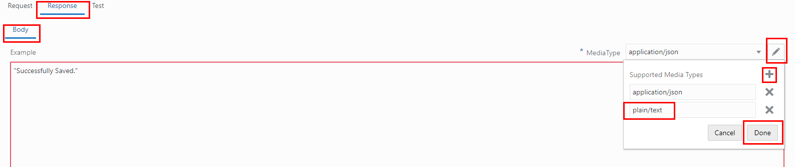

- Click **Done** and then click **Add** to complete the POST definition.
 
  

- Using the GET methods that returns all the records we will confirm that the POST inserted a record and we will obtain the PRODUCT_ID of that new record.

- Click the **GET (Get Many) method**:

  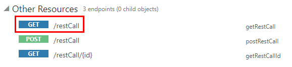

- Click the **Test** tab and click **Send**. Scroll down to the bottom of the Response and should see the record for `Dry Erase Test Markers`. **Note the PRODUCT_ID** as we will be using this in subsequent PUT and DELETE calls. In this example the PRODUCT_ID is `232`:

  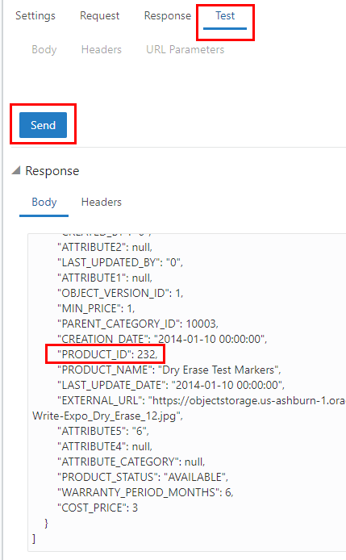

- Next, create a **PUT** method with the PATH having a **suffix** of **restCall**. Set the Action Hint dropdown to **Update**.

  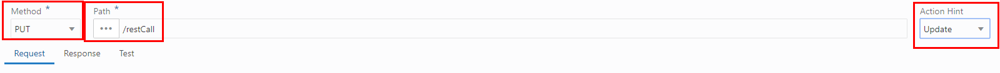

- Click the **Test** tab. **Copy and Paste** the following payload into the **Request Body** section:

  **NOTE:** We are using the PRODUCT_ID obtained above (You will substitute your specific PRODUCT_ID). In this example `232`. The LIST_PRICE has been bumped to `18`.

  ```
  {
    "LIST_PRICE": 18,
    "PRODUCT_ID": 232,
    "PRODUCT_NAME": "Dry Erase Test Markers"
  }
  ```

  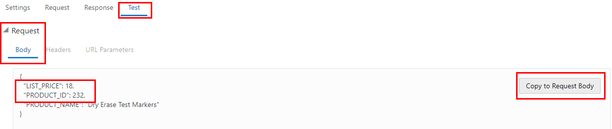

- Click the **Copy to Request Body** button.

- Click **Send**. If successfull you should see a return message `"Successfully Updated."`. From the Response tab click **Copy to Response Body**. 

- Since the returned payload is plain text we will set the Response body as such. Click the **Response** tab. Click the **Pencil icon** and the Plus Sign in the Media Type drop down and add:

  ```
  plain/text
  ```

  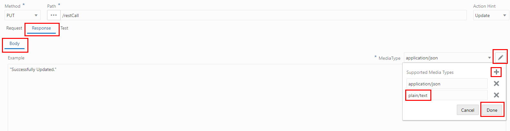

- Click **Done** and then click **Add** to complete the PUT definition.
 
  

- OPTIONAL - Verify the update to the database occur by using the GET (Get Many) method. Scroll to the bottom to find the record and verify that the LIST_PRICE is now `18`:

  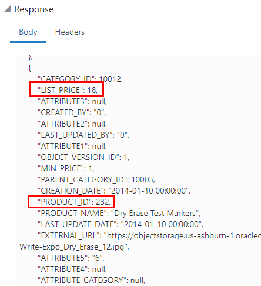

- The final method you will create is a **DELETE** with the PATH having a **suffix** of **restCall/{id}**. Set the Action Hint dropdown to **Delete**.

  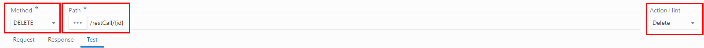

- Click the **Test** tab and then **URL Parameters**. (You will substitute your specific PRODUCT_ID). For our example we enter ID `232`. Click **Send**.

  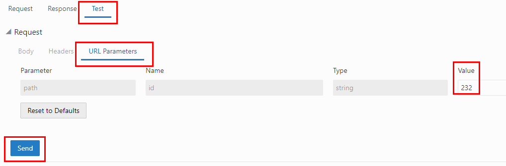

- Click the **Copy to Request Body** button.

- Click **Send**. If successfull you should see a return message `"Successfully Deleted."`. From the Response tab click **Copy to Response Body**. 

  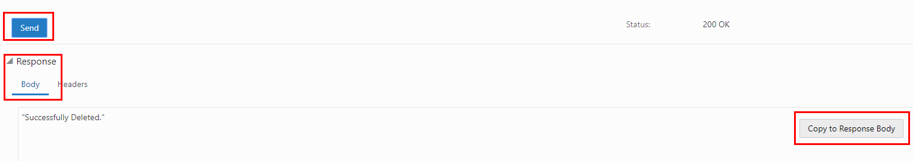

- Since the returned payload is plain text we will set the Response body as such. Click the **Response** tab. Click the **Pencil icon** and the Plus Sign in the Media Type drop down and add:

  ```
  plain/text
  ```

  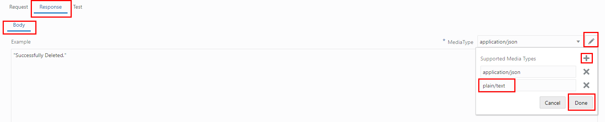

- Click **Done** and then click **Add** to complete the DELETE definition.

  

- All of the endpoints have now been created and tested:

  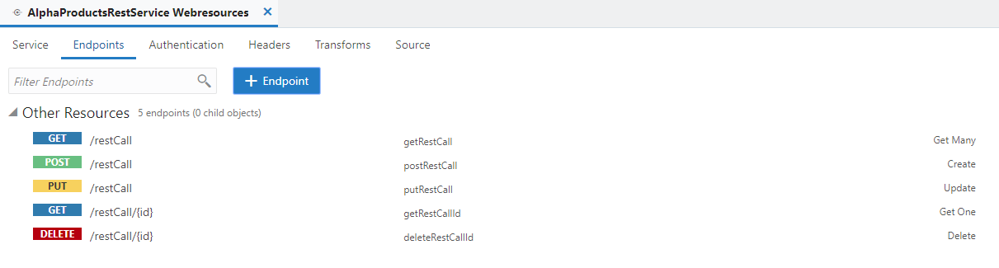

- Finally, set the authentication for the endpoints by clicking the **Authentication** tab. Select the **Enable authentication / proxy** checkbox and chose the **None (Use Proxy)** mechanism:

  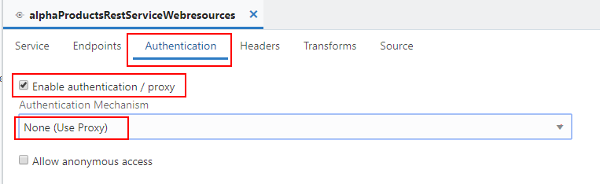

## Create the Mobile Application

### **STEP 3**: Create a Mobile Application

- Select the **Mobile Applications** icon on the left on side of the web page and then click **+ Mobile Application**.

  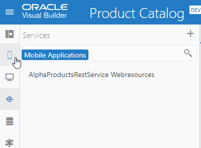

  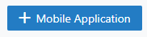

- Name the application...

  ```
  AlphaOffice
  ```

- ... and select the **None** Navigation Style.

  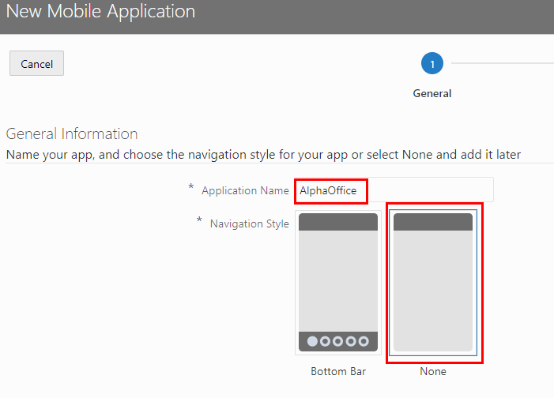

- Click the **Arrow icon**.

  

- Select the **No Content** layout and click **Finish**.

  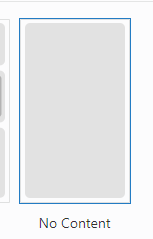

- Now you have access to (left to right) components, page structure, display canvas and properties. We will be hitting a little of everthing going forward. In the components section find the **Image** component and drag and drop that right below the `Mobile Page Template` in the **Page Structure**.

- Now drag and drop a **Heading** component right below the image field. Your screen should look like:

  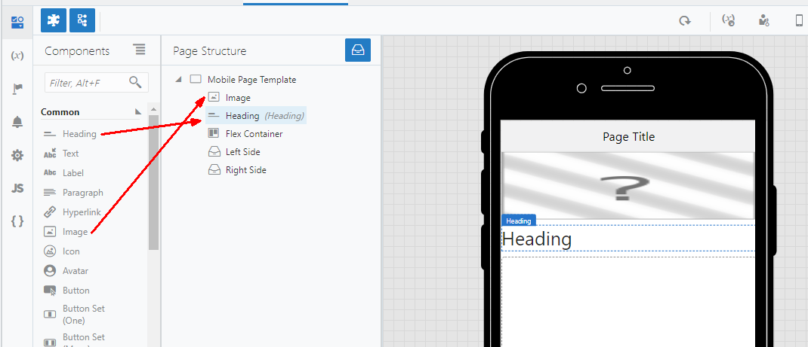

- Your application should be in Design Mode:

  

- Time to set some Properties. You can select the specific component who wish to set property values for by ether selecting from the Page Structure OR the display canvas. In some cases it will be easier to use one or the other...

- Select the **Mobile Page Template** from the Page Structure pane and name it:
  
  ```
  Catalog
  ```

- ... which can be found under the **General** properties area on the right.

- You'll notice the change does not take affect until you tab out of the Page Title field.

- Click on the **Heading** field and set the text to:

  ```
  Products
  ```

- ... leaving the Heading size to **H1**. You screen looks like:

  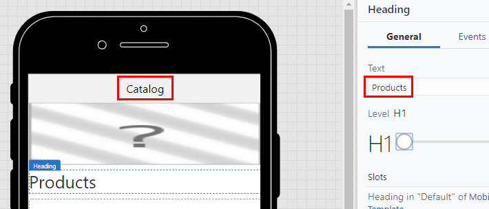

- Download a static image from here: [AlphaOffice Image](https://github.com/oracle/learning-library/blob/master/workshops/monolithic-to-microservice/lab-resources/vbcs/AlphaOfficeSupply.png). Click on this link and save the file locally.

- Now, click on the **Image** component in the canvas and click the **Data** tab in the Properties section. 

  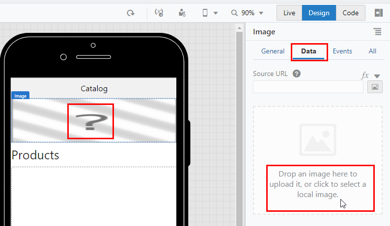

- Click on the **Drop an image here...** box and upload the static image; **AlphaOfficeSupply.PNG** you just downloaded:

  

- The image is uploaded. If it doesn't display right away on the canvas click the **Refresh icon**.

  

  - Your screen should now look like:

  

- From the Components section drag and drop a **List View** into the canvas Flex Container below the Products item:

  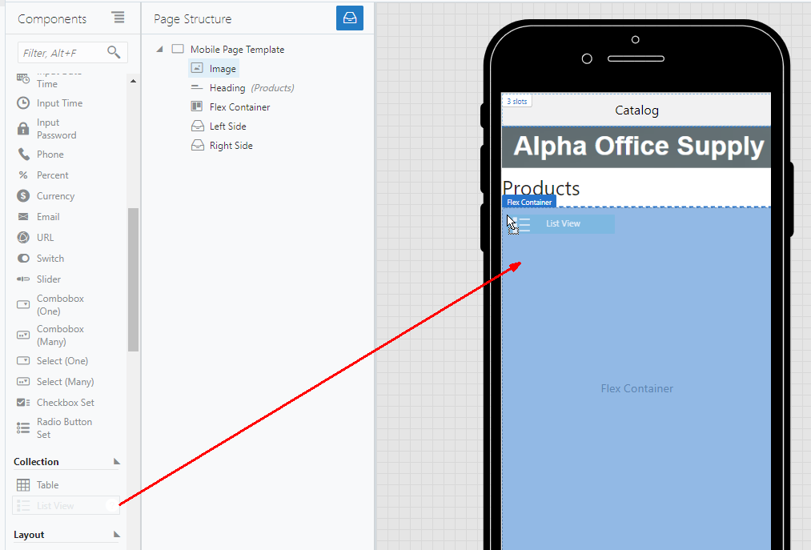

- The canvas is populated with a default layout and the **List View** item should be highlighted). If it's not, select it in the Page Structure section. In the Properties area if you don't see the `Add Data` option then select the `Quick Start` icon all the way over on the right. Then click **Add Data**. We will associate this List View with data from one of our REST endpoints.

  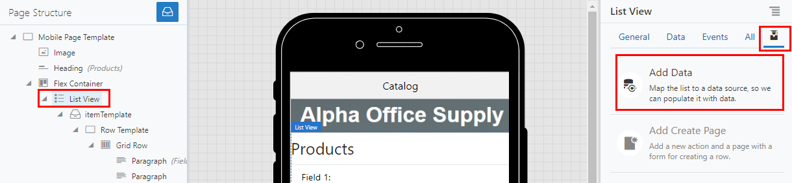

- In step 1 of the Add Data section only relevant endpoints that would populate the List View are available. **Expand** the available endpoints and select **GET** (Many). Click **Next**.

  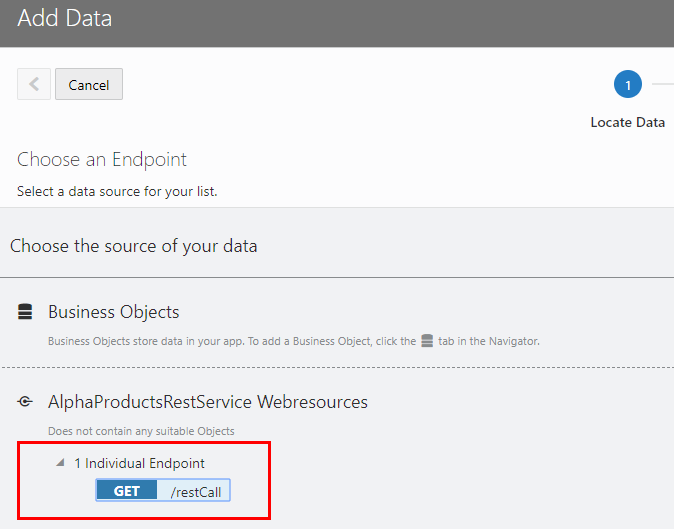

- In step 2 choose the following layout and click **Next**.

  

- In the Bind Data step select the following 4 columns **IN THIS ORDER**:

  ```
  PRODUCT_NAME
  EXTERNAL_URL
  PRODUCT_ID
  LIST_PRICE
  ```

- Set the `PRODUCT_ID` and `LIST_PRICE` to an **Input Number** type.

- Set the `EXTERNAL_URL` to an **Image** type.

- Set the `Primary Key` to **PRODUCT_ID**.

- Before pressing on make sure your screen looks like:

  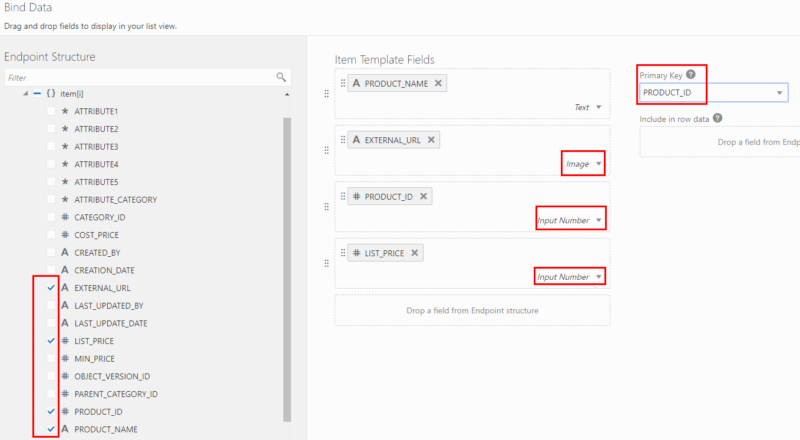

- Click **Next** and **Finish**.

- The Endpoint is called and the canvas refreshed with the Product Catalog data:

  

- Now we'll tydy up some item properties. Delete the Labels for **PRODUCT_NAME** and **EXTERNAL_URL**. 

  **NOTE: We're deleting just the labels, not the data items...**

- Select each of the above mentioned Labels and hit the delete key. The Label will disappear.

  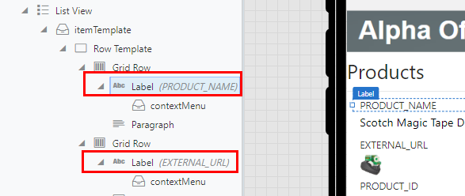

- Select the **Paragraph item for PRODUCT_NAME**. Notice that selecting it highlights the item in the canvas and brings up the Properties values:

  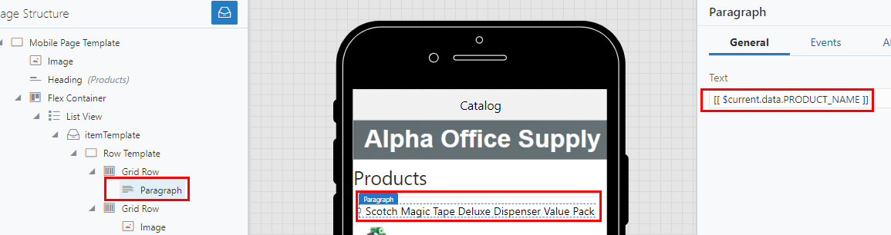

- Select the **ALL** property tab and expand the **General Attributes**:

  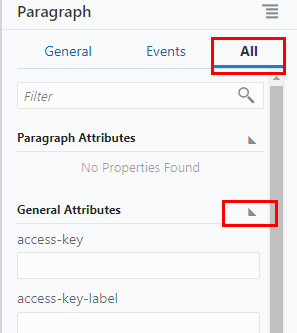

- Scroll down the General Attributes until you find the **Style** field. This is where CSS type commands can be entered. We want to enlarge the displayed text for this item. **Type OR Copy and Paste** the following:

  ```
  font-size: large;
  ```

  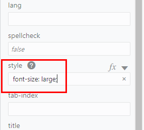

- Upon tabbing out of the field the change will happen.

- Select the **Label** item for **PRODUCT_ID** and under the **General** tab change the title to:

  ```
  Product ID
  ```

 - Under the **ALL** tab --> **General Attributes** enter:
 
   ```
   font-size: large;
   ```
  
  - ... into the **Style** field.

- Select the **Input Number** item for **PRODUCT_ID**. Under the **General** properties tab **de-select the Thousands Separator** checkbox.

  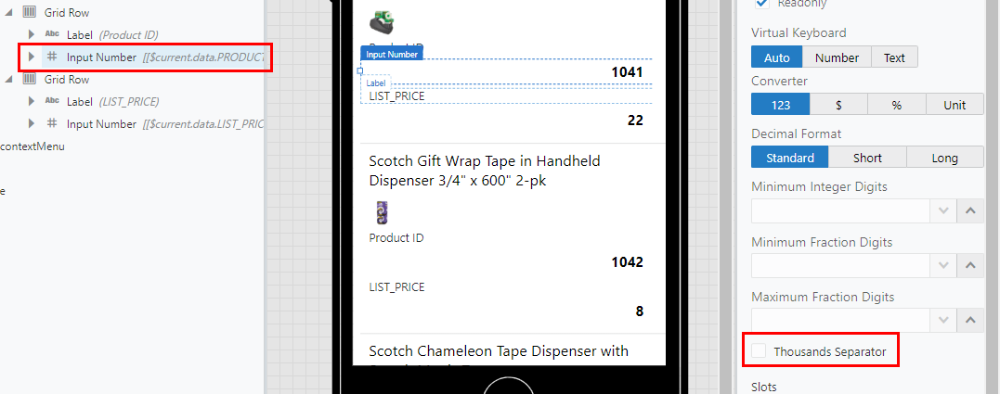

- Upon tabbing out of the field the change will happen.

- Select the **Label** item for **LIST_PRICE** and under the **General** tab change the title to:

  ```
  List Price
  ```

 - Under the **ALL** tab --> **General Attributes** enter:
 
   ```
   font-size: large;
   ```
  
  - ... into the **Style** field.

- Select the **Input Number** item for **LIST_PRICE**. Under the **General** properties tab change the **Converter** attribute to a dollar sign `$`. Also, in the **Currency Code** attribute enter:

  ```
  USD
  ```

  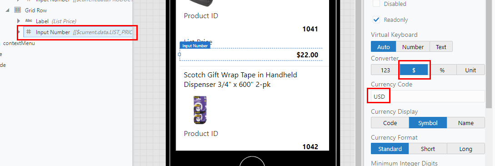

- Finally, select the **Image** Item under **Page Structure** (or the canvas). Under the **General** properties tab change image Height and Width to **80**.

  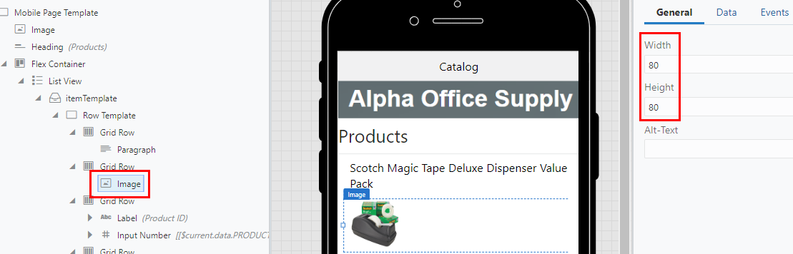

- Your finalized version of the `main-start` page will look something like:

  **NOTE:** Different Phone display profiles will present the data differently. 

  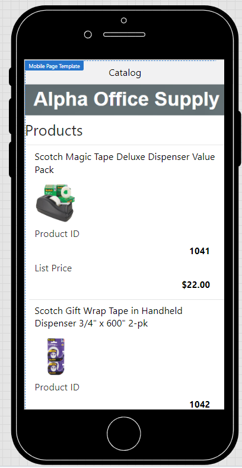

## Add Record Creation to the Application

### **STEP 4**: Add Create Page

- Select the **List View** item in the main-start Page Structure (or the canvas) and if you don't see the various wizard driven options, click the `Quick Start` icon on the far right of the Properties section and select **Add Create Page**. 

  

- Expand the available endpoints and select **POST/restCall**. Click **Next**.

  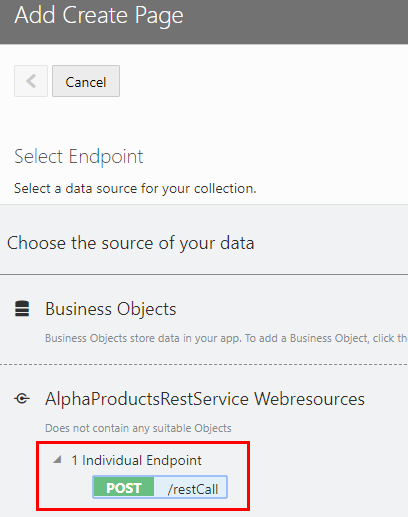

- Choose the following columns **IN THIS ORDER**:

  ```
  PRODUCT_NAME
  LIST_PRICE
  ```

- Change the name for the `Button label` and the `Page title` to:

  ```
  Create
  ```

  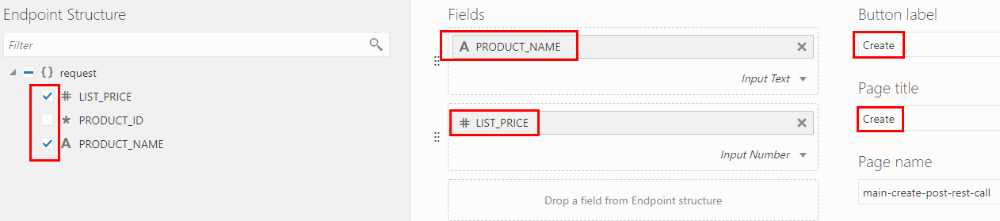

- Click **Finish**. A `main-create-post-rest-call` page is created. The main-start page now displays a large PLUS sign at the top right of the display.

  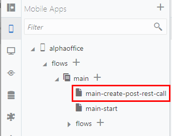

  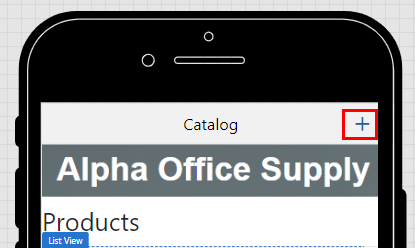

- From the Mobile Applications pane click the **main-create-post-rest-call** page. This will open it up on the canvas.

- As we did with the main-start page we will tidy up so properties and add the AlphaOffice image.

- **Drag and drop an Image component** into the Page Structure pane right below the Mobile Page Template item.

  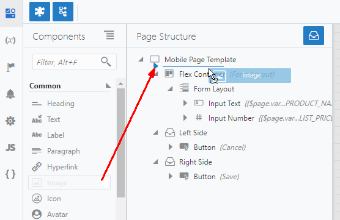

- With the **Image** item selected click the **Data** tab in the Properties pane and then click the **Drop and image here...** section.

  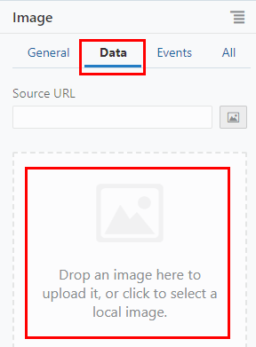

- Upload the image we used earlier; `AlphaOfficeSupply.png`. You may have to click the pane refresh icon to update the canvas. 

  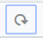

- Your screen should look like:

  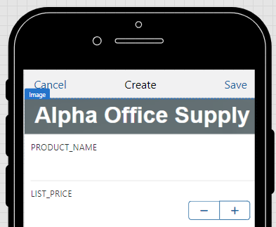

- Select the Input Text item **PRODUCT_NAME** in the Page Structure and change the **Label Hint** in the Properties pane under the **General** tab to:

  ```
  Product Name
  ```

  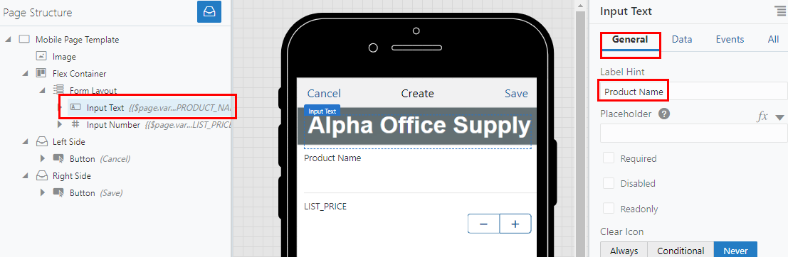

- Likewise, change the **Label Hint** for the LIST_PRICE Input Number item to:

  ```
  List Price
  ```

 - Also change the **Converter** attribute to a dollar sign `$` and type in the following for the **Currency Code** attribute:

   ```
   USD
   ```

- The canvas should now look like:  

  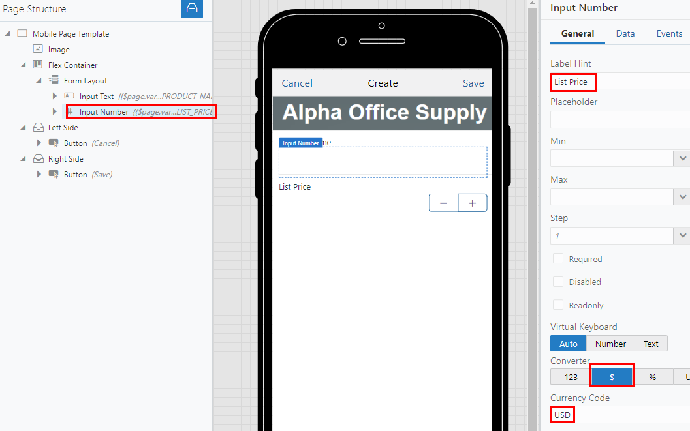

- When the `main-create-post-rest-call` page was created some supporting Actions and Events associated with that page were also created to handle navigation (For example, what to do when the Cancel and Save links are clicked). Event execution is handled by `Chains`.

- Click on the **Events** icon for the `main-create-post-rest-call` page (already being displayed), click the **createPostRestCallChain** item under the saveButtonClicked Event to show its Properties and finally select the **createPostRestCallChain** link on the far right hand side of the page (Properties section). 

  

- This opens up the chain flow where you can see various Actions defined for the cases of success or failure. In the success flow Click the **Fire Notification confirmation** Action. In the Properties section change the **Summary** atrribute to:

  ```
  Saved:
  ```

- ... and change the **Message** attribute to:

  ```
  Record Successfully Created
  ```

  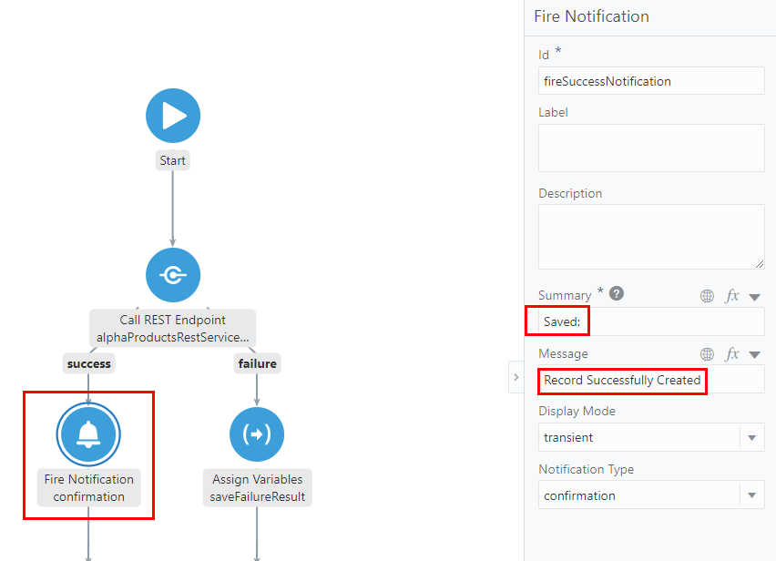

- You can close the tab once the changes are in place.

  

### **STEP 5**: Test Record Creation

- Select the **main-start** page and then click the **Run** application icon on the right hand side of the main menu bar.

  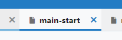

  

- A new browser tab opens and the application is started. You can scroll up and down to see the available products in the catalog. Clicking the **PLUS sign** will take you to the Create page.

  

- **Type OR Copy and Paste** the following into the fields:

  ```
  Product Name:   EXPO Dry Erase Kit, Assorted Colors
  List Price:     20
  ```

- Tab out of the List Price field to see the currency formatting. Click the **Save** link. If all goes well you should see the success confirmation pop up for a few seconds.

  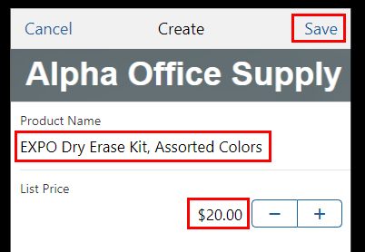

    

- Scroll down the product catalog listing until you find your new product for `EXPO Dry Erase Kit, Assorted Colors` which was inserted into the database. In this case the assigned PRODUCT_ID is 240:

  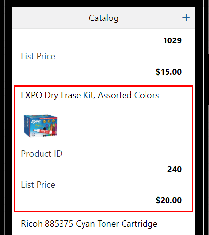  

## Add Update and Delete capabilites

### **STEP 6**: Add Edit Page

In this section you will maually create a new page and add update and delete capabilites to the records in the product catalog. Events and Action Chains will be created to support the flows. This page will eventually be called from the main-start page.

- Close the browser tab with the application running. Back in Visual Builder, in the Mobile Apps pane click the **PLUS icon** next to Main flow to create a new page. 

  **NOTE: Do not create a new Flow... just a page**

  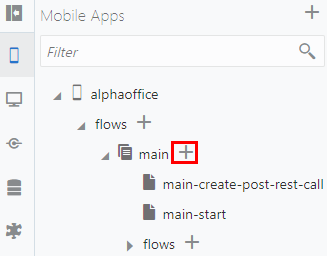

- In the Create Page dialog name the page:

  ```
  main-edit
  ```

- ... Choose the **Custom** content style and click **Create**.

  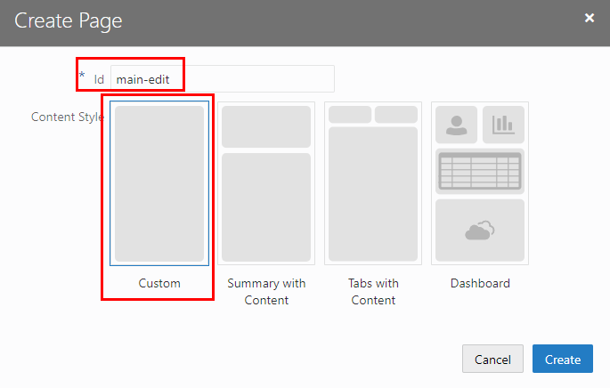

### **STEP 7**: Create Page Variables

In this step we will define the Types and Variables used within the page.

- With the newly created `main-edit` tab selected click the Variables icon:

  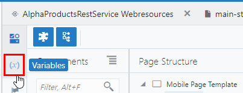

- The first thing we will do is create an object array type which will define the structure for the returned set of values from the REST endpoint GET (one). Click on the **Types** tab and then click the **+ Type** button and select **From Endpoint**.

  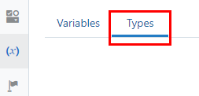

  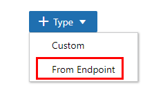

- Expand the Service Connections and select the **GET /restCall/{id}** enpoint which will return one record based on the input parameter {id}. Click **Next**.

    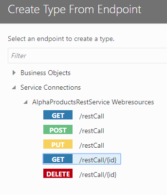

- Select the following columns:
    - LIST_PRICE
    - PRODUCT_ID
    - PRODUCT_NAME
    - EXTERNAL_URL

  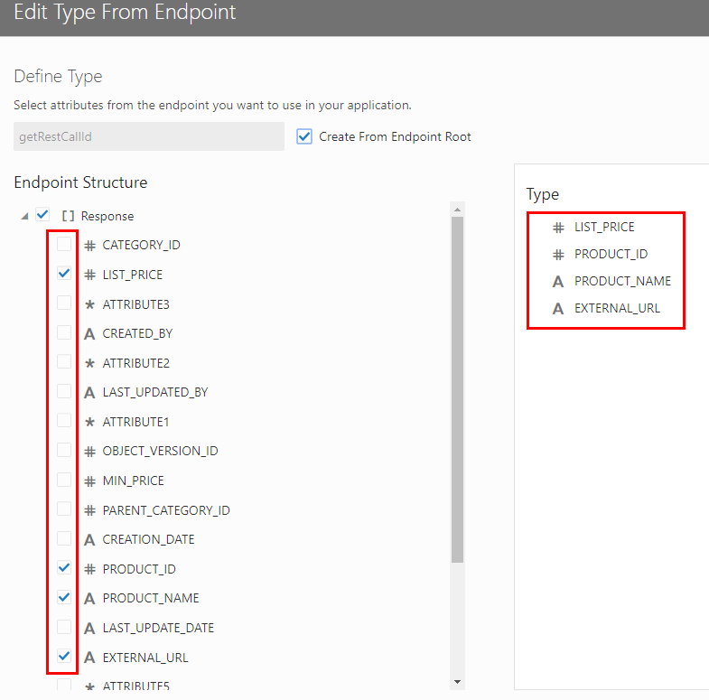

- Click **Finish**.

- The type is created. Add the suffix **Type** to the generated name in the Properties pane so the id name becomes `getRestCallIdType`:

  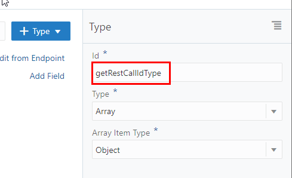

- The structure looks like:

  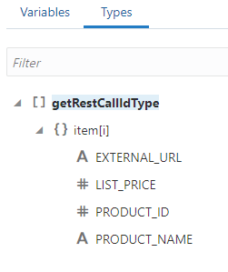

- Now, click the **Variables tab** and then click the **+ Variables** button to create a variable based on the new type (this variable is used for content mapping purposes). 

  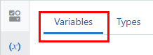

  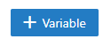

- Call the variable:

  ```
  getRestCallVar
  ```

- ... using the **getRestCallIdType**.

  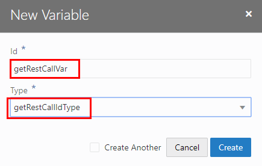

- Click **Create**.

- Create a variable called:

  ```
  InputVar1
  ```

- ... using the **Number** type

  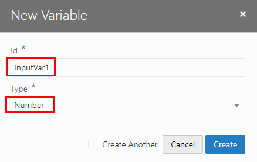

- Click **Create**.

- In the Properties pane for **InputVar1** under the **General** tab select the following attribute checkboxes:
    - **Input Parameter**
    - **Pass On URL**
    - **Required**

  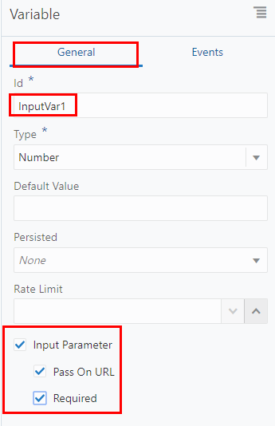

  **NOTE: This variable is used as an input parameter when called from the main-start page based on a product selection** (Defined later on in this Lab).

- Create three more variables with the following types:
    - **IDVar       : Number**
    - **PriceVar    : Number**
    - **ProdNameVar : String**
    - **ImageVar    : String**

- The final variables definitions should look like:

  

### **STEP 8**: Create Page Layout

- Click the **Designer icon** to get back to the page canvas.

  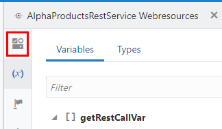

- Now, we will build out the look and feel of items on this page. First, in the Page Structure. Drag and drop an **Image** item from the Component pane just below the `Mobile Page Template item` in the Page Structure.

  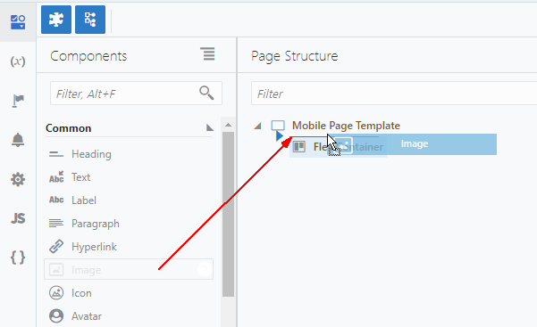

- Drag and drop a **Form Layout** item **inside** the `Flex Container` **on the canvas**.

  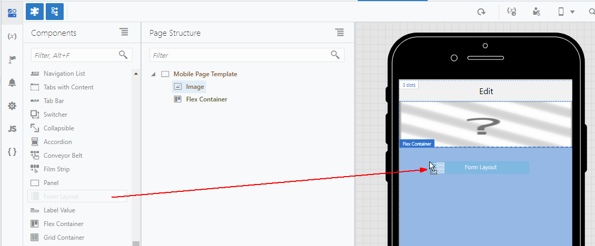

- Drag and drop an **Input Number** item **inside** the `Form Layout` item **on the canvas**.

  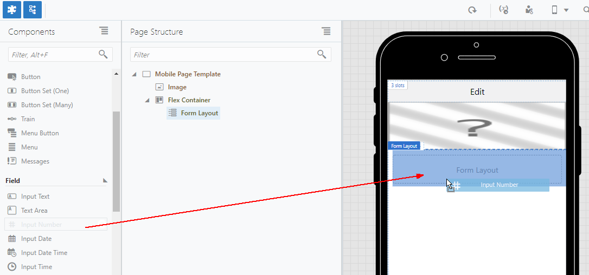

- In the Page Structure drag and drop an **Input Text** item below the Input Number item you just created in the `Form Layout` item. Ensure that the blue indentation arrow shows the item going into the `Form Layout` (This ensures the item is embedded within the Form Layout)

  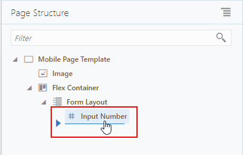

- Drag and drop an **Image** item just below the Input Text item you just created in the `Form Layout` item (This ensures the item is embedded within the Form Layout)

- Drag and drop an **Input Number** item just below the Image item you just created in the `Form Layout` item (This ensures the item is embedded within the Form Layout)

- So far your Page Structure should look like:

  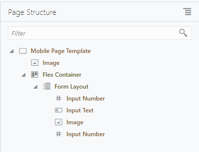

- In the Page Structure select the **Mobile Page Template** item.

- In the **Properties** pane under the **General** tab on the right side you'll see Left Side / Right Side controls. This is where we are going to define some buttons. Click the **Left Side plus sign** and select the **Button** type.

  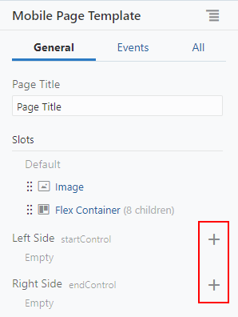

  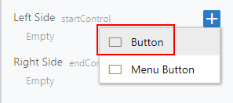

- Create **two more buttons on the Right Side**. Your Page Structure should now look like:

  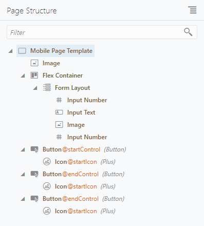

- In the Page Structure **delete the default Icon** for each button by selecting the Icon items and hitting the delete key. Now, your Page Structure looks like:

  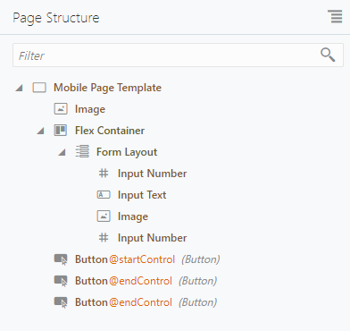

### **STEP 9**: Set Item Properties

- Select the **Mobile Page Template** item in the Page Structure. Under the General Properties tab set the **Page Title** attribute to:

  ```
  Edit
  ```

- In the Page Structure select the **top** Button item. In the Properties pane under the General tab change the Text to:

  ```
  Cancel
  ```

- In the Page Structure select the **middle** Button item. In the Properties pane under the General tab change the Text to:

  ```
  Delete
  ```

- In the Page Structure select the **bottom** Button item. In the Properties pane under the General tab change the Text to:

  ```
  Update
  ```

- Your Page Structure and Canvas should look something like:

  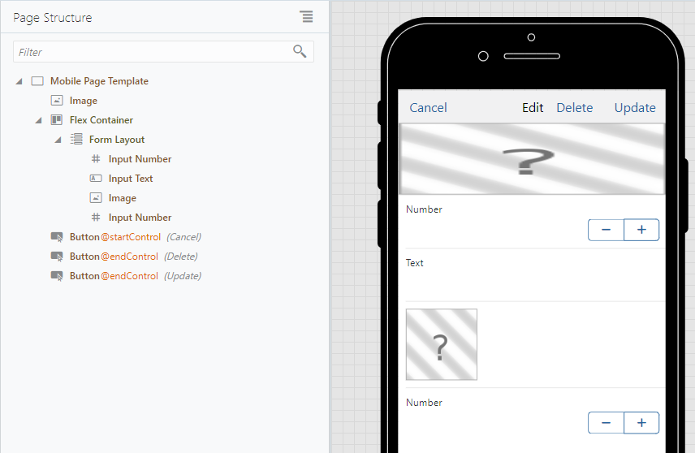

- With the **Image** item selected click the **Data** tab in the Properties pane and then click the **Drop and image here...** section.

  

- Upload the image we used earlier; `AlphaOfficeSupply.png`.

- Select the first Input Number item in the canvas. 

  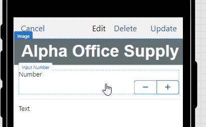

- Under the **General** tab in the Properties pane set the **Label Hint** to:

  ```
  Product ID
  ```

- Scroll down the attributes and **check the Readonly checkbox**. Also, **uncheck the Thousands Separator checkbox**:

  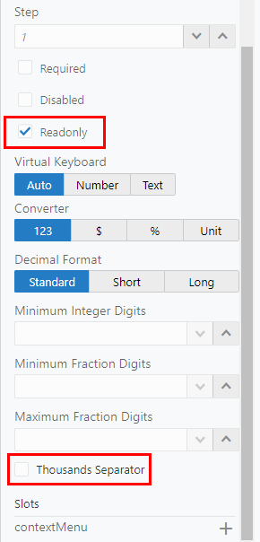

- Click the Properties **Data** tab and then click the **Select Variable** icon (Down arrow) and choose:

  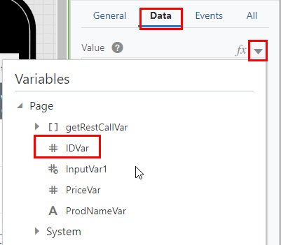

- The attribute will show:

  

- Next, below the Product ID item select the Input Text item on the canvas. Under the **General** tab in the Properties pane set the **Label Hint** to:

  ```
  Product Name
  ```

- Click the Properties **Data** tab and then click the **Select Variable** icon (Down arrow) and choose:

  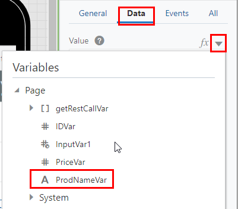

- The attribute will show:

  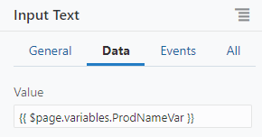

- Next, select the Image item on the canvas. Under the **General** tab in the Properties pane set the **Width** and the **Height** attributes to 80:

  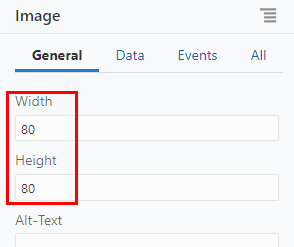

- Click the Image item Properties **Data** tab . For the **Source URL** attribute click the **Select Variable** icon (Down arrow) and choose:

  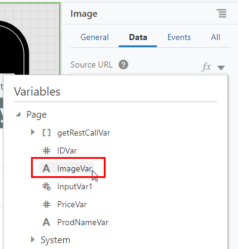

- Finally, select the bottom Input Number item on the canvas. Under the **General** tab in the Properties pane set the **Label Hint** to:

  ```
  List Price
  ```

- Scroll down the attributes and change **Converter** to the dollar sign symbol `$` and type the following in the **Currency Code** attribute:

  ```
  USD
  ```

- Click the Properties **Data** tab and then click the **Select Variable** icon (Down arrow) and choose:

  

- The attribute will show:

  

- Your final canvas should look like:

  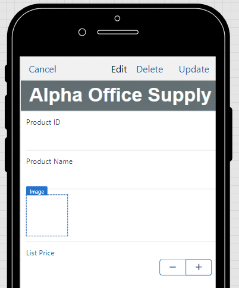

### **STEP 10**: Define the Actions and Events on this page

In this step we will finish up the `main-edit` page by defining four Events and subsequent Actions. The first event will define what happens when the page is called from the `main-start` page. The other Events will deal with the Cancel, Delete and Update buttons.

- From the `main-edit` page click the **Actions icon** followed by clicking the **+ Action Chain** button.

  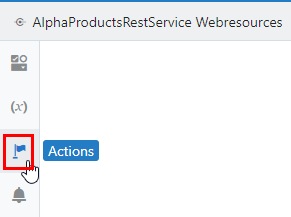

  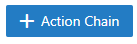  

- **Type OR Copy and Paste** the following:

  ```
  id :  
      CallRestGetChain
  Description:  
      Calls the GET REST (one) endpoint using the parameter passed in by the main-start page via the InputVar1 parameter  
  ```

  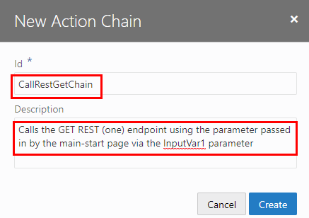

- Click **Create**. An empty chain flow is presented.

- Drag and drop a **Call REST Endpoint** Action under the Start action. Then click the **Select Endpoint** button.

  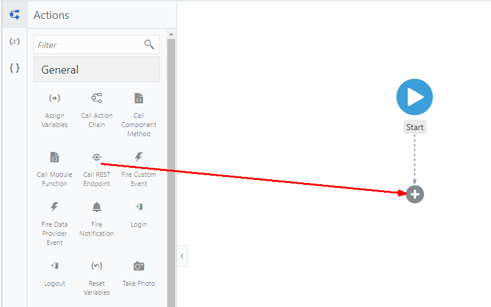

  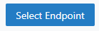

- Choose **GET /restCall/{id}** and click **Select**.

  

- In the Properties pane set the **Response Type** attribute to the **getRestCallIdType** we created earlier in this lab. This ensures the returned JSON payload is parsed into the proper type object. Then click **Assign** in the **Input Parameters**. 

  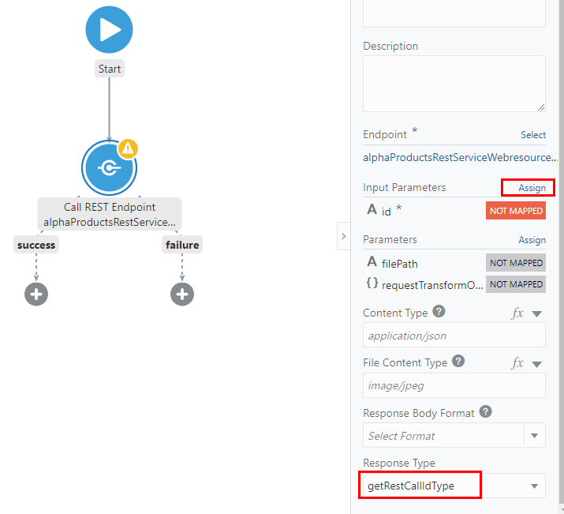

- This brings up a dialog where we map and assign variable content. Our **Target** Parameter requires a value for **id** that in the end will be passed in from the `main-start` page but for now we'll hard-wire a value to it so we can test the REST Call and our Chain. Select the Target **id** parameter and in the box at the bottom of the page enter:

  ```
  1037
  ```

- ... this is a known PRODUCT_ID in the database.

  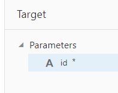

  

- The value will show as mapped to id:

  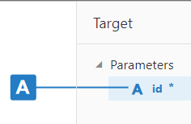

- Click **Save**.

- Now, drag and drop an **Assign Variables** Action under the success flow. Then click the **Assign** link for that action.

  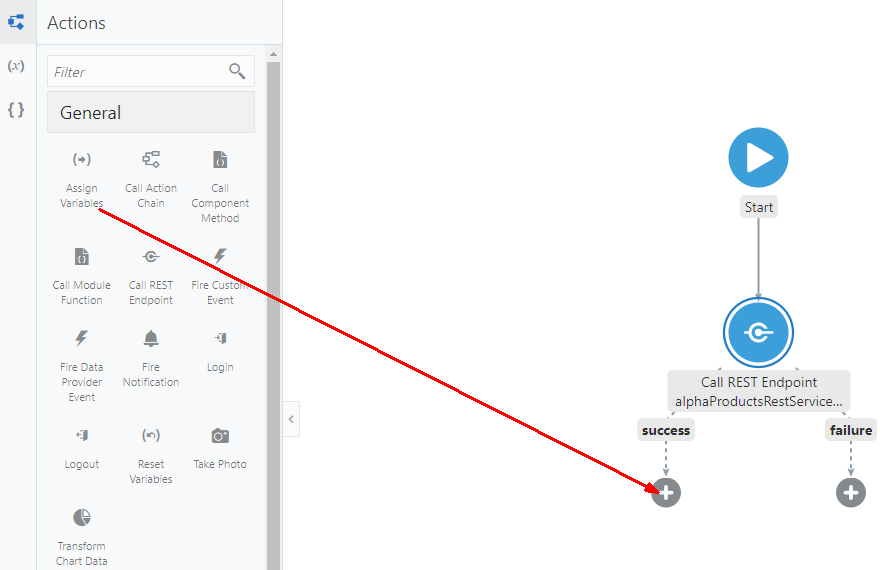

  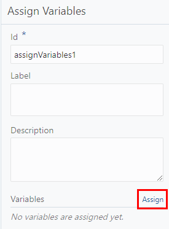

- Here is where we will map the Results of the REST call to getRestCallVar and also to the variables we attached to Data attributes for the display canvas. On the Sources side expand out **Results** until you see all of the individual fields. **Map** (Drag and drop) the following Sources to Targets:
    - Source: **callRestEndpoint1-->body-->item[0]** --> Target: **getRestCallVar**
    - Source: **EXTERNAL_URL** --> Target: **ImageVar**
    - Source: **LIST_PRICE** --> Target: **PriceVar**
    - Source: **PRODUCT_ID** --> Target: **IDVar**
    - Source: **PRODUCT_NAME** --> Target: **ProdNameVar**

- When your done it should look like:

  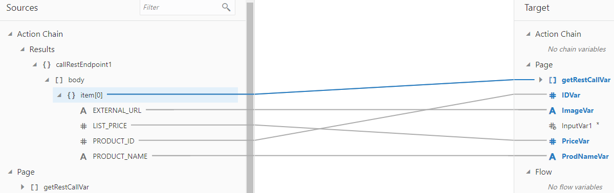

- Click **Save**. The Chain is completed.

- Now, create an Event which calls the new chain upon page start up. From the `main-edit` page click the **Events icon** followed by clicking the **+ Event Listener** button.

  

  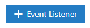

- Select the **vbEnter** Event and click **Select**.

  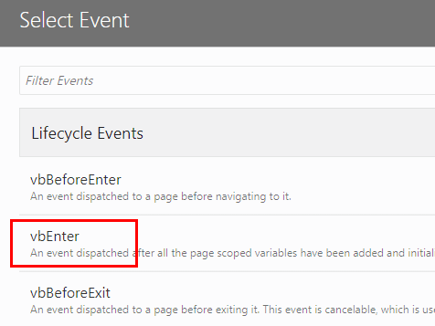

- Select **CallRestGetChain** and click **Select**. The `vbEnter` event is completed.

  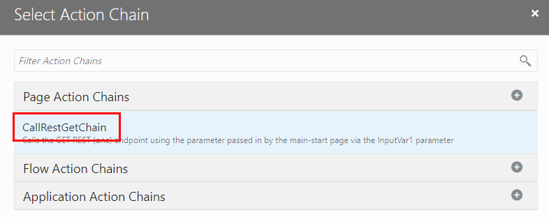

  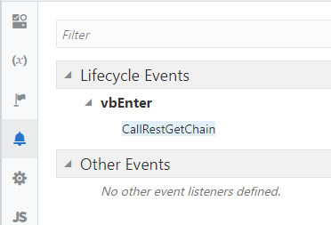

- Click the **Designer** icon to go back to the `main-edit` canvas.

  

- The page is reloaded with the new Event and Action Chain firing. If all went well you should see the information displayed for **PRODUCT_ID: 1037**

  

- The remaining three Action Chains and Events in the `main-edit` page (Update, Delete and Cancel) are based on Events by clicking the specific button.

- Make sure your still in **Design Mode** on the `main-edit` page.

  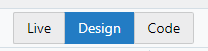

- In the canvas click the **Update** Button. In the Properties pane select the **Events** tab and then Click **+ New Event --> Quick Start 'ojAction'**.

  

- In the Properties pane ID field **rename** the new Action Chain to:

  ```
   UpdateActionChain
  ```

- Drag and drop a **Call REST Endpoint** Action under the Start action. Then click the **Select Endpoint** button.

  

  

- Choose **PUT /restCall** and click **Select**.

  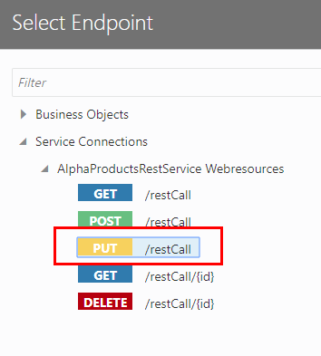

- In the Properties pane set the **Response Body Format** to  **text**. Then, click the **Parameters Assign** link.

  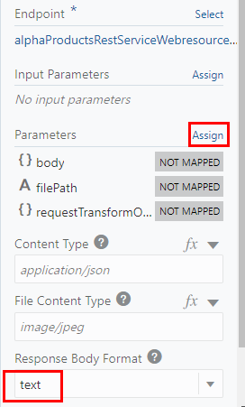

- Select the **Target** Parameter: **body**. Copy and Paste the following into Expression box at the bottom:

  ```
  {
   "LIST_PRICE": "{{ $page.variables.PriceVar }}",
   "PRODUCT_ID": "{{ $page.variables.IDVar }}",
   "PRODUCT_NAME": "{{ $page.variables.ProdNameVar }}"
  }
  ```

- Hit the tab key. The expression uses the current values of the canvas display variables to build a JSON payload that is used by the REST call to update the database.

  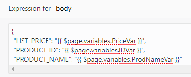

  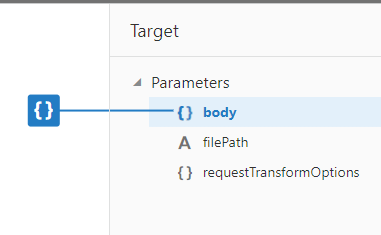

- Click **Save**.

- Drag and drop a **Fire Notification** Action below the **success** flow.

  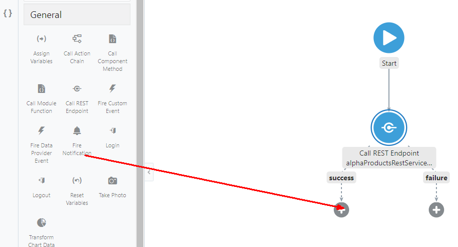

- For the Notification Properties set the following:
    - Summary:  **Updated Product:**
    - Message:  (Choose the **ProdNameVar** field) using the Down arrow
    - Display Mode:  **transient**
    - Notification Type:  **confirmation**

  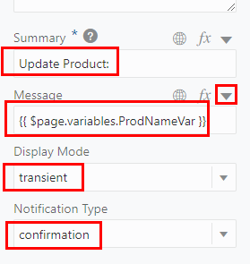

- The chain is completed. Now, **select the `main-edit` tab** (page) and put the application in **Live Mode** to test.

  

- Change the Product Name to say: **Sharpie Medium Point...** and click the **Update** button. You should get the success flow confirmation:

  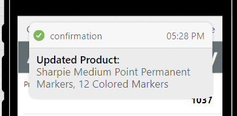

- Go back to **Design Mode** on the `main-edit` page.

  

- In the canvas click the **Delete** Button. In the Properties pane select the **Events** tab and then Click **+ New Event --> Quick Start 'ojAction'**.

  

- In the Properties pane ID field **rename** the new Action Chain:

  ```
   DeleteActionChain
  ```

- Drag and drop a **Call REST Endpoint** Action under the Start action. Then click the **Select Endpoint** button.

  

  

- Choose **DELETE /restCall/{id}** and click **Select**.

  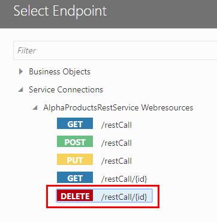

- In the Properties pane set the **Response Body Format** to  **text**. Then, click the **Input Parameters Assign** link.

  

- Map the Sources **Page-->IDVar** field to the Target Parameter: **id**.

  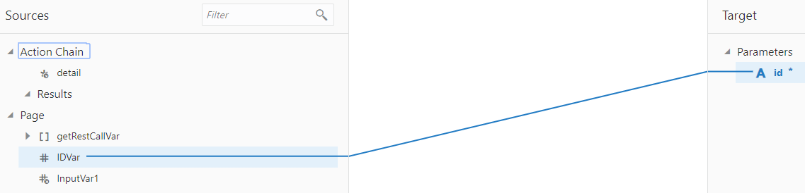

- Click **Save**.

- Drag and drop a **Fire Notification** Action below the **success** flow.

  

- For the Notification Properties set the following:
    - Summary:  **Deleted Product:**
    - Message:  (Choose the **IDVar** field) using the Down arrow
    - Display Mode:  **transient**
    - Notification Type:  **confirmation**

  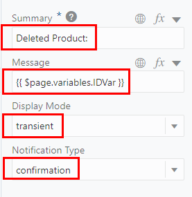

- Drag and drop a **Navigate Back** Action below the Notification. This will return us to the `main-start` (page) after the record is deleted.

  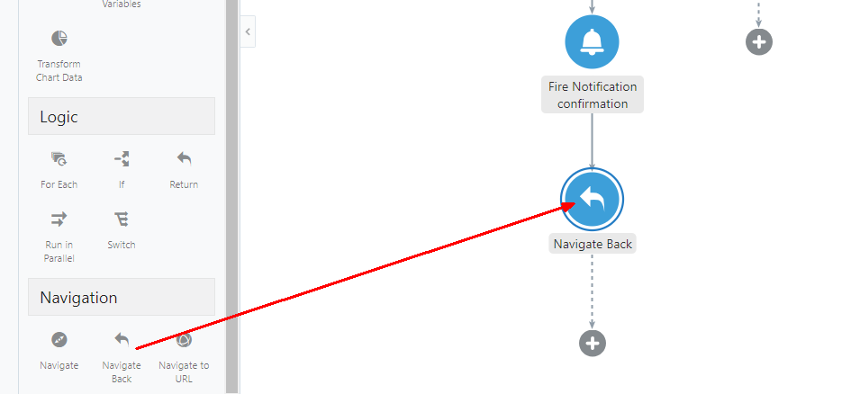

- The chain is completed. Now, **select the `main-edit` tab** We will test the Delete functionality after the entire application is completed.

- The last Action and Event for this page is the Cancel button which simply returns us to the calling page (which will be `main-start` when we are all done).

- Select the `main-edit` tab (page). Make sure you are in **Design Mode.**

  

- In the canvas click the **Cancel** Button. In the Properties pane select the **Events** tab and then Click **+ New Event --> Quick Start 'ojAction'**.

  

- In the Properties pane ID field rename the new Action Chain:

  ```
   CancelActionChain
  ```
- Drag and drop a **Navigate Back** Action after the Start.

  

- The chain is completed. We will test the functionality when the entire application is completed.

### **STEP 11**: Call the main-edit page from main-start

This step will complete the design of the application. We will add a Selection Event on the canvas List View and call the `main-edit` page passing the selection's PRODUCT_ID as an input parameter to the `main-edit` which will in turn take that input and query the relevant record from the database. 

- Select the `main-start` tab (page) which should be **Design mode**.

  

- In the Page Structure pane select the **List View** item.

  

- In the Properties pane select the **Events** tab, then click **+ New Event**, and select **Quick Start: 'selection'**.

  

- In the generated **ListViewSelectionChangeChain** drag and drop a **Navigate** Action under the Start.

  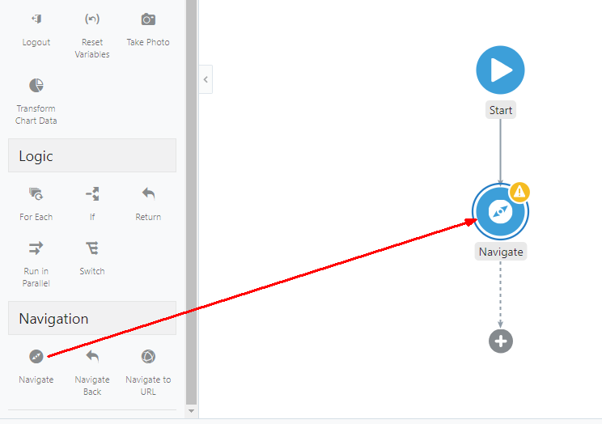

- Click **Select Target**. Choose **Peer Page** and select the **main-edit** page

  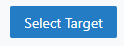

  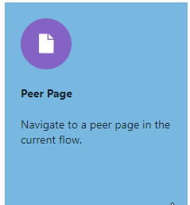

  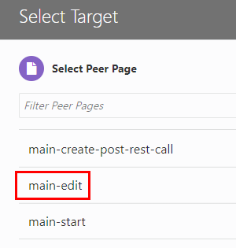

- Click **Select**.

- It is known that `main-edit` requires an input variable so we must map the selection (PRODUCT_ID (which is the database table's primary key)) to the input variable.

- In the Properties pane check the Browser History **push** radio button and then click the **Assign** link for the **Input Parameters**.

  

- Map the Sources: **Selection-->item[0]** to the Target: **InputVar1**.

  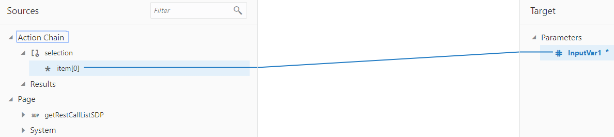

- Click **Save**.

- One last thing we need to do is removed the "hard-wired" value (1037) we put into the CallRestGetChain Action flow within the `main-edit` page and map the incoming value from the `main-start` page to the REST call PRODUCT_ID.

- Go to the `main-edit` tab (page) and click on **Actions**. Then, click on the the **CallRestGetChain**. 

  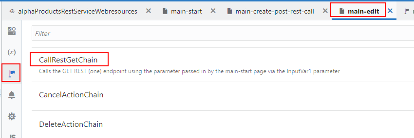

- In the chain click on the **Call REST Endpoint** Action and then click on the **Input Parameters Assign** link in the Properties pane.
 
  

- In the mappings select the "hard-wired" value for Target: **id**, right click and choose **Delete**. 

  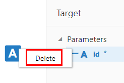

- Now map the Sources: **Page-->InputVar1** to Target: **id**.

- Click **Save**.

  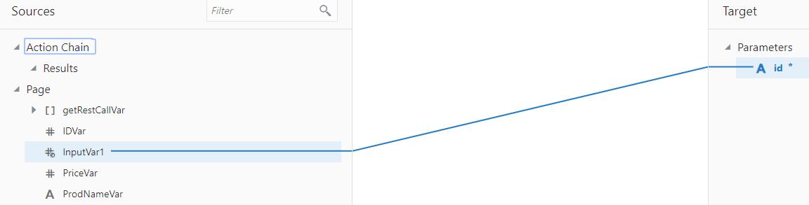

- The application is completed.
   
- To test click the **Run** arrow on the main menu bar.

  

- Run a test doing the following:
    - Select a Product from the main page. See if it shows up in the Edit page.
    - Cancel out.
    - Insert a new Product from the main page **+** PLUS sign using the following:
      ```
      Product Name: EXPO Dry Erase Kit, Assorted Colors 
      List Price:  25
      ```
    - See if the new product is in the Main List, find it, and select.
    - Modify the Product Name and List Price to:
      ```
      Product Name: EXPO Dry Erase Kit - 2 Pak, Assorted Colors 
      List Price:  50
      ```
    - ... and Update.
    - Cancel out.
    - Refind the Updated Product, select and Delete.
    
