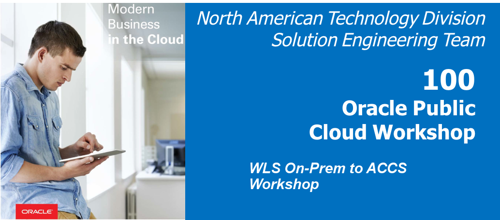  
Updated: August 22, 2018

## Introduction

This is the first of several labs that are part of the **Oracle Public Cloud WLS On-Prem to Cloud Workshop.** This workshop will walk you through the movement on a Java EE application from your on-prem WLS environment to Oracle's Cloud.

You will take on 2 Personas during the workshop. The **Lead DevOps Engineer Persona** Chip, who manages a team of developers writing and maintaining production applications and Richard **Infrastructure engineer** persona who's current challenge is providing the resources to host current applications on-premises.

**_To log issues_**, click here to go to the [github oracle](https://github.com/oracle/learning-library/issues/new) repository issue submission form.

### **STEP 1**: Acquire an Oracle Cloud Trial or Workshop Account

- Bookmark this page for future reference.

- Please click on the following link to create your Free Account, and complete all the required steps to get your free Oracle Cloud Trial Account. When you complete the registration process you'll receive a $300 credit that will enable you to complete the lab for free. Additionally, you'll have 1000s of hours left over to continue to explore the Oracle Cloud.

    - Soon after requesting your trial you will receive the following email. You may begin working on Lab 100 before you receive this email, but you will not be able to start Lab 200 until you have received it.

    

    ***setup a password***

### **STEP 2**: Login to your Oracle Cloud Account
- From any browser, go to the URL:
    `https://cloud.oracle.com`

- click **Sign In** in the upper right hand corner of the browser

    

- Enter your identity domain and click **My Services**

    **NOTE:** The **Identity Domain** should come from your Trial confirmation email.

    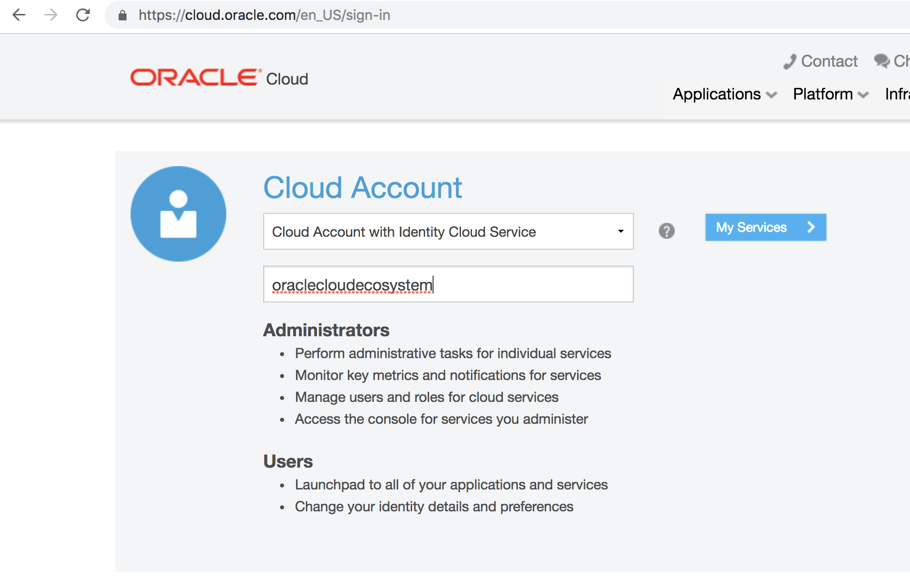

- Once your Identity Domain is set, enter your User Name and the Password you set after your confirmation e-mail and click **Sign In**

    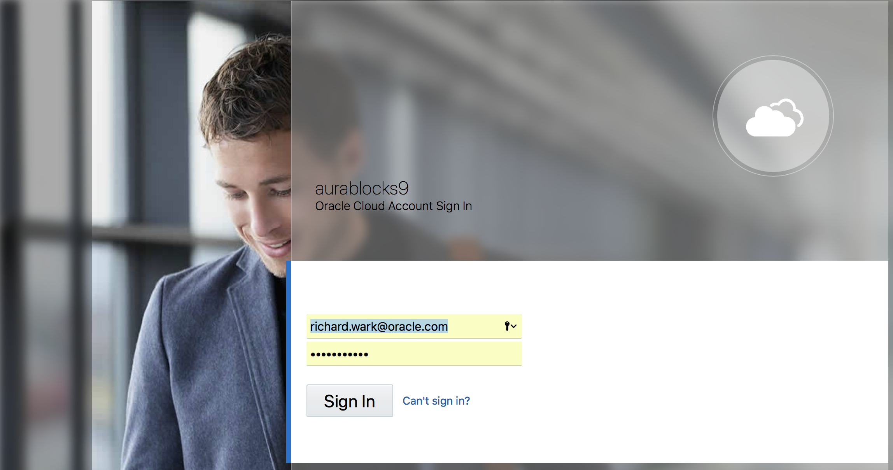

    

- You will be presented with a Dashboard displaying the various cloud services available to this account.

    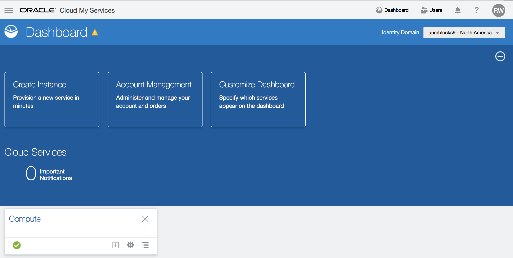

- If all your services are not visible, **click** on the **Customize Dashboard**, you can add services to the dashboard by clicking **Show.** For this workshop, you will want to ensure that you are showing at least the **Java, Application Container, Database and Storage Classic** cloud services. If you do not want to see a specific service, click **Hide**

    

    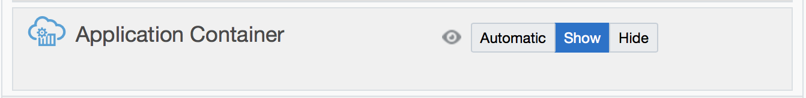

    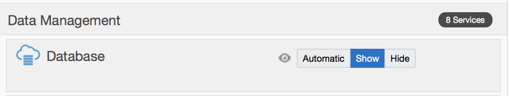

In order to complete the remaining migration labs, we will first create our on-prem application.  We have a pre-created image with an embeded Weblogic Server which will be used for this process.  To import this image, we must first create a network (VNC) that will allow you access into your image and a compartment which will contain your instances.

### **STEP 3**: Create Network and Compartment on OCI
- Click Compute from the Customize Dashboard or from Services. After that from the Menu Click Identity and Compartments. 
  
  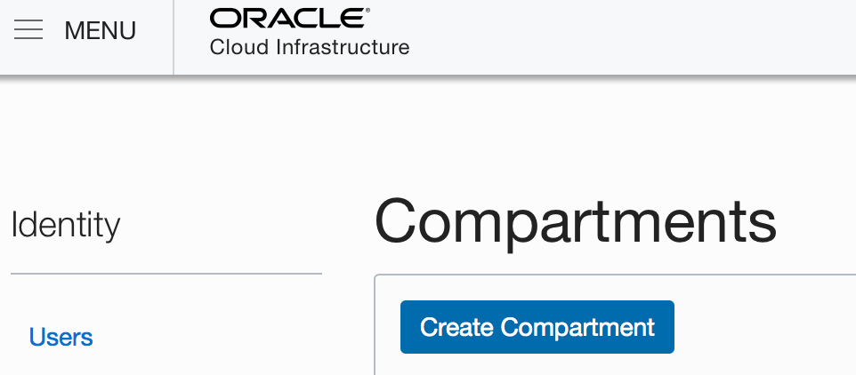

- Click Create Compartments button to create a Compartment called WebLogicLab.
  
  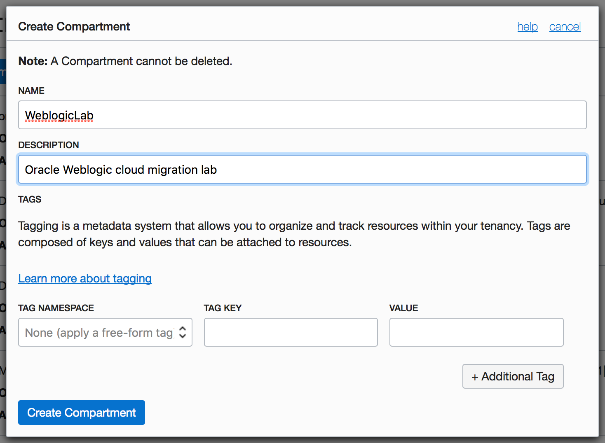

- You can see the recently created WebLogicLab Compartment in  Compartments.
  
  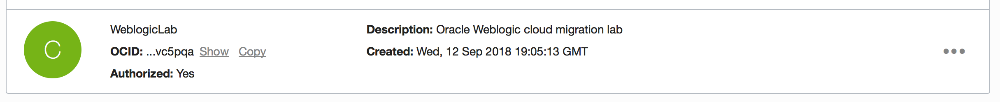

- Click Compute from the menu and click Custom Images.
  
  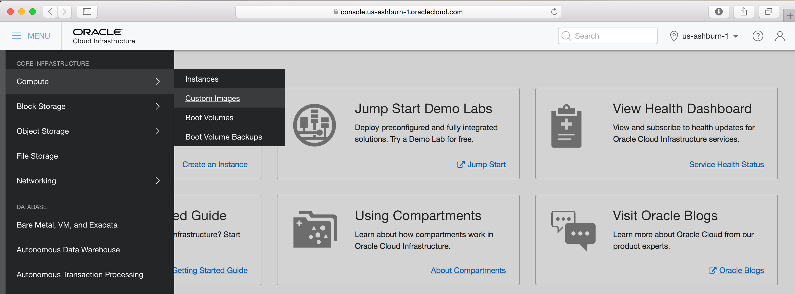

### **STEP 4**: Import Custom Image

- Click Import Image button and fill name and copy object storage URL.
  https://objectstorage.us-ashburn-1.oraclecloud.com/p/SYLtttdNPcIjxVbKbzsNDuzl7ZZaFCPGLodzGz8nP-Q/n/gse00015058/b/PlaceForImages/o/Nov7JDevImage

   After that, click Import Image.
  
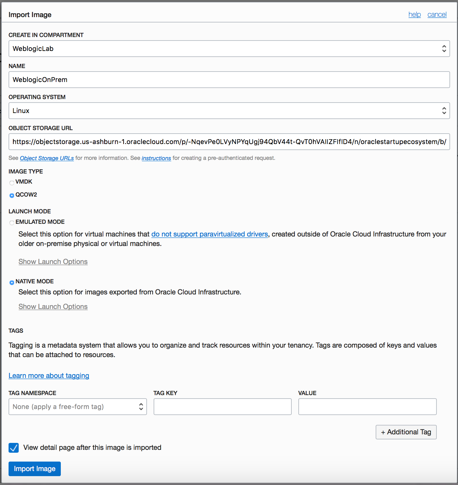

- You can see your WeblogicOnPrem Image is importing.
  
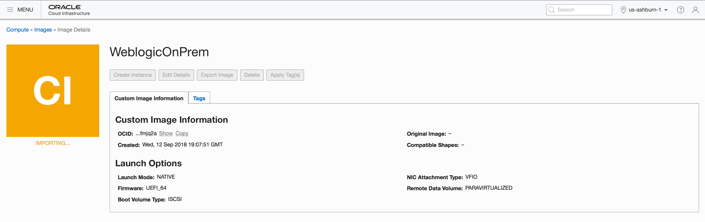

- Later you can is your WeblogicOnPrem Image is up and available to use.
  
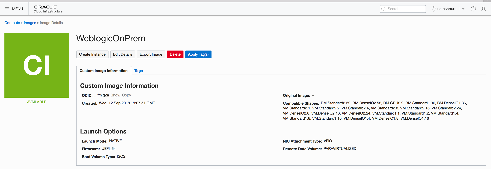

### **STEP 5**: Create Instance

- From the Custom Images page, select WeblogicOnPrem image and click Create Instance
  
  

- Click Create Instance button after completing required name for the instance.

  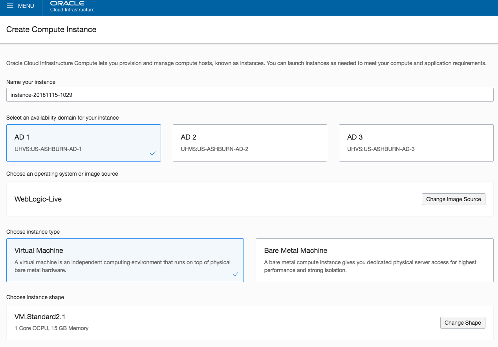
  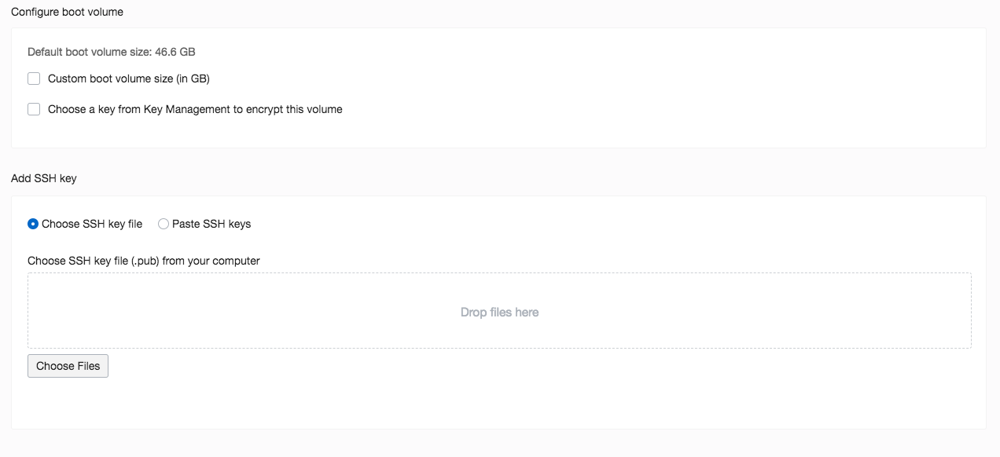
  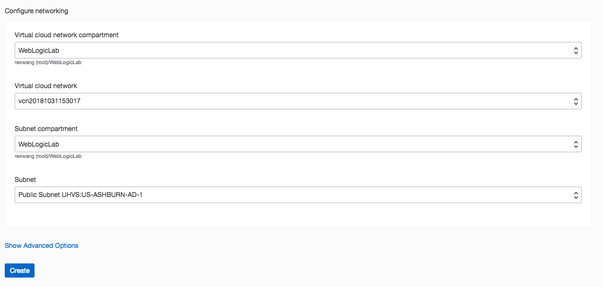

- You can see your WebLogicLabInstance is provisioning.
  
  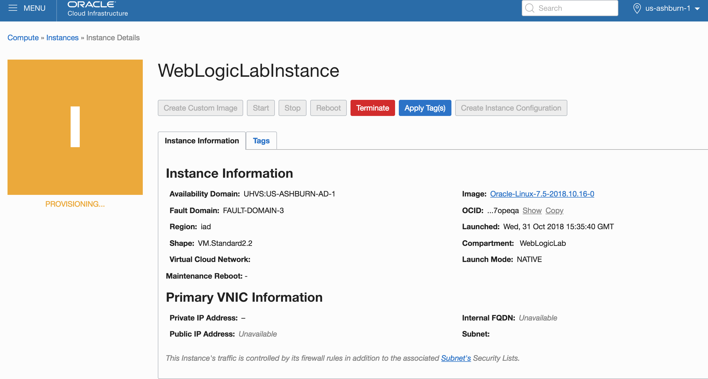

- Then you can see your instance is up and running.
  
  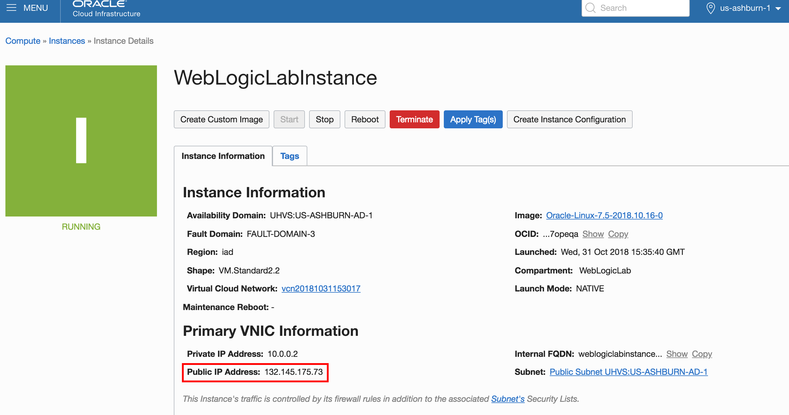

- You can connect to the image instance using the public ip Address.
  
  Example: vnc://132.145.175.73:5910
  Password: Oracle123

### **STEP 6**: Open JDeveloper Environment

- Click JDeveloper icon to open JDeveloper Environment

 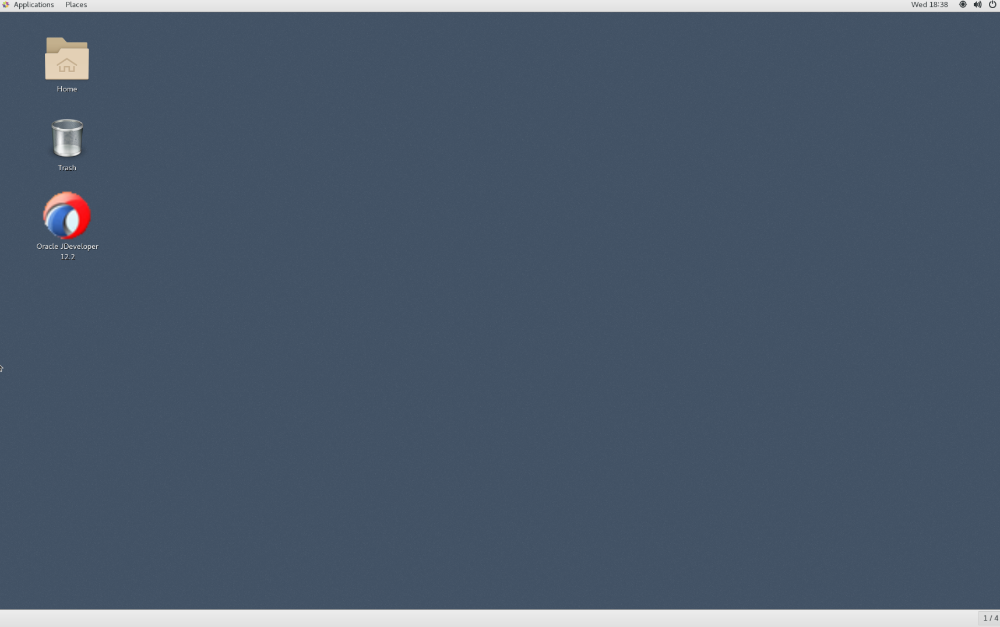

- Select Java EE Developer option
  
 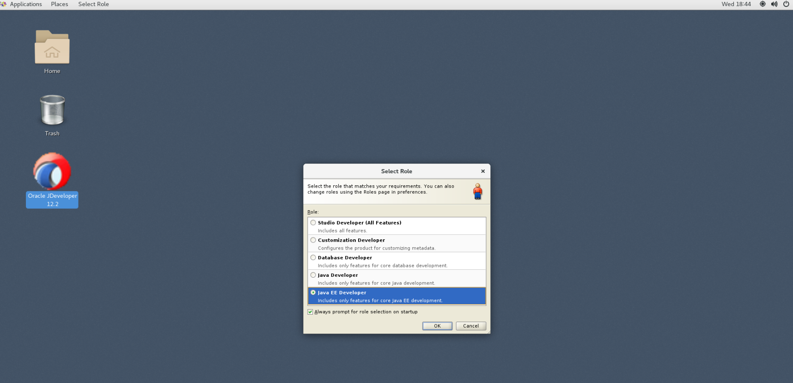
  
- You have JDeveloper Environment is ready to use
  
  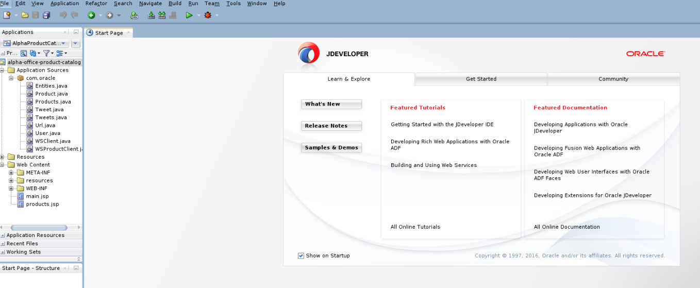