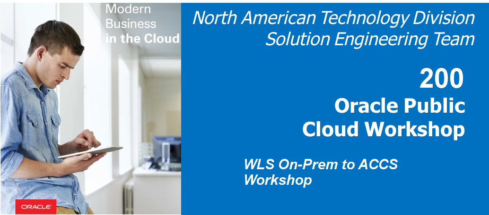  
Updated: 08/28/2018

## Introduction

This is the first of several labs that are part of the WebLogic Server On-Prem to Cloud Workshop. This lab will walk you through the process of moving an existing Java On-Prem application into Oracle Application Container Cloud. It will create and deploy war file and deploy it to the Oracle Public Cloud.

**_To log issues_**, click here to go to the [github oracle](https://github.com/oracle/learning-library/issues/new) repository issue submission form.

## Objectives

- Deploying the Application to the Oracle Application Cloud Service Instance
- Verifying the Application Deployment

# Redeploy both Components to Application Container Cloud Service

## Deploying the Application to the Oracle Application Cloud Service Instance

### **STEP 1**: Preparing the WAR file to be Deployed
- Click Application tab and open Terminal. You need to pull latest code as follows.
  
    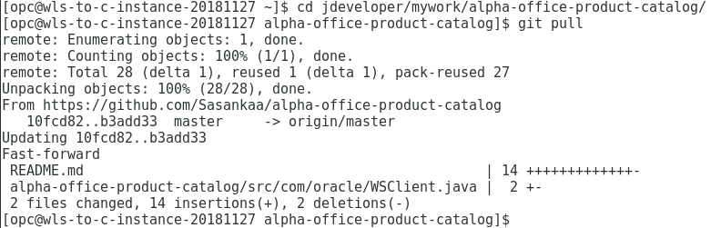

- In the Projects pane in Oracle JDeveloper, right-click Project and select Deploy > New Deployment Profile.
   
    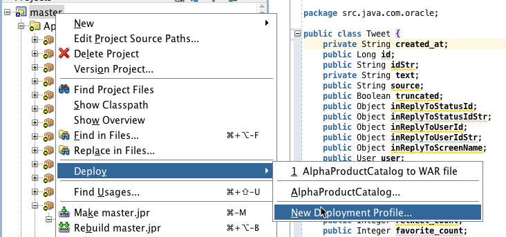 

- The New Deployment Profile is displayed. Select WAR file and click Next.
  
    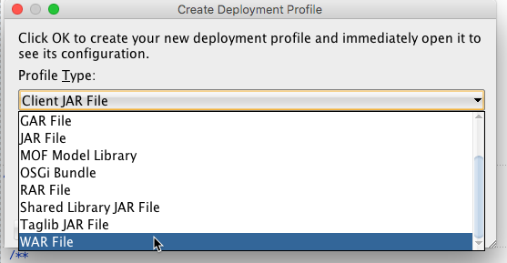 

- The Create Deployment Profile is displayed. Select Profile Type to WAR file and click OK.

    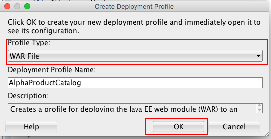 

- In the Edit WAR Deployment Profile Properties, edit any changes and click OK.
    
    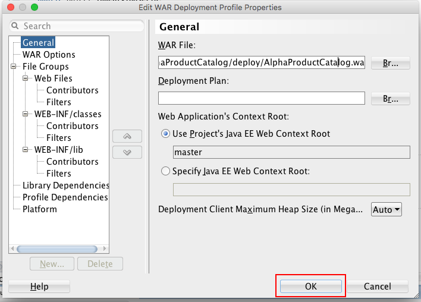 

- Right Click project and Click Deploy. Select recently created AlphaProductCatalog. 
  
    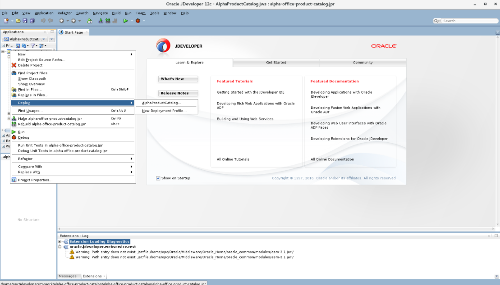

- Deploy AlphaProductCatalog is displayed. Select Deploy to War and click Next.    
    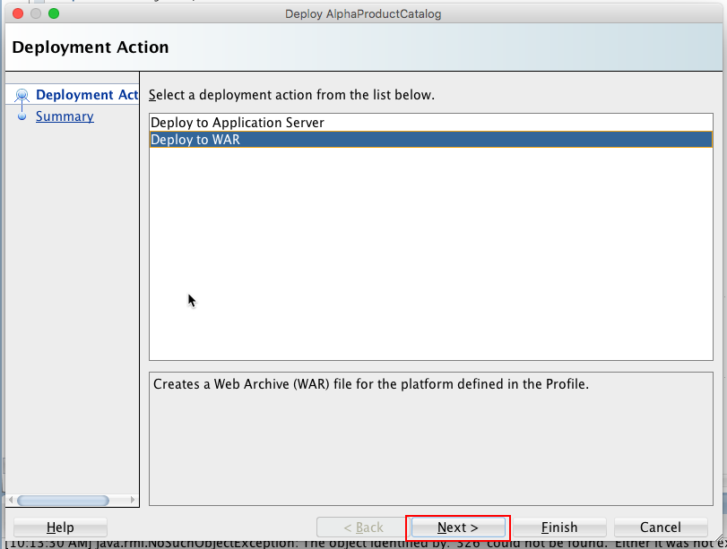 

- In the Summary page, verify the values and click Finish.
  Note: You can find generated war file as follows. 
    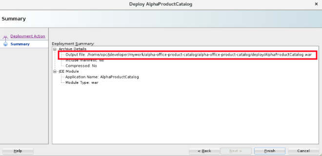

### **STEP 2**: Uploading the war file to the  Application Container Cloud Service

- Log into Oracle Cloud (https://cloud.oracle.com/en_US/sign-in). From Action Menu in the Application Container, select Open Service Control.
  
    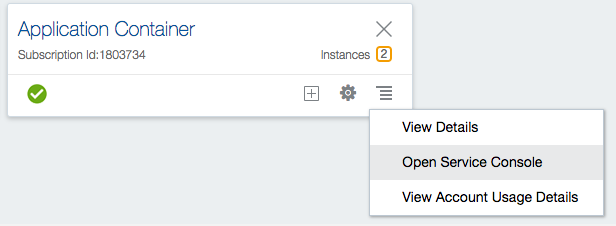

- In the Oracle Application Container Cloud, click Create Application.

    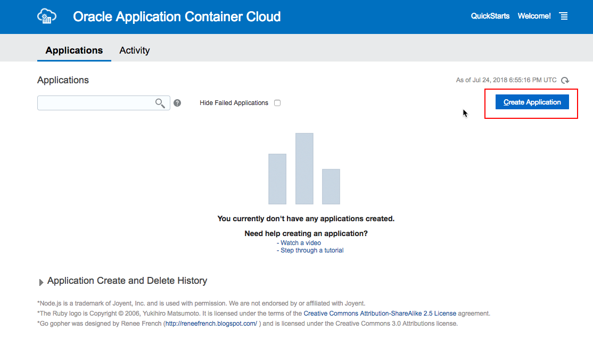 

- The Create Application is displayed. Select your application platform as JAVA EE.
  
    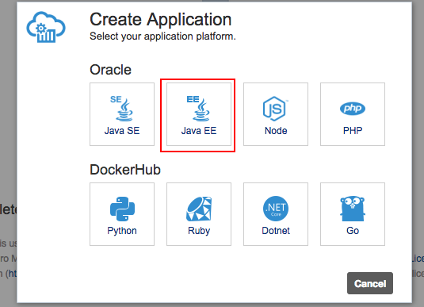 

- The Create Application is displayed. Enter a name for the application.
  
    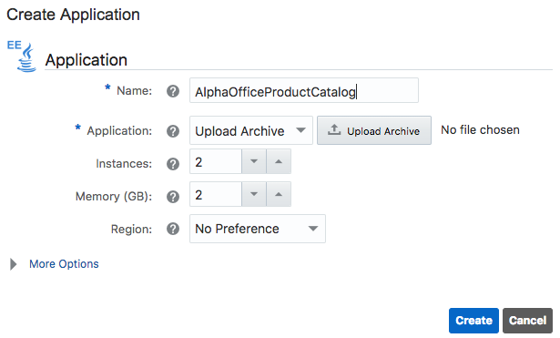 

- Click Upload Archive button to upload generated war file and click Create.

    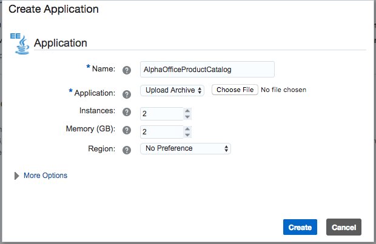 

## Verifying the Application Deployment

### **STEP 1**: Verification

- After Application Container Cloud Service Instance is created, click the link.

    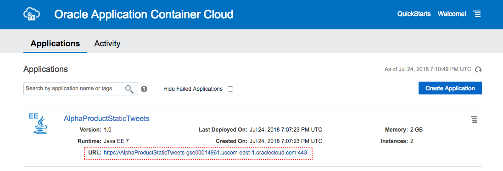 

- Add /alpha-office-product-catalog/products.jsp to view Alpha Office Product Catalog website.

     

- You have successfully deployed the Java EE application using  Application Cloud Container Service. Click any product to view its static twitter popup.

     

### **STEP 2**: Scale instance in the Application Container Cloud Service

- Click overview tab inside AlphaOfficeProductCatalog instance.

    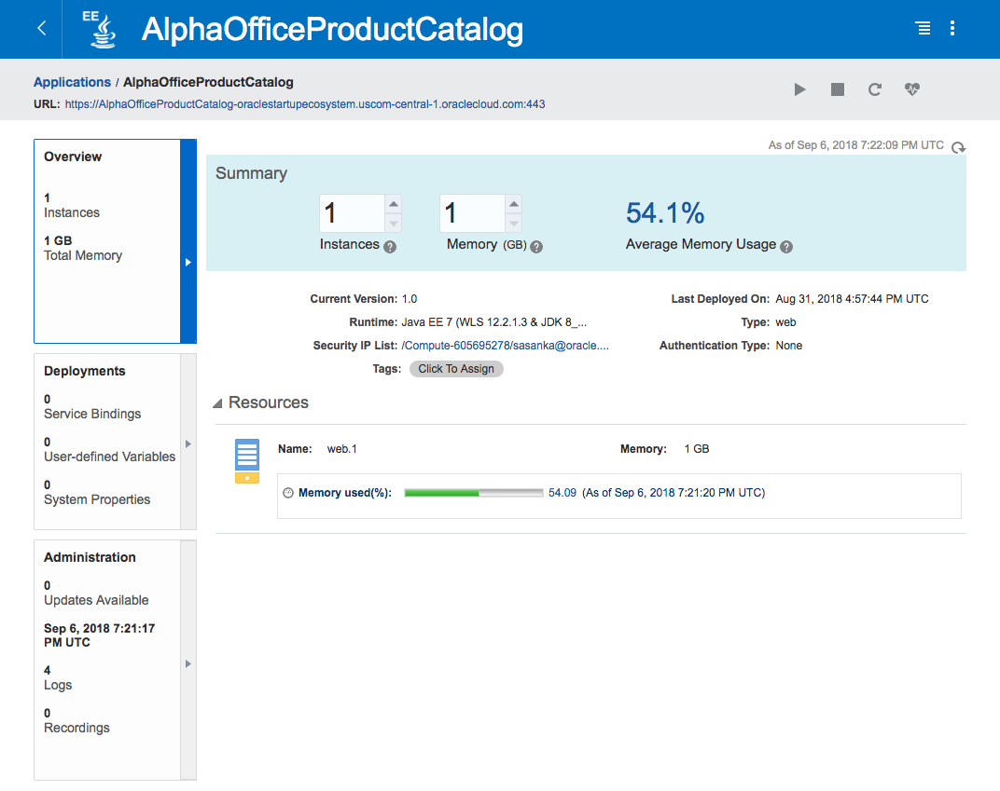 

- Increase instances and memory according to your requirements.

    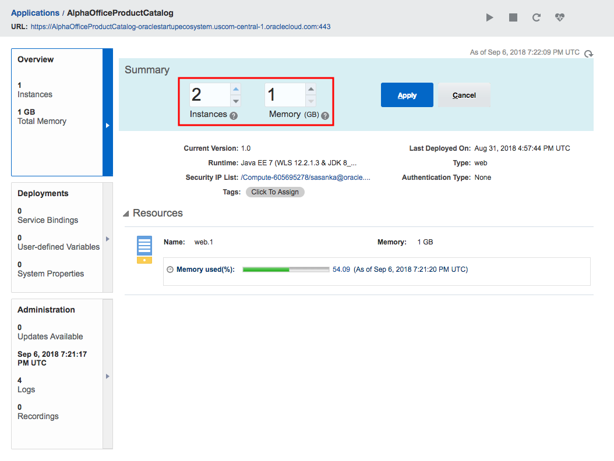 

- Click Apply to proceed.

    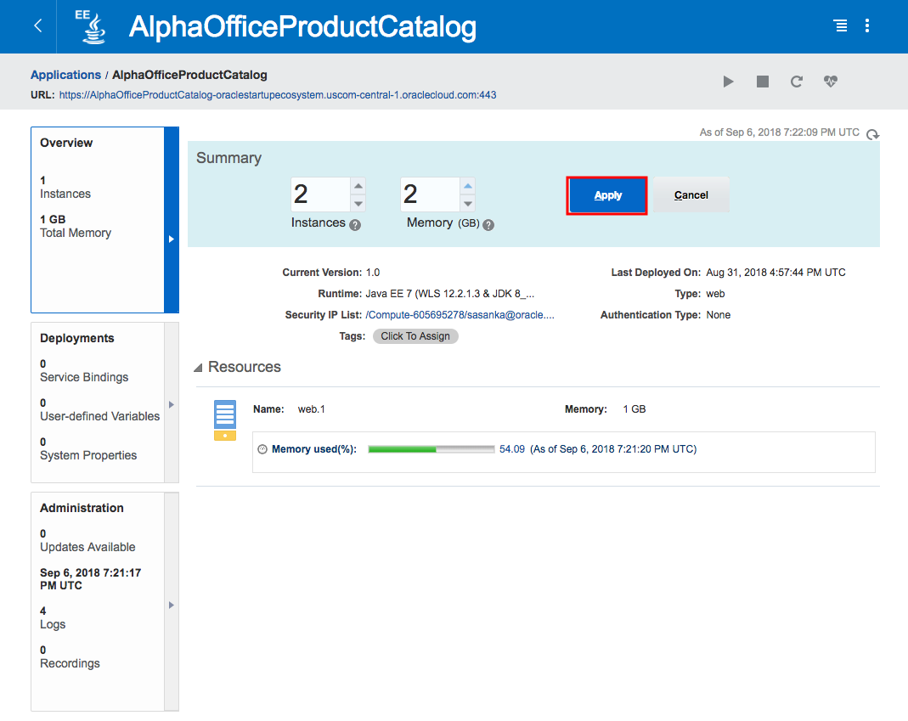 

- Proceed with either Rolling Restart with no downtime or Concurrent Restart brief downtime and click apply. 

    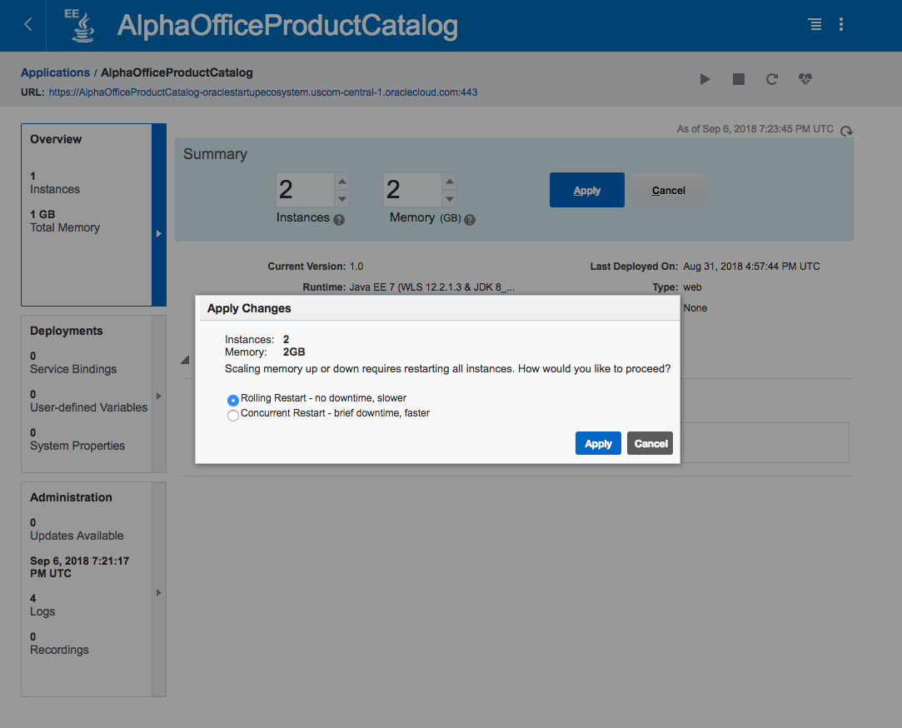 

- Wait few minutes to progress activity.

    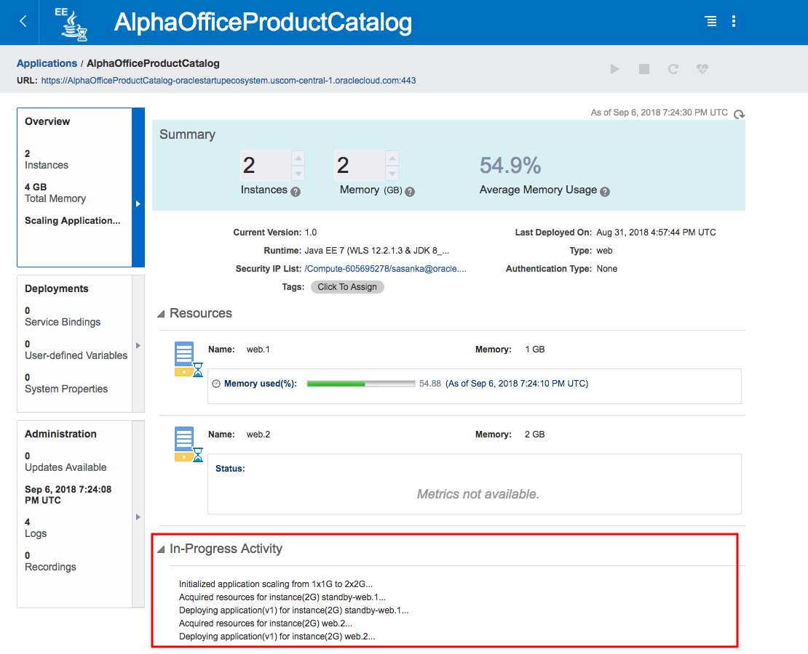 

- You have successfully scaled up/down AlphaOfficeProductCatalog Application Container Cloud Service Instance.

    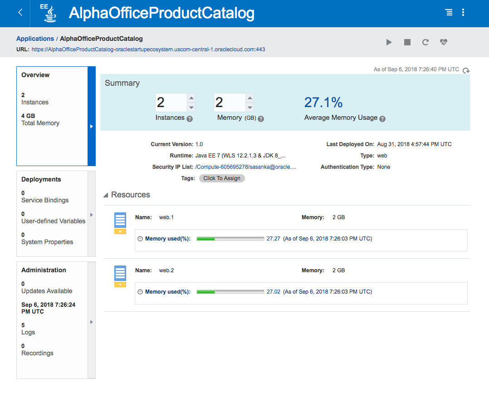 

