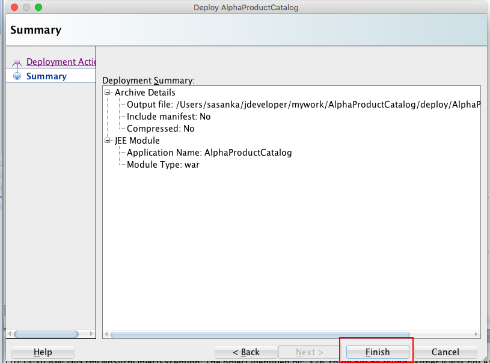
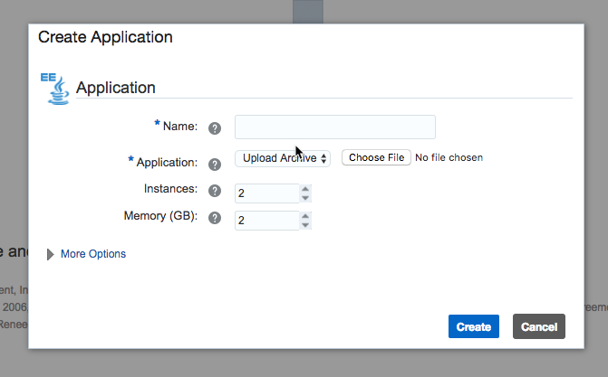

  
Updated: 08/28/2018

## Introduction

This is the first of several labs that are part of the WLS On-Prem to Cloud Workshop. This lab will walk you through the process of moving an existing Java On-Prem application into Oracle Application Container Cloud. It will create and deploy war file and deploy it to the Oracle Public Cloud.

**_To log issues_**, click here to go to the [github oracle](https://github.com/oracle/learning-library/issues/new) repository issue submission form.

## Objectives

- Deploying the Application to the Oracle Application Cloud Service Instance
- Verifying the Application Deployment

## Required Artifacts

For this lab you will need Github and Oracle JDeveloper. Use the following links to set up:

- a [GitHub account - https://github.com/join](GitHub account - https://github.com/join)
-  [Oracle JDeveloper - https://www.oracle.com/technetwork/developer-tools/jdev/overview/index.html](Oracle JDeveloper - https://www.oracle.com/technetwork/developer-tools/jdev/overview/index.html)

# Redeploy both Components to ACCS

## Deploying the Application to the Oracle Application Cloud Service Instance

### **STEP 1**: Preparing the WAR file to be Deployed

- In the Projects pane in Oracle JDeveloper, right-click Project and select Deploy > New Deployment Profile.
   
     

- The New Deployment Profile is displayed. Select WAR file and click Next.
  
     

- The Create Deployment Profile is displayed. Select Profile Type to WAR file and click OK.

     

- In the Edit WAR Deployment Profile Properties, edit any changes and click OK.

     

- Deploy AlphaProductCatalog is displayed. Select Deploy to War and click Next.

     

- In the Summary page, verify the values and click Finish.
   
    

### **STEP 2**: Uploading the war file to the  Application Container Cloud Service

- In the Oracle Application Container Cloud, click Create Application.

     

- The Create Application is displayed. Select you application platform as JAVA EE.
  
     

- The Create Application is displayed. Enter a name.
  
     

- Click Choose File button to upload generated war file and click Create.

     

## Verifying the Application Deployment

### **STEP 1**: Verification

- After Application Container Cloud Service Instance is created, you can click the link.

     

- Verify that you can see the Alpha Product Catalog Static Tweets Page.

     

- You have successfully deployed the Java EE application using  Application Cloud Container Service.

***SHOW RUNNING APP HERE
