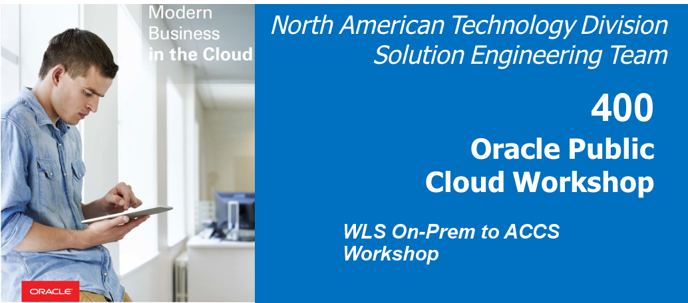  
Updated: 08/08/2018

## Introduction

This lab focuses on how to use Oracle Database Cloud Service and Oracle Java Cloud Service to complete the migration of your on-premises Oracle WebLogic Server environment to Oracle Cloud. 
Oracle AppToCloud saves you the tedious and error-prone task of manually migrating all of your existing Oracle WebLogic Server environments to Oracle Cloud. Create an Oracle Java Cloud Service instance that's linked to your existing AppToCloud artifacts in Oracle Cloud Infrastructure Object Storage Classic, and then perform an import to deploy all of your Java EE applications and resources to the new instance.
**_To log issues_**, click here to go to the [github oracle](https://github.com/oracle/learning-library/issues/new) repository issue submission form.

## Objectives

- Exporting a WebLogic Server Domain to Oracle Cloud
- Creating an Oracle Java Cloud Service Instance with AppToCloud

## Required Artifacts

- Oracle WebLogic Server
- An active subscription to Oracle Java Cloud Service
- The location of your AppToCloud files in Oracle Cloud Infrastructure Object Storage Classic

# Exporting a WebLogic Server Domain to Oracle Cloud

### **STEP 1**: Create the WebLogic Domain
- Download AlphaProductCatalog.war to an on-premises machine.
- Start WebLogic Server and login to the Weblogic localhost console.
- Click Lock & Edit.

    

- Under Domain Structure, click Deployments.

    

- On the Deployments page, click Install.

    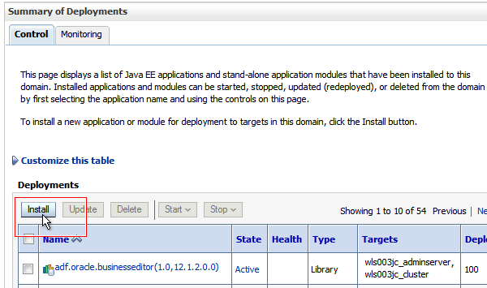

- On the Install page, click upload your file(s).

    

- On the Install Application Assistant page, click Browse near the Deployment Archive field, and select the alphaOffice.war application that you downloaded earlier.

    

- The name of the selected deployment archive file appears next to the Browse button. Click Next.

    

- Make sure that the deployment archive file is selected, near the bottom of the page, and then click Next.

    

- You can install the deployment as either an application or a library. For this tutorial, we'll install it as an application. Click Next

    

- Select the servers or clusters to which you want to deploy the application. For this tutorial, we'll deploy the application to all the servers in the cluster. So click All servers in the cluster, and then click Next. 
Note that the the cluster name (alphaOff_cluster in this example) would be the first eight characters of your service instance's name followed by _cluster.

    

- On the Optional Settings page, click Next. The default settings are adequate for this tutorial.

    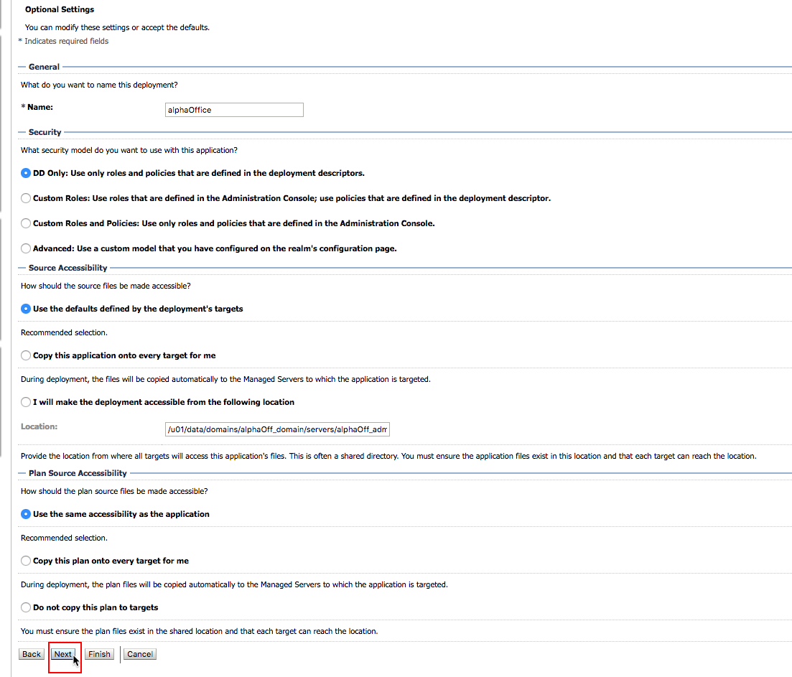

- Review the configuration settings. You can choose to fine-tune your configuration; but for this tutorial, select No, I will review the configuration later, and then click Finish.

    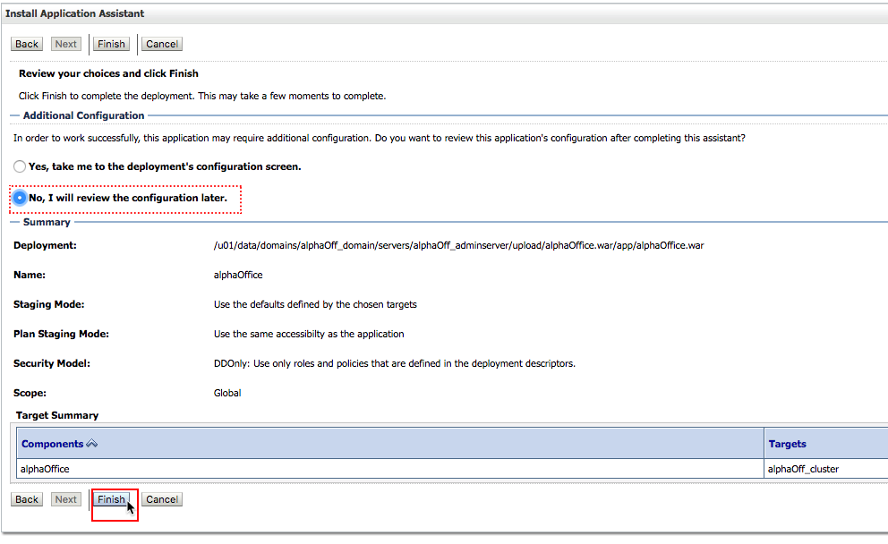

- A message is displayed that the application was deployed successfully.

    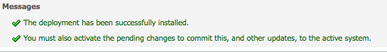

    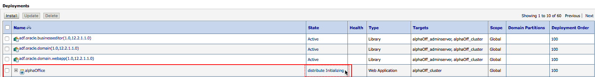

- In the Change Center, click Activate Changes.

    

- The application is in the Prepared state and ready to be started.

    

- In the WebLogic Server Administration Console, on the Summary of Deployments page, go to the Control tab.

    

- In the Deployments table, select the check box near the application that you just deployed.

     

- Click Start, and then select Servicing all requests.

    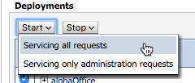

- Click Yes to confirm the deployment.

    

- The application is now in the Active state and is ready to accept requests.

    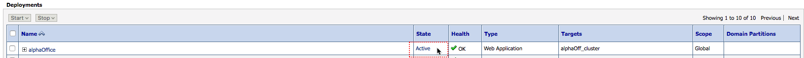

- Test access to the application
  
   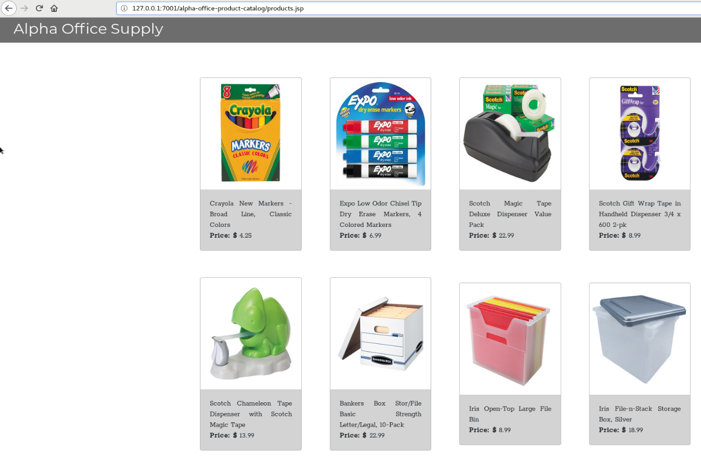

### **STEP 2**: Install the AppToCloud Tools
- Sign in to the Oracle Cloud My Services dashboard. Follow the instructions in your Welcome email, or go to http://cloud.oracle.com and click Sign In.
  
- In the Java tile click the Action menu Action Menu Icon, and then select Open Service Console.
  
   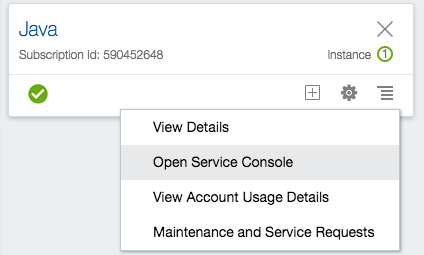

Note: If the Java tile is not visible, click Customize Dashboard.

- Click your username at the top of the page. Select Help and then Download Center.

- Click the download icon for AppToCloud. Save the file a2c-zip-installer.zip to the machine running the sample domain.
  
   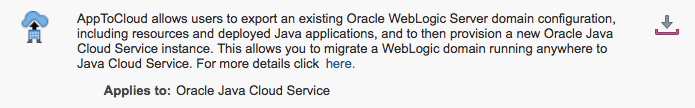

- Extract a2c-zip-installer.zip to a destination directory of your choosing. For example:
  
   

### **STEP 3**: Check the Domain Health

- Set the JAVA_HOME environment variable to the directory where you have installed the Java SE Development Kit (version 7 or later).

   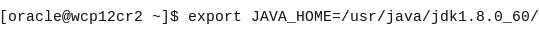

- Create a directory for the AppToCloud output files. For example:

   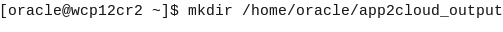

- Launch the AppToCloud Client tool.

   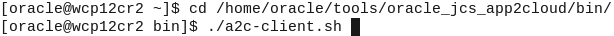

- Click the folder icon for the Oracle Home field.

   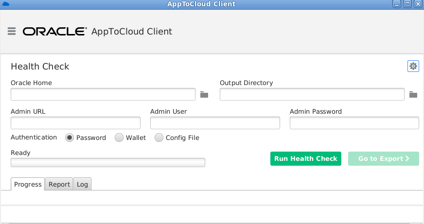

- Navigate to the Oracle Fusion Middleware home directory (MW_HOME) that contains your Oracle WebLogic Server installation. For example, /u01/app/fmw. Click Open.

- Click the folder icon for the Output Directory field.

   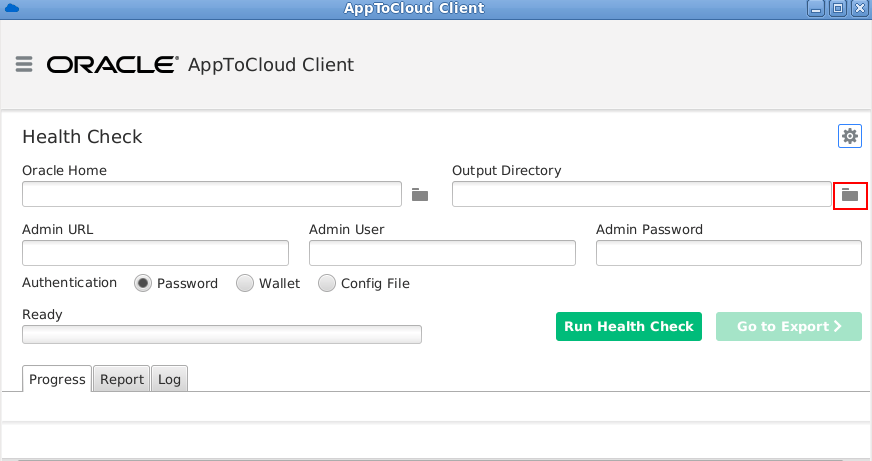

- Navigate to the output folder that you created earlier. For example, /home/oracle/app2cloud_output. Click Open.

- Complete the remaining fields on this page: 
    - Admin URL: t3://localhost:7001
    - Admin User: weblogic
    - Admin Password: oracle123
- Click Run Health Check.

   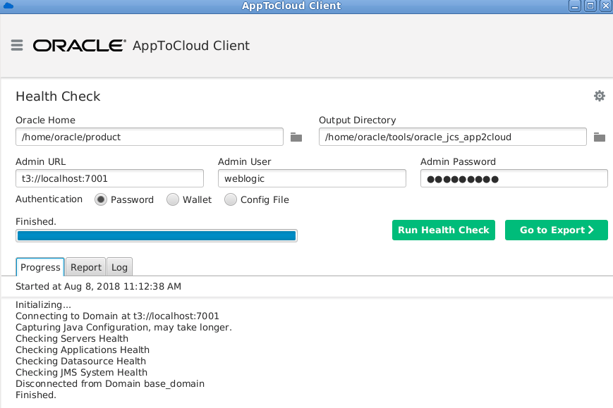

- Use the Progress tab to verify that the Health Check completed successfully.

- If the Health Check fails, refer to the error messages in this tab as well as the Report and Log tabs.

### **STEP 4**: Export the Domain

- Click the Go To Export button on the Health Check page.
The Export page is displayed. The Oracle Home and Archive File input fields are set automatically based on the Health Check results

   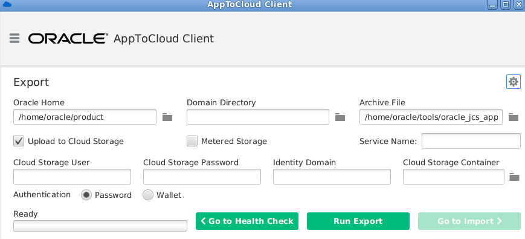

- Click the folder icon for the Domain Directory field.

   

 Navigate to the sample domain that you created earlier, MW_HOME/user_projects/domains/default_domain. For example, /u01/app/fmw/user_projects/domains/default_domain. Click Open.

- Verify that the Upload to Cloud Storage check box is selected.

- Select the Metered Storage check box if you have a metered subscription to Oracle Storage Cloud Service. If instead you have a monthly subscription, enter your Storage Cloud Service Name.

- Complete these other storage input fields:
    - Cloud Storage User - The name of an Oracle Cloud user with the Oracle Cloud Storage Service container administrator role. The credentials you use to log into Java Cloud Service will normally have the correct permissions required to create the container.
    - Cloud Storage Password - The user's password
    - Identity Domain - The Oracle Cloud identity domain to which this user belongs. This is often the same identity domain you use to log into Java Cloud Service.
  
   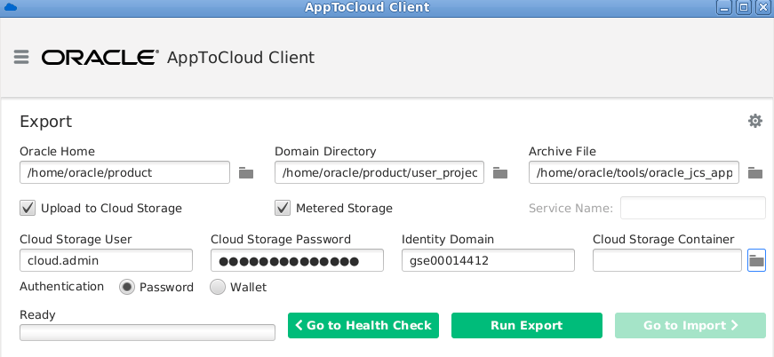 

- Click the folder icon for the Cloud Storage Container field.
The Select Cloud Storage Container window will not display if the AppToCloud Client is not able to connect to Oracle Storage Cloud Service with the provided configuration. Address any error messages and click the folder icon again.

    

- Click the New button.

   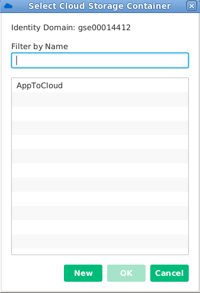 

- Enter the name AppToCloud and click OK.

- Enter the name of new cluster.

   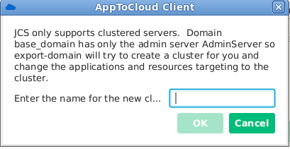 

- Verify that the AppToCloud container is selected and click OK to return to the Export page.

- Click Run Export.

- Use the Progress tab to verify that the Health Check completed successfully. Also note the location of the generated overrides file in Storage Cloud Service. For example, Storage-gse00014412/AppToCloud/base_domain.json.

   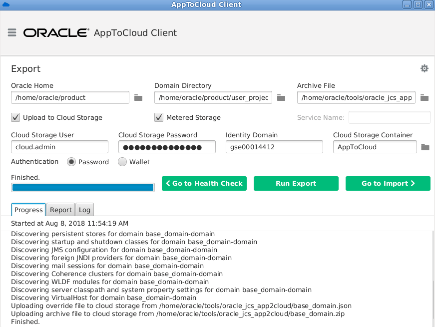 

If the Export fails, refer to the error messages in this tab as well as the Report and Log tabs.

- Close the AppToCloud Client.
Tip: You can view the generated export and report files in your specified output directory, app2cloud_output. You can view log files in the logs directory of your AppToCloud installation, oracle_jcs_app2cloud/logs.

# Creating an Oracle Java Cloud Service Instance with AppToCloud

### **STEP 1**: Create an Oracle Database Cloud Service Instance

- Sign in to Oracle Cloud My Services.
- Click  Dashboard menu near the upper left corner of the page, and select
  
- Click on create instance

   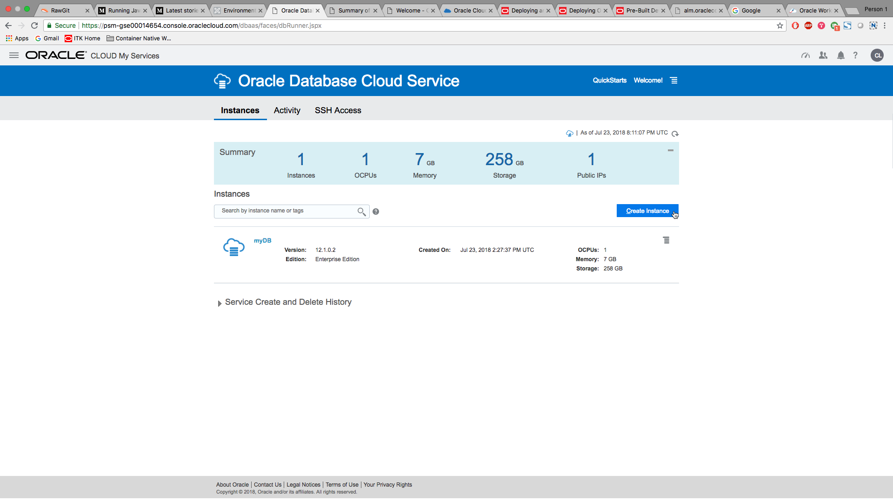

- Fill out the details and remember the region.

   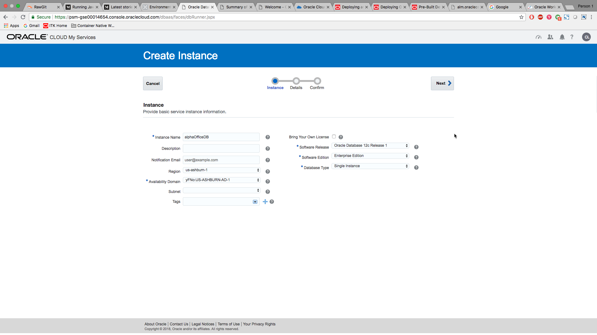

- Fill out the details and upload the ssh key. You can create new ssh key if you don't have it already.

   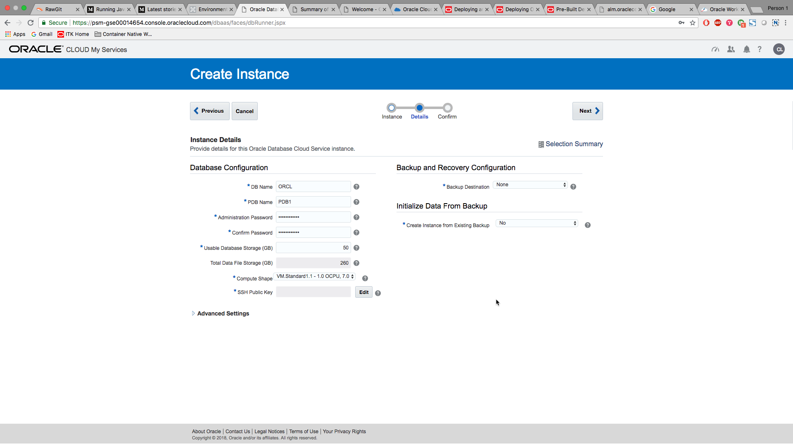

   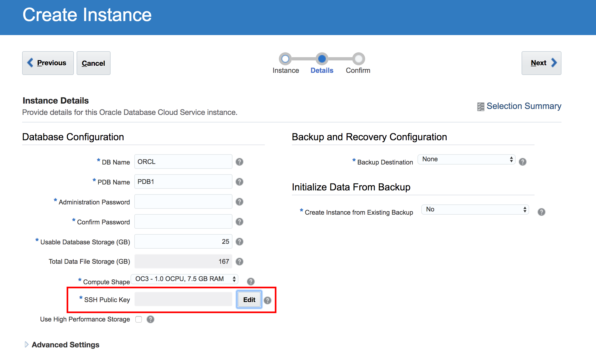

- Click on create and in few minutes new database instance will be running.

   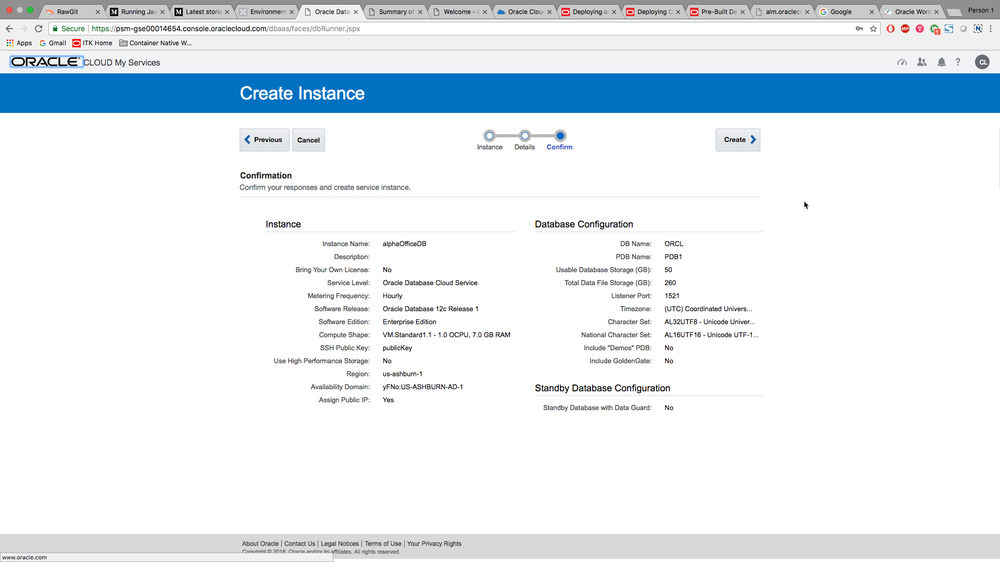

- For this tutorial you do not need Database configurations. If your application needs to connect database, then you remotely connect to the Database Cloud Service instance and use SQL scripts to create the necessary schema, tables and data for the sample application. There are many other ways in which to migrate data to Database Cloud Service.

### **STEP 2**: Create an Oracle Java Cloud Service Instance

- Return to the Dashboard in Oracle Cloud. Locate the Java tile. Click the Action Menu Action Menu Icon, and then select Open Service Console. If this is the first time you have accessed the service then you may be presented with a Welcome screen. If this happens then you can continue to the console by clicking Go to Console.

- Click Create Service and then select the Oracle Java Cloud Service - AppToCloud option.

   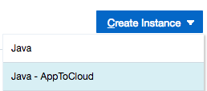

- Enter values for these input fields:
  
   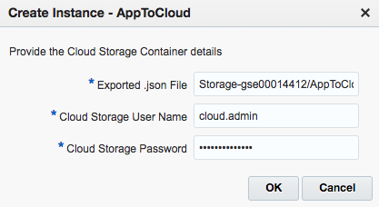

    - Exported json File - Enter the fully-qualified URL or the relative path to default_domain.json in the AppToCloud storage container.
For example, SStorage-gse00014412/AppToCloud/base_domain.json
If necessary, refer to the output from the AppToCloud Client tool.
    - Cloud Storage User Name - Enter the name of an Oracle Cloud user that has access to this storage container. This can be the same user that the AppToCloud Client used to upload the JSON file.
    - Cloud Storage Password - Cloud Storage Password
- Click OK

- Enter a unique Service Name for your Oracle Java Cloud Service instance. This tutorial uses the name AlphaProductCatalogWeb.

   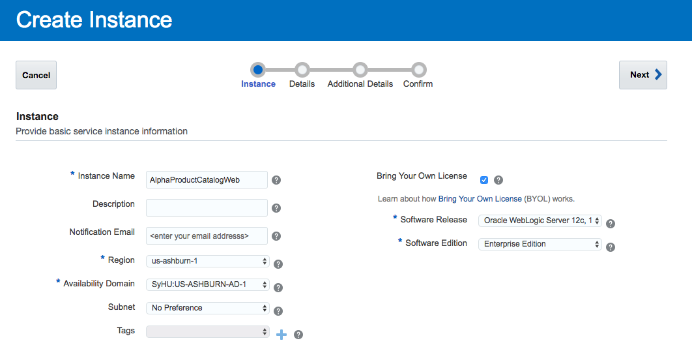

- Accept the default values for the remaining fields on the Service page and click Next.

- Click Advanced. Click Edit next to the SSH Public Key field. Use your browser to select the public key file to upload from your local computer. Select the same publicKey file that you downloaded earlier in the tutorial for the Database Cloud Service Instance.

   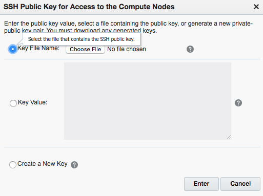

- Click Enter.

- Complete the WebLogic Access section:
  
   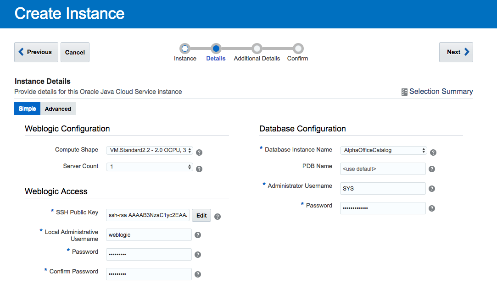

- Complete the Database section:
  
   

-  Click Enable Access to Administration Consoles.

   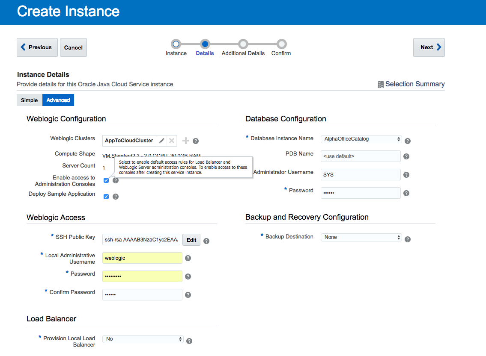
  
- For Provision Load Balancer, select Yes. Accept the default load balancer settings.

   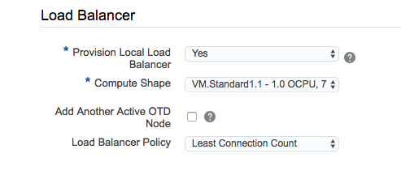

- Click Next.
  
   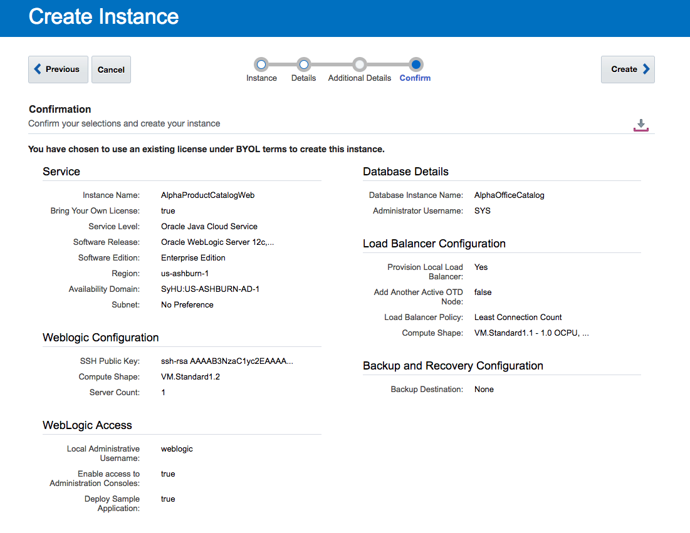

- On the Confirmation page, review your selections and click Create.
When you return to the Java Cloud Service console, you will see your new service instance listed. It will have a status of "Creating Service".

   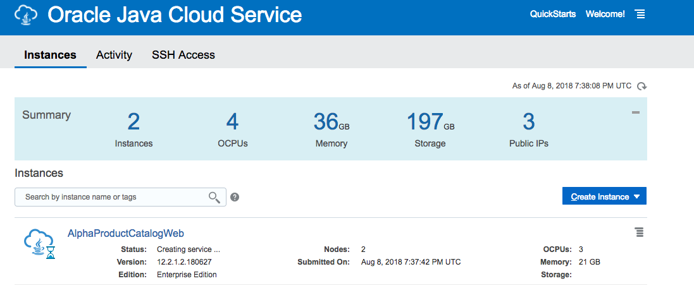

- Periodically refresh this page until the service instance creation is completed.

### **STEP 3**: Import Applications into the Service Instance

- Perform an import to update the new service instance with the Java EE applications and other resources collected from your on-premises environment.

- On the Services page click the Menu icon for your new service instance and select AppToCloud Import.
You may need to scroll through the list of menu options.

- When prompted for confirmation, click OK.
Note: After a few moments, the service instance will have a status of "Service Maintenance". Periodically refresh this page until the service instance is no longer in a maintenance state.
If the import fails, use the Activity tab to view the log for this operation.

### **STEP 4**: Test the Imported Application

- Click the name of the service instance.
  
- Identity the Public IP address in this service instance.

- Direct your browser to the URL http://LB_PUBLIC_IP/alpha-office-product-catalog/products.jsp.
Verify that the AlphaProductCatalog application was successfully deployed to Oracle Cloud.

   

