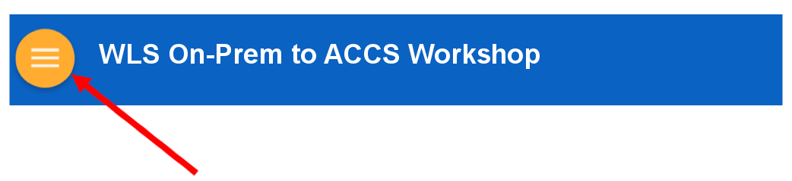

# On-prem Weblogic migration to Cloud Workshop

Welcome to the On-prem Weblogic migration to Cloud workshop. This workshop will walk you through the movement on a Java EE application from your on-prem WLS environment to Oracle's Cloud.
To learn more about this workshop please watch the video below.

<a href="https://youtu.be/" target="_video">Workshop Overview</a>

### **Step 1**: Acquire an Oracle Cloud Trial or Workshop Account

- Bookmark this page for future reference.

- Please click on the following link to create your <a href="https://myservices.us.oraclecloud.com/mycloud/signup?language=en&sourceType=:ex:tb:::RC_NAMK180921P00075:WLSOnPremCloud&SC=:ex:tb:::RC_NAMK180921P00075:WLSOnPremCloud&pcode=NAMK180921P00075" target="_trial">Free Account</a>, and complete all the required steps to get your free Oracle Cloud Trial Account. When you complete the registration process you'll receive a $300 credit that will enable you to complete the lab for free.  Additionally, you'll have 3500s of hours left over to continue to explore the Oracle Cloud.

  - Soon after requesting your trial you will receive the following email. You may begin working on Lab 100 before you receive this email, but you will not be able to start Lab 100 until you have received it.

  

### **Step 2**: Navigate to Lab 100

- _You can see a list of Lab Guides_ by clicking on the **Menu Icon** in the upper left corner of the browser window. You're now ready to continue with **Lab 100**.

