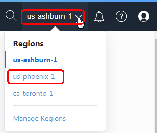
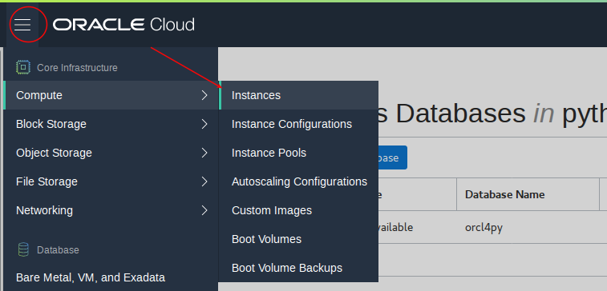

# Lab 050: Setup Cloud Environment

  

## Introduction

In Lab 50 (as Derek) you will initiate the Oracle cloud environment that you will use to create and deploy your microservices applications. This environment will be contained within a cloud Compartment, and communication within the Compartment will be via a Virtual Cloud Network (VCN). The Compartment and VCN will isolate and secure the overall environment. You will deploy two Oracle Cloud Services for this environment. An Oracle Cloud Developer Image will be used to develop and deploy your microservices code. The microservices will access data within an Autonomous Transaction Processing (ATP) Cloud Service. 

***To log issues***, click here to go to the [github oracle](https://github.com/oracle/learning-library/issues/new) repository issue submission form.

## Lab 050 Objectives

- Setup your IAAS environment and create common components.
- Create a new Cloud Developer Image from Marketplace.
- Create an Autonomous Transaction Processing (ATP) Database.
- Install Visual Studio Code into the Cloud Developer Image.

## Steps

### **STEP 1:** Your Oracle Cloud Trial Account

You have already applied for and received your Oracle Cloud Trial Account.

### **STEP 2:** Log in to your OCI dashboard and Switch Regions

- Once you receive the **Get Started Now with Oracle Cloud** Email, make note of your **Username, Password and Cloud Account Name**.

  

- From any browser go to

  [https://cloud.oracle.com/en_US/sign-in](https://cloud.oracle.com/en_US/sign-in)

- Enter your **Cloud Account Name** in the input field and click the **Next** button.

  

- Enter your **Username** and **Password** in the input fields and click **Sign In**.

  

- You are presented with the Oracle Cloud Infrastructure (OCI) Dashboard/Portal

  

- To switch Regions, click on the Region Drop-Down in the upper right-hand corner and select **Manage Regions**
  
  

- On the Tenancy page, click on the **Subscibe To This Region** button for the **us-phoenix-1** Region.  Note - this is not in fact required, but does show how you can select region to co-locate services.
  
  

- Click **OK** to confirm the subscribtion to the region.
  
  

**NOTE:** Refresh the Page to verify the Region is now Active (Green Circle).  The subscribtion can take 1 minute to occur.
	
- Once the Region is Active (Green Circle), click on the Region Drop-Down in the upper right-hand corner and select **us-phoenix-1**

  
	
  

### **STEP 3:** Create a Compartment

Compartments are used to isolate resources within your OCI tenant. User-based access policies can be applied to manage access to compute instances and other resources within a Compartment.

- Click the **Menu icon** in the upper left corner to open the navigation menu. Under the **Governance and Administration** section, select **Identity** and select **Compartments**.

  

- Click **Create Compartment**.  Note that you can create the compartment in your root compartment, or create sub-compartments under the root compartment.  In this case we will be creating a new compartment under our 'demo' compartment (your root compartment will be different).

  

- In the **Name** field, enter `python4dev`. Enter a **Description** of your choice. Click **Create Compartment**.

  

- In a moment, your new Compartment will show up in the list.

  

### **STEP 4:** Create a VCN

We need a default VCN to define our networking within the python4dev compartment. This is where Subnets and Security Lists are defined for each Availablity Domain in your Tenancy. Oracle Cloud Infrastructure is hosted in regions and availability domains. A region is a localized geographic area, and an availability domain is one or more data centers located within a region. A region is composed of several availability domains. Availability domains are isolated from each other, fault tolerant, and very unlikely to fail simultaneously. Because availability domains do not share infrastructure such as power or cooling, or the internal availability domain network, a failure at one availability domain is unlikely to impact the availability of the others.

All the availability domains in a region are connected to each other by a low latency, high bandwidth network, which makes it possible for you to provide high-availability connectivity to the Internet and customer premises, and to build replicated systems in multiple availability domains for both high-availability and disaster recovery.

- Navigate to `Networking` > `Virtual Cloud Networks`.

  

- Select `Create Virtual Cloud Network`. 

  

- Call it ***py4devvcn***, and be sure to select the option to create related resources.  Be sure to select the ***python4dev*** compartment you created previously.  Then scroll down and click `Create Virtual Cloud Network`.

  

  

The new [marketplace cloud developer image](https://blogs.oracle.com/linux/announcing-the-oracle-cloud-developer-image-for-oracle-cloud-infrastructure) for Oracle provides a great platform for application development, with all of the development tools you'll need pre-installed and configured.

### **STEP 5:** Create a new cloud developer image from the Oracle Marketplace Images.

- First create a new ssh key pair.  On linux or a Mac enter this in a command shell.  Note to create a ssh key pair on Windows use puttygen.  See the following:  `https://www.ssh.com/ssh/putty/windows/puttygen`.  Call the key `alphakey`.  It will create a private key called `alphakey` and a public key called `alphakey.pub`.  The public key `alphakey.pub` is used when you are prompted for a SSH key when you create services, and the matching private key `alphakey` is used to access those services after creation. (eg: Cloud Developer Image). 

`ssh-keygen -b 2048 -t rsa`

- Navigate to `Compute` > `Instances`.

  

- Select `Create Instance` (in your ***python4dev*** compartment).

  

- Enter `AlphaOffice` as the name, and then select `Change Image Source`.

  

- Select the `Oracle Cloud Developer Image`.  Click the checkbox to access the terms and restrictions.

  

  

- Select your public ssh key you created above.

  

- Select your Virtual Cloud Network Compartment `python4atp` and `py4devvcn` VCN and then `Create`.

  
	
### **STEP 6:** Create an Autonomous Transaction Processing (ATP) Database

We require a Database to store the Alpha Office data which is accessed later in this workshop.  We will create an Autonomous Transaction Processing (ATP) Database to load data into.  Autonomous Transaction Processing is one of a family of cloud services built on the self-driving, self-securing, and self-repairing Oracle Autonomous Database.  Autonomous Transaction Processing uses machine learning and automation to eliminate human labor, human error, and manual tuning, delivering unprecedented cost saving, security, availability, and production. Autonomous Transaction Processing supports a complex mix of high-performance transactions, reporting, batch, IoT, and machine learning in a single database, allowing much simpler application development and deployment and enabling real-time analytics, personalization, and fraud detection.

- Click the **Menu icon** in the upper left corner to open the navigation menu. Under the **Database** section of the menu, click **Autonomous Transaction Processing** .

  

- Select the **Compartment** `python4dev` and click **Create Autonomous Database**.

  

- Select the **Compartment** `python4dev` if it is not already selected. Enter the **Display Name** `AlphaOffice`, **Database Name** `orcl4py`, enter the **Administrator Password** of `a1phaOffice1_` and Click **Create Autonomous Database**

  

  

  

- After approximately 5 minutes, the Autonomous Transaction Processing instance will be provisioned. You can immediately proceed to the next section.

  

### **STEP 7:** Connect to your marketplace developer image

[See this link for more info](https://cloudmarketplace.oracle.com/marketplace/en_US/listing/54030984).  This info is copied below.

- Navigate to `Comute` > `Instances` and select your image to identify the IP address

	

- Identify the IP address.  You will use this to ssh to the image.

	

- SSH to the image.  Open a terminal window on a Mac or command shell on Linux and enter the following command: `ssh -i privateKey opc@<your IP address>`.  Note if you are on Windows you will need to use putty.

	

- Enter `vncpasswd` to set your VNC access (make it a secure one!).

	

- Enter `vncserver` to start the vncserver.

	

- Open a SSH tunnel.  This example works on Linux and the MAC.  Note on Linux you will need to be su.  See [here](http://www.oracle.com) for information on how to create a tunnel on Windows.  ***NOTE:*** do not close this terminal window.  It maintains the tunnel to the developer image, which we access through VNC.  If for whatever reason the window is closed or you are otherwise logged out (sometimes tunnels drop), then just run this again to log in.

`ssh -i <your private key> -L 5901:localhost:5901 opc@<your marketplace compute IP>`

- Open a vnc viewer session.  If you don't already have vncviewer you can download it [here](https://www.realvnc.com/en/connect/download/viewer/).

	

	

### **STEP 8:** Download Files Used in this Workshop

**Click to Download.  Save the file to your Downloads directory.**

[lab-resources.zip](https://oracle.github.io/learning-library/workshops/python4atp/lab-resources.zip)

**This completes the Lab!**

**You are ready to proceed to [Lab 100](LabGuide100.md)**
