# Lab 050: Setup Cloud Environment

  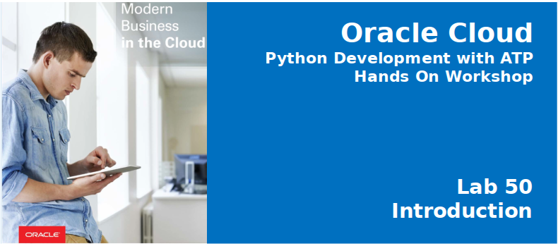

## Introduction

In Lab 50 (as Derek) you will initiate the Oracle cloud environment that you will use to create and deploy your microservices applications. This environment will be contained within a cloud Compartment, and communication within the Compartment will be via a Virtual Cloud Network (VCN). The Compartment and VCN will isolate and secure the overall environment. You will deploy two Oracle Cloud Services for this environment. An Oracle Cloud Developer Image will be used to develop and deploy your microservices code. The microservices will access data within an Autonomous Transaction Processing (ATP) Cloud Service. 

To deploy these services, you will be using Terraform, a tool for building, changing, and versioning infrastructure safely and efficiently. It is an important tool for anyone looking to standardize IaaS (Infrastructure as a Service) within their organization.

***To log issues***, click here to go to the [github oracle](https://github.com/oracle/learning-library/issues/new) repository issue submission form.

***We recommend that you create a notes page to write down all of the credentials you will need.***

## Lab 050 Objectives

- Setup your IAAS environment and create common components.
- Create a new Cloud Developer Image from Marketplace.
- Create an Autonomous Transaction Processing (ATP) Database.
- Create an Object Storage bucket.

## Steps

### **STEP 1:** Your Oracle Cloud Trial Account

You have already applied for and received your Oracle Cloud Free Tier Account.

### **STEP 2:** Log in to your OCI dashboard

- From any browser go to oracle.com to access the Oracle Cloud.

    [https://www.oracle.com/](https://www.oracle.com/)

    

- Click the icon in the upper right corner.  Click on **Sign in to Cloud** at the bottom of the drop down.   *NOTE:  Do NOT click the Sign-In button, this will take you to Single Sign-On, not the Oracle Cloud*

       
 
- Enter your **Cloud Account Name** in the input field and click the **Next** button.

  

    **Note this is NOT your email. This is the name of your tenancy noted in the email you received during signup**
- Enter your username (this may be your email address) and password and click on **Sign In**.
  

- Once you log in you will see a page similar to the one below.

      

### **STEP 3:** Download and Install Terraform

See these instructions for [Download of Terraform](https://learn.hashicorp.com/terraform/getting-started/install.html).

**Make sure to fully review the page before starting.**

- First, click on the link to get to the downloads page.

    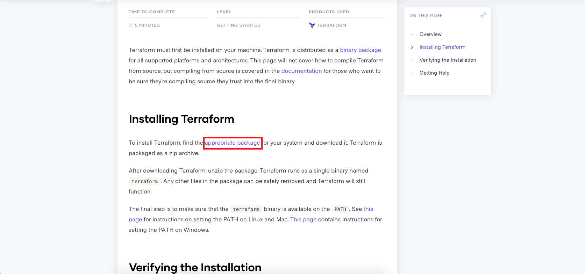

- Then, choose the appropriate package from your operating system.

    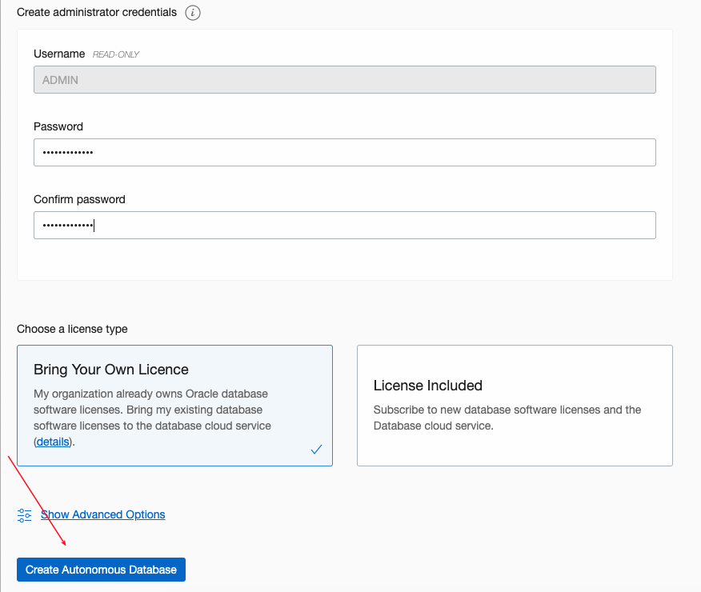

- Once the download finishes, in your home directory look for a folder called `bin`. Move the zip file you downloaded into this directory. Open the zip file and verify that you see the binary file in the `bin` directory.

    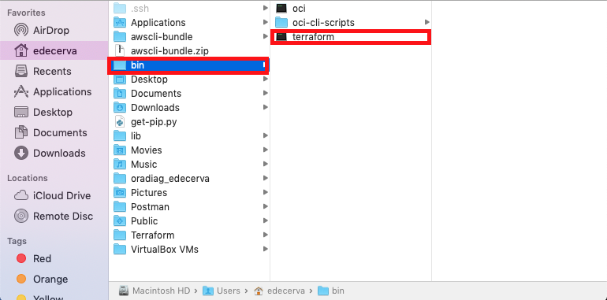

The following steps are for Linux and Mac users. Windows users see [here](https://stackoverflow.com/questions/1618280/where-can-i-set-path-to-make-exe-on-windows) for instructions on setting the correct path.

- Make sure you are in the home directory, then in the terminal run the following,

    `$ nano .bash_profile`

    If it doesn't exist, create it and then open the text editor.

- Add the following path to your bash_profile. Press ctrl + o to save, then press enter. Next, ctrl + x to exit.

    `export PATH=$PATH:/path-to/your/bin/`

    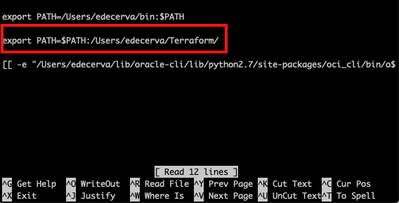

- Now, we need to source the profile so we can use that path in our environment.

    `$ source .bash_profile`

- Finally, make sure that Terraform was installed successfully.

    `$ terraform`

    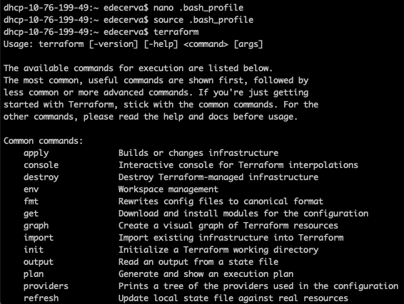

### **STEP 4:** Get Your Oracle Cloud Credentials

In order to use Terraform, you will need a few different credentials which can be found on the OCI console.

- Click the **Menu icon** in the upper left corner to open the navigation menu. Under the **Governance and Administration** section, select **Identity** and select **Users**.

  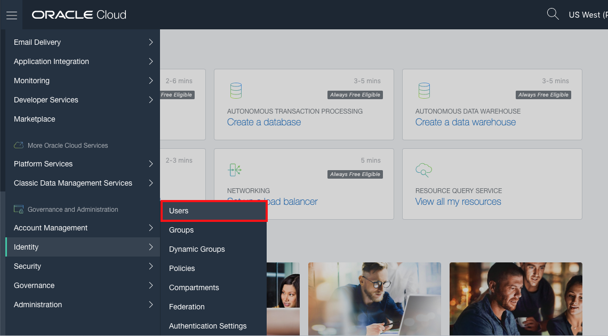

- Click on your username. It will usually be in the format **oracleidentitycloudservice/username**.

  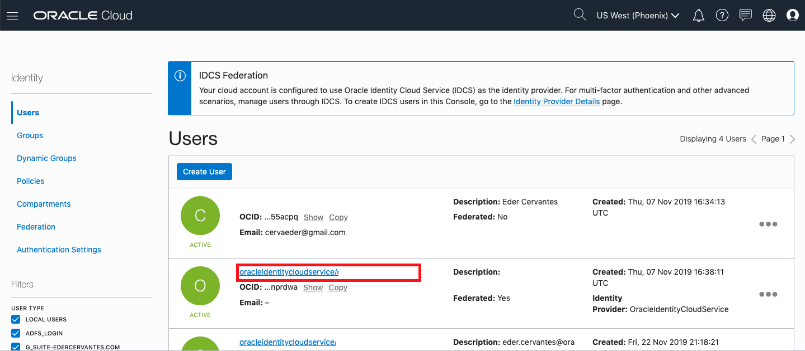

- Click **Copy** next to OCID, and save this as your **User OCID** in your notes. Next, click on the profile icon in the top right. Then click into the tenancy link.

  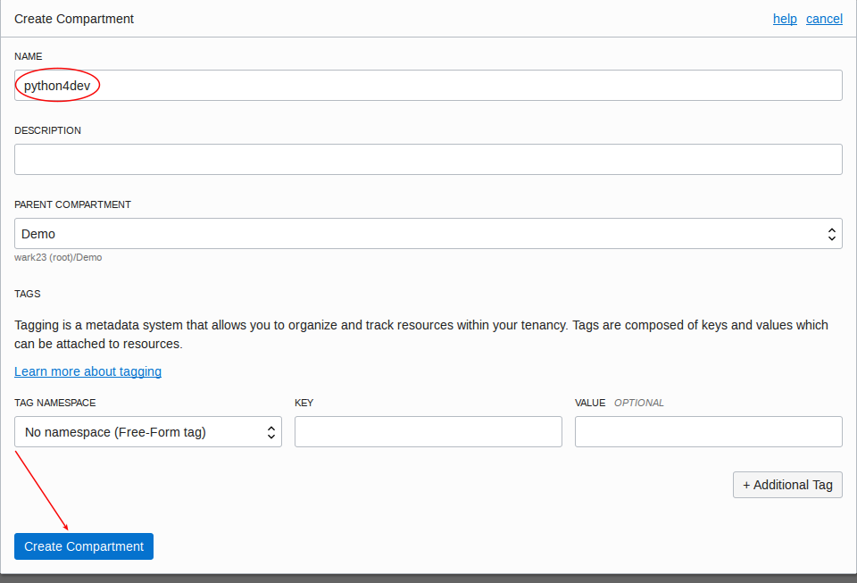

- Click **Copy** next to OCID, and save this as your **Tenancy OCID** in your notes. Then, copy the **Object Storage Namespace** in your notes.

  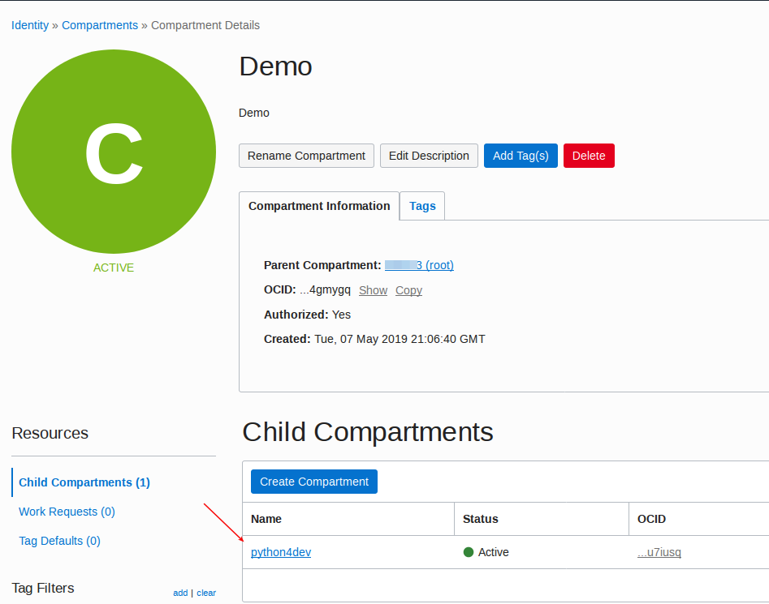

- Click the **Menu icon** in the upper left corner to open the navigation menu. Under the **Governance and Administration** section, select **Identity** and select **Compartments**.

  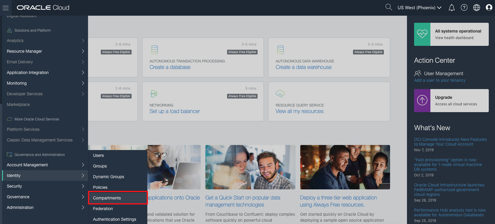

- Click on the OCID next to your root tenancy, then click **Copy**, and save this as your **Compartment OCID** in your notes.

  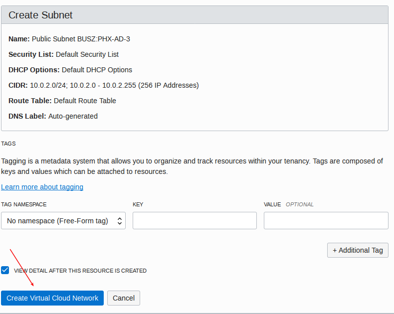

- Finally, go back to the home console and make a note of your default region. For example, if your region is US West (Phoenix), note down Phoenix in your notes.

  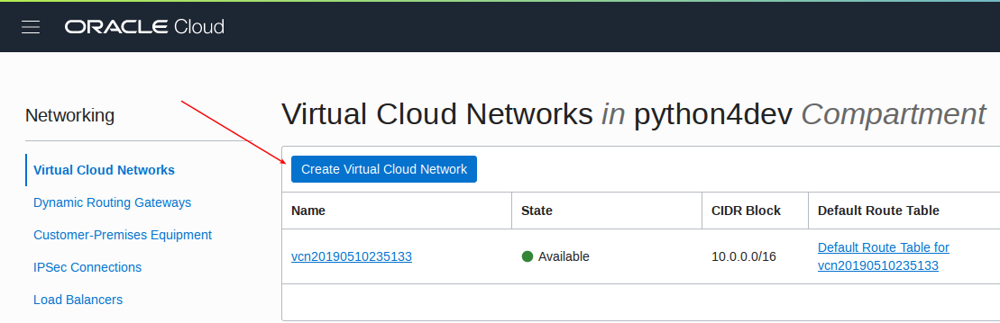

### **STEP 5:** Download and Install the OCI CLI (Oracle Cloud Infrastructure Command Line Interface)

Before downloading, make sure you meet the [requirements](https://docs.cloud.oracle.com/iaas/Content/API/Concepts/cliconcepts.htm#Requirements) to install the OCI CLI.

See these instructions for [Download and Install of CLI](https://docs.cloud.oracle.com/iaas/Content/API/SDKDocs/cliinstall.htm).

**Make sure to review the whole page before starting.**

- Once you have the CLI installed,

    Run `$ source .bash_profile`

    Run `$ oci setup config`

    Press enter to choose the default location for the config file

    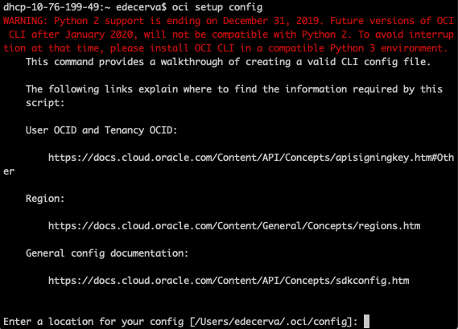
    
    Then enter the **User OCID** you saved earlier and press enter.

    

    Repeat the process, but with your **tenancy OCID**

    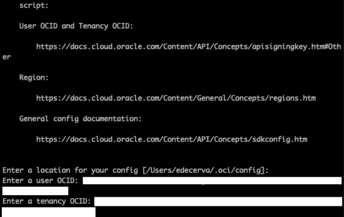

    Enter the [home region](https://docs.cloud.oracle.com/iaas/Content/General/Concepts/regions.htm) you noted earlier.

    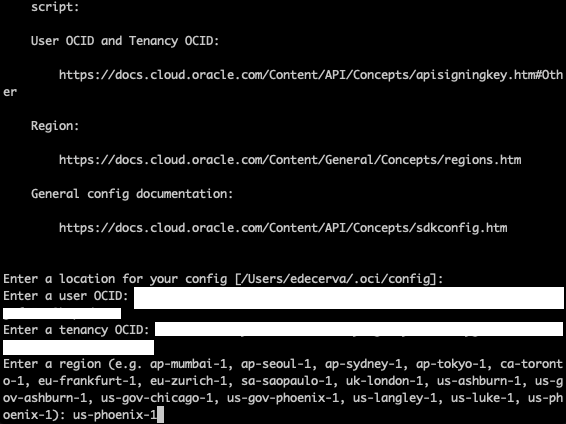

    Enter Y to generate a new RSA key pair, then press enter to choose default values for the rest of the options

    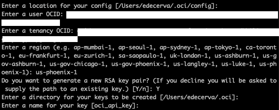
    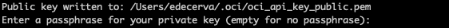

    Finally, run

    `$ ls ~/.oci`
    
    Verify that your files are there

    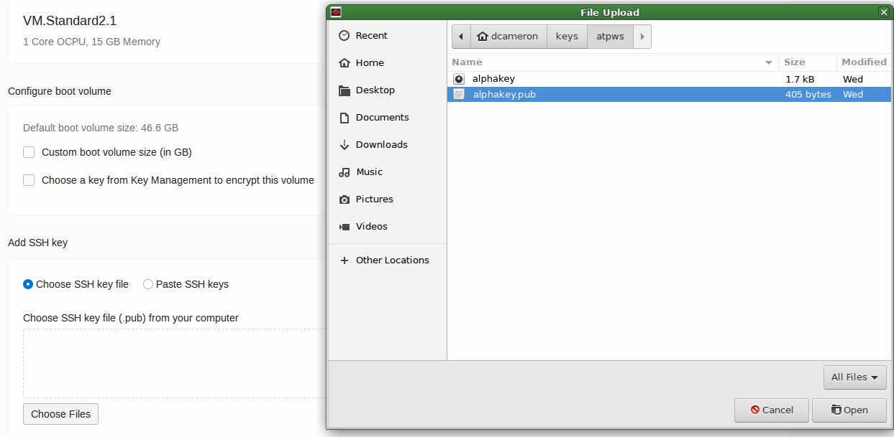

- Lastly, go into your /User/path/.oci folder and open the oci_api_key_public pem file.

**Note:** This is a hidden folder. If you don't know how to find hidden folders, go [here](https://ianlunn.co.uk/articles/quickly-showhide-hidden-files-mac-os-x-mavericks/) for Mac and Linux, or [here](https://support.microsoft.com/en-us/help/14201/windows-show-hidden-files) for Windows.

    

    Copy the contents of the file.

    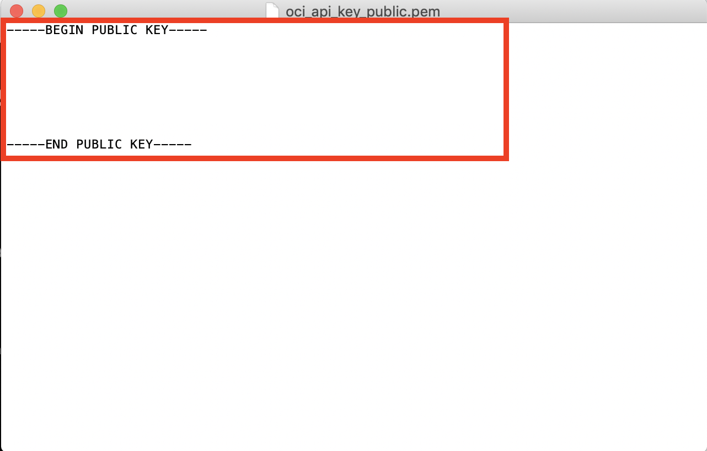

    Go back to the OCI console and click the **Menu icon** in the upper left corner to open the navigation menu. Under the **Governance and Administration** section, select **Identity** and select **Users**.

    

    Click on your username. It will usually be in the format **oracleidentitycloudservice/username**.

    

    Scroll down and click on `Add Public Key`.

    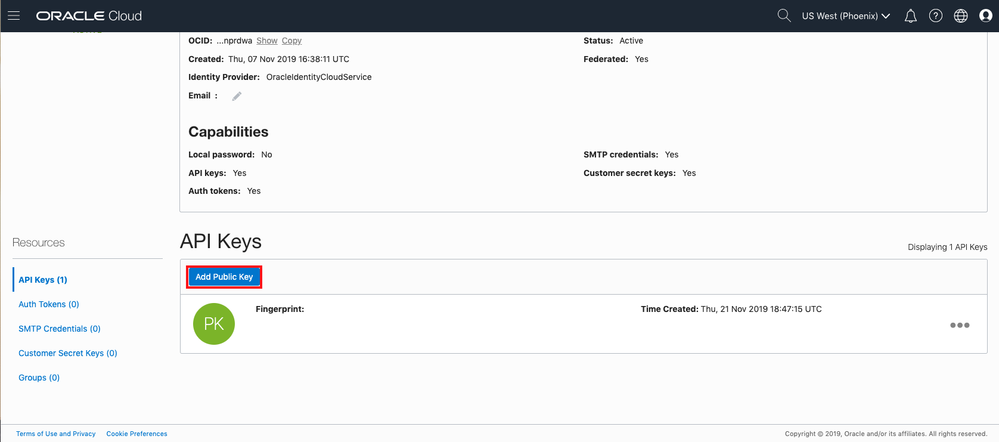

    Paste in your public pem key and then click `add`.

    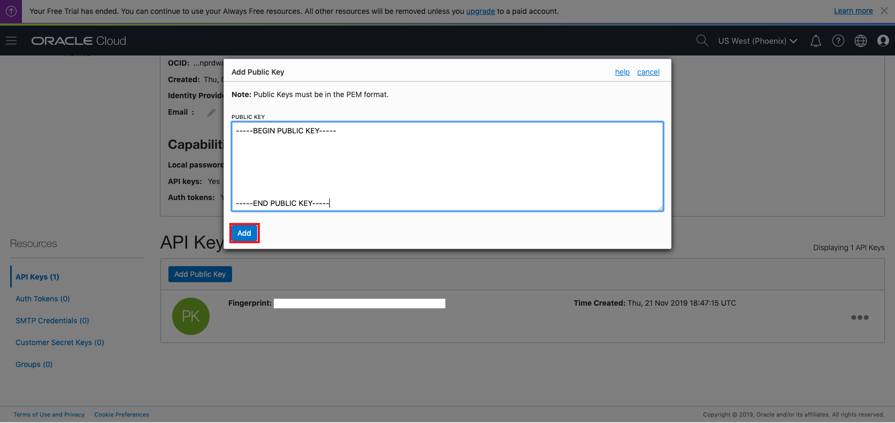

    Finally, open the config file in your /User/path/.oci folder.

    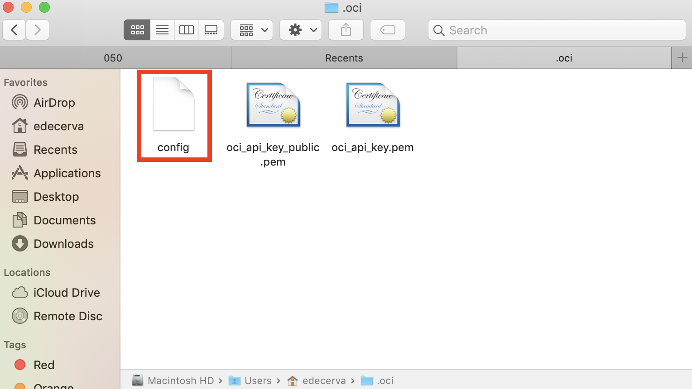

    Verify that your `Fingerprint` matches the one in your config file.

    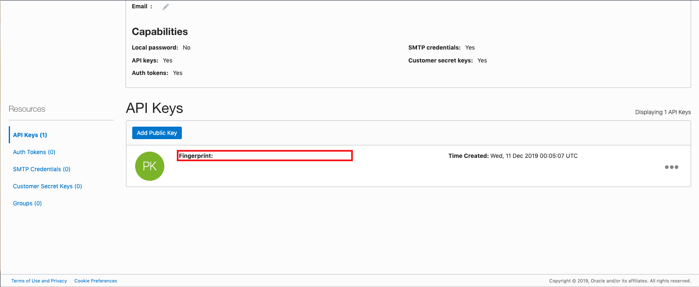

### **STEP 6:** Generate your SSH key pair

- On linux or Mac enter this in a command shell.
    
    `$ ssh-keygen -b 2048 -t rsa`

    You can call the key whatever you want (the default is easiest).  It will create a private key and a public key. The public key is used when you are prompted for a SSH key when you create services, and the matching private key is used to access those services after creation. (eg: Cloud Developer Image).

    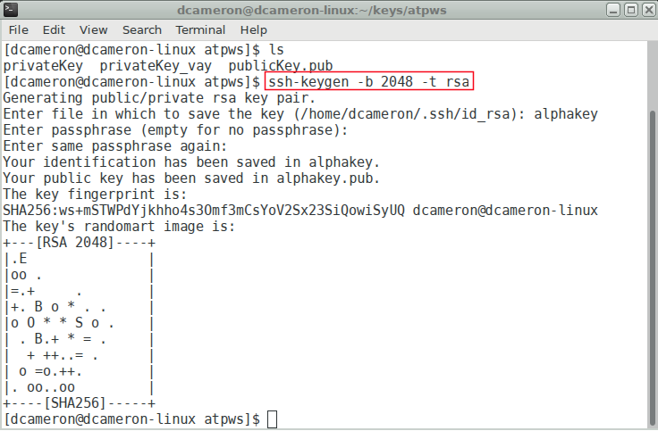

- On Windows, follow these [instructions](https://www.ssh.com/ssh/putty/windows/puttygen).
    You can call the key whatever you want (the default is easiest).  It will create a private key and a public key. The public key is used when you are prompted for a SSH key when you create services, and the matching private key is used to access those services after creation. (eg: Cloud Developer Image). 

	
### **STEP 7:** Prepare Terraform Script

- First, create a folder on your computer to hold the files.
    
    `$ mkdir OCI-terraform && cd OCI-terraform`

    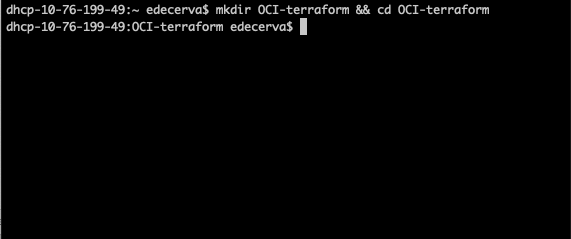

- Then, [download](https://github.com/edercervantes/terraform-OCI) zip file for the Terraform script.

    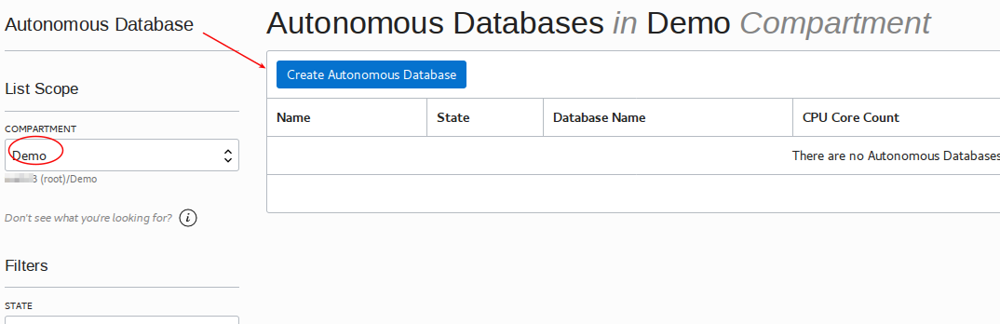

    Add the zip file to your new folder. Then unpack it.

- Go into the new folder
    `$ cd terraform-OCI-master`

**Note: For the next steps, you can also use your IDE of choice or any text editor.**

**Open the config file you created earlier when you set up the OCI CLI. This contains most of the info you will need in the following steps.**

- In the folder terraform-OCI-master, open env.vars

    `$ nano env.vars`

    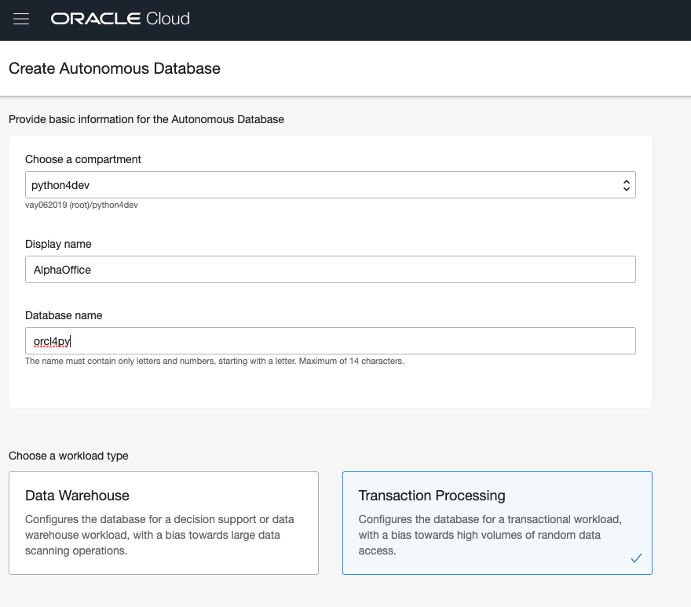

- Paste in the information matching the values in your notes and config file, then save and exit.

- Next, open variables.tf

    `$ nano variables.tf`

    Go to the OBJECT_STORAGE section and change the default value for obj_store_namespace to yours. Press ctrl + o to save, then press enter. Next, ctrl + x to exit.

    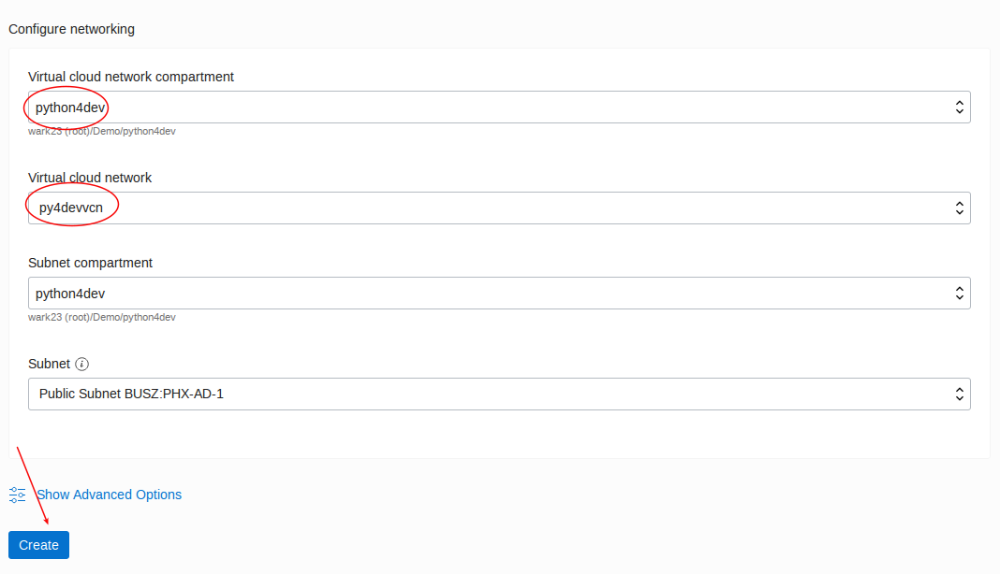

- Finally, open compute.tf

    `$ nano compute.tf`

    Go to the ssh_authorized_keys variable and change the default path to yours. Press ctrl + o to save, then press enter. Next, ctrl + x to exit.

    

### **STEP 8:** Create Resources

- In the terminal, make sure you are inside the terraform-OCI-master folder

- Run the following commands

    `$ terraform init`

    `$ source env.vars`
    
    `$ terraform plan`
    
    `$ terraform apply`

    When prompted, input yes and hit enter.

**Wait a few minutes for all of the resources to be created.**

### **STEP 9:** Connect to your marketplace developer image

[See this link for more info](https://cloudmarketplace.oracle.com/marketplace/en_US/listing/54030984).  This info is copied below.

- Navigate to `Compute` > `Instances` and select your image to identify the IP address

	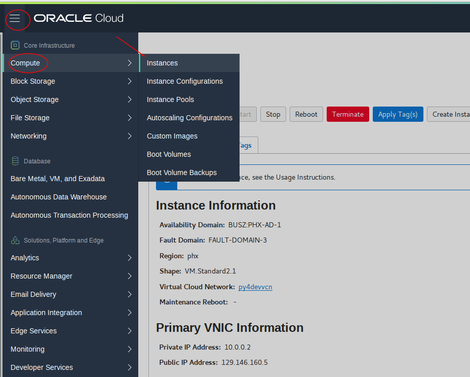

- Identify the IP address.  You will use this to ssh to the image.

	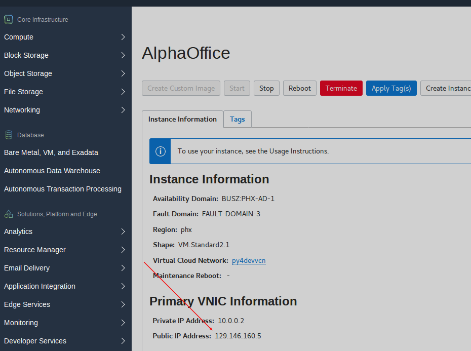

- SSH to the image. 
    **Note if you are on Windows you will need to use putty.**
    Open a terminal window on a Mac or command shell on Linux and enter the following command:

    `$ ssh -i <your private key> opc@<your IP address>`

	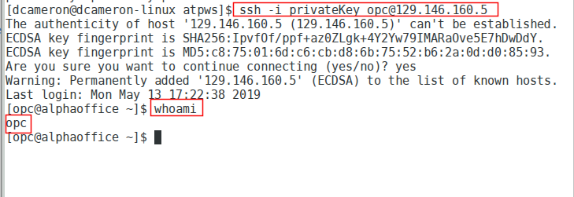

- Enter `$ vncpasswd` to set your VNC access (make it a secure one!).

	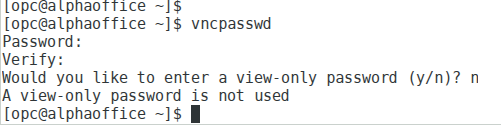

- Enter `$ vncserver` to start the vncserver.

	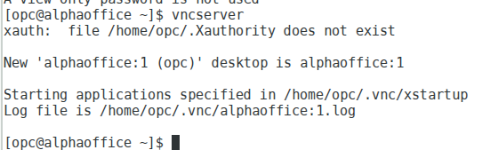

- Enter `$ exit` to go back to your local directory.

- Open a SSH tunnel.
    ***NOTE:*** do not close this terminal window.  It maintains the tunnel to the developer image, which we access through VNC.  If for whatever reason the window is closed or you are otherwise logged out (sometimes tunnels drop), then just run this again to log in.
    
    For Windows, follow these [instructions](https://www.skyverge.com/blog/how-to-set-up-an-ssh-tunnel-with-putty/) for information on how to create a tunnel on Windows.

     This example works on Linux and MAC. Note: on Linux you will need to be su.

     `$ ssh -i <your private key> -L 5901:localhost:5901 opc@<your IP address>`

    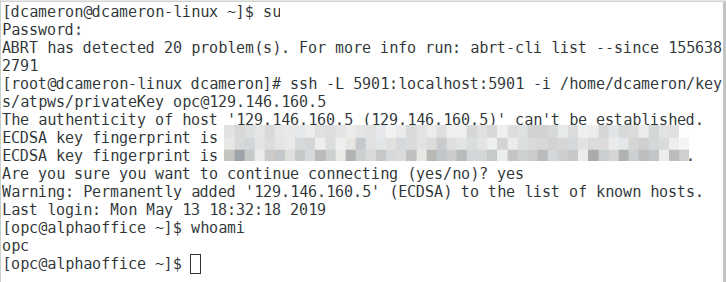

- Open a vnc viewer session.  If you don't already have vncviewer you can download it [here](https://www.realvnc.com/en/connect/download/viewer/).

    Enter `localhost::5901` into the browser and then press Enter.

    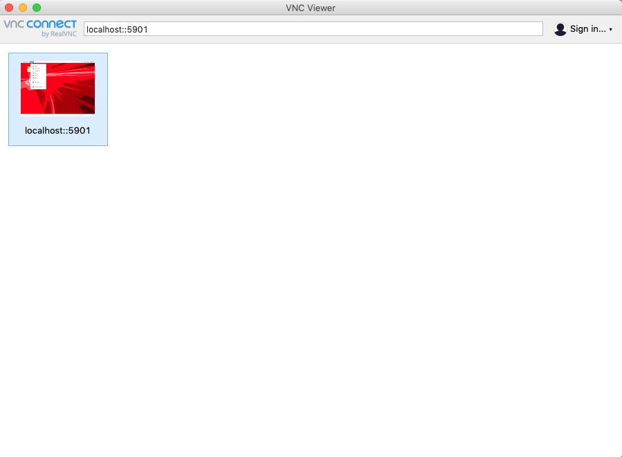

    Enter the **vncpasswd** password you created earlier. 

	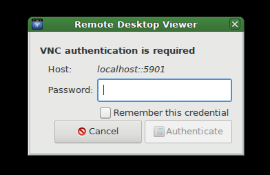

    Now you have a user interface for your instance.

	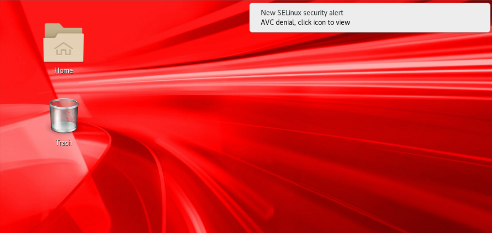

### **STEP 10:** Download Files Used in this Workshop

**[Click to Download](https://oracle.github.io/learning-library/workshops/python4atp/lab-resources.zip). Keep track of which directory this zip file gets saved to.**

<!-- [lab-resources.zip](https://oracle.github.io/learning-library/workshops/python4atp/lab-resources.zip) -->
- Next, go back into your instance

    **If you are already logged in, you do not need to run the command below.**

    `$ ssh -i <your private key> opc@<your IP address>`

    If you are prompted, enter `yes`.

- Run `$ pwd` to view your home path. Then run `$ exit` to go back to your local environment. If your home path is different than the one below, then change it to yours.

    `$ scp </path/to/lab-resources.zip> opc@<your IP address>:/home/opc`

    If you are prompted, enter `yes`.

- Finally, go back into your instance.
    
    Once inside, run `$ ls` to verify that you see your zip file.

    Now the zip file is in your instance!

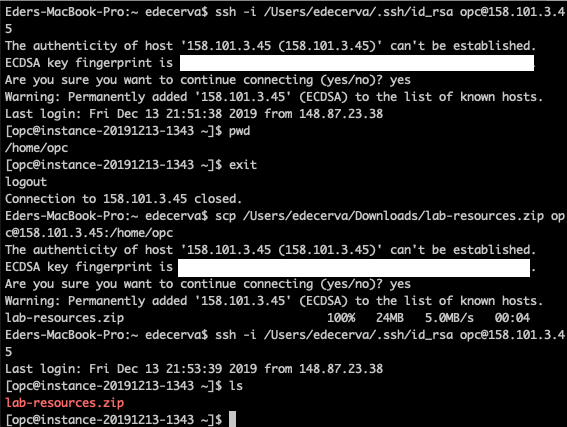

**This completes the Lab!**

**You are ready to proceed to [Lab 100](LabGuide100.md)**
