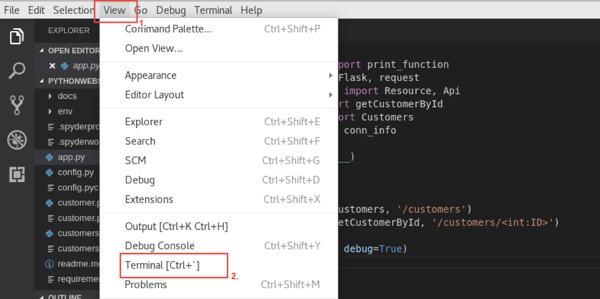
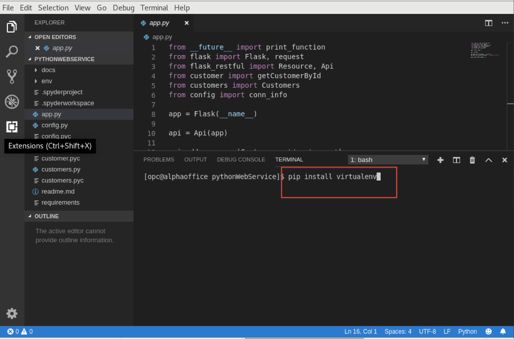
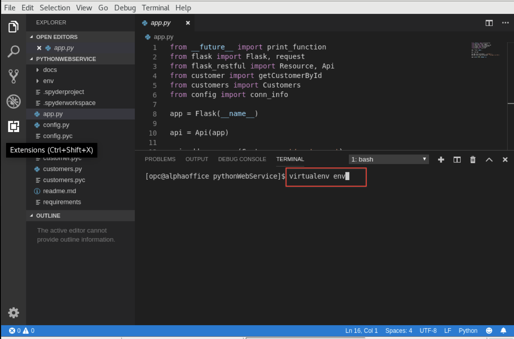
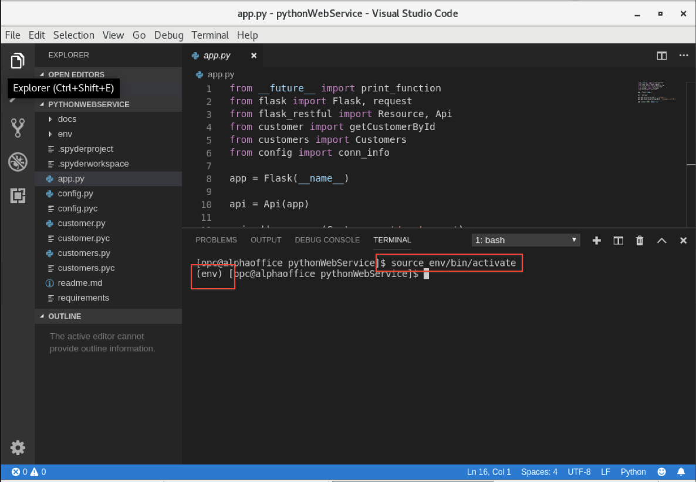
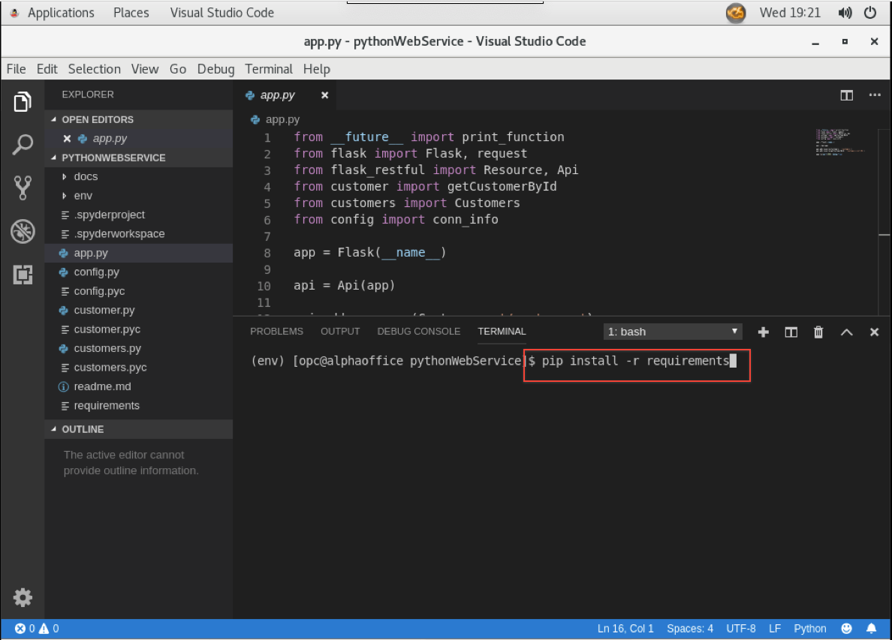
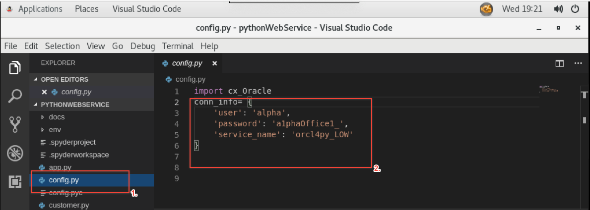
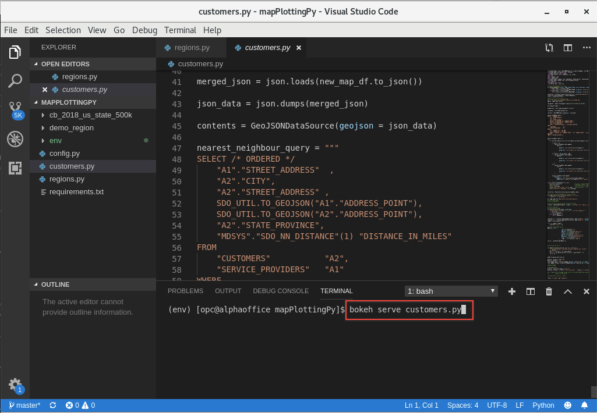
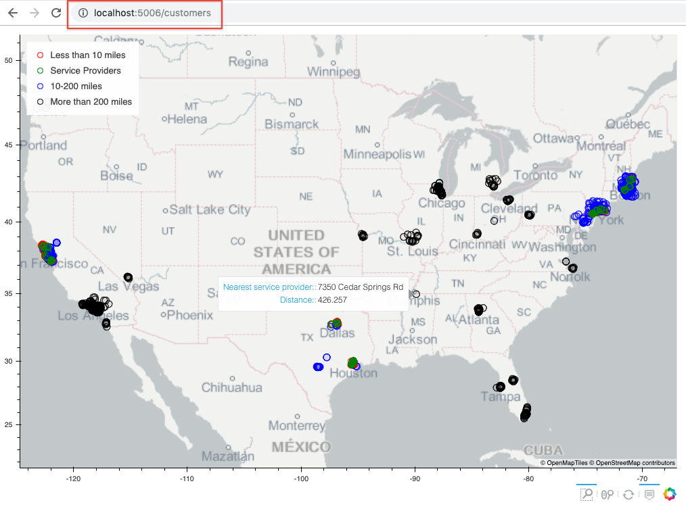

# Lab 300: Plot Data and Show Nearest Service Provider on Map

  

## Introduction

Support is interested in a new app that provides insights into customer and service provider data by geography, and would like an intuitive map like interface.  You plan to use the open source GeoPandas extension to quickly mock up an application interface leveraging Oracle Spatial.  You need to assess customer service provider availability for your products, and identify service provider coverage based on customer proximity to those services.  You plan to use some of Oracle's comprehensive library of Spatial functions such as SDO_NN to calculate distances between customers and their nearest service provider, and use this information to assess future service provider outlet requirements.

## Lab 300 Objectives

- Setup Python application 
- Check the distance between customer and service provider.

## Steps


### **STEP 1:** Configure project in Visual Studio Code

- Open the terminal,click on **Applications**, select **Favorites** and then click on **Visual Studio**.

  

- Click on **File** and then click on **Open Folder** 

  

-  In the Dialog box go to the unzipped **lab-resources** folder, look inside of it, click on **mapplottingpy**, and then click on **OK**.

- You will the see the files on the left panes.

- Open the inbuilt Visual Studio Code terminal by clicking on **View** and then click on **Terminal**. You can also open by keyboard shortcut **[Ctrl + `]**.

  

- In the terminal enter command `$ pip install virtualenv`

  

- Next enter command `$ virtualenv env` to create entry point.

  

- To run the virtual enviornment type `$ source env/bin/activate`. If successfull you will see (env) before the path that means you are now in virtual env

  

- We have all the required packages in requirements file. To install it run the command `$ pip install -r requirements.txt`

  


### **STEP 2:** Plot customers on Map

- Leave the terminal open. Click on **config.py** file from the left pane and change the details in the file with your Autonomous Transaction Processing Database information.

  

- We are using **Bokeh** open source library to plot the data we get from  on map. Bokeh is an interactive visualization library that targets modern web browsers for presentation. Its goal is to provide elegant, concise construction of versatile graphics, and to extend this capability with high-performance interactivity over very large or streaming datasets.

- If you closed the terminal, open it again and make sure to be in virtual env. Run the command.
    
    `$ bokeh serve customers.py`
    
    Now we have our web application running. Leave the terminal as it is.

  

- To confirm everything works fine, open firefox and go to URL [http://localhost:5006/customers](http://localhost:5006/customers).
    
  

- Make sure to have zoom box selected by click the icon as below.

  

- To zoom in drag and make square to get  better visibility of points.

  

- Points on the map are the location of customer and service provider, when you hover over the points, it shows the customer address and the distance to the nearest service provider.

-  As seen above the distance between the customer and service provider is calculated using the SQL query and using package SDO_NN_DISTANCE. To understand more we have two tables( i.e Customers and Service providers) with each having GeoCordinate, SDO_NN_DISTANCE calculates the distance between these two points and we calculate that distance in miles and sort by distance. All this is done by the query following below.

    ``` 
            SELECT /* ORDERED */
                "A1"."STREET_ADDRESS"  ,
                "A2"."CITY",
                "A2"."STREET_ADDRESS" ,
                SDO_UTIL.TO_GEOJSON("A1"."ADDRESS_POINT"),
                SDO_UTIL.TO_GEOJSON("A2"."ADDRESS_POINT"),
                "MDSYS"."SDO_NN_DISTANCE"(1) "DISTANCE_IN_MILES"
            FROM
                "CUSTOMERS"           "A2",
                "A2"."STATE_PROVINCE",
                "SERVICE_PROVIDERS"   "A1"
            WHERE
                "A2"."COUNTRY_ID" = 102 AND 
                "A1"."COUNTRY_ID" = 102 AND
                "MDSYS"."SDO_NN"("A1"."ADDRESS_POINT", "A2"."ADDRESS_POINT", 'sdo_num_res=1 unit=mile', 1) = 'TRUE'
            ORDER BY
            "MDSYS"."SDO_NN_DISTANCE"(1)
    ```

### **Useful Links:**
- Here are some useful links to show more about the Spatial Database features.
  - [Oracle docs](https://docs.oracle.com/database/121/SPATL/sdo_nn.htm#SPATL1032)
  - [Blog on Spatial Database](https://blogs.oracle.com/oraclespatial/spatial-with-python-and-geopandas-made-easy-with-cx_oracle)


**This completes the Lab!**

**You are ready to proceed to [Lab 400](LabGuide400.md)**