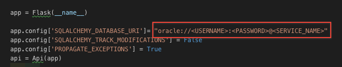

## CONNECTING TO DATABASE

- Go to app.py file [app.py](app.py)
- Change the USERNAME , PASSWORD AND SERVICE NAME in the CONNECTION URL. As shown in below image.

    

## REST API DOCUMENTATION

### PRODUCTS RELATED

- [Show customers](docs/getProducts.md) ``` GET /customers```

### PRODUCT RELATED

- [Show customer](docs/getProduct.md) ``` GET /customers/:id```
- [Add customer](docs/postProduct.md) ``` POST /customers/:id```
- [Delete customer](docs/deleteProduct.md) ``` DELETE /customers/:id```
- [Update customer](docs/updateProduct.md) ``` PUT /customers/:id```
