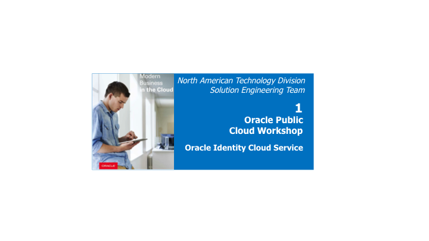

# User On-boarding - Active Directory Synchronization



## Introduction

Active Directory's Users and Groups can be synchronized to IDCS using the **Microsoft Active Directory Bridge**.

You can select which AD containers of Users and Groups will be synchronized.
A User's password is **NOT** synchronized. So users will need to either -

- **Activate** (have email sent to them with link) which will let them set a password, or 
- **Federate into IDCS** - using your company's SAML Identity Provider (IDP) - for example - **Active Directory Federation Service (ADFS)**

## Persona

Administrators, End-Users

## Objectives

**Onboard users from On-premise Active Directory**

- Synchronization setup
	- AD Setup
	- Configure Identity Bridge
	- Initial Synchronization
	- Verify Synchronization
	- Synchronize Changes in Active Directory
- End-user verfication
	- Activate IDCS Account


## Logistics

Windows Server 2012 equipped with .NET framework 4.6+. The script has been tested with Windows 2012 64-bit Server.

## Synchronization setup

### **STEP 1**: Active Directory Setup 

`(Persona: Administrators)`

- **Install Active Directory if not already done.**

	- Log into Active Directory Machine as Administrator

	- Copy install script file [createDomain.ps1](resources/createDomain.ps1) onto your Active Directory machine.
	
	- Right click on **createDomain.ps1** and choose run with PowerShell.
	
		
		
		

	- This will run a script and then reboot. It will show a list of errors which can be disregarded. The process should take between 5-10 minutes.

		
		
		
		
		

- **Populate Active Directory with required users and Orgs**

	- Log into Active Directory Machine as `administrator@oracledemo.com`. 

	- Download and copy [populateAD.ps1 ](resources/populateAD.ps1) to this machine if you have not done so already.

	- Right click on **populateAD.ps1** and choose run with PowerShell.

		

		

	- The powershell script will say *complete* when completed. You can then close the powershell window. 

		

		

	- The Users, OU's and groups should now exist.

		
		
		


### **STEP 2**: Configure Identity Bridge

`(Persona: Administrators)`

- Log into IDCS Admin Console 

	

- Click [Download and Configure]() under the title **Directory Integrations** from bottom of screen. 

- Click the button **Add a Microsoft Active Directory Bridge**

	

- Click **Download**. This will download the Bridge installer to your local machine. 

	
	

- Copy the ClientID and Shared secret information

	

- Copy the downloaded installer on the Windows server

- Launch the Oracle Identity Cloud Service Active Directory Agent installer (double click the **EXE** file) from the Windows Server.

- Click on **Next** on the next 3 screens on the Wizard

	
	
	
	
	

- In the *Enter Provided Credentials* window, provide information about your Oracle Identity Cloud Service:

	- **Cloud Service URL:** The Oracle Identity Cloud Service URL. For example, [https://example.oraclecloud.com](https://example.oraclecloud.com)
	
	- **Identity Bridge Client ID** and **Identity Bridge Secret** - The information you copied from Oracle Identity Cloud Service earlier
	
	- Click on **Next**

		

- Provide Active Directory Administrator credentials, uncheck **Use SSL** checkbox, and click on **Test Connection**

	

- After successful connection test, click on **Next**

	

- Installer will now install the agent. When finished exist the installer by clicking **Close**.

	
 
- Go back to the IDCS Admin Console. Move to **Directory Integrations** menu under **Settings**. The registered client will be listed as active.
 
	
 
- Click the bridge you just registered. The page contains four items where you can select organizational units for users, for groups and configure the synchronization.

	

- In the **Select Organizational Units (OU's) for Users** section, select the OU's containing the users that you want to synchronize with IDCS. Select **DemoUsers** OU.


- In the **Select organizational units(OU's) for Groups** Section, select OU's containing the groups to be synchronized with IDCS. Select **Groups** OU.


- In the **Set import frequency** section, select the interval at which the agent will run and synchronize users and groups with IDCS. Change the interval to something shorter than 1 Hour. (1-5 minutes are good options)


- The **federated authentication** is enabled by default. This configuration means the user credentials will be validated against a configured Identity Provider. In this demo, uncheck the federated authentication checkbox. IDCS will generate the password for the users and send the notification by email (the email attribute must be filled in Microsoft Active Directory and mapped to IDCS).

	

- Click on **Save**.

	

- Summary of the bridge configuration is displayed.

	

- Click **Attribute Mappings** tab to modify the default attribute mappings between the Microsoft Active Directory and IDCS. Keep the default mappings for the demo.

	

- Click **Import** tab to see information about the last time the bridge ran. At this moment no information is shown as you did not run it yet.

	

### **STEP 3**: Initial Synchronization

`(Persona: Administrators)`

- Click **Import** to manually start the import job.

- Refresh the page until the synchronization is completed.

	

- Review the synchronization summary displayed :
   
```
How many users were successfully imported.
How many groups were successfully imported.
How many users failed to import.
How many groups failed to import.
```
	
	

### **STEP 4**: Verify Synchronization

`(Persona: Administrators)`

- In the IDCS admin console, click **Users**. 

- The users imported from the Microsoft Active Directory are displayed in IDCS

	

- Click **Groups**. 

- The groups imported from Microsoft Active Directory are displayed in IDCS.

	

- Click the group **Employees** and then click **Users** tab. The group membership reflects the membership from Active Directory. Verify that **Danny Crane** is part of the **Employees** group.

	


### **STEP 5**: Synchronize Changes in Active Directory

`(Persona: Administrators)`

- From IDCS admin console, click the group **OurVendor** and then click **Users** tab. Ensure that no user is assigned to the group.

	

- Go to **Active Directory Users and Computers** inside the Windows Server. Open the group **OurVendor**. Add **John Wells** as the member.

	
	
	
	
	

- Run the **Import** job of the bridge again from IDCS admin console. Refresh until finished.

	

- Verify that **John Wells** is now a member of the group **OurVendor** in IDCS.

	
	
## End-user verfication

### **STEP 1**: Activate IDCS Account 

`(Persona: End-Users)`

- Login to Gmail as [demoidcs@gmail.com](). Go to the **User1** label. Verify that there is an activation email from IDCS for **Danny Crane**

	

- Open and review the email. Click on the **Activate Your Account** button.  
 
	

- IDCS Change Password page will open up. Provide a suitable password that matches the listed **Password Criteria**. Click on **Submit**.

	

- Verify that you are redirected to IDCS **MyApps** portal, which would be empty for now.

	

	

- Go to `My Profile` section from menu located top-right

	
	
- Ensure that **Employee** group is visible under **My Access** sub-tab
	


## Additional Resources

- [Understanding the Bridge](https://docs.oracle.com/en/cloud/paas/identity-cloud/uaids/understanding-bridge.html)

- Tutorial: [Oracle By Example (OBE): Oracle Identity Cloud Service: Integrating with Microsoft Active Directory Using Directory Integrations](http://www.oracle.com/webfolder/technetwork/tutorials/obe/cloud/idcs/idcs_idbridge_obe/idbridge.html) 

- An Approach to AD Bridge HA using Docker and Windows Containers - [OTN Link](http://www.oracle.com/technetwork/articles/idm/gutierrez-idcs-idbridge-3960710.html)


