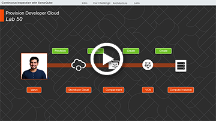
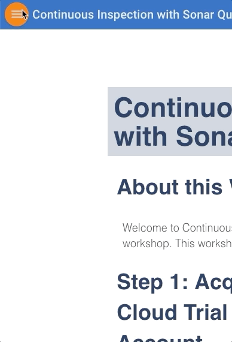

# Automated Code Inspection

## About this Workshop

Welcome to the Automated Code Inspection workshop. This workshop will walk you through application lifecycle management with embedded code review using SonarQube. It will showcase how SonarQube can save time and improve code quality directly inside the agile development process.

 <a href="https://videohub.oracle.com/media/1_nu64e6yh" target="vid">

Watch Overview Video
 </a>

### Step 1: Acquire an Oracle Cloud Trial

- Bookmark this page for future reference.

- Please click on the URL to create your <a class="trial-link" href="https://myservices.us.oraclecloud.com/mycloud/signup?language=en&sourceType=:ex:tb:::RC_NAMK190523P00163:CodeInspect_HOL&SC=:ex:tb:::RC_NAMK190523P00163:CodeInspect_HOL&pcode=NAMK190523P00163" target="_trial">Free Account</a> and complete all the required steps. When you complete the registration process you'll receive a $300 credit that will enable you to complete the lab for free. Additionally, you'll have 1000s of hours left over to continue to explore the Oracle Cloud.

- Soon after requesting your trial you will receive the following email.

    

### Step 2: Navigate to Lab 050

- You can see a list of Lab Guides by clicking on the Menu Icon in the upper left corner of the browser window.

    

You're now ready to continue with [Lab Guide 050](LabGuide050.md)
