## Introduction

Welcome to the Automated Code Inspection workshop. This workshop will walk you through application lifecycle management with embedded code review using SonarQube. It will showcase how SonarQube can save time and improve code quality directly inside the agile development process.

**_To log issues_**, click here to go to the [github oracle](https://github.com/oracle/learning-library/issues/new) repository issue submission form.

## Objectives

- Run the job to see the new analysis in SonarQube.
- Create issue in Developer Cloud Service
- Fix the issue in code
- Close issue in Developer Cloud Service.

## Required Artifacts

For this lab you will need Oracle Cloud account and Developer Cloud service instance.

## Fixing the issue in code

### **STEP 1**: Check for the Issue in SonarQube

- Continuing the previous lab, go to the issues page in sonarQube, for this workshop we will solve the issue type **Bug**.

    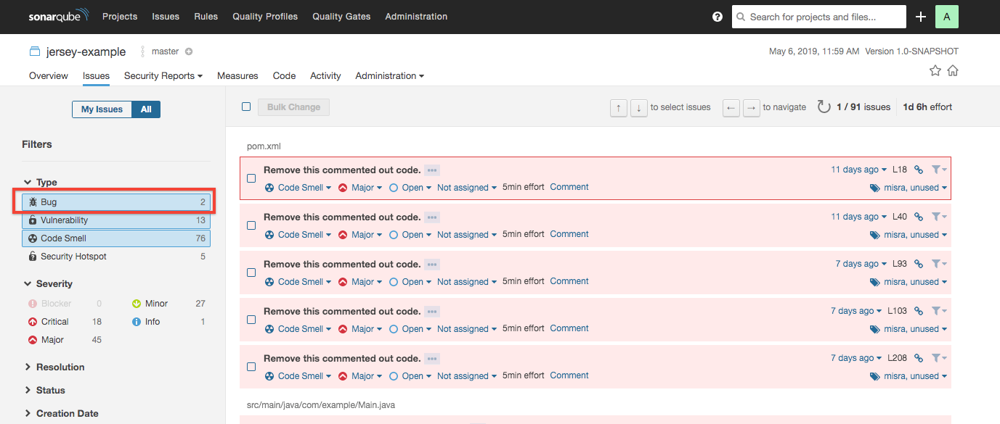

- As you can see there are two issues shown under bug category with severity Critical and Major.

    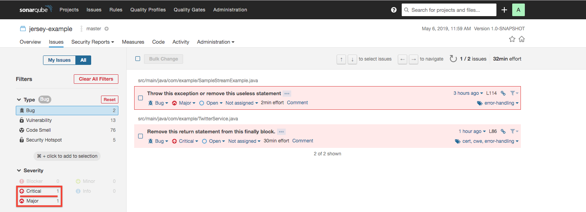

- Click on the first issue and check for the error message. As you see the error message, you can select the type of issue, severity, whether the issue is solved or still open, who is it assign to and how many minutes it might take to fix the issue.

    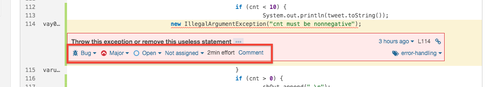

### **STEP 2**: Create issue in Developer Cloud Service

- Go back to Oracle Cloud, navigate back to your MyServices dashboard by selecting the **Hamburger Menu** and clicking **MyServices Dashboard**.

    

- Expand the **Developer Hamburger Menu** and select **Open Service Console**.

    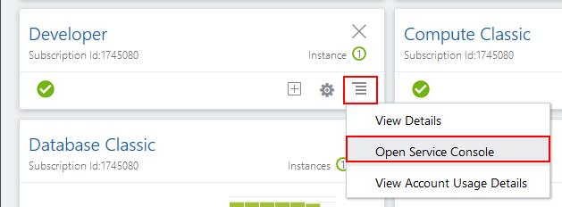

- You should see the Developer Cloud Instance you provisioned in the previous lab. Ensure it is in the ready state then click the menu icon to the right of the name and with the options visible select **Access Service Instance**.

    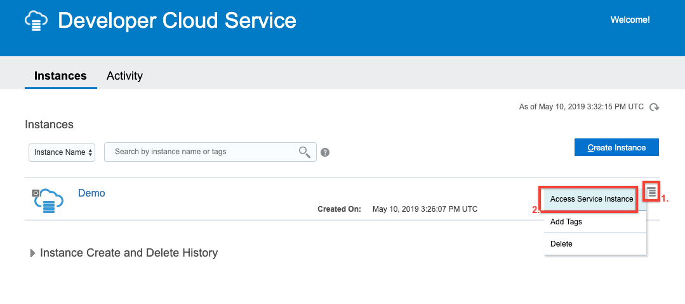

- We will generate new issue based on the error messagee seen in the previous step. Click on **Issues** in the left panel and then click on **Create Issue**.

    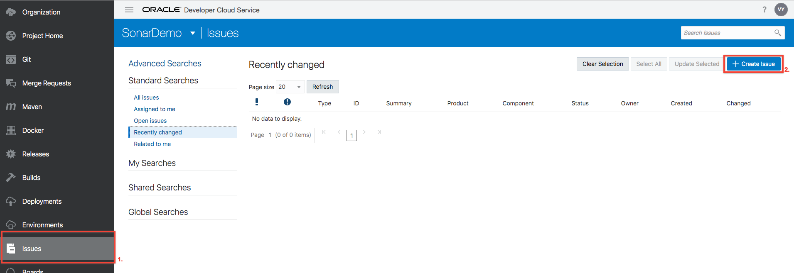

- Fill out the form as shown in the below image.
    ```
    Summary: Solve bug in TwitterService.java
    Description: Error on line 86
    Owner: Set to Your Name
    ```

    

- We will generate another issue. Fill out the form as shown in the below image.
    ```
    Summary: Solve bug in SampleStreamExample.java
    Description: Error on line 114
    Owner: Set to Your Name
    ```

    

### **STEP 3**: Edit Code in DevCS Git Repo

- Click on **Git** in left panel to see the code repository.

    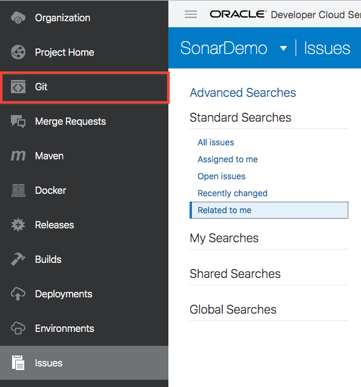

- Go to the file SampleStreamExample.java , path as shown in following image and  click on pencil icon to edit.
    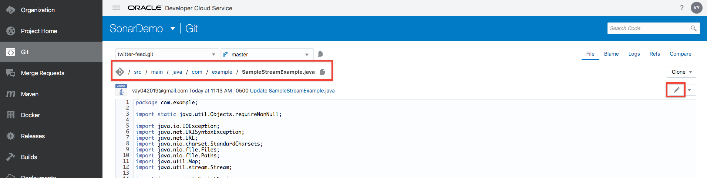

- Go to line 114 and add word **throw** before the line.

    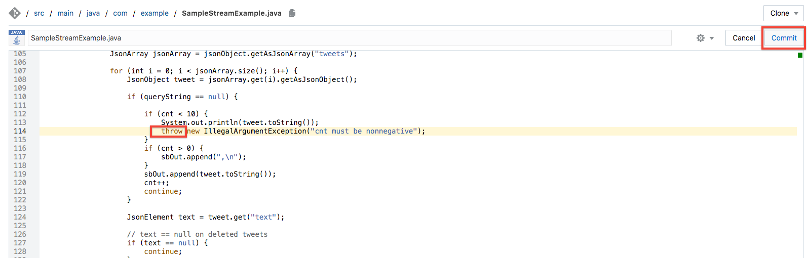

- Repeat the process and go to file TwitterService.java, path as shown in following image and click on pencil icon to edit.

    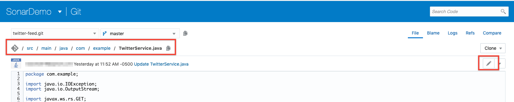

- Go to line 86 and remove **return**.
Reason of error: Using return, break, throw, and so on from a finally block suppresses the propagation of any unhandled Throwable which was thrown in the try or catch block.

    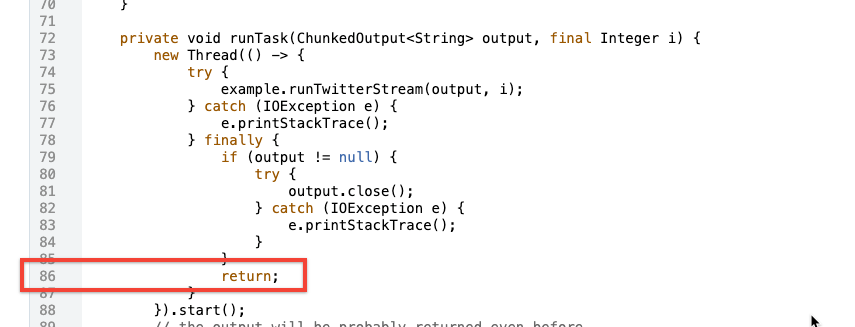

### **STEP 4**: Check the SonarQube for Issue Fix

- With the job already configured to run automatically on commit, go to SonarQube server dashboard. And you can see there are zero bugs shown.

    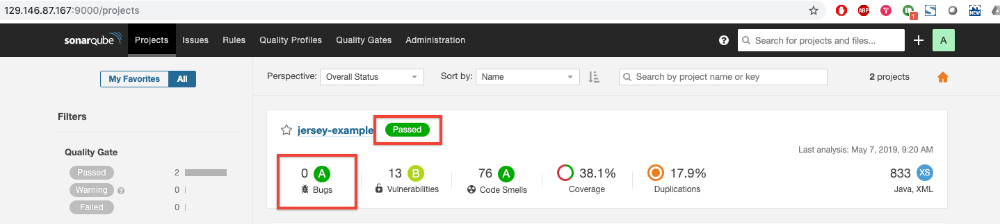

- To confirm open issues page and click on bug.

    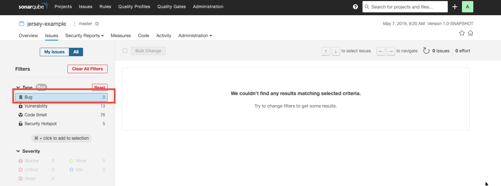

### **STEP 5**: Close the Issue in Developer Cloud Service

- Go back to Developer cloud service and click on **Issues** in left panel.

    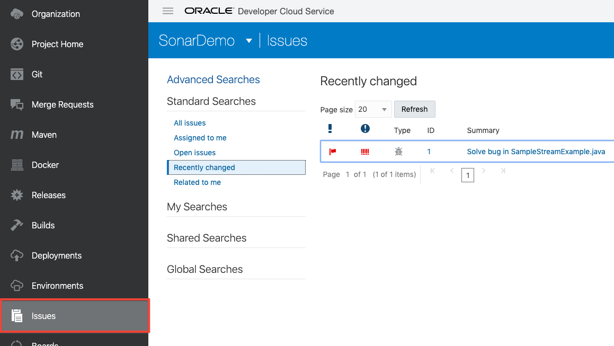

- Select the issue and then click on **Update Selected**

    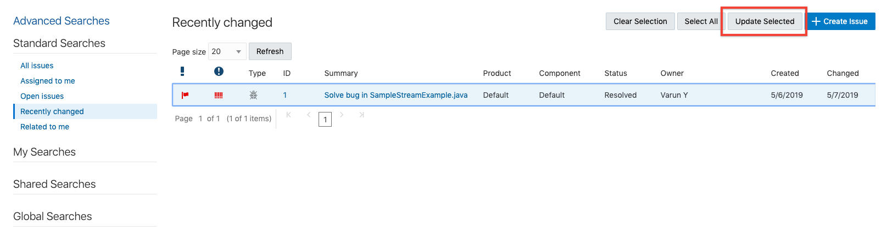

- In the form check the **Status** and select **Resolved**. Also check **Resolution** and select **Fixed** from dropdown. Click **Next** when finished.

    

    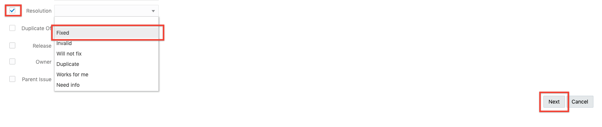

- Click **Save** to close the issue.

    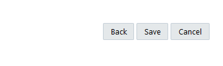

 **You are now ready to move to the next lab: [Lab 400](LabGuide400.md)**
