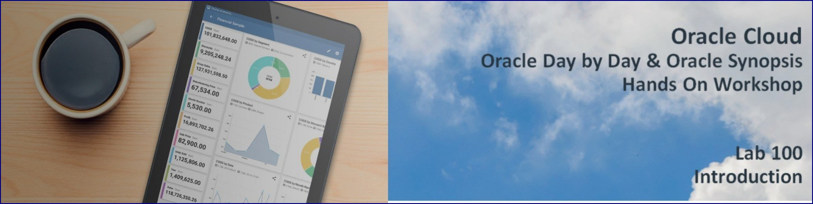
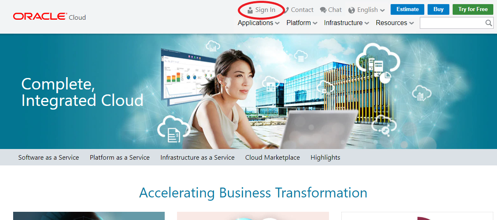
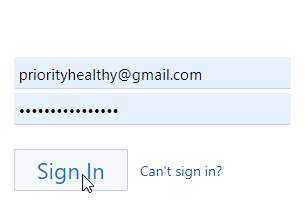
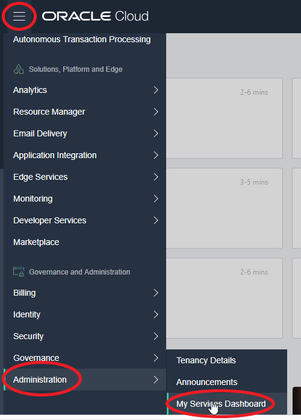
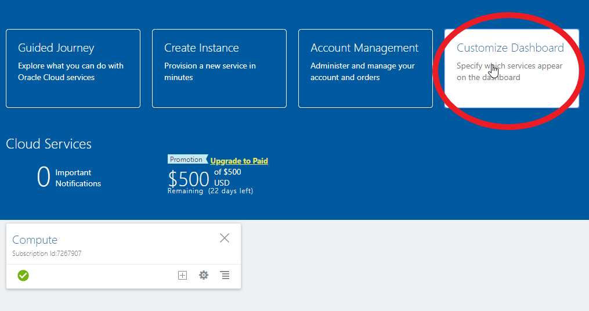
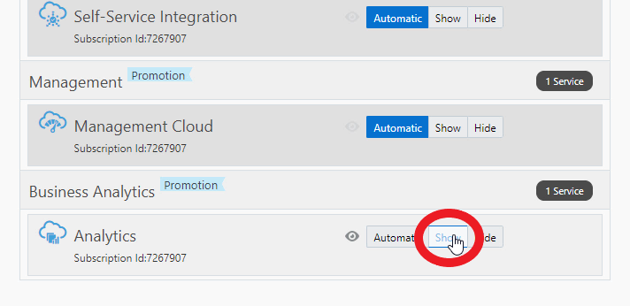
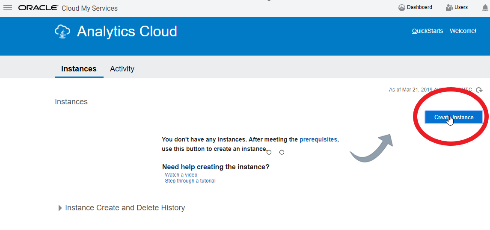
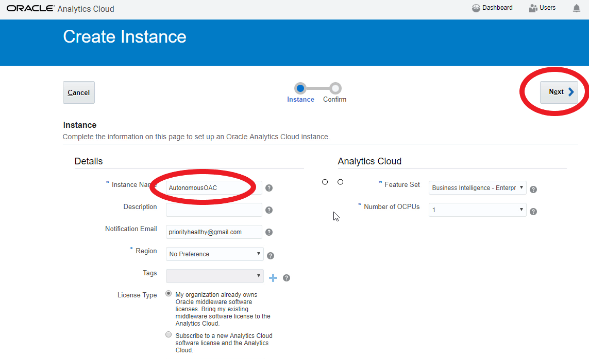
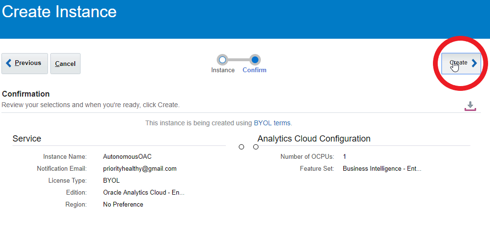
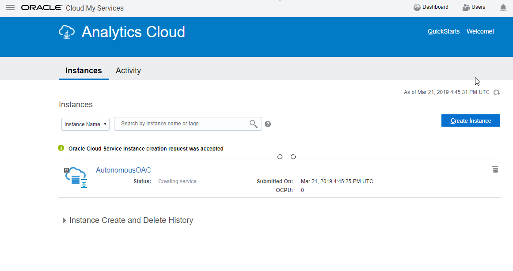

# Background Challenges

Even with today's robust Business Analytics often you are tied to your PC and lack the flexibility to access analytics on the go during travel or take a quick glance before a meeting.  Mobile Analytics is the Solution and has changed consumer expectations while giving enterprises the ability to engage with their customers anytime, anywhere. Have you seen Spreadsheets talk to you, Have you seen data through a Mobile Lens and magically transform it to rich visuals, Today we will - 100% on-device analytics that is Oracle Synopsis. Simply ask a question and have interactive visuals answer your query.  We'll also see an app called Oracle Day by Day with Powerful mobile analytic search capabilities.

The App learns what you are interested in, when and where you are interested in it, and who you like to share and collaborate with. Start your day with a smart list of analytics that helps you make better decisions—day by day. Let us show you how to infuse analytics into people’s lives and not the other way around.

# Lab 100: Provisioning and Getting Started

## Lab Introduction

You will assume the role of Sales Manager Chris Nolan. Chris needs to travel across all of his regions to help close deals. He needs to know where to focus his time and maximize his travel.

Oracle Day by Day is a part of OAC - Enterprise Edition Offering. Hence a OAC Account needs to be provisioned to enable using Oracle Day by Day.

This lab walks you through the steps to provision a new Autonomous Analytic Cloud service. Note throughout all the labs you may see small differences between what you see in your accounts and the results of various steps due to cloud product updates. 

## Objectives
-   Learn how to provision an Autonomous Analytic Cloud Service

## Required Artifacts
- The following lab requires an Oracle Public Cloud account. You may use your own cloud account, a cloud account that you obtained through a trial, or a training account whose details were given to you by an Oracle instructor.

# Steps

## Provisioning an Autonomous Analytic Cloud Service
In this section you will be provisioning an Autonomous Analytic Cloud Service using the cloud console.

### **STEP 1: Sign in to Oracle Cloud**
- Go to [cloud.oracle.com](https://cloud.oracle.com), click **Sign In** to sign in with your Oracle Cloud account.

  

- Enter your Cloud Account Name and click **Next**.

  

- Enter your Cloud username and password, and click **Sign In**.

  

### **STEP 2: Initiate the creation of an Autonomous Analytic Cloud service.  Note this will take approximately fifteen minutes.**

- Go to the menu in the upper left, select **Administration**, and then **My Services Dashboard**.

  

- Now we will create a new Autonomous Oracle Analytic Service.  Select **Customize Dashboard** to make sure the Analytics service is shown.

  
  
- Scroll down until you find **Analytics** and make sure to select **Show** and then scroll back up to close. 

  

- Select the hamburger menu in the lower left of **Analytics** and select **Open Service Console**

   

- click **Create instance**.

  

- Enter `AutonomousOAC` as the Instance Name and click **Next**

   
  
- Confirm Details and click **Next**

   

- You should see the new instance with status **Creating Service** and after about fifteen minutes it should be completely provisioned

   

# Conclusion
Chris Nolan found that creating a new Autonomous Analytic Cloud service is very very easy, and took only a couple of minutes to create.

You can now move on to the next lab.
