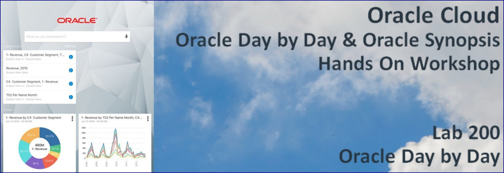

# Introduction to Oracle Day by Day

Oracle Day by Day is the first enterprise analytics app platform from Oracle that learns what you are interested in, when and where you are interested in it, and who you like to share and collaborate with. Start your day with a smart list of analytics that helps you make better decisions, day by day.

Oracle Day by Day’s smart feed continuously delivers meaningful analytics throughout the day based on what’s going on in your business, in your day, and who you collaborate with. It infuses analytics into your daily activities, at the right place and at the right time, to help you make better decisions—day by day.

Quickly get answers to your business questions, simply by doing a search or just let your voice do the typing.

- Simply say a question and let the Oracle Day by Day engine prepare an analytic summary for a well-rounded answer
- Powerful analytic search capabilities help you pinpoint exactly the information you need

Powerful bring back capabilities enable your workforce to preset when to receive the analytics. With Oracle Day by Day, users can teach the system to send the data when its the most meaningful. Analytics are delivered based on time, place, or contacts. Oracle Day by Day was built from the ground up with the understanding that decisions are often a team sport. Sharing and collaborative capabilities are provided every step of the way. Make public comments, create private discussions, and even share insights via third-party apps

This demo illustrates how to use Day By Day – Oracle BI Mobile App with Search and Collaboration capability.  This script will explain how to start with Day-By-Day app and search your reports / KPI answers from your server through Mobile on the go.  Demo highlights to create smart feed to get alert on your mobile and schedule meeting with co-workers once you find your results in Day By Day.

# Background Story for Oracle Day by Day

In this lab you will assume the role of Sales Manager - Chris Nolan. He has been suffering of lack of visibility across the Sales Pipeline. He decides to utilize Oracle Day By Day to help him get access to the current opportunities that are being handled by his team at any time from his mobile device of choice.

The Sales Consulting Resource Management portal yields a spreadsheet. It has all the relevant information about the Sales Pipeline and its Status. Chris can upload this sheet on OAC and derive insights helping him address critical deals and drive them to closure.

## Objectives
-   Learn how to index the Data Sheets.
-   Monitor Index creation
-   Discover Salient features of the app
-   Leverage the app - Oracle Day by Day to help Chris Nolan achieve visibility, derive insights of     the Sales Pipeline and take meaningful actions.

## Required Artifacts

- A Trial OAC Account
- Sales Opportunity Data Set
- Oracle Day by Day app installed on your Phone

## Download the Oracle Day by Day App from Play Store

Google Play Store:
https://play.google.com/store/apps/details?id=com.oracle.singularity&hl=en_US

Apple Play Store:
https://itunes.apple.com/in/app/oracle-day-by-day/id1236214430?mt=8&ign-mpt=uo%3D4

# Steps 

### **STEP 1: Sign in to Oracle Analytics Cloud and import the Sales Opportunity Data Set.**

  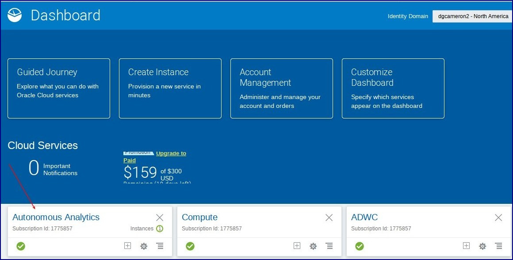

- Click on `Open Service Console` at the far left corner.

  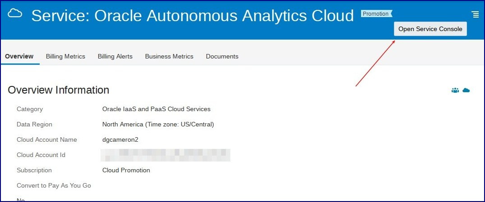

- Click on the menu on the far left bottom and select `Oracle Analytics Cloud URL`.

  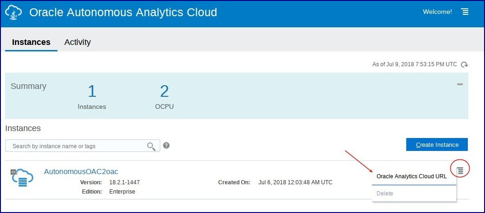

- You end up on the main OAC page.  Click on the menu in the upper right to expand the menu.

  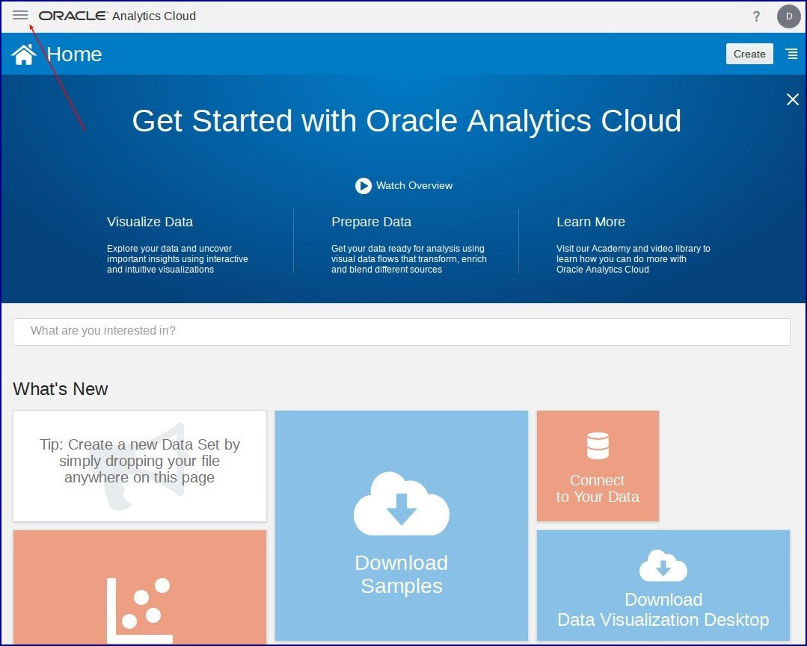

- We will upload Sales Opportunity Data Set to OAC.  Click on Create & Select `Data Set` on the left.

  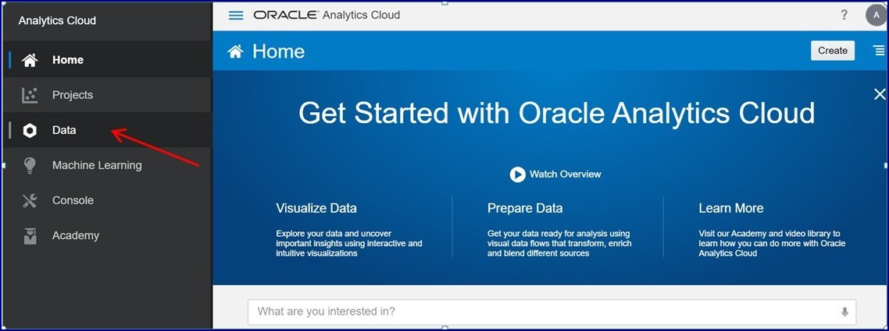

- Click on `Drop date file here or click to browse` in the pop-up window.

  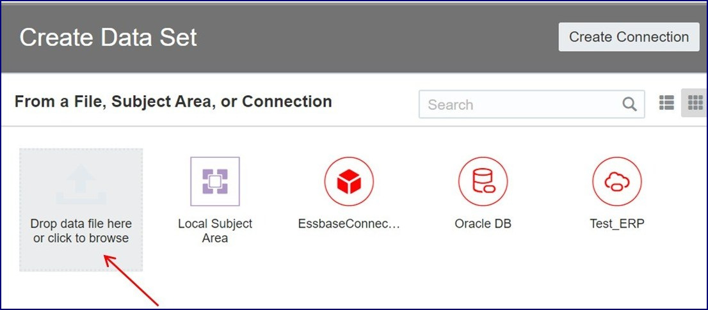

- Navigate to the folder and choose the Sales Opportunity Data Set and Click on `Open` from right bottom corner.

  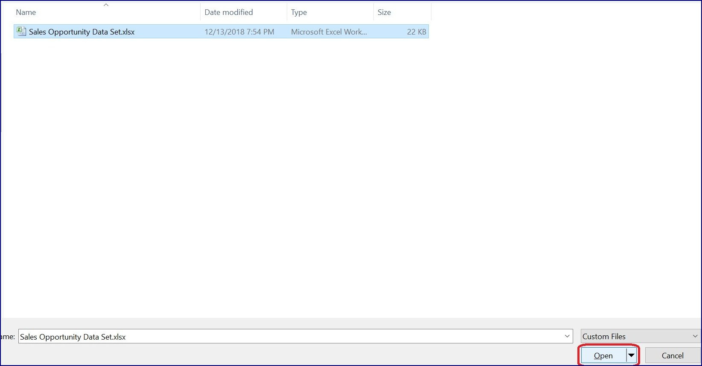

### **STEP 2: Configure Index on the required Data Set.**

- Click on the menu in the upper right to expand the menu and Select Data.

  

- Click on the menu in the left corner to expand the menu for the Sales Opportunity Data Set and Select `Inspect`.

  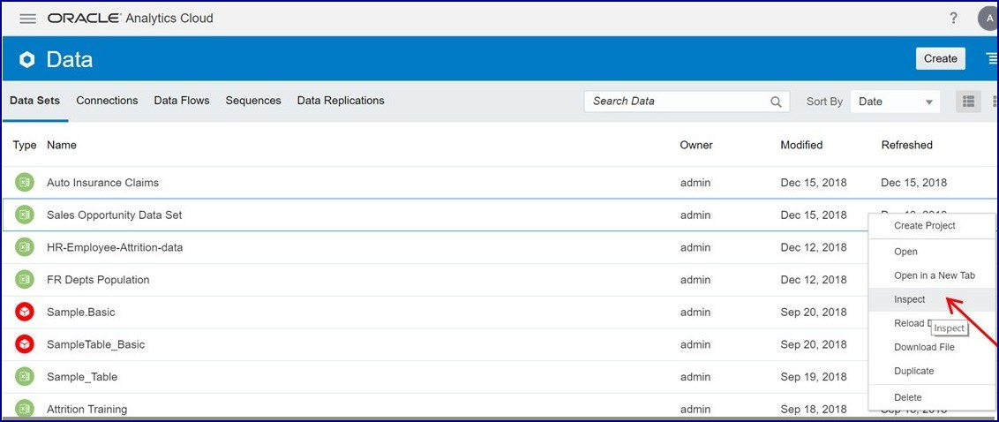

- Click on `Search` and Choose `By names and values` and schedule for the Index to run at a desired time by choosing `Start` and Click `Save` in the upper left corner of the current workspace.

  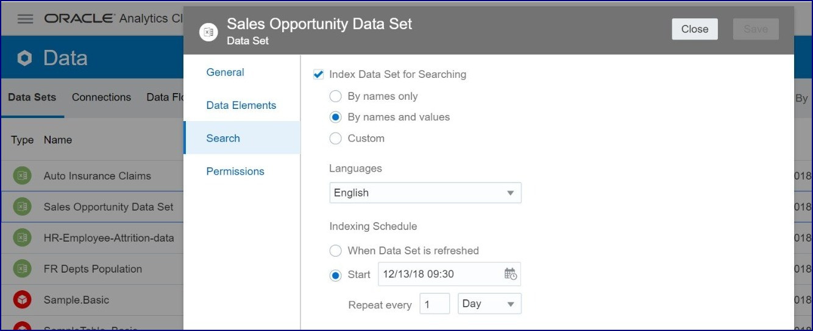  

- You can monitor the index run status - Click on the menu in the upper right to expand the menu,
Select `Console`

  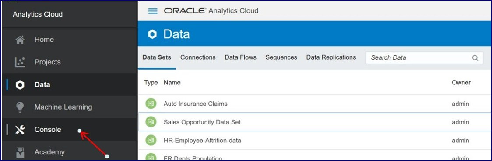    

- Navigate to `Search Index` - In the left corner Click on the `Monitor Crawls` to monitor the Status of the Index scheduled on the data set.

  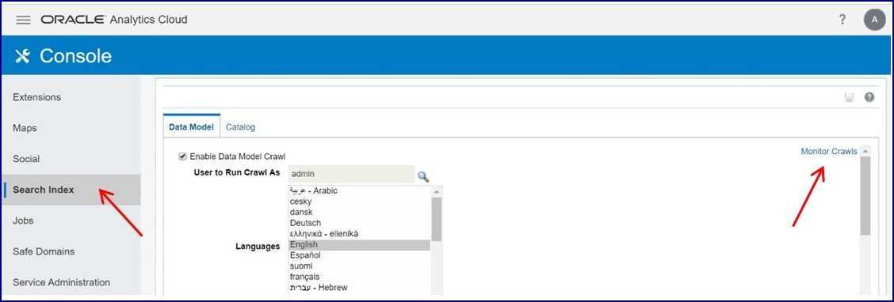

### **STEP 3: Now we are ready to explore this Data Set on Mobile App - Oracle Day by Day.**

- Open Oracle Day By Day App. Click `Login`.

  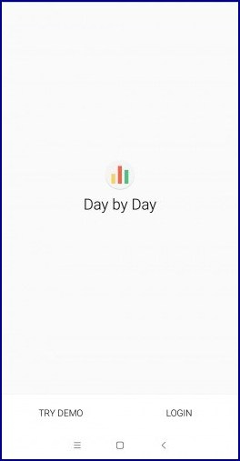  

- Put your Server address where you want query your data on phone.Click `Connect`.

  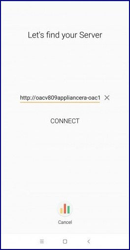

- Enter the User Credentials and Click `Login`

  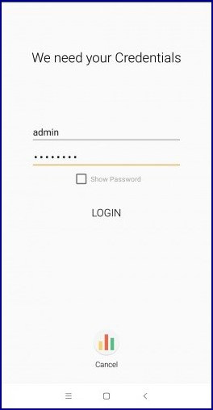

- You will see a `Welcome` Screen

  

- On the landing page you see below 
    - `Smart Feed` - This contains a list of analytics that should be meaningful to the user based on what’s going on in the business and their day.
    - `Search` - This allows you to query what you looking for.
    - `LeaderBoard` - Over time Day by Day will proactively deliver analytics to users Smart Feed. The leaderboard is the first ‘system generated’ item that we push to user’s Smart Feeds.

  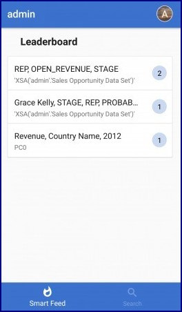

- Click on left top corner on the `profile` image to see the app settings & tap of `edit` to upload a profile image and specify a profile name.
    - Allow Nearby: Share cards with nearby users. Enables simple sharing between device platforms.
    - Show Leaderboard: Over time Day by Day will proactively deliver analytics to users Smart Feed. The leaderboard is the first ‘system generated’ item that we push to user’s Smart Feeds.
    - Invite Colleagues: You see the users available in the contacts list on your mobile device.
    - Bringbacks: Over time users may want to see and manage which card shows up on the feed.
      Bring Back menu will allow you to edit any currently active bring backs.
    - My Crew: Can view/create a group of users that you can interact.
      You see two types of users:
      - Suggested users: Registered users of the app who are in the contacts list on your mobile device with an email address that exactly matches the email address of the user IDs that they use for the app.
      - Users: Registered users of the app who are available in your Oracle Analytics Cloud instance.
      - Server Information: OAC Server information is mentioned and the control to disconnect is available here.
      - About: General information about the app is mentioned here - Legal Terms, Privacy Policy, Version & Copyright Details and Help

  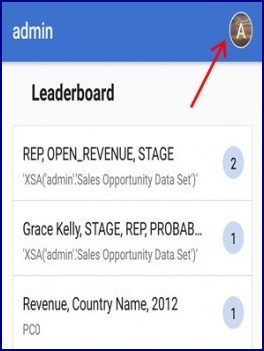 

  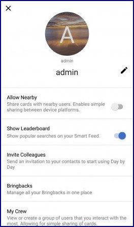 
 
  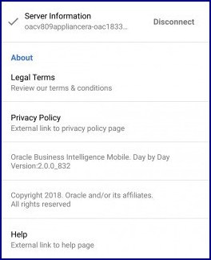 

-  Click on `Search` at the left bottom corner and click on `microphone` icon.

   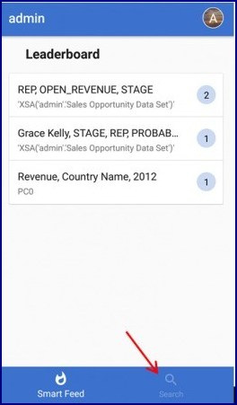 

    

- Chris Nolan is interested in knowing status of his Sales Pipeline. So speak/type `Show me Open revenue by Stage and Representative`.

  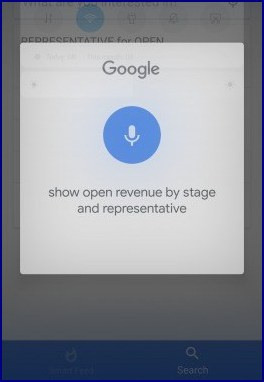 

  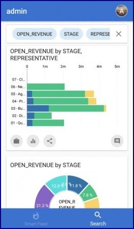 

  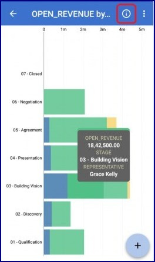 

- Click on 03 - Building Vision Stage & Locate the largest value and Click in the information icon.

  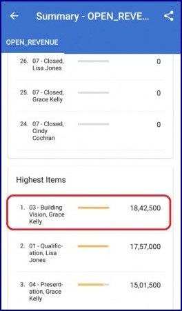

- In the information details, scroll down to confirm the Highest revenue worth opportunity in the pipeline at the Building Vision stage is owned by Grace Kelly Representative.

  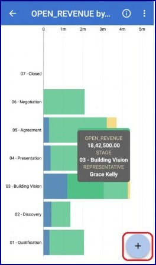

- The `'+'` icon on the left bottom offers 3 options

  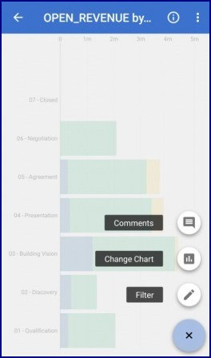

Comments: Add a descriptive analysis/text about the chart.

  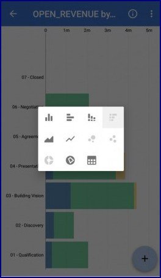 

Change Chart: The App has in-built intelligence to choose a suitable graph based on the kind of data, However user can change the type of graph with this option.

  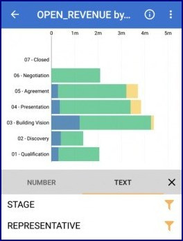 

Filter: User can filter the data, Once clicked on `Filter` - user is offered with 2 types of filter -
    - Number
    - Text

  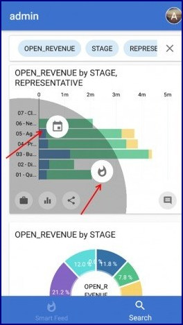 
   
- On the right bottom corner of the `Data Card`, there are 3 icons

  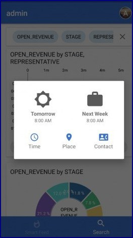

- `Briefcase` Icon: Offers 2 options
- `Bringback` - You can retrieve data on a specific date and time, location, and contact from the smart feed or in the search mode. Based on your selection, you automatically see the chart on the specified date, time, and place. For a contact-based bringback, when the contact whom you have specified calls you or sends a message, the app displays the chart.

  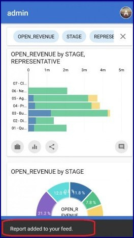

- `Smart Feed` - Allows you to add a chart to the Smart Feed. You see a message that the chart has been added to the smart feed.

  

- Now Chris Nolan from this first chart has information regarding Rep - Grace Kelly is in charge of an Opportunity with a highest revenue of $18,42,500.00 and at a Sales Stage of Building Vision where her inputs could assist Grace Kelly Close the deal. Further he would like to know the Opportunity of concern and the win probability for the same.

- Chris can speak/type the question `What is the Opportunity handled by Grace Kelly which is at Building Vision Stage and What is the probability`.

  

- App yields the result - Green Cloud Operations is the Opportunity with the probability of 38%.

  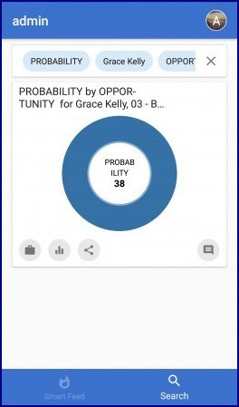 

  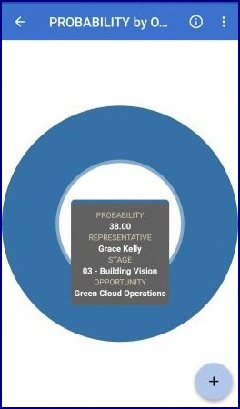 

   

- By leveraging mobile analytics with Oracle Day By Day, Chris Nolan was able to connect with his organization's Sales Pipeline information, identify key opportunities at crucial Sales Stage and their probability to win and the Sales Repreenetative who is incharge - helping him address his team effectively.
