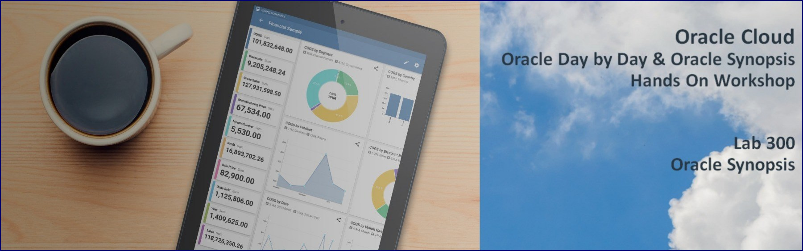

# Introduction to Oracle Synopsis

Oracle Synopsis is the first mobile analytics app that lets you quickly open and interact with spreadsheets and business data in a visual and intuitive way, while you're on the go.

Spreadsheets and business data are presented in the most meaningful way possible. Visually stunning and interactive graphics give your data context. Discover hidden insights, explore further, and share the data with your team—from your mobile device. Oracle Synopsis includes the following features:

- Smart summaries
- Automatic chart generation
- Ability to filter, sort, and zoom in on data
- Fingerprint lock
- 100% on-device analytics
- Works with iOS and Android devices
- Works with Excel and CSV files

# Background for Oracle Synopsis

In this lab you will assume the role of Sales Manager Chris Nolan. He needs to travel across all of his regions to help close deals. He needs to know where he needs to focus his time and maximize travel.

He just received Sales spreadsheet from his corporate office.  This is about the only report they generate for him that provides much value.  Unfortunately, every time he receives it, he manually scans through the numbers trying to create reports and charts in Excel that are useful.  
He has just boarded a train on his way to a sales office in one of his territories and has an hour or so to kill. He is going to use his time to try out the Synopsis product, specifically looking for two things:
1)	Focus on Sales & Profit of North America Region 
2)	See who (Sales Rep) needs the most help in which City and for which Customer Segment and Product Category.

# Synopsis Lab 300: Getting Started

## Lab Introduction
This lab walks you through the steps to get started using the Synopsis App

To log issues and view the Lab Guide source, go to the [github oracle](https://github.com/oracle/learning-library/tree/master/workshops/synopsis) repository.

## Objectives
-   Discover Salient features of the app
-   Leverage the app - Synopsis to help Chris Nolan analyze Sales & Profits. Help achieve the Sales      Targets by discovering which Region, Account and Sales Rep needs his expert inputs.

## Required Artifacts
- The following lab requires you to download Synopsis App from below:

## Download the Synopsis App from Play Store

Google Play Store:
https://play.google.com/store/apps/details?id=com.oracle.lens

Apple Play Store:
https://itunes.apple.com/gb/app/oracle-synopsis/id1191620183?mt=8

# Steps

### **STEP 1: Access the data set - "Sales Dataset" from the mailbox**

- Open up a Spreadsheet from the App, which is all you need to do to ensure the app will auto open when you receive spreadsheets via e-mail.

  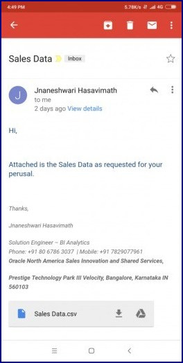

### **STEP 2: Open the e-mail on your mobile device**

- Click the attachment link to open your spreadsheet in Synopsis

  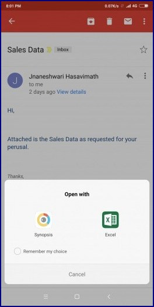

- Focus on What Matters Most : The first mobile analytics app that lets you quickly open and interact with spreadsheets and business data in a visual and intuitive way—while you're on the go.


### **STEP 3: Oracle Synopsis does more than just open spreadsheets—it automatically aggregates the data and tells the story behind the numbers, with rich graphics. It's easy to use and free**

- Note the message at the top of the screen that shows the spreadsheet is loading. 

  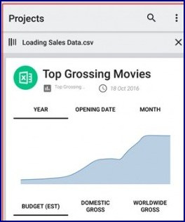

- NOTE: If you ever want to get rid of projects you can swipe the project card to the right

### **STEP 4: Select the Data Card**

- Synopsis has now pulled in your spreadsheet and aggregated the data.

  Each Spreadsheet is referenced as a Project. Note that at the top of the Project your Dimensions are showing.  Dimensions represent different ways you can slice your data. At the bottom of your project are your measures.  Measures are numeric values that represent measures such as Profit or Sales.

  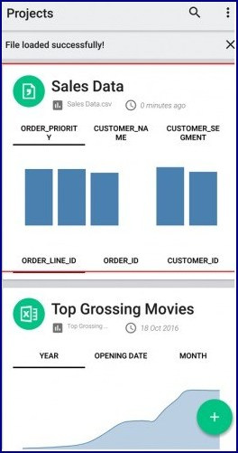

- You can select different dimensions or measures to see your project graph change.

### **STEP 5: Explore the "+" Sign Options**

- You can click on the ‘+’ green plus sign to see different sources to fetch data from.

- Synopsis allows you to connect to different sources:
  - **OAC:** Connect to OAC instance and access Data Sets and create Data Cards from the same
  - **Lens:** It can read any data (switches on the camera to capture the data) and can create BI Analysis / Charts on that automatically by enabling chart option	
  - **File Explorer:** Access the internal of your phone to explore the xlsx and csv
  - **Google Fit:** Can import data from your goggle fit device
  
    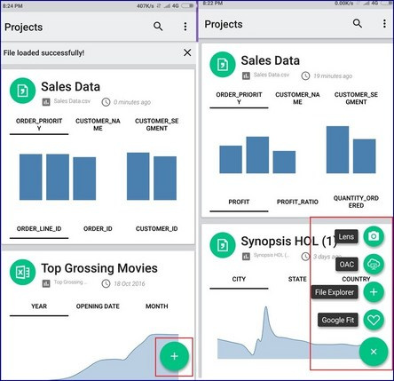


### **STEP 6: Explore App Settings.**

- You can click on the 3 vertical ellipsis on the right top corner.
	
	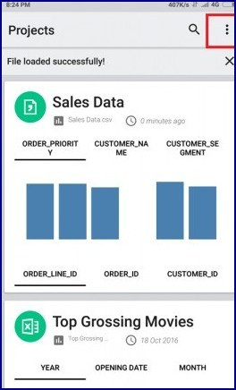
	
- Click on the Settings.

- Synopsis lists the General Settings along with information about the App.

	

### **STEP 7: Explore all the measures.**

- Measures will automatically appear on the card.

- There is one thing we need to change right away.  Synopsis saw numeric values for ORDER_LINE_ID and assumed it was a measure.  For our purposes, ORDER_LINE_ID is a Dimension so we need to quickly change it to a Dimension.

  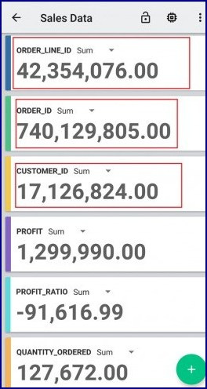

### **STEP 8: Explore the Settings for a Data Card.**

- Click on Settings

  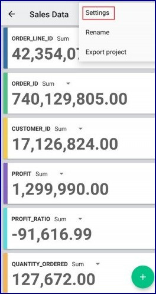

```
It is simple to re-categorize columns from Dimensions to Measure and vice-versa and rename the Column Labels
```
- Drag ORDER_LINE_ID, ORDER_ID AND CUSTOMER_ID from the left to the right and Click on APPLY

- Enable the “Edit Column Labels”

  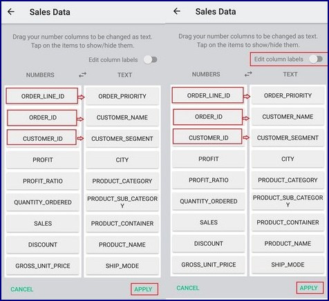
  
### **STEP 9: Export a Project.**

- It is simple to Export project to a local folder on your phone.

  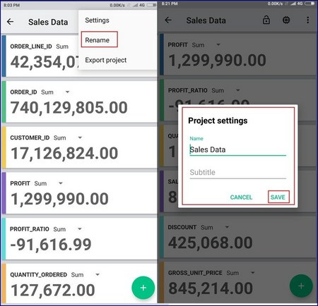

- Click the vertical ellipsis in the upper right corner and click on “Export project”  

  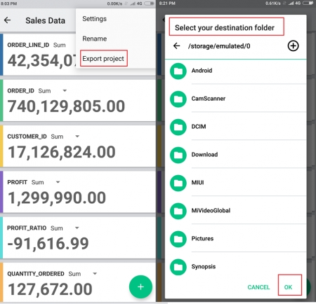
  
### **STEP 10: Create a Custom Column.**  
  
- You can create a New column on the go with this option.

- Click on the green plus sign “+” to create a New Column. 

  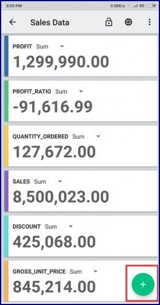 

- You can create a New Column on the go using the available measure columns and basic operators listed in the list and numeric values 0-9 and decimal.  

- Click on interested columns to create a new calculated column using the available operators

- Click on left arrow to add on any numbers and decimal

  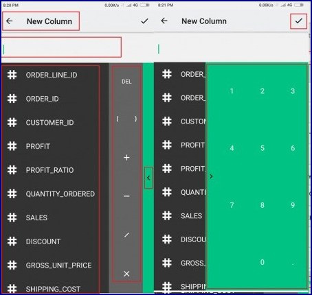

### **STEP 11: Choose to analyze Sales.**  

- Going back to the main screen, we get every possible combination of the various measures displayed against the dimension columns. The best visualization type is automatically chosen by synopsis by default to make the most sense. Let us explore these graphs. I also want to take a closer look at the Sales numbers.

- Scroll through the screen to explore all the various auto-generated graphs.

- Click on Sales Measure card

  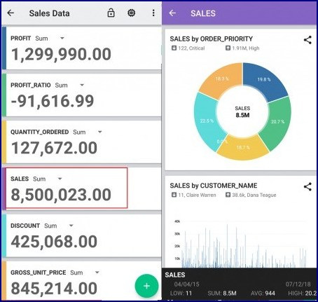
  
### **STEP 12: Narrow down to analyze Sales by CUSTOMER_SEGMENT.**  

- We are now presented with Sales Measure sliced with every available dimension column. I now want to take a closer look at the Sales by Customer Segment and see how each Customer Segment is doing.

- Click on Sales by CUSTOMER_SEGMENT.

  

### **STEP 13: Region of Interest- North America.**  

- From the ‘TEXT’ choose the filter icon for the attribute ‘REGION’.

- Click on Edit button on the bottom right, Narrow down the analysis to “North America” Region.

  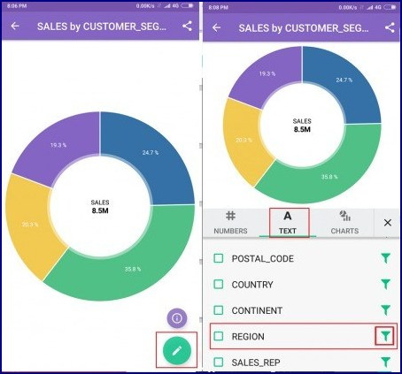  
  
- Choose ‘North America’ out of the list and apply.

- ‘Uncheck All’ and choose the intended Region and Click ‘APPLY’
    
  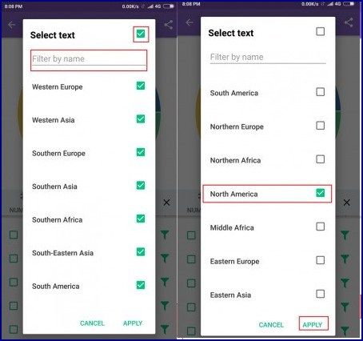  

### **STEP 14: Identify the leading and lagging Customer Segment.**  

- As I can see, we are making good sales in Corporate Customer Segment. Home Office and Consumer are doing considerable Sales but Small Business is lagging compared to the other Customer Segments.

- Results of Sales by Customer Segment for ‘North America’ Region.

  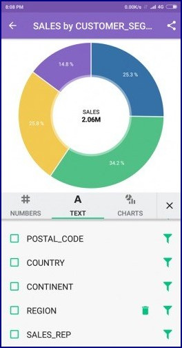

### **STEP 15: Add PROFIT to the analysis of SALES numbers.**  

- I now want to compare the Sales that we are seeing with the Profit for each Customer Segment. This will help us gauge how each Customer Segment is doing with respect to the Profit and will give us a better picture of the Sales.

- Click on Numbers and Select PROFIT.

  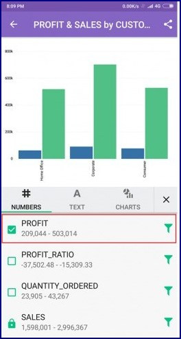   

### **STEP 16: Identify the least Profitable CUSTOMER_SEGMENT.**  

- To make the chart easier to understand, let us change the chart type to a horizontal Bar Graph. 
We can now see that despite high Sales in Corporate Segment, it’s the least profitable in North America Region.

- Click on Charts and Select Bar(H).

  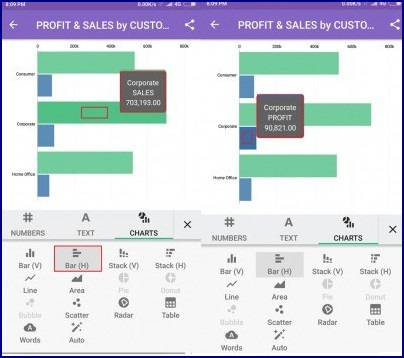   
  
### **STEP 17: Filter on least Profitable CUSTOMER_SEGMENT.**  

- Filter by Corporate: CUSTOMER_SEGMENT.

- Click on Text.

- Click on filter icon which corresponds to CUSTOMER_SEGMENT

  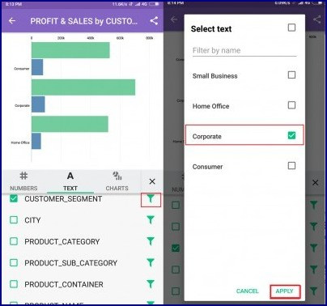   

### **STEP 18: Identify the PRODUCT_CATEGORY of concern.**  

- Add PRODUCT_CATEGORY to further analyze which PRODUCT_CATEGORY is a matter of concern.

- Click on Text.

- Click on checkbox against PRODUCT_CATEGORY 

  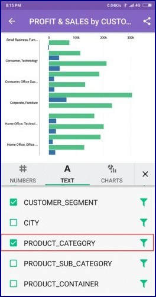   
  
### **STEP 19: Identify the least profitable PRODUCT_CATEGORY.**  

  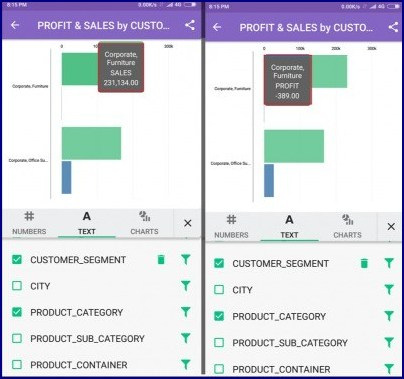   
  
- Furniture is the PRODUCT_CATEGORY of interest.

### **STEP 20: Filter by the least profitable PRODUCT_CATEGORY.**  

- Click on filter icon against PRODUCT_CATEGORY and APPLY.

  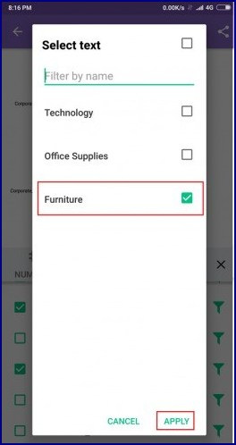   
  
### **STEP 21: Identiy the Sales Rep who needs to be addressed on priority.**  

- Add Sales Representative to know who needs to be met in priority for addressing the next action plan to up the profitability.

- Click on the Checkbox against SALES_REP 

  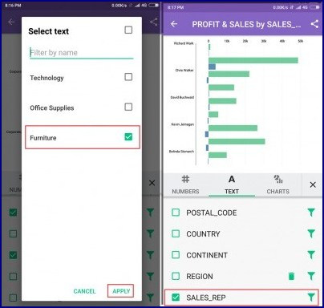

- We can see Kevin Jernagan has least Profitable Sales Numbers  

  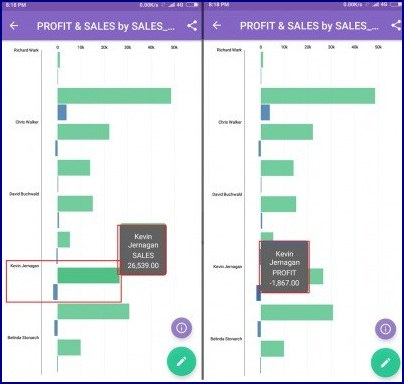
  
### **STEP 22: Identiy the City to which Sales Rep belongs.**  

- Filter by Kevin Jernagan: SALES_REP 

- Click on filter icon against SALES_REP and check "Kevin Jernagan" and hit APPLY

- Add City to the analysis to address Kevin on further sales strategies.

  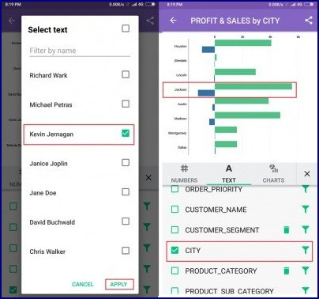
  
- We can see Jackson City is to be addressed on priority  

### **STEP 23: Summarize our findings.**  

- Let’s exit the chart.  Note that our changes stick with the chart

- There are pointers with down arrow to show the least and highest Profitable City

  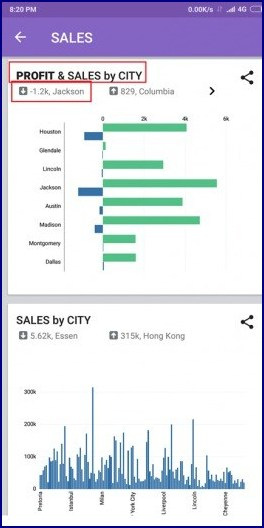
  
### **STEP 24: Share the Image of the visual with required stake holders.**  

- We have listed options to share the image of the Visual.

- Click on the Share Icon on the right up corner of the Data Card

  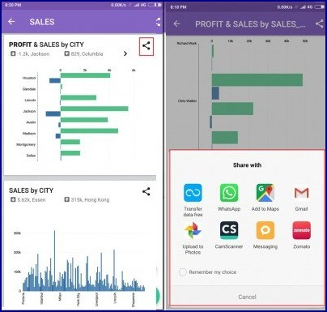  

# Conclusion
-	Became familiar with Oracle’s free mobile visualization tool, Synopsis
-	Identified the scope for bumping up my Sales & Profit numbers for North America region
-	Identified the Sales Rep and respective City to be addressed on priority and brief the strategy in the upcoming meeting
