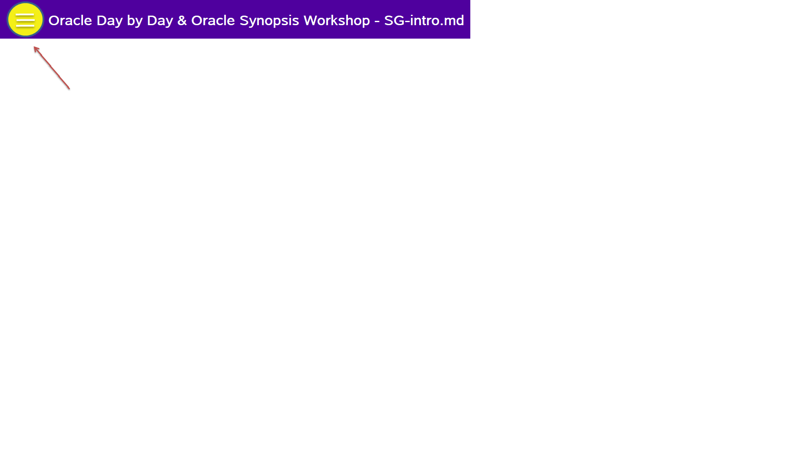

# Mobile Analytics Workshop featuring Oracle Day by Day & Synopsis

Welcome to the Oracle Day by Day & Oracle Synopsis Workshop.These labs discuss the features of Mobile Apps in the space of Oracle Analytics Cloud, a use case around Sales Organisation with real business challenges. This workshop provides series of hands on labs that help address questions around Sales Organisation and give you a basic understanding of the Mobile Apps and how it vastly simplifies to draw insights from a set of data without reaching out to the traditional way of analysing using a Desktop/PC.

Lab 100 will introduce you to OAC and show you how to create an Analytics Service. Lab 200 will show how to upload a Data Set to OAC and index a dataset/datamodel of interest and how you can visualize patterns in data and run ad-hoc queries to discover patterns in the data using Oracle Day by Day.
Lab 300 will show how you can visualize patterns in data using a Data Set from your mailbox, using Oracle Synopsis.

## Acquire an Oracle Cloud Trial or Workshop Account

Please click on the [Free Oracle Cloud Promotion](https://myservices.us.oraclecloud.com/mycloud/signup?language=en&sourceType=:ex:tb:::RC_NAMK190227P00084:PredictDemandML_ADW_HOL&SC=:ex:tb:::RC_NAMK190227P00084:PredictDemandML_ADW_HOL&pcode=NAMK190227P00084) link to complete all the required steps to get your free Oracle Cloud Trial Account. When you complete the registration process you'll receive a $300 credit and up to 3500 hours of free Oracle Cloud usage. You'll have 1000s of hours left over after the labs to continue to explore the Oracle Cloud.  Soon after requesting your trial you will receive the following email. You will not be able to start Lab 100 until you have received it.

## Navigate to Lab 100

- Once the setup is complete you can move on to lab 100 by clicking on the Menu Icon in the upper left corner of the browser window. You're now ready to continue with Lab 100.

 
