# Lab 300 - Create an ICS Integration using a Database Adapter

---

## Introduction

This is the third of several labs that are part of the **ICS Development** workshop. 

In this lab, you develop an integration in ICS using a database adapter to query an On-Premises Oracle database.

In the previous lab, a REST connection was created.  In a similar manner we need to create the connections necessary for the integration in this lab which are for the inbound SOAP web service as well as the Oracle Database.

The ICS integration that we'll be building is shown in the following picture:

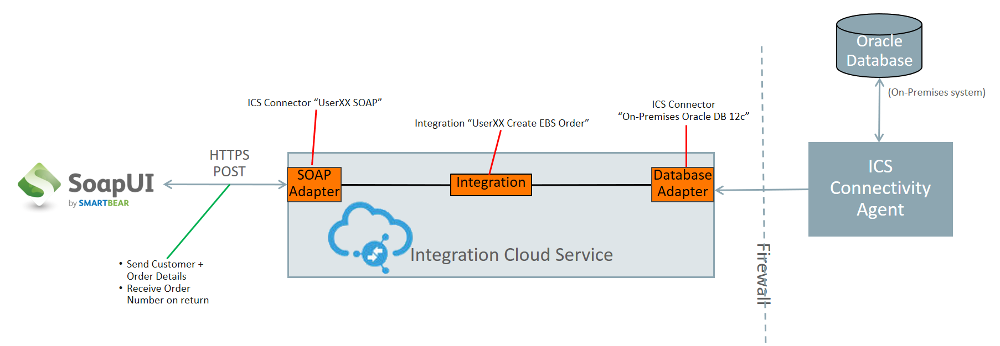

Here is a description of what is happening with this integration:

SoapUI will be used to test the exposed Web Service endpoint of the ICS integration called *UserXX Create EBS Order* (where XX will be 00 -> 10).  This integration has 2 connections.  The incoming message is received by the incoming *UserXX SOAP* Soap Connection.  The *UserXX Create EBS Order* orchestration makes 1 query into the Oracle database using the *UserXX Oracle DB 12c* connection to get details needed to create an order in EBS.  After the database calls are made, the results from the query are returned to the calling web service.

## Objectives

- Learn how to create ICS SOAP and Database Adapter Connections
- Learn how to create an ICS Orchestration using the ICS Adapters
- Learn how to test the ICS integration using SoapUI

## Required Artifacts

- The following lab and an Oracle Public Cloud account that will be supplied by your instructor.
- SoapUI will need to be installed for ICS integration testing - see "Prerequisites" section of the workshop for details

## Part 1: Create the ICS Connections

### **1.1**: Login to the ICS Service Console

---

**1.1.1** From your browser (Firefox or Chrome recommended) login to the ICS Console using the following URL:
<https://ttcics-gse00011451.integration.us2.oraclecloud.com/ics/faces/global>

**1.1.2** Enter your `User Name` and `Password` and click **Sign In**

***NOTE:*** the **User Name and Password** values will be given to you by your instructor.

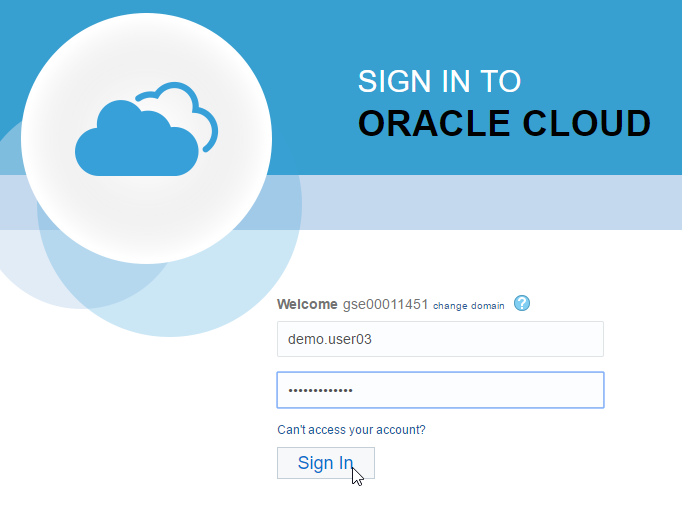  

**1.1.3** You may be presented with the tutorial overlay for the ICS Service Console - since we already went through ICS in Lab 100, dismiss the tutorial by clicking on _Got It!_

**1.1.4** You will now be presented with the ICS Service Console from which you will be performing the rest of this workshop lab.

### **1.2**: Create the SOAP Connector

---

**1.2.1** Select the `Connections` graphic in the designer portal

 

**1.2.2** Click on **Create** in the upper-right

 

**1.2.3** Select the **SOAP** Connection, by either doing a search, or by scrolling down to the **SOAP** connection, then click on the **Select** button of the **SOAP** connection.

**1.2.4** Fill in the information for the new connection 

- **Name:** Enter in the form of _UserXX SOAP_ where XX is the number in your allocated user.
- **Role:** Select _Trigger_ since we going to use the connection as a trigger to start the integration

Note that the **Identifier** will automatically be created based on the **Name** you entered.

**1.2.5** Click **Create**

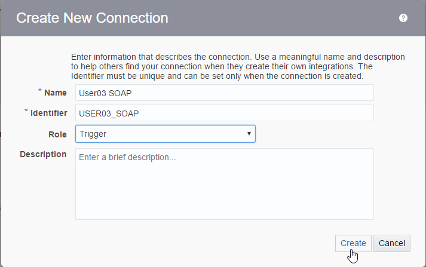 

**1.2.6** Click the **Configure Connectivity** button

NOTE: The "SOAP" header will show that the connection is both "Trigger and Invoke" even though it was setup to be a "Trigger" only. This is a known issue.

 

**1.2.7** For the *WSDL URL*, select the *Upload File* checkbox, then the *Upload* button.

 

**1.2.8** Select the *Browse* button and browse to the file `createOrder.wsdl` which can be found in github relative to this lab here: [https://cloudaccelerate.github.io/TTC-iPaaSArtifacts/ics/createOrder.wsdl](https://cloudaccelerate.github.io/TTC-iPaaSArtifacts/ics/createOrder.wsdl) (Save that file to your local workstation so it can be uploaded)

 

**1.2.9** Select the "Upload" button

**1.2.10** In the field *Suppress insertion of timestamp into the re..." field, select *No*, then select the *OK* button.  This selection will disable the need for the WS-Utility (WSU) Timestamp in the WS-Security header.  When we test inbound requests with Basic Auth security policy, no timestamps will be required.

**1.2.11** Select the *Configure Security* button so we can change the default security configuration which is set to **Username Token**. 

**1.2.12** Select *No Authentication* from the picklist of _Security Policies_ (because only ICS credentials will be needed for this SOAP API), then select the *OK* button.

**1.2.13** At the top of the connection configuration screen, Click on the **Test** button to test the connection.

**1.2.14** In the dialog that pops up, select the **Validate and Test** button because we want to both validate the WSDL and test the connection.

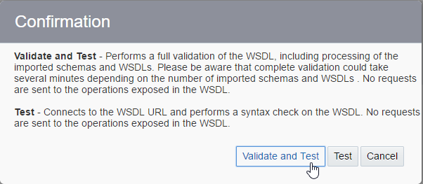

Note how the progress indicator will go from 75% to 100% after the connection tests successfully.

 

**1.2.15** Click on the **Save** button in the upper right corner of the connection configuration screen.

 

**1.2.16** Click on the **Close** button in the upper right of the connection configuration screen.

Your new SOAP connection appears in the list of configured connections and is even marked as **New** !

 

### **1.3**: Create the Database Connector

---

**1.3.1** Click on **Create** button again in the upper right

 

**1.3.2** Select the **Oracle Database** Connection, by either doing a search, or by scrolling down to the **Oracle Database** connection, then click on the **Select** button of the **Oracle Database** connection.

Note: If there is still a filter typed in for the SOAP adapter, you can clear it by selecting the `X` next to the search box.

**1.3.3** Fill in the information for the new connection:

- **Name:** Enter in the form of _UserXX Oracle DB 12c_ where XX is the number in your allocated user.
- **Role:** Select _Invoke_ since we going to call the connection as an invocation from the integration

Note that the **Identifier** will automatically be created based on the **Name** you entered.

**1.3.4** Click **Create**

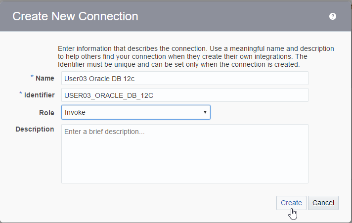 

**1.3.5** Click the **Configure Connectivity** button

_NOTE:_ The "Oracle Database" header will show that the connection is both "Trigger and Invoke" even though it was setup to be a "Invoke" only.  This is a known issue.

 

**1.3.6** Enter the values given to you by your workshop instructor for the *Connection Properties*, then select the _OK_ button:

- **Host:** - `129.152.144.104` - this is only an example of an EBS hostname and may not be the EBS instance used in your workshop
- **Port:** - `1521` - this is the default database port for the EBS database
- **SID:** - leave this blank, you need either a SID, or a Service Name which we gave, but not both
- **Service Name:** - `pdborcl` - this is the Service Name for the sample database we will be using

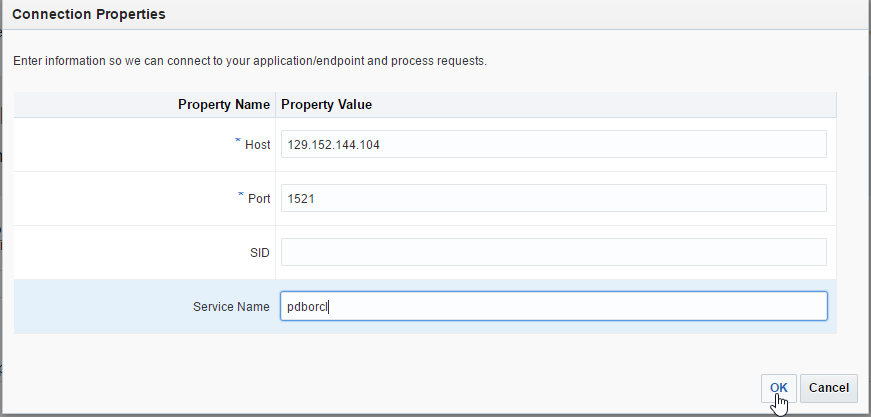 

**1.3.7** Next scroll down in the Connection Configuration page and select the **Configure Security** button.

 

**1.3.8** Enter the following Username and Password for the EBS adapter connection.

The following values are example DB schema username/password and may not be the one used in your workshop.  
Your workshop instructor will tell you if it needs to be changed.

- **Username:** - `ttc_user` 
- **Password:** - _provided by your instructor_ 

**1.3.9** Click on the **OK** button to save the credentials.

**1.3.10** Now, scroll down again in the Connection Configuration page and select the **Configure Agents** button.

**1.3.11** Select the *ON_PREM_AGENT_GROUP* which should be the only entry in the agent list by clicking the name, then select the **Use** button.

**1.3.12** At the top of the connection configuration screen, Click on the **Test** button to test the connection.

Note how the progress indicator will go from 85% to 100% after the connection tests successfully.

 

**1.3.13** Click on the **Save** button in the upper right corner of the connection configuration screen.

 

**1.3.14** Click on the **Close** button in the upper right of the connection configuration screen.

Your new Database connection appears in the list of configured connections and is even marked as **New** !

**Note** how the icon for the connection is different between the SOAP and Database connector.

 

## Part 2: Create the ICS Integration

---

### **2.1**: Create Orchestration Integration

**2.1.1** On the upper left-hand navigation of the Connections screen select the _Hamburger_ menu, then the *Integrations* link

**2.1.2** Click on the _Hamburger_ menu icon again to dismiss the left-hand navigation.

**2.1.3** Select the **Create** button in the upper-right of the Integrations screen

**2.1.4** In the **Create Integration - Select a Style/Pattern**, select the **Orchestration** style.  We want to use this because our integration will have one invocations to the Database and later another couple invocations to the EBS API to create an order - the **Basic Map Data** style only has a single target service invocation as well as additional invocations for data enrichment of the payload before the target invocation call is made.

**2.1.5** Fill in the information for the new orchestration

- **What triggers this integration?:** Select the radio button for `Application event or business object`.  Note that integrations can be scheduled to run at specific times if the `Schedule` trigger type is selected.
- **What do you want to call your integration?:** Enter the name in the form of _UserXX Create EBS Order_ where XX is the number in your allocated user.
- **Identifier:** Accept the default - this value will be generated based on the name you enter.
- **Version:** Accept the default - if you want to clone and create newer versions later, you can change to a higher version than **01.00.0000** which is the default.

After you've filled in the information, select the **Create** button

**2.1.6** Observe the design canvas for the new integration.  (The various features of the ICS designer were covered in lab 100 **Exploring ICS** earlier in this workshop)

**2.1.7** Create the Trigger for the orchestration. This integration will have a SOAP WSDL endpoint as defined when we created the **UserXX SOAP** connector earlier.

Expand the list of SOAP Triggers by clicking on the **SOAP(X)** link (where `X` will be the number of SOAP connections in the ICS instance - this will vary depending on how many others are running the workshop together).

Click and drag your SOAP connection identified by your assigned user (ie: `UserXX SOAP`) over to the **Start** target.  

(Note: After you click and start dragging your connection, the `Triggers` connection tray on the left hand side of the designer will become hidden)

**2.1.8** Drop your connection onto the large *Plus Sign* inside the *Start* circle.

**2.1.9** Give your trigger a name in the *Configure SOAP Endpoint -> Basic Info* dialog.

- **What do you want to call your endpoint?:** Enter the name `createOrder` as the trigger name.

After filling in the name, click on the **Next >** button

**2.1.10** Observe the SOAP operations/ports/objects in the *Configure SOAP Endpoint -> Operations* dialog.  These settings were all pulled from the WSDL which was uploaded in the configuration of the SOAP Connecter earlier.

After observing, click on the **Next >** button

**2.1.11** In the Configure Headers screen, leave the radio button selection to `No` since we aren't setting header values.  Next, select the **Next >** button.

**2.1.12** Review the settings for your new Trigger in the *Configure SOAP Endpoint -> Summary* dialog.

After reviewing, click on the **Done** button

**2.1.13** Observe that the orchestration's design pallette is populated with the Trigger _createOrder_ just created along with the mapping and return operations which will be used for the SOAP trigger's response payload.

**2.1.14** Save the progress of your orchestration by clicking on the **Save** icon in the upper right of the design window

### **2.2**: Create an Invocation using the Database Connection

**2.2.1** Open the **Invokes** connection tray by clicking on the `Invokes` link in the very right of the orchestration design pallette so we can create the first call to the database.

**2.2.2** Select your database connector by clicking on the **Oracle Database(X)** link. (where `X` will be the number of Database connections in the ICS instance - this will vary depending on how many others are running the workshop together).
Click and drag your Database connection identified by your assigned user (ie: `UserXX Oracle DB 12c`) over to the target which will be just below the `createOrder` trigger.

(Note: After you click and start dragging your connection, the `INVOKES` connection tray on the left hand side of the designer will become hidden)

**2.2.3** Drop your connection onto the large *Plus Sign* just below the `createOrder` trigger.

**2.2.4** Fill in the information for the new invoke in the *Oracle Adapter Endpoint Configuration Wizard* dialog.

- **What do you want to call your endpoint?:** Enter the name `lookupAccountID` as the service invocation name.
- **What operation do you want to perform?:** Select `Run a SQL Statement`.  The database adapter supports both calling database stored procedures as well as running ad-hoc SQL statements.

After filling in the basic information, click on the **Next >** button

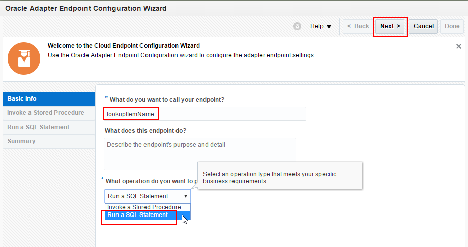

**2.2.5** Copy the SQL statement provided inline here with a parameter for `AccountName` specified in the inbound SOAP Trigger to ICS:

`select DISTINCT LOOKUP_VALUE from TTC_LOOKUP where LOOKUP_KEY LIKE  '%'||#ACCOUNT_NAME||'%'`

Note 1: The SQL query has to be in one line and doesn't end with a semi-colon.

Note 2: The double pipes in the query above are SQL concatenation operators for attaching the wildcard percent signs before and after the SQL parameter #ACCOUNT_NAME

Click on the **Validate SQL Query** button so the query can be validated for proper SQL syntax.

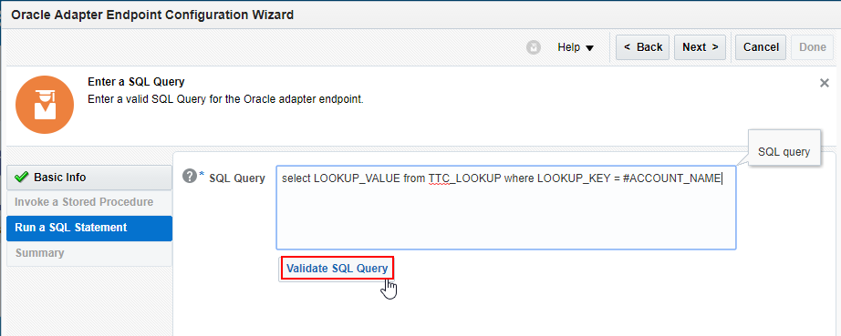 

**2.2.6** Verify that the SQL query was validated by the `Success!` message that will appear in the **Status** on the *Enter a SQL Query* dialog page.

If the query won't validate, then ensure you didn't paste in any funny characters or extra lines for the query.

Select the **Next >** button after you've validated the query has been successfully validated.

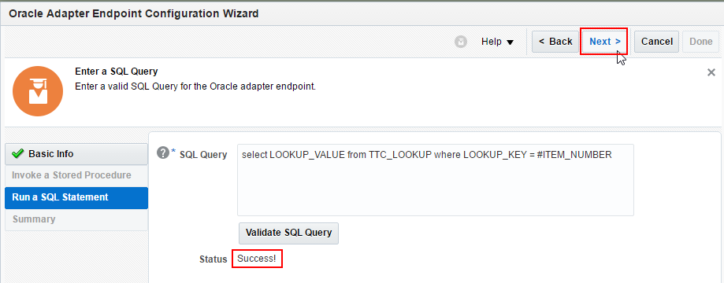

**2.2.7** Review the settings for your new adapter configuration in the *Oracle Adapter Endpoint Configuration Summary* dialog.

After reviewing, click on the **Done** button

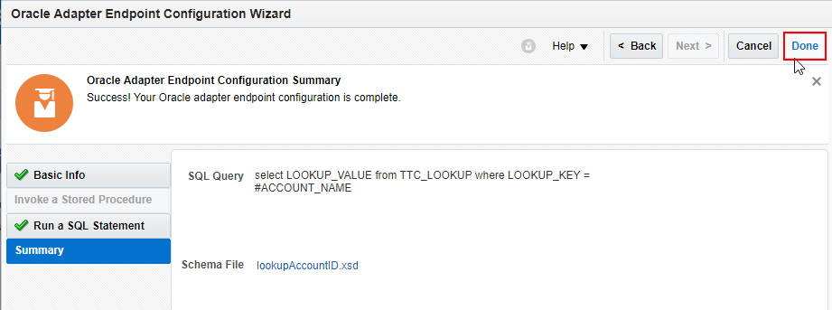

**2.2.8** Observe that the orchestration's design pallette is populated with the invoke _lookupAccountID_ you just created along with the mapping needed to invoke this adapter.

Click on the **Zoom to Fit** button in the upper right of the design pallette if you want to see the entire orchestration.

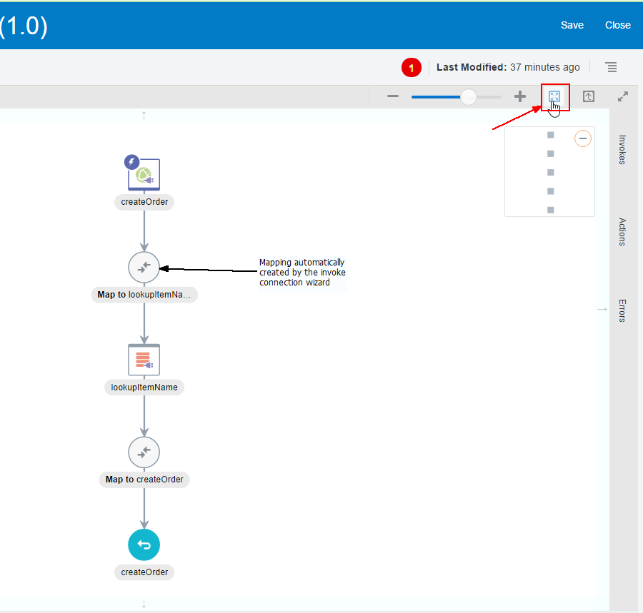

**2.2.9** Click on the *mapping symbol* for the _lookupAccountID_ mapping - this will bring up 3 icons for activities we can do to the mapping.  

Click on the `pencil icon` to edit the mapping.

Note: You can also view the mapping by clicking on the `eye` icon.  In the `hamburger` icon, you can either upload an external XSLT file for this mapping that you've created external to ICS, or you can delete the mapping.

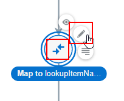

**2.2.10** Edit the mapping by clicking on the little circle to the right of the `AccountName` source variable and then drag it on top of the little circle just to the left of the `ACCOUNT_NAME` target variable.

Note: As described in the lab 100 ICS overview, this map could be tested by selecting the **Test** button in the upper right.  We aren't going to test this mapping because it is so simple.

After completing the mapping, save it by clicking on the **Validate** icon in the upper right of the design window

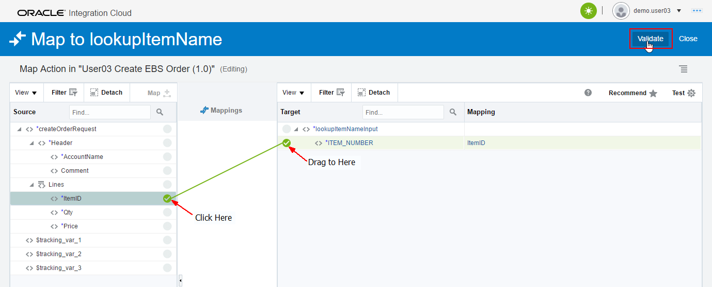

**2.2.11** Exit the mapping editor by clicking on the **Close** button in the upper left.

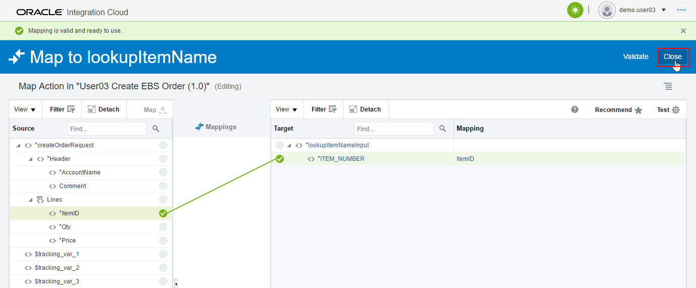

**2.2.12** Save the progress of your orchestration by clicking on the **Save** icon in the upper right of the design window

### **2.3**: Create the Return Payload for the Integration

Note that the return payload we are about to map is going to change in the next lab, lab 400, when we add a call to the EBS API to create an order.  The mapping of values in this lab will be done to verify the lookup values that were returned as a result from the query made into the database.

**2.3.1** Click on the *mapping symbol* for the _createOrder_ return payload mapping.  

Click on the `pencil icon` to edit the mapping.

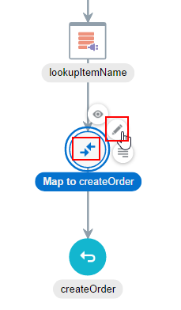

**2.3.2** First, map the lookup value `LOOKUP_VALUE`

- In the Source variable section, click on the chevron to the left of the `lookupAccountIDOutput` variable to expand it.
- Click on the little circle to the right of the `LOOKUP_VALUE` source variable and then drag it on top of the little circle just to the left of the `OrderNumber` target variable.

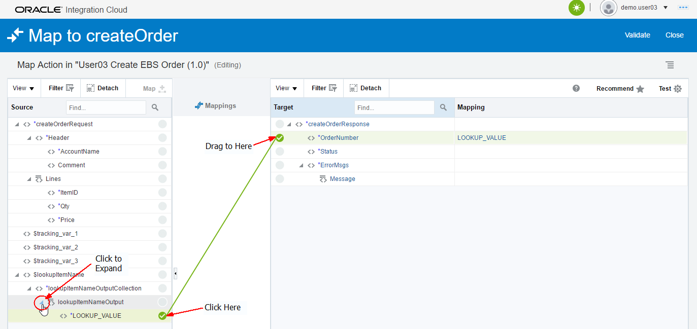

**2.3.3** We want to put an annotation in front of this variable in the return payload which says "Lookup Value = " so that it makes more sense with the `OrderNumber` target variable we are using for now.  In order do this, we will use the XSLT function `concat()`.

To open the advanced mapping editor, left-click on the target variable name's link `OrderNumber`.

**2.3.4** Scroll to bottom of the **Source** variables and then expand the `Mapping Components` section by clicking on the chevron just to the left of the label

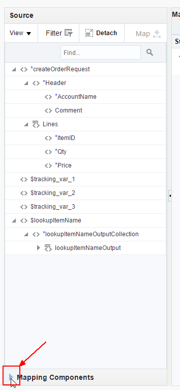

**2.3.5** Access the XSLT `String` functions

- First expand the XSLT Functions by clicking on the chevron to the left of the `Functions` label
- Now expand the list of `String` functions by clicking on the chevron to the left of the `String` label

**2.3.6** Apply the `concat` function to the mapped variable.

- First click and drag the `concat` function in the list of XSLT String functions
- Drag and Drop the `concat` function on top of the mapped `LOOKUP_VALUE` variable in the `<xsl:value-of select = ...` statement

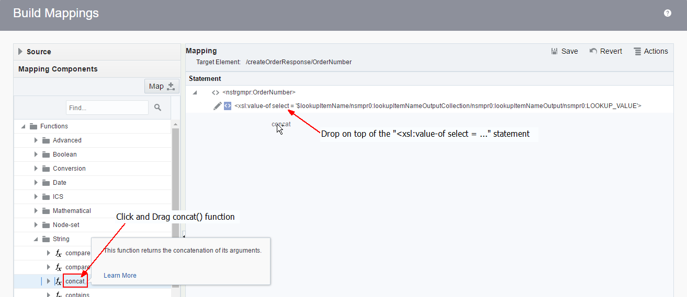

**2.3.7** The advanced editor wants to know if the `LOOKUP_VALUE` variable should be the first or second argument to the concat function.

Click on the radio button for `string2`, then click on the **OK** button.

**2.3.8** Now we want to add the annotation string "Lookup Value = " as the first string in the concat function.

Click on `string 1` just beneath the concat function

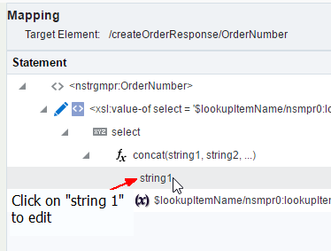

**2.3.9** Type in the string `"Lookup Value = "` (surrounding double quotes needed) in the editable textbox for the first argument for the concat function.

- After you have entered the string for the first concat argument, save this advanced mapping by selecting the **Save** button in the upper right.
- Finally, exit out of the advanced maping editor by clicking on the **Close** button in the lower right

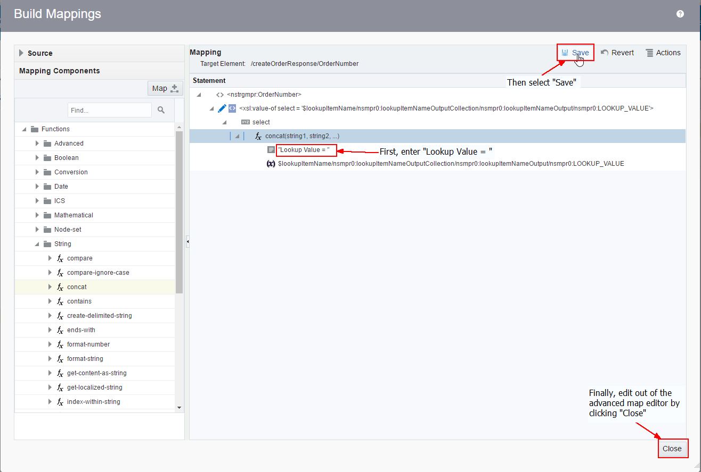

**2.3.10** The return payload mapping is now complete.

- Select the **Validate** button in the upper right of the mapping editor.
- After validating, select the **Close** button also in the upper right

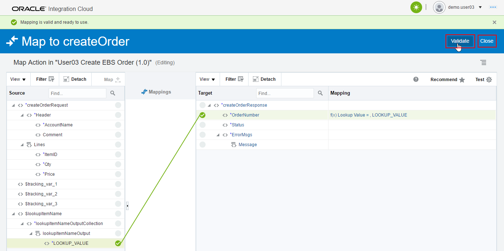

The final step in creating this integration is to add tracking variables.

### **2.4**: Add Tracking Variables for the Integration

**2.4.1:**	Open the “Tracking” editor

We want to add the *ItemID* we just mapped as a `Business Identifier`.  Business Identifiers enable runtime tracking on messages.  These identifiers will be saved in ICS’s monitoring tab for each instance of the integration that is run.

**2.4.2** Click on the _Hamburger_ icon, the click on the `Tracking` menu item to bring up the business identifier editor.

   

**2.4.3:**	The `Business Identifiers For Tracking` editor will be opened up

**2.4.4** Click on the *AccountName* variable in the Source variable section.  The editor will show the metadata for this variable such as type, path, etc.

**2.4.5** Next, click on the `Shuttle Icon` to move the *AccountName* variable over to be a new `Tracking Field`.

**2.4.6** Observe that the *AccountName* variable has now been added as a `Tracking Field`.  The source variable name is also added as the `Tracking Name` by default – since *AccountName* means something and is suitable for people to read in the monitoring tab we’ll keep it. If the comment variable was something random like *C2EF*, we would want to change it and give it a human-readable tracking name.

**2.4.7** Select the `Done` button now that the new `Business Identifier` has been added.

   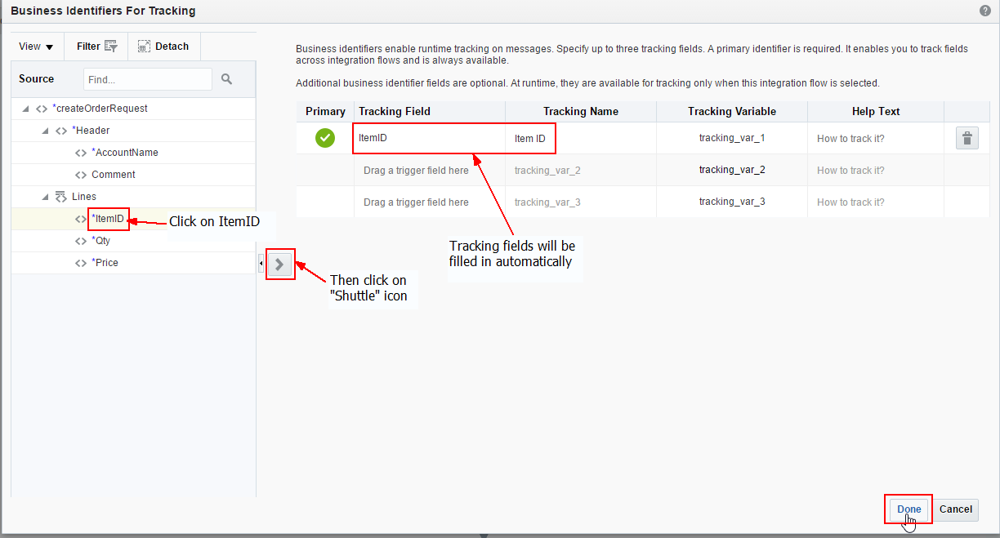

**2.4.8** Once again, click on the `Save` button to save the tracking changes, then select the `Close` button

   

This integration is now complete.  We now need to activate (deploy) it so it can be used.

### **2.5**: Activate the Integration

**2.5.1** Click on the *Activate* switch/slider on the right of the `UserXX Create EBS Order` integration.

   

**2.5.2** The `Activate Integration?` dialog will be displayed

**2.5.3** Select the *Enable tracing*, then *Include payload* checkboxes since this isn’t a production deployment.  These checkboxs will tell ICS that the payloads for each instance of the integration will be saved in the logfiles as explored in the first part of this lab earlier.

**2.5.4** Now select the *Activate* button to begin activation of the integration.

   

**2.5.5** The progress bar of the integration activation will move across the `Activate Integration?` dialog box.

**2.5.6** Once the integration is activated you will see that the activation slider now is colored green with a checkmark in it.

   

### **2.6**:	Check the Service Endpoint

**2.6.1** A message will appear on the top of the ICS Designer Portal indicating that the integration activation was successful.  The WSDL for the service endpoint will also be displayed.

**2.6.2** Click on the WSDL link so we can ensure that this integration has an available service endpoint.

   

**2.6.3** The WSDL for you new ICS integration will now be displayed in your browser.

**2.6.4** Copy the WSDL URL into your copy buffer so we can test it in the next lab section.

   

**2.6.5** Now that we have built and activated an integration and copied it's service endpoint, we can test it with some sample data to make sure it works.

## Part 3: Test the ICS Integration

---

### **3.1**: Test Using SoapUI

**3.1** Open SoapUI.  If you don't already have this installed, follow the instructions provided in the **Prerequisites** section of this workshop.

**3.2** Click on the **SOAP** button so we can create a new project for testing our new ICS SOAP Web Service

**3.3** In the **New SOAP Project** dialog window, paste the WSDL URL into the **Initial WSDL** window and give a meaningful **Project Name** such as _User03 Create EBS Order_.  Keep the checkbox selected for **create sample requests for all operations?**.  Click on the **OK** button after you've initialized the settings for your new SoapUI SOAP project.

**3.4** The new SOAP Project will appear in the left-hand navigation.

**3.5** Expand the **createOrder** operation by clicking on it, then open the auto-generated sample request **Request 1** by double-clicking on it.  An empty request payload will be generated.

**3.6** In the request payload, replace the question marks with the following test values:

- **AccountName**: _A. C. Networks_
- **Comment**: _Lab 300 request from SoapUI_
- **ItemID**: _2155_
- **Qty**: _1_
- **Price**: _3333_

**3.7** Next we need to add the authorization credentials so ICS will allow the request from SoapUI.  ICS uses basic username/password authentication.

**3.8** Click on the **Auth** button in the lower-left of the **Request 1** SoapUI window

**3.9** In the **Authorization** dropdown, select _Add New Authorization..._

**3.10** In the **Add Authorization** dialog pop-up window, select **Type** of _Basic_ form the picklist, then select the **OK** button.

**3.11** Fill in your assigned username and password in the **Auth (Basic)** window at the bottom of the SoapUI request window

**3.12** ICS needs two headers in the request payload to satisfy the enforced Web Services Security (WSS) standards.  It needs both the **WSS Username Token** and the **WS-Timestamp**.

**3.13** Insert the **WSS Username Token** by right-clicking in the Request payload body and select **Add WSS Username Token** from the pull-down list

**3.14** In the **Specify Password Type** dialog pop-up window, select _PasswordText_ as the WSS Username Token type, then click on the **OK** button.

**3.15** Insert the **WS-Timestamp** by right-clicking in the Request payload body and select **Add WS-Timestamp** from the pull-down list

**3.16** In the **Specify Time-To-Live value** dialog pop-up window, set the value (in milliseconds) to _60000_ (60 seconds), then click on the **OK** button.

**3.17** Finally your request payload is ready to send to ICS.

**3.18** Click on the green _Submit Request_ arrow in the upper left of the **Request 1** window.

**3.19** The right side of the **Request 1** SoapUI window will display the results of the ICS integration call.

**3.20** The return payload of the ICS integration will show both the _Lookup Value = XX_ value which was looked up in the Database call.

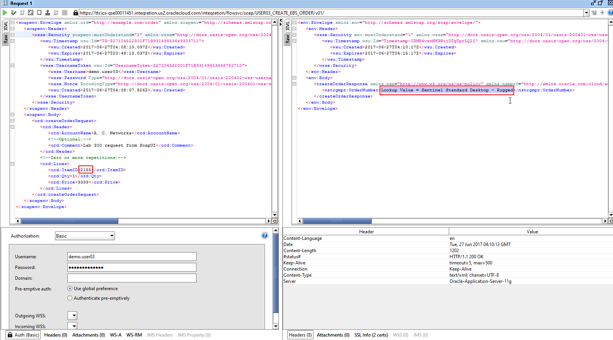

**3.21** Change the value of the **AccountName** from _A.C. Networks_ to _General Technologies_ and see if you get a different lookup result?  What do you find?

NOTE 1: Other valid Account Names to try are _Bigmart_, _Vision_, _CDS, Inc_, _Computer Service and Rentals_, _Federal Parts_, _Imaging Innovations, Inc._, and _Hilman and Associates_

NOTE 2: We could have put logic in the orchestration to give a response like `No Value found for AccountName XXX` - that's left as an exercise to the participant.

You have now completed Lab 300 of the ICS Developer Workshop.  In the next lab, we will modify the orchestration we just created by adding a call to an EBS API using the EBS Adapter.
