# Lab 100 - Creating a Visual Builder Application

## Introduction

This is the first of several labs that are part of the **Oracle Visual Builder Cloud Service Workshop.** During this workshop you will explore Oracle's  Visual Builder Cloud Service and its features from the persona of **Javascript Developer**, <add name>. You will follow <add name> as he creates a new web application, mobile application and links the mobile and web applications to the same business data in the Cloud. In our first lab you will create a Visual Builder application and add business data to display.

## Objectives

- Begin Creating a Web Application
  - Create application within Visual Builder user interface
  - Add business data for application to display
- Create the Application Pages
  - Create pages for displaying business data
  - Create pages for creating and editing business data

# Create an Application and Import Business Data

##  Create the Application

### **STEP 1**: Access, Create  Visual Builder Cloud Service

- Click on the **Hamburger** icon at the top of the page and select the **Open Visual Builder Homepage** dropdown choice.

  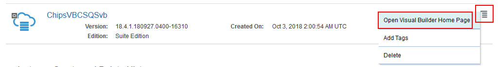

- Click **New Application** button to start the application create wizard.

  

- Select the **Empty Application** template and click **Next**.

  

- On Details screen enter the following data and click on **Next**.

  In the Create Application dialog box, enter the following, then press **Create**.

  - **Application Name:** ```Application```
  - **Description:** ```Tutorial Application```
  - **Application ID:** The text field is automatically populated as you type based on the Application Name.

    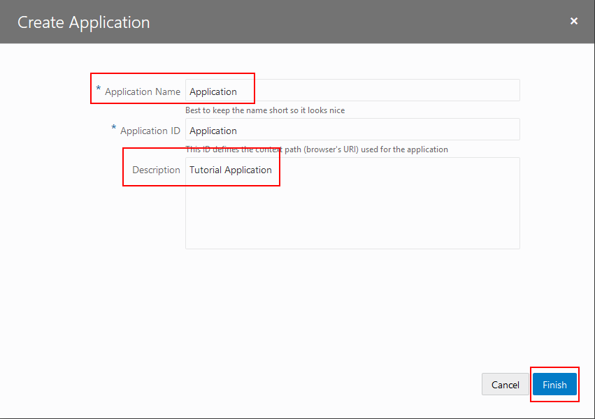

  **NOTE:** _If you receive a browser warning please update/change your browser to a compatible version._

    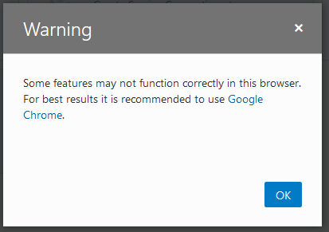

- You now have a new application, in which you can begin building pages and adding data.

  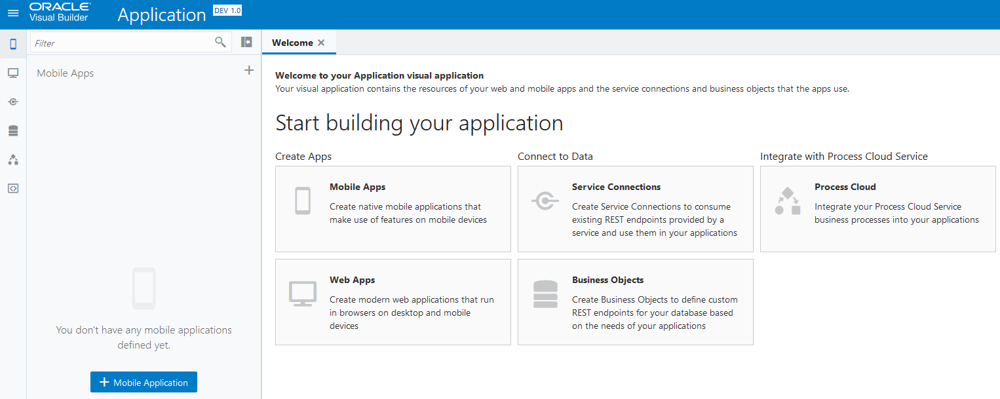

## Import Business Data

### **STEP 1**: Importing Business Data

In this step we will create a new business object to host data for our application.

- Open the **Business Objects** by clicking on the "Business Objects" icon in the navigation panel.

  

- Click the "menu" icon and select "Data Manager" from the dropdown to open the import tool.

  

- Now we'll import the Inventory data from a file. In the right hand pane select the **Import Business Objects** window.

  

- Download this spreadsheet <a href="https://oracle.github.io/learning-library/workshops/vbcs/avbcsMisc/inventory.xlsx" target="new">inventory.xlsx</a> to your local machine. When prompted upload this file to create a new business object.

  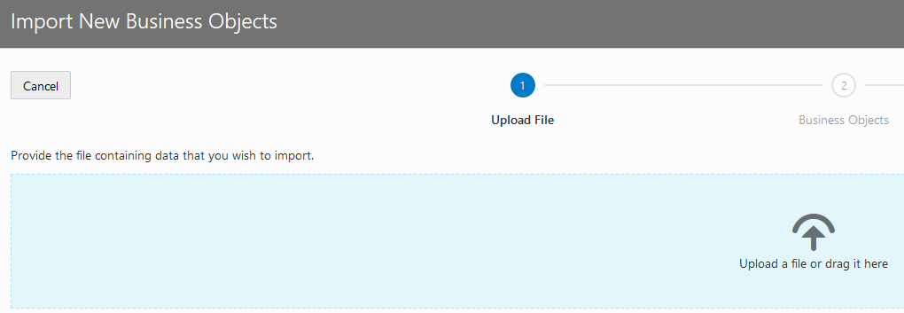

- You will see a popup stating that the upload is taking place and it will confirm that the upload finished with a message stating "Upload succeeded."

  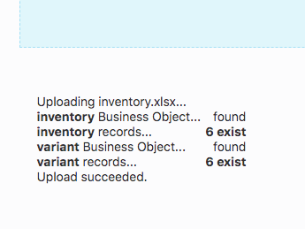

- Click **Next**

  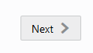

- The business objects will be displayed with the option to edit the names, we will be leaving the names as they are and click **Next**.

  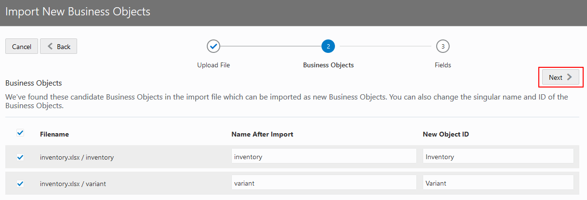

- The next step will display the fields that will be created and will detect the data types and set them accordingly. You can edit the names and types here but we will be leaving them as they are imported. Click **Finish**.

  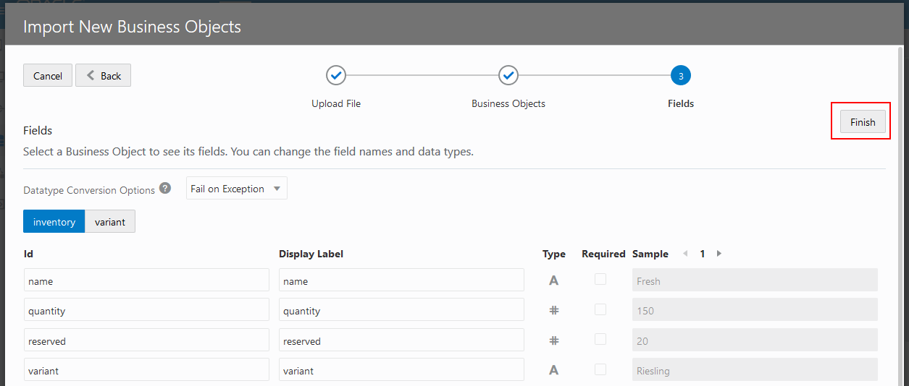

- Once the import is finished, you will receive a message showing the business objects that have been imported. Click the **Close** button.

  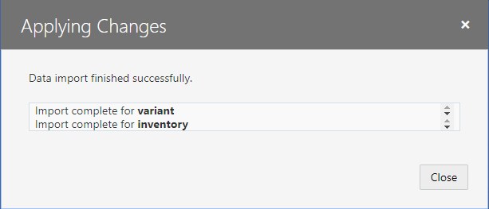

- You should now see the **inventory** and **variant** business objects in the panel on the left. Click on the **inventory** Business Object. If the objects do not immediately appear refresh your browser.

  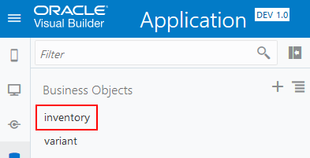

- You will see the details of the business object in the right hand panel.

  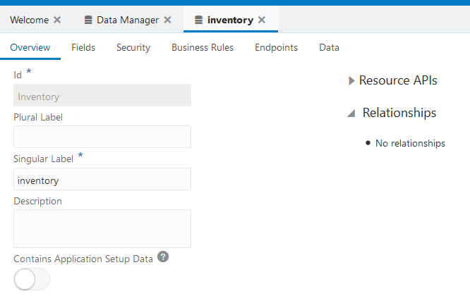

### **STEP 2:** Creating the Web App

Now that we have data for our app to display we can build our web app to display and modify that data.

- Click on the **monitor** icon in the left panel to open the web apps panel. Then click on the **+ Web Application** button to create a new web app.

  

- Name your app ```InventoryWebApp``` and click **Create**.

  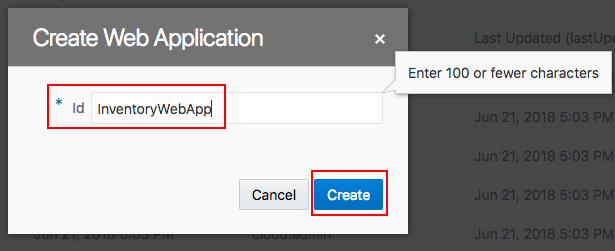

- Your applications canvas will open in the left hand menu. This is where we will begin adding components to the page. Expand the drop downs in the left panel to see where the main-start page is in the structure of the app.

  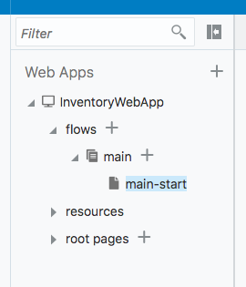

- The main-start page development panel will open in the right hand side of the page. To begin, we'll add a list to our page to display our added inventory data. Scroll down in the components list panel and drag a **List View** onto our page.

  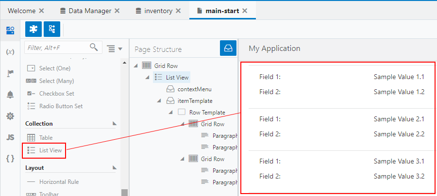

- To associate our inventory data with the list, in the right panel select **Add Data**.

  

- In the popup dialog window select the **inventory** data source and click **Next**.

  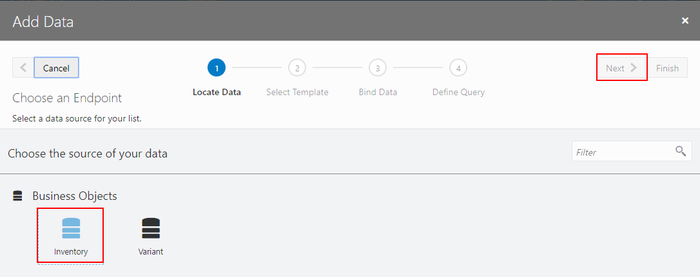

- Select the top template and click next **Next**.

  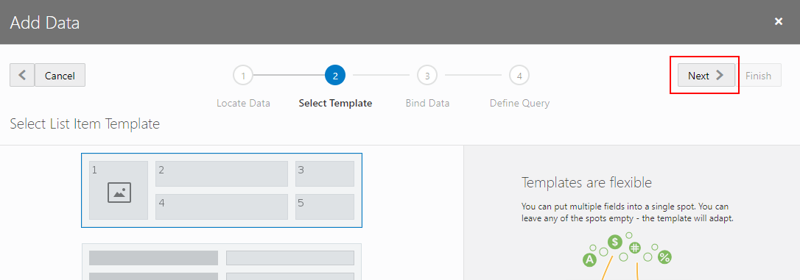

- For our **Fields** drag and drop the following fields to the respective numeric position.

    - **Position 2**: name     
    - **Position 3**: quantity
    - **Position 4**: variant
    - **Position 5**: reserved

  

  Your screen should look like the following before you click **NEXT**:

  

- We don't need to define a query for our data, so we can click **Finish**.

  


- At this point we have an application that will display our data and we can look at the live app by clicking on the **Play** button in the top right corner.

  

- We have created a simple app to display our wine inventory...

  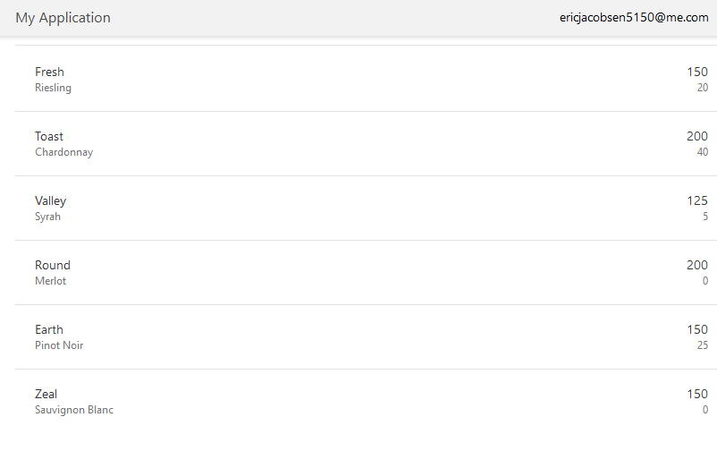

Our app is displaying our data but our inventory/reserved counts aren't labeled. Let's add labels so users will know what these numbers mean. To do that we can customize the data displayed in our list view.

- Close the browser tab that opened Live View and return to the design view of your app.

- In the **Page Structure** panel select **Value 1 --> Paragraph**

  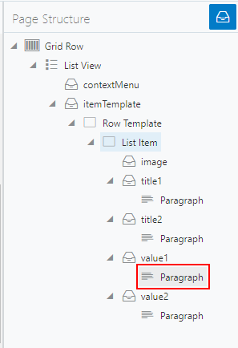

- In the right hand panel paste the following into the general tab. We will add a custom label to the list view so the data in the fields will accurately describe the inventory levels numeric values.

```
[["Inventory: " + $current.data.quantity]]
```

  

- In the **Page Structure** panel select **Value 2 --> Paragraph**

  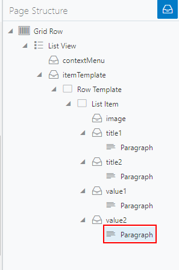

- In the right hand panel paste the following into the general tab.

    ```
    [["Reserved: " + $current.data.reserved]]
    ```

    

- Now our app displays a list of the available wines with their inventory count and reserved count.

  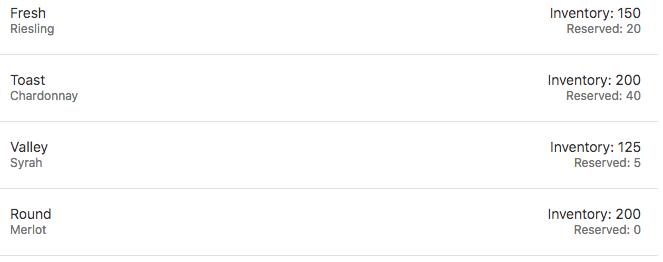

# Summary

We have now created an application in  Visual Builder Cloud Service, added our business data. The next lab in the series will guide us through adding update and edit features to allow the app's users to update inventory counts from the app.

- You may proceed to [Lab 200](LabGuide200.md)
