# Oracle Visual Builder Demo Lab

 

Updated: November 02, 2018

## Introduction

_Time to Complete: 30 minutes_

Oracle Visual Builder is a cloud service that enables you to rapidly create and host web and mobile applications with minimal coding required. Users can visually create an application using a collection of built-in user-interface controls, and bind the UI to existing REST services or custom business objects they create from within the tool. Users publish their application with a click of a button to provide access to end-users. In addition role based security can be defined for the application to control access to pages and data.

## Lab Overview

This Lab will have you log into Oracle Visual Builder and build a web application that uses Business Objects and Charts.

## Requirements

**Chrome is the recommended browser. Others do not support all of the drag and drop functionality. If not using Chrome you will see a Warning:**

  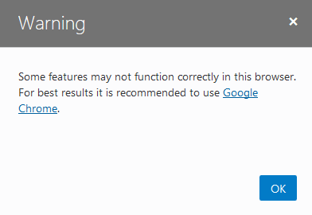

# Application Development with Visual Builder

**`AAfter clicking on the Demo Lab button and Signing Up or Signing In you'll receive an email with the URL and credentials to log into your Visual Builder environment.`**

## Login and Launch the Demo Lab

### **STEP 1**: Demo Lab

- Click **Demo Lab**.

  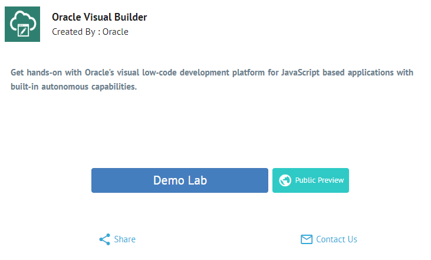

- After Signing In, if you don't see the status bar then refresh your browser. In 4 minutes the Virtual Builder instance will be available.

  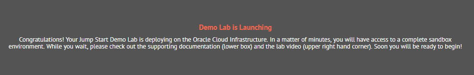

- While you're waiting, check out the short video that gives an overview of this session.

  

### **STEP 2**: Log into Visual Builder

- Go to the URL you recieved in the email and login with the credentials provided:

  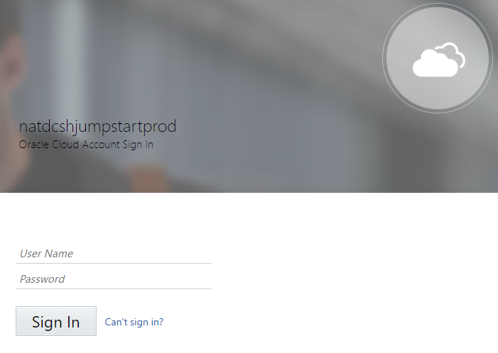

- You should see the introduction Visual Builder page. Click the **+ New Application** button.

  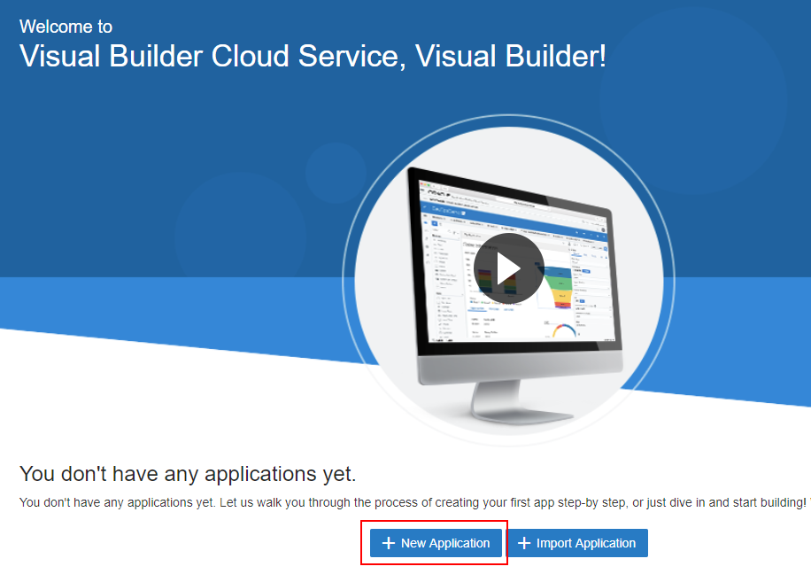

- Enter the Application Name using a prefix of `charts-` followed by your `initials` and a suffix of `123`.

  **Application Name**

  ```
  charts-<your intials>123
  ```

  **Description**

  ```
  Charts based Web Application
  ```

  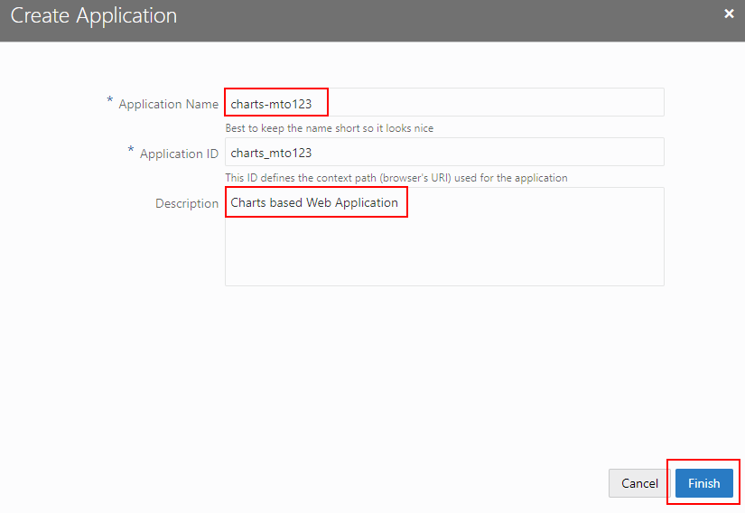

## Web Application

### **STEP 1**: Create a Web Application

- On the left hand side of the page click the **Application Icon** to toggle to a Web Application.

  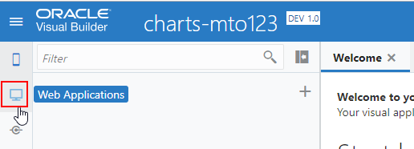

- Click the **+ Web Application** button.

  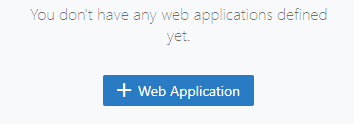

-  Name the application `chartwebapp` and click **Create**. The application opens on the main-start page with a Component Palette on the left, a Canvas in the middle and the Property Palette on the right.

  ```
  chartwebapp
  ```

  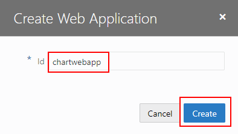

### **STEP 2**: Import Data for the Business Objects 

A business object is a resource, such as an invoice or purchase order, similar to a database table; it has fields that hold the data for your application. Like a database table, a business object provides the structure for data used with business processes. Business objects are stored in a database.

- Download the `chart_application.zip` file by **right-clicking** on this link: [Chart Application](https://objectstorage.us-ashburn-1.oraclecloud.com/p/8lPXm6vGlPEsZX1ymQL-GUduhby-u3y_8Q9hpV1s4EQ/n/natdcshjumpstartprod/b/VBCS/o/chart_application.zip) and saving locally. The .zip contains CSVs for the business objects.

- Click the **Business Objects Icon**

  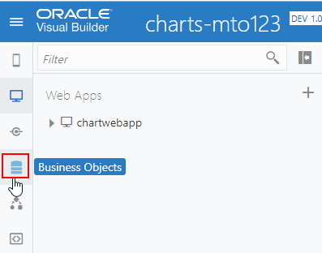

- Then, click the Business Objects **hamburger menu** and select **Data Manager**.

  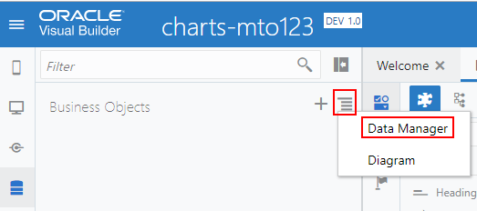

- Click the **Import Business Objects** tile.

  

- Click on the **Upload a file or drag it here icon**, browse to the location you saved the `chart_application.zip` file and select it.

  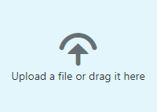

- Three Business Objects are imported and created, Region, Sales and Summary. Click **Next**.

  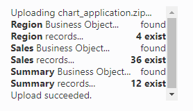

- On the Business Object page you'll see the three created data sources. Click **Next**.

  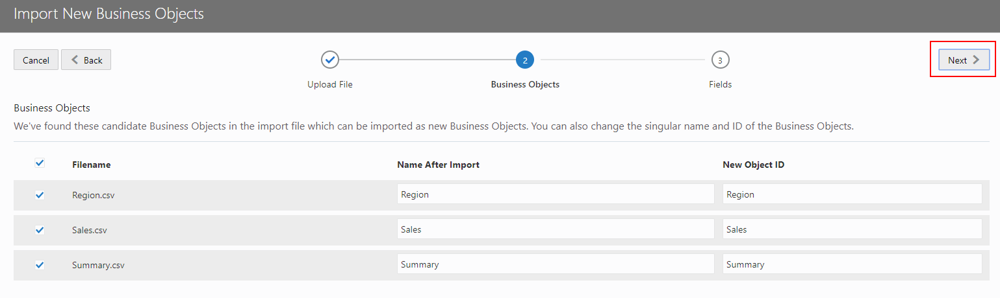
  
- On the Fields page we are going to make some changes. Click the **Sales** tab to bring up the default parameters.

  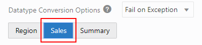

- Make the following changes:
  - On the Display Label column **rename** `ref2Region` to `Region`.
  - Click the **#** sign in the type field. Select the **Reference icon**.

      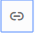

  - Accept the defaults and click the **check icon**.

      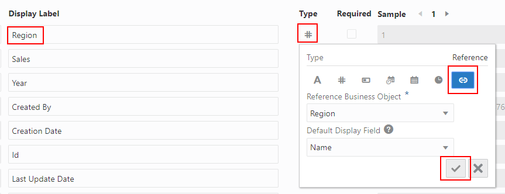

- Select the **Summary** tab and make the following changes:
  - On the Display Label column **rename** `ref2Region` to `Region`.
  - Click the **#** sign in the type field. Select the **Reference icon**.

      

  - Accept the defaults and click the **check icon**.

      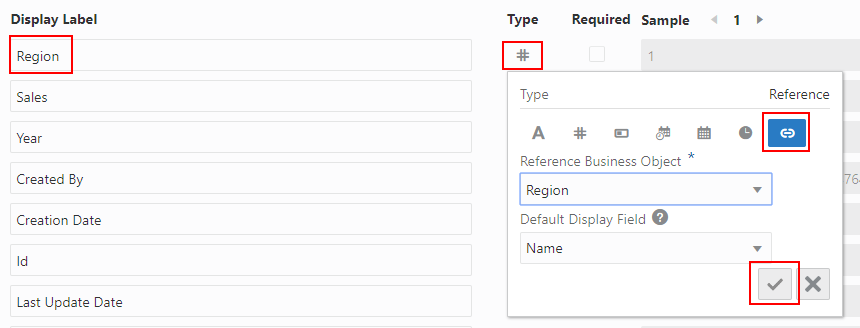

- Click **Finish**. The import will occur.

- In the Applying changes dialog click the **Close** button to complete the process.

  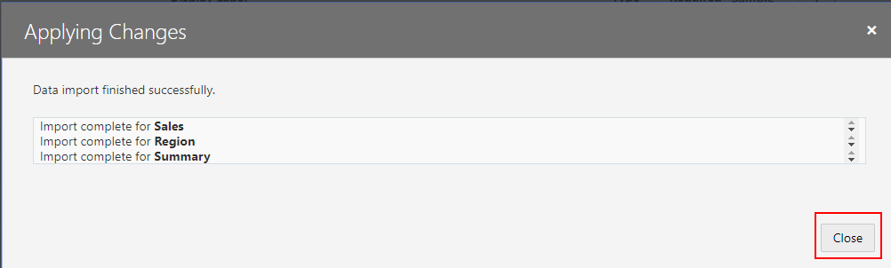

- Click the Business Objects **hamburger menu** and select **Diagram**. It will show the relationships you just defined.

  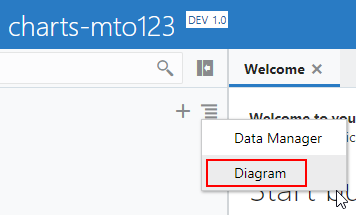

  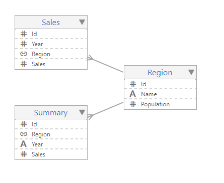

## Add a Bar Chart to the Application

### **STEP 1**: Add a Heading

- Click the **Web Applications Icon**.

  

- Expand **chartwebapp-->flows-->main** and click **main-start**.

  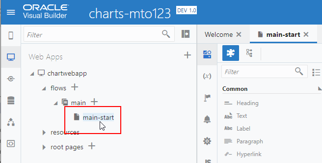

- In the Component Palette locate the **Heading** component under `Common` and drag it onto the Canvas.

  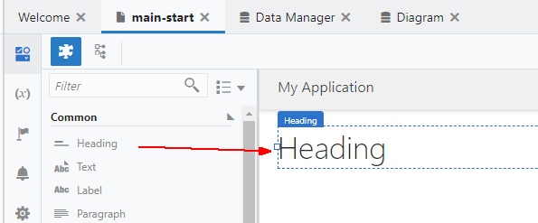

- In the `Heading` label properties change the text to:

  ```
  Summary
  ```

- ...and hit **enter/return** to see the changes take effect.

  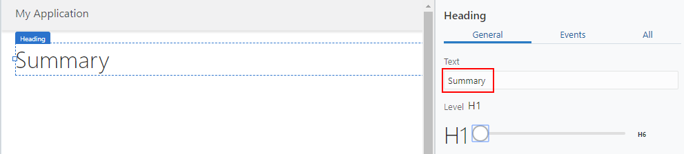

### **STEP 2**: Add a Bar Chart

- In the Component Palette scroll down to the chart section and drag a **Bar Chart** into the Canvas below the Heading. A default Bar Chart appears. Click **Add Data** to map a Business Object to the chart.

  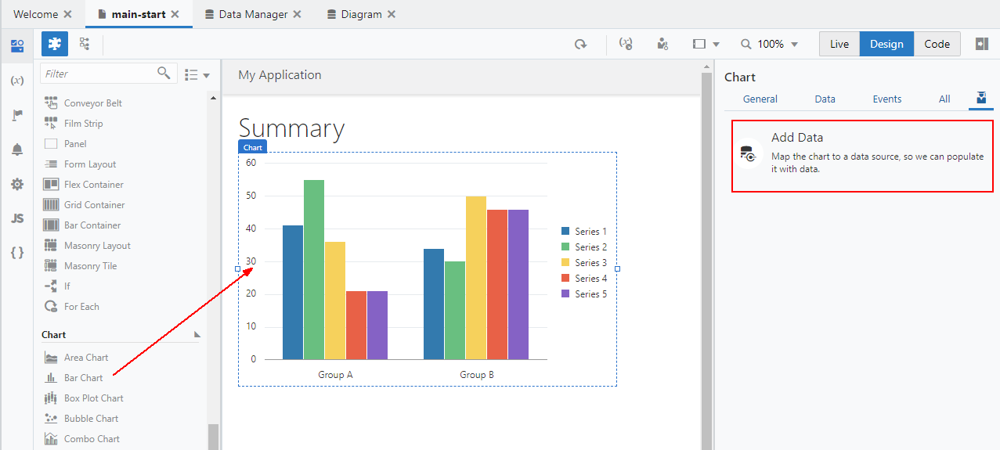
  
- On the `Locate Data` page click the **Summary** Business Object.

  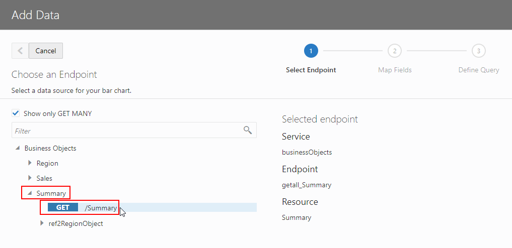

- Click **Next**.

- On the `Map Fields` page drag and drop the following:

  - **sales**-->Values (Y Axis)
  - **year**-->Categories (X Axis)

  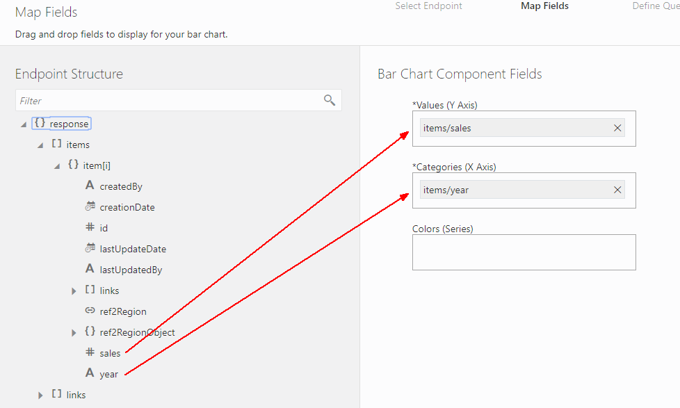

  - Expand the `ref2RegionObject` to **items-->item[i]**. Drag **name** to Colors (Series)

  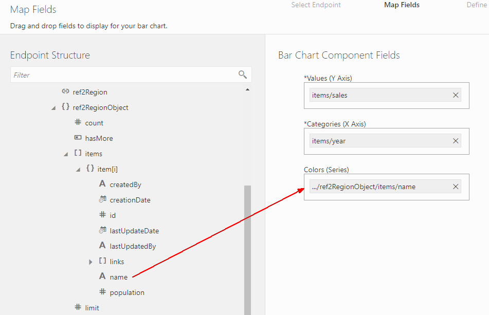

- Click **Next**. Then, on the `Define Query` page click **Finish**. The Summary Business Object's values are applied to the chart.

  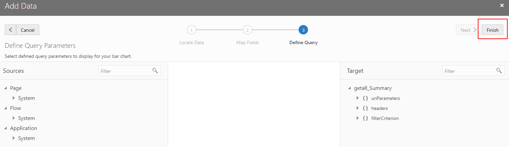

  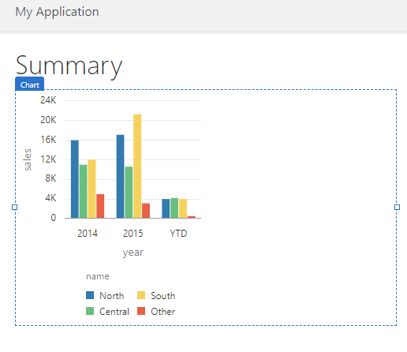

- With the Bar Chart selected click the **General** tab. Select or enter the following:

  - Legend, Title: **Regions**
  - Legend, Position (drop down): **End**
  - X Axis, Title: **Year**
  - Y Axis, Title: **Sales**

  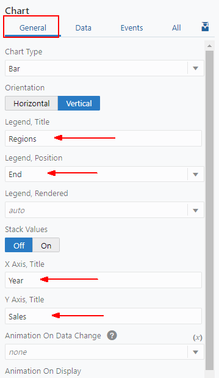

- The Bar Chart will now look like:

  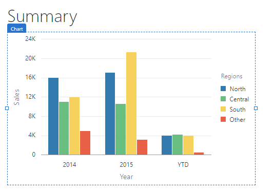

- From the `Component Palette` drag a **Label** between the Summary Header and the Bar Chart. You'll know it's between when you see a broken blue bar across the Canvas.

  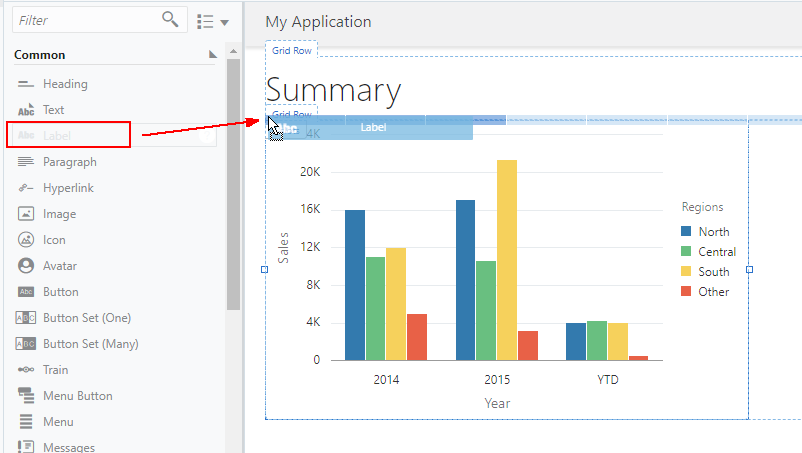 

- In the Label properties change the text field to:

  ```
  Sales by Region
  ```

- ... and hit **enter/return**.

  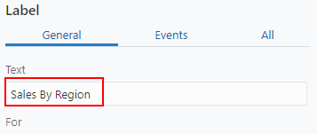

- The completed chart will look like:

  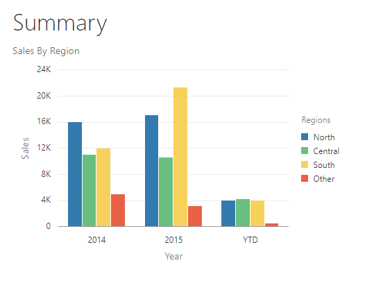

## Add an Area Chart to the Application

### **STEP 1**: Add the Area Chart

- In the Component Palette scroll down to the chart section and drag an **Area Chart** into the Canvas below the Bar Chart. A default Area Chart appears. Click **Add Data** to map a Business Object to the chart.

  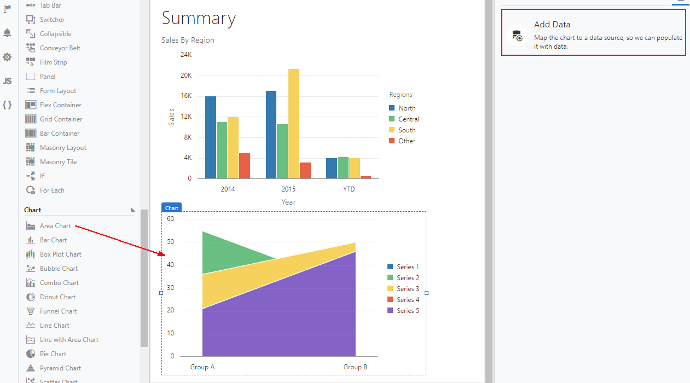

- On the `Locate Data` page click the **Sales** Business Object.

  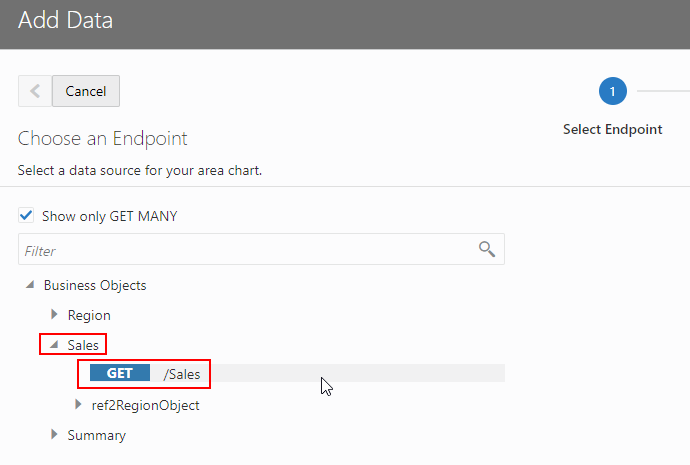

- Click **Next**.

- On the `Map Fields` page drag and drop the following:

  - **sales**-->Values (Y Axis)
  - **year**-->Categories (X Axis)

  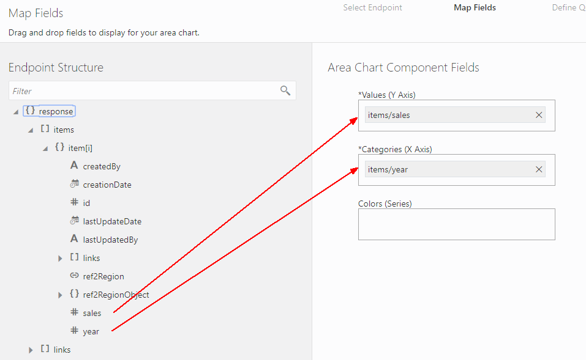

  - Expand the `ref2RegionObject` to **items-->item[i]**. Drag **name** to Colors (Series)

  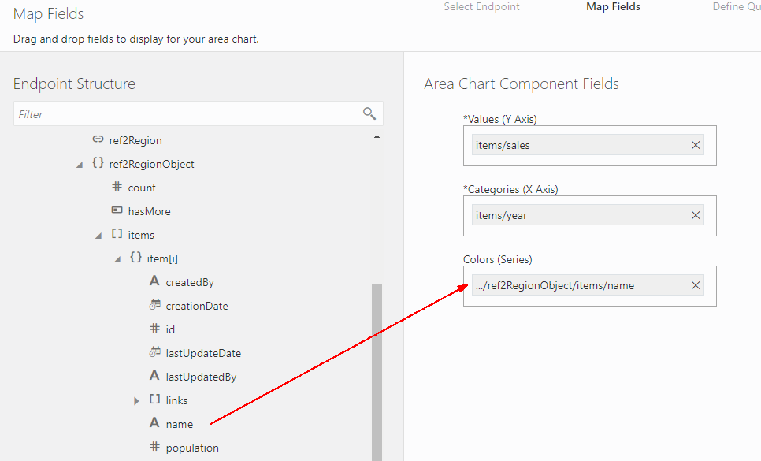

- Click **Next**. Then, on the `Define Query` page click **Finish**. The Sales Business Object's values are applied to the chart.

  

  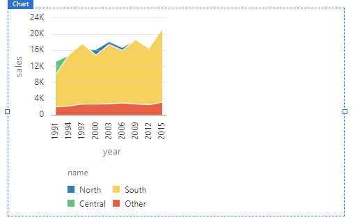

- With the Area Chart selected click the **General** tab. Select or enter the following:

  - Legend, Title: **Regions**
  - Style Defaults, Line Type (drop down): **Curved**
  - Stack Values: **On**
  - X Axis, Title: **Year**
  - Y Axis, Title: **Sales**

    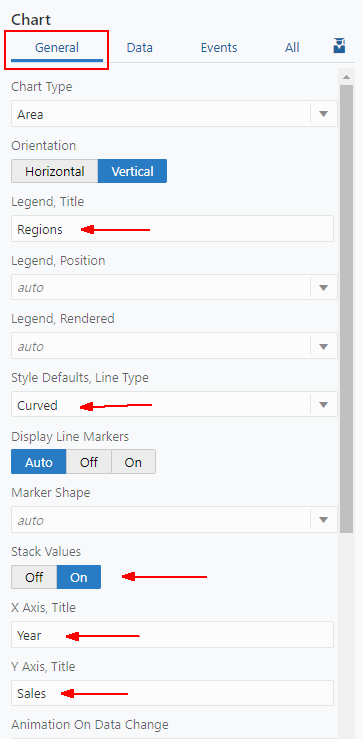

- The completed Area Chart will now look like:

  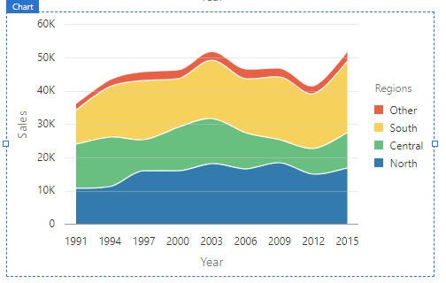

### **STEP 2**: Run the Application

- Click the **Run Application Arrow** on the main Visual Builder menu bar.

  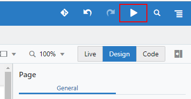

- The application will appear in a new browser tab:

  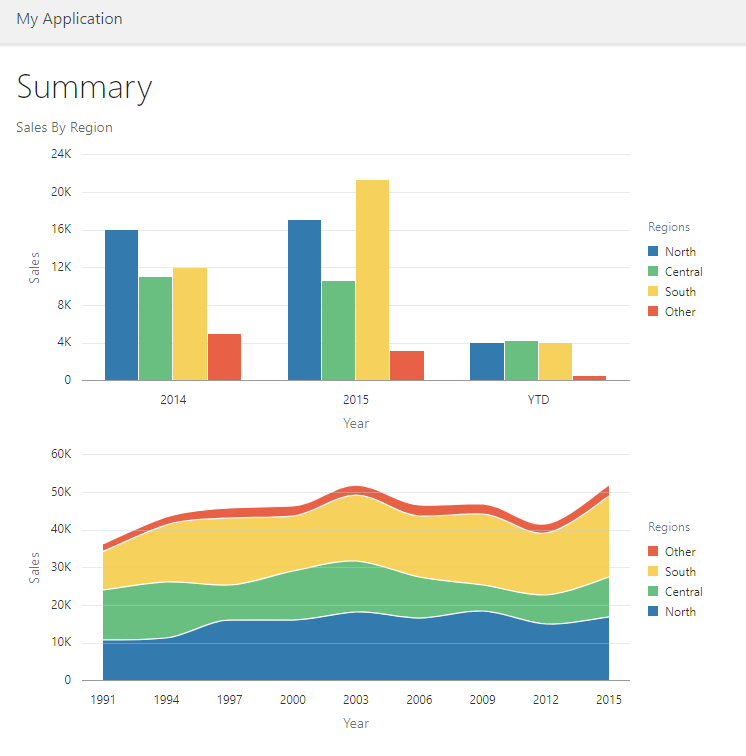 

# Where do I go from here?

If you would like to experience a more in-depth look at how Oracle Visual Builder can be used please go to the following: 

[Complete Visual Builder Workshop](https://go.oracle.com/LP=76343?src1=:ow:lp:cpo::RC_NAMK180712P00041:LPD100729372&intcmp=NAMK180921P00073:ow:lp:cpo::RC_NAMK180712P00041:LPD100729372)

**This completes the Demo Lab**
