# Pull the Docker image for the WebLogic and push to Oracle Cloud Infrastructure Registry (OCIR)

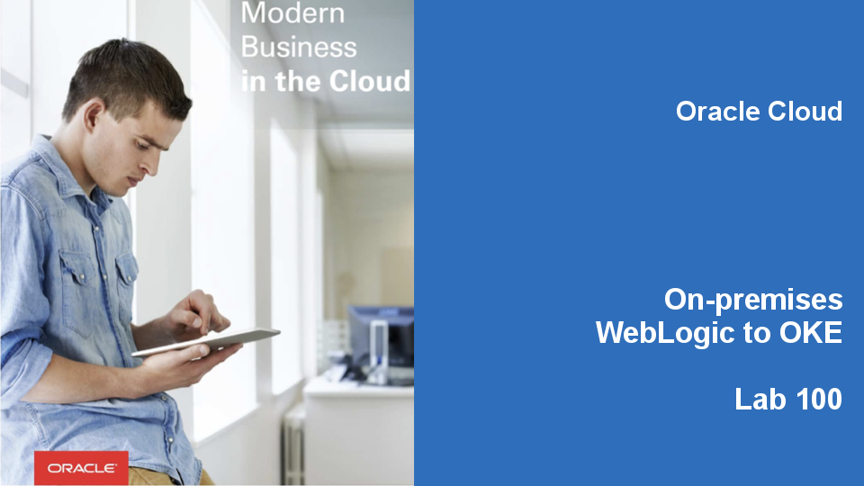
Updated: January 14, 2019

## Introduction

This tutorial is based on the official [Oracle WebLogic Kubernetes Operator](https://github.com/oracle/weblogic-kubernetes-operator/blob/master/site/user-guide.md) user guide.

To run the operator in a Kubernetes cluster, you need to build the Docker image and then deploy it to your cluster. The operator sources can be found on github.com and is built using Apache Maven. In this tutorial you can pull WebLogic Image and upload to Container Registry (OCIR) for later deployment:

**_To log issues_**, click here to go to the [github oracle](https://github.com/oracle/learning-library/issues/new) repository issue submission form.

## Objectives

- Setup Environment

## Required Artifacts

- [Oracle Cloud Infrastructure](https://cloud.oracle.com/en_US/cloud-infrastructure) enabled account.
- [Github](https://github.com/) account.
- [Docker](https://cloud.docker.com/login) account.

# Pull the Docker image for the WebLogic and push to Oracle Cloud Infrastructure Registry (OCIR)

## Setup Environment

### **STEP 1**: Log in to your Oracle Cloud Infrastructure (OCI)

- If you are using a Trial Account, **you must wait until you receive this email** indicating that your Cloud Account has been provisioned. _Please note that this email may arrive in your spam or promotions folder pending your email settings._

  

- Once you receive the **Get Started with Oracle Cloud** Email, make note of your **Username, Password and Cloud Account Name**.

  

- From any browser go to:

    [https://cloud.oracle.com/en_US/sign-in](https://cloud.oracle.com/en_US/sign-in)

- Enter your **Cloud Account Name** in the input field and click the **My Services** button. If you have a trial account, this can be found in your welcome email. Otherwise, this will be supplied by your workshop instructor.

  

- Enter your **Username** and **Password** in the input fields and click **Sign In**. If you have a trial account, these can be found in your welcome email. Otherwise, these will be supplied by your workshop instructor.

  

- You are presented with the Oracle Cloud Infrastructure (OCI) Dashboard/Portal

  

### **STEP 2**: Get Authentication Token to use Oracle Cloud Infrastructure Registry (OCIR)

- Once you logged in click your name on top-rigth corner and select **User Settings**. 

  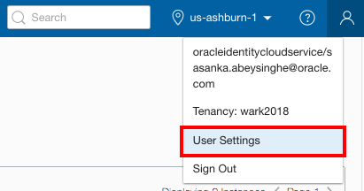

- Click Users
  
  

- You may see two users in the list, one that is named with just your email address, and another that is named `oracleidentitycloudservice`/your-email-address. **Choose the one that is named just your-email-address.**
  
  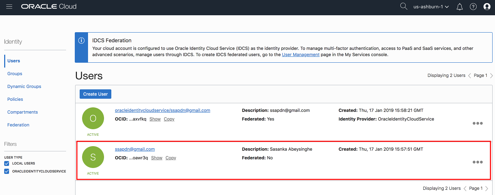

- On the user details page select **Auth Tokens** in the left menu. Click **Generate Token**.
  
   
  
-  Enter a friendly description for the auth token and click **Generate Token**.

  

- The new auth token is displayed. **Copy** the auth token immediately to a secure location from where you can retrieve it later, because you won't see the auth token again in the Console. **Close** the Generate Token dialog.

 

### **STEP 3**: Accept Licence Agreement to use Oracle WebLogic Server image from Docker Store

- If you have not used the base image [`Oracle WebLogic Server`](https://hub.docker.com/_/oracle-weblogic-server-12c) before, you will need to visit the [Docker Store web interface](https://hub.docker.com/_/oracle-weblogic-server-12c) and accept the license agreement before the Docker Store will give you permission to pull that image.

Open [https://hub.docker.com/_/oracle-weblogic-server-12c](https://hub.docker.com/_/oracle-weblogic-server-12c) in a new browser and click **Log In**.

- Enter your account details and click **Login**.
**Note:** If you don't already have one, obtain a Docker Store account, click Create Account.
  

- Click **Proceed to Checkout**.

- Complete your contact information and accept agreements. Click **Get Content**.

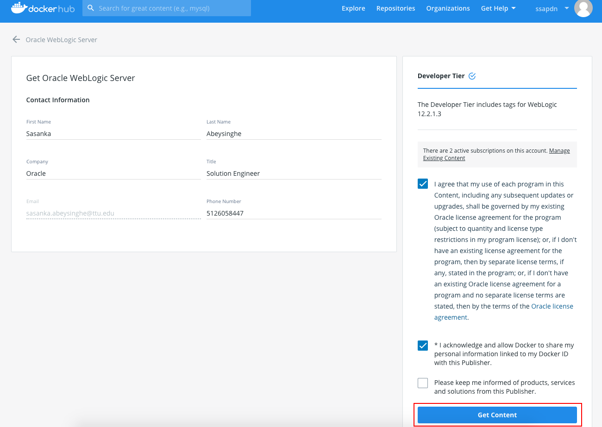

- Now you are ready to pull the  image on docker enabled host after authenticating yourself in Docker Hub using your Docker Hub credentials.

### **STEP 4**: Pull Docker images for the operator and push to Oracle Cloud Infrastructure Registry (OCIR)

In this step you will fork the tutorial's source repository. The source repository contains the demo application deployed on top of WebLogic server, configuration yaml to quickly create Oracle Container Pipelines(CI/CD) application to build custom WebLogic image and few additional Kubernetes configuration files to deploy the custom WebLogic image.

Open the [https://github.com/nagypeter/weblogic-operator-tutorial.git] repository in your browser. Click the **Fork** button at the left top area. Sign in to github.com if necessary.

Wait until the fork process is complete.

First create your Oracle Container Pipelines application. Oracle Container Pipelines acts as continuous integration tool which will produce WebLogic container image and uploads to Oracle Container Registry.

The following pipelines are predefined in the Oracle Container Pipelines configuration file ([wercker.yml](https://github.com/nagypeter/weblogic-operator-tutorial/blob/master/wercker.yml)):

- **build**: Default and mandatory pipeline to start the workflow. It builds the demo Web Application using Maven.
- **build-domain-in-home-image**: Pipeline which runs Docker build to create custom WebLogic container image. First time when no *latest* image available in repository it uses official WebLogic image from Docker Store as base image and runs WLST script to customise the image. Also copies the demo Web Application into the image and deploys using WLST. Once *latest* (tag) of the image is available in the repository then the workflow just builds the Web Application and update the *latest* image with the new application binaries. After the Docker build the pipeline produces a new image and pushes to the image repository. Thus every time when changes happen in the sources and committed to Github. The image tag will be the commit hash tag of the source changes  which triggered the new build process. Also the historically latest gets the *latest* tag as well.

[Sign in to Oracle Container Pipelines (former Wercker)](https://app.wercker.com/) and click **Create your first application** button or the **+** icon at the top right corner and select *Add Application*.

NOTE! If you need to sign up to Oracle Container Pipelines do it with your Github account. Click the **LOG IN WITH GITHUB** button and authorise Oracle Container Pipelines application for your Github account. You can revoke Oracle Container Pipelines's authorisation request anytime using your Github's profile settings.

Select the owner of the application. By default it is your Oracle Container Pipelines username, but it can be any organization where you belong to. Make sure the selected SCM is *GitHub*. Click **Next**.

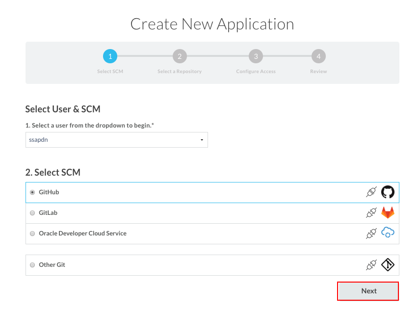

Select *weblogic-operator-tutorial* repository what you imported previously. Click **Next**.

Leave the default repository access without SSH key. Click **Next**.

If you want you can make your application public if you want to share the application's status otherwise leave the default private settings. Click **Create**.

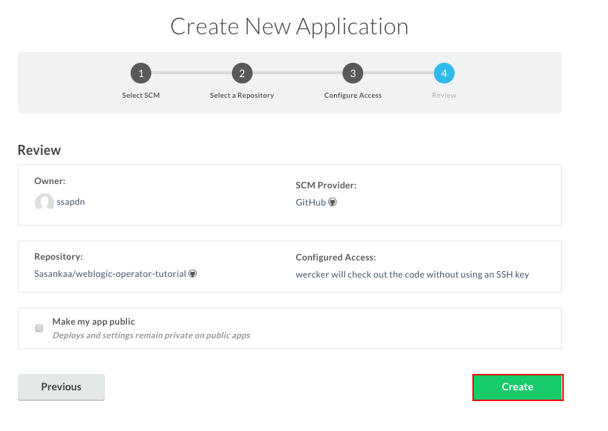

The repository already contains a necessary `wercker.yml` but before the execution provide the following key/value pairs:

| Key | Value | Note |
|----------------|---------------------------------------------------------------------------|------------------------------------------------------------------------------------------------------------------------------------------------------------------|
| OCI_REGISTRY_USERNAME | your_cloud_username |  The username what you note during user settings.  |
| OCI_REGISTRY_PASSWORD | OCIR Auth Token | The Auth Token you generated previously |
| TENANCY | Name of your tenancy |
| REGION | The code of your home region. See the [documentation](https://docs.cloud.oracle.com/iaas/Content/Registry/Concepts/registryprerequisites.htm#Availab) to get your region code. | e.g. `iad` - stands for *us-ashburn-1* `fra` - stands for *eu-frankfurt-1* |
| DOCKER_USERNAME | Your Docker Hub username | Necessary to pull official WebLogic Server image from Docker Store |
| DOCKER_PASSWORD | Your Docker Hub password | Necessary to pull official WebLogic Server image from Docker Store |

To define these variables click **<>Environment** tab and enter keys and values. Remember that these values will be visible to anyone to whom you give access to the Oracle Container Pipelines application, therefore select **Protected** for any values that should remain hidden, including all passwords.

Click the **Worklflow** tab and then **Add new pipeline** to enable pipeline defined in *wercker.yml*.

Enter the name of the pipeline and the "YML Pipeline Name" as *build-domain-in-home-image*. Please enter exactly this name - because this name is hardcoded in the *wercker.yml*. Click **Create**.

Click again the **Worklflow** tab to get back to the editor page. Click the + sign after the mandatory *build* pipeline.

Leave the default branch(es) configuration and select the *build-domain-in-home-image* pipeline.

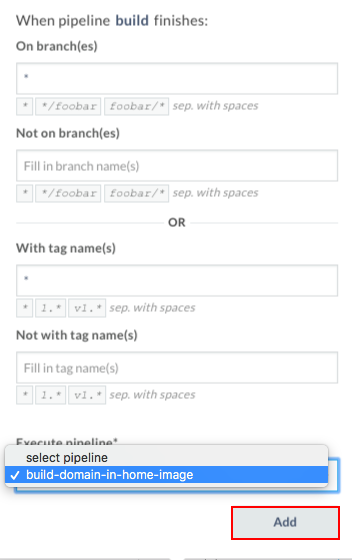

Your workflow should be similar:

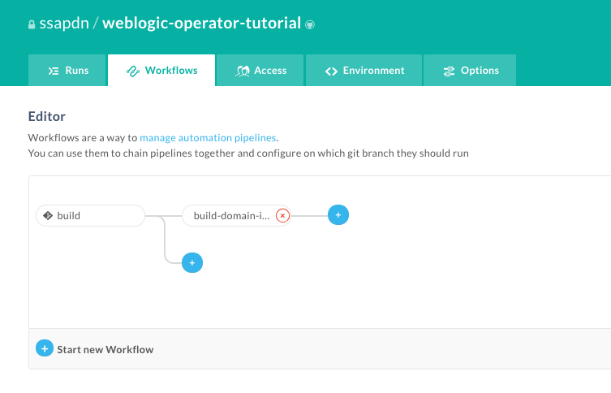

Go to the **Runs** tab and click ***trigger a build now*** link.

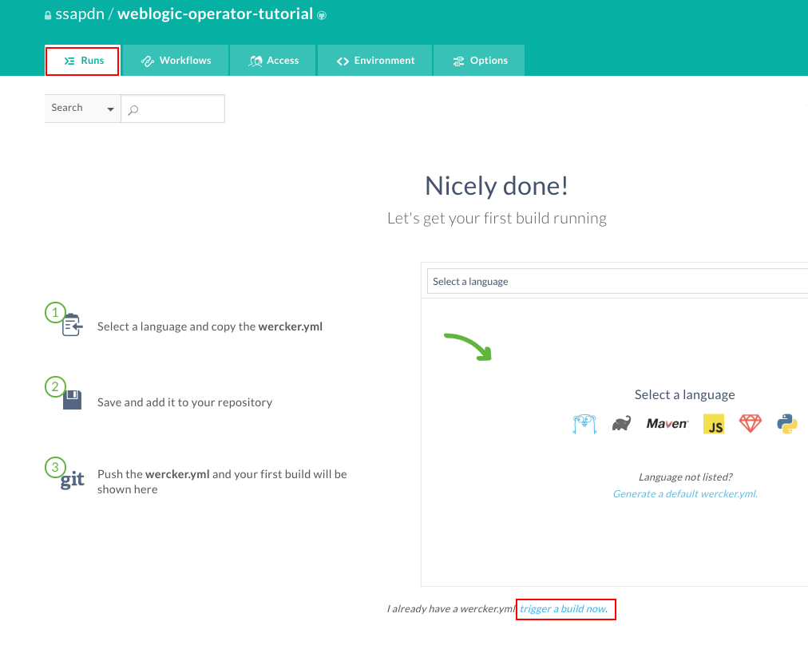

To get more details about the current step click on the pipeline.

When the workflow is completed the WebLogic image is available in your image repository.

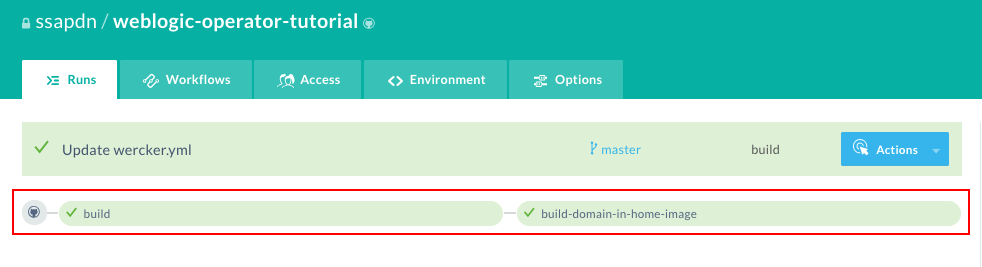

From the OCI Console navigation menu, select **Developer Services->Registry (OCIR)**.
  

In the registry you have to find a repository named like your Oracle Container Pipelines application (e.g. *weblogic-operator-tutorial*). If you open the repository for more details you  find two images. Technically the two images are the same, but got two tags. One of them is the git commit hash tag which is uniquely identify the image. The second *latest* tag applied because to have easier access to the historically latest release/image.

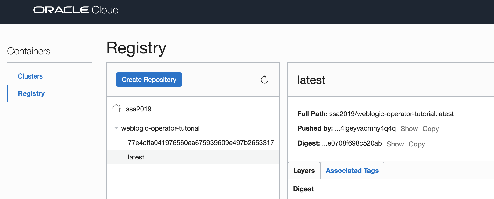

Now the WebLogic domain image is ready to deploy on Kubernetes using WebLogic Operator.

**You are now ready to move to the next lab: [Lab 200](LabGuide200.md)**