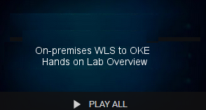

# On-premises WLS to OKE 

Welcome to the on-premises WLS to OKE workshop. This workshop will walk you through the process of moving an existing On-premises WebLogic application into to a Kubernetes cluster in the Oracle Public Cloud. 
To learn more about this workshop please watch the video below.

<a href="https://youtu.be/" target="_video">Workshop Overview</a>

### **Step 1**: Acquire an Oracle Cloud Trial or Workshop Account

- Bookmark this page for future reference.

- Please click on the following link to create your <a class="trial-link" href="https://myservices.us.oraclecloud.com/mycloud/signup?language=en&sourceType=:em:eo:ie:2t:RC_NAMK180921P00075:WLSonPrem_HOL" target="_trial">Free Account</a>, and complete all the required steps to get your free Oracle Cloud Trial Account. When you complete the registration process you'll receive a $300 credit that will enable you to complete the lab for free.  Additionally, you'll have 1000s of hours left over to continue to explore the Oracle Cloud.

  - Soon after requesting your trial you will receive the following email. 

  

### **Step 2**: Navigate to Lab 100

- _You can see a list of Lab Guides_ by clicking on the **Menu Icon** in the upper left corner of the browser window. You're now ready to continue with **Lab 100**.

  

  

**You are now ready to move to the next lab: [Lab 100](LabGuide100.md)**