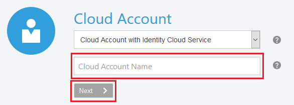

# Access an Oracle Cloud Platform Trial Account #

## Before You Begin ##
This 20-minute lab walks you through the steps of getting an Oracle Cloud Platform trial account and signing in.

### Background ###
Welcome to the Oracle University Zip Labs Challenge. Each lab is designed to build your familiairy with the Oracle Cloud Platform using step-by-step instructions. You'll need an Oracle Cloud Platform account to complete the labs. If you don't have one, follow these steps to get a free account. You earn 1 point for attempting this lab.

With access to the Oracle Cloud Platform, you can build production-ready workloads by using a variety of cloud services including Database, Compute, Blockchain, IoT, Big Data, API Management, Integration, Chatbots, and much more!

### What Do You Need? ###
* An email address you can access

## Create Your Account ##
In this section, you'll fill out the form located at [oracle.com/oow18trial](https://oracle.com/oow18trial)

1. Enter the appropriate information for Account Details. 
     * Remember the Cloud Account Name you select. You'll need it to sign into your account.
     * Use the same email address you used to register for Oracle Open World / Code One.
2. Because you've used the same email, the fields for the SMS Verification Code are no longer needed and disappear. 
     * Otherwise, enter your country, mobile number, and click the **Request Code** button. Within a few minutes, you should recieve a verification code. Enter the code in the appropriate field and click **Verify**.
3. Because you've used the same email, the fields for Credit Card Details are no longer needed and disappear.
     * Otherwise, enter credit card information. You will NOT be charged unless you elect to upgrade the account later. Click **Add Payment Method** when you are finished.
4. Read and agree to the Terms & Conditions by checking the box and click **Complete**.
5. Your account is partitioning. You'll recieve a confirmation email shortly. This email contains information you'll need to sign in to your account.

## Sign in to Your Account ##
1. Go to [cloud.oracle.com](https://cloud.oracle.com) and click **Sign In**.

    

    [Description of the illustration signin.png](files/signin.txt)

2. From the **Cloud Account** drop-down menu, select **Cloud Account with Identity Cloud Service**.
3. Enter your Cloud Account Name and click **Next**. This is the name you chose when you created your account in the previous section. If you forgot the name, see the confirmation email.

    

    [Description of the illustration accountname.png](files/accountname.txt)

4. Enter your Cloud Account credentials and click **Sign In**. Your username is the email address you used to sign up. Your password is auto-generated and is found in the confirmation email. You're asked to change this password when you sign in for the first time.

    
    
    [Description of the illustration username.png](files/username.txt)