# Loading Data into the Autonomous Database #

## Before You Begin ##
This 15-minute lab walks you through the steps to get load data from external databases into the Oracle Autonomous Data Warehouse (ADW) on Oracle Cloud Infrastructure (OCI). This lab assumes you have already provisioned an ADW instance.

### Background ###
You can load data into Autonomous Database using Oracle Database tools and 3rd party data integration tools. You can load data:

-   from files local to your client computer, or

-   from files stored in a cloud-based object store

For the fastest data loading experience Oracle recommends uploading the source
files to a cloud-based object store before loading the data into your Autonomous Database.

Today we will use the PL/SQL **DBMS_CLOUD** package. The DBMS_CLOUD package supports loading
data files from the following Cloud sources: 
1. Oracle Cloud Infrastructure Object Storage (OCI Object Storage)
2. Oracle Cloud Infrastructure Object Storage Classic
3. Amazon AWS S3

This tutorial shows how to load data from OCI Object
Storage using two of the procedures in the DBMS_CLOUD package:

-   `create_credential`: Stores the object store credentials in your Autonomous
    Database schema.

-   `copy_data`: Loads the specified source file to a table. 


### What Do You Need? ###
* Access to an instance of Oracle Autonomous Data Warehouse (ADW)


## Load a data file to your Object Store ##
Oracle Cloud Infrastructure offers two distinct storage class tiers.  Object Storage, for data which you need fast, immediate and frequent access and Archive Storage, for data which you seldom or rarely access.  In this ziplab you will stage data into an object store in the Oracle Cloud Infrastructure Object Storage service.

1.  Log in to your Oracle Cloud Infrastructure Console

2.  Select **Object Storage** -> **Object Storage** from the drop down menu on the top left of the Oracle Cloud Infrastructure console


3.  Select **Create Bucket** to create a bucket to load your data in.  This will be your staging area.  Later in this lab you will move the data from this staging area to your ADW instance.
For this lab, we'll use the `root` compartment.
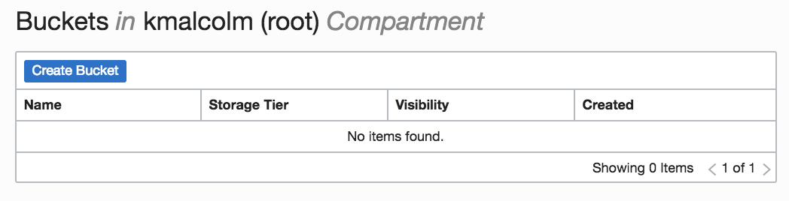

4.  Enter the following information: 
    * **Bucket Name**:  `bucket-<city you were born in>-<your initials>`  (example: *bucket-london-kam*)
    * **Storage Tier**:  `Standard`
     * **Encryption**: `Encrypt using Oracle Managed Keys`

     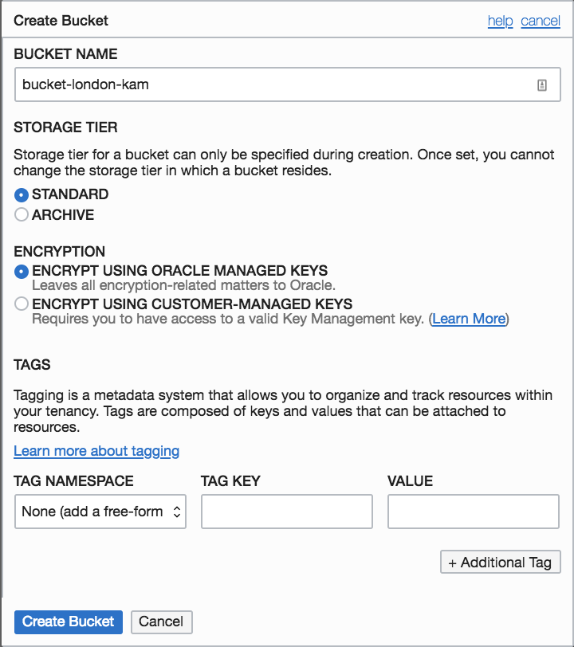

5. Click **Create Bucket**.

6.  Click on the bucket name you just created.  

    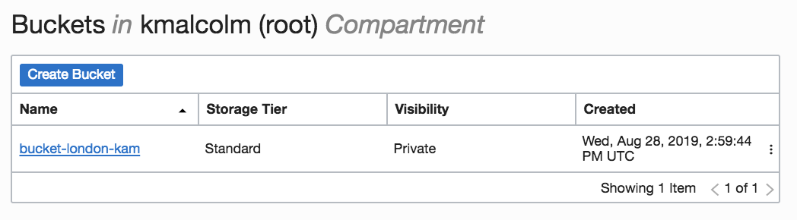

7. Review the screen. Note you have created an empty bucket with no objects in it and the visibility is set to private. 


8.  Click [here](https://www.oracle.com/webfolder/technetwork/tutorials/obe/cloud/adwc/OBE_Loading%20Your%20Data/files/datafiles_for_sh_tables.zip) to download the zip file with your objects.  Open up your file browser and extract the zip file.

9.  Click **Upload Object** to begin selecting the data files to upload to the bucket.  Click on **select files** to choose your extracted data files.
    


10.  **Select the data file** `channel.dat` and click **ok**

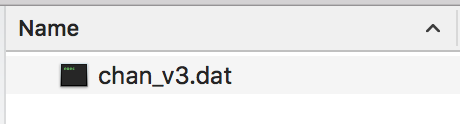

11.  Click **Upload Objects** to load.   


    Please be patient, this may take a few seconds to complete.
  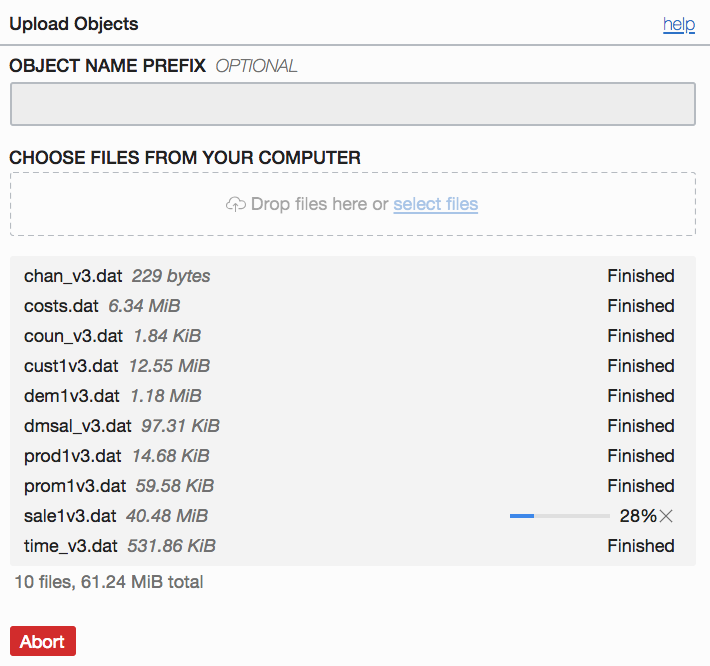

Once complete, verify all *.dat files have a status of *`Finished`* and click **Close**.
  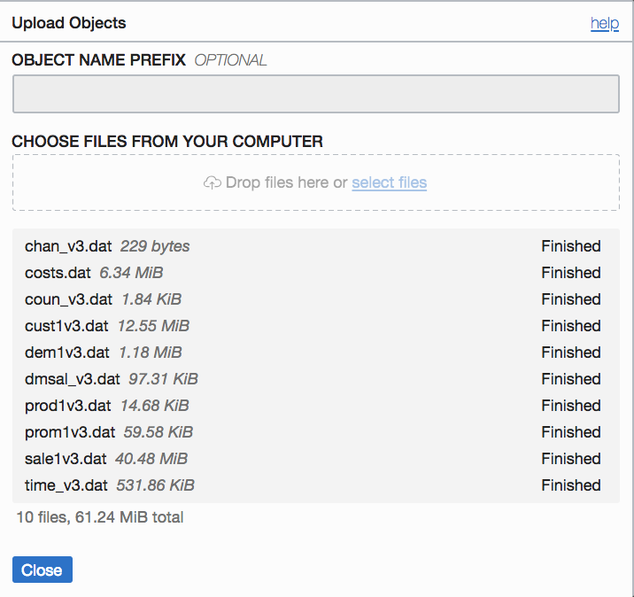

12. Your bucket should have 1 object, the chan_v3.dat file loaded.  If this were a true data load, you may be loading hundreds of large files here.


12.  The final step will be to change the visibility of your bucket. Click the **Edit Visibility** button at the top of your Bucket Details screen.
    
     

13. Change the visibility to **Public**, accept all other defaults.  Click **Save Changes**

    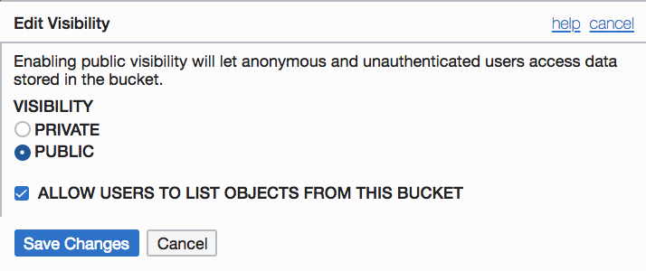  

14. Your bucket should now be visible and public.  Verify and proceed to setting up your Auth token.
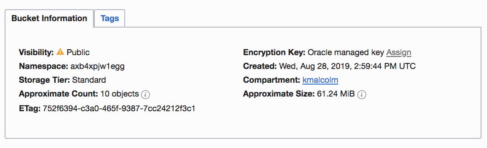  


## Create an Object Store Auth Token##

To load data from the OCI object store, you need to create an Auth Token for your object store account. The
communication between your Autonomous Database and the object store relies on this Auth Token and username/password authentication.

1.  If you have logged out of Oracle Cloud Infrastructure Object Storage, please log back in.

2.  From the menu on the top left select **Identity->Users**. Once on the Users Page click on your username
 

3.  Select your username.  Click **Auth Tokens** under **Resources** on the left of the console.
 
 

4.  Click **Generate Token**.
 

5.  A pop-up dialog appears. Set the Auth Token by performing the following
    steps:

    -   In the pop-up dialog, enter a description.
     

    -   Click the **Generate Token** button.
    

    -   Copy the generated token to a text file. The token does not appear again and you WILL NEED this token to load your data into ADW.

    -   Click **Close**.


## Create Object Store Credentials in your Autonomous Database##

Now that you have created an object store Auth Token, its time to store the credentials of the object store in ADW instance.

1.  Let's navigate to SQL Developer web to prepare your ADW instance for the staged data.  
Go back to your ADW instance via the menu.


2.  Click on the ADW instance you created in a previous exercise and verify it is still running.
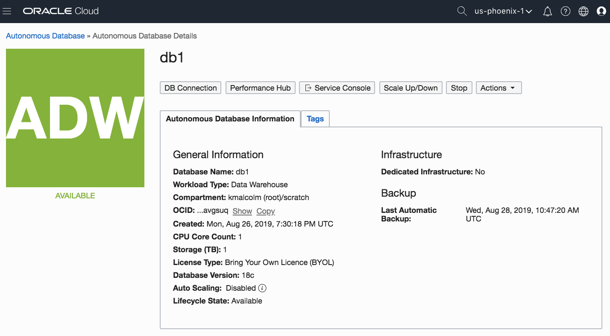

3.  Click on **Service Console**.  If the service console does not open a new tab, ensure pop up blocker is turned off for your browser.  Click on **Development** to access the developer tools for ADB.


4.  Click on **SQL Developer Web**.
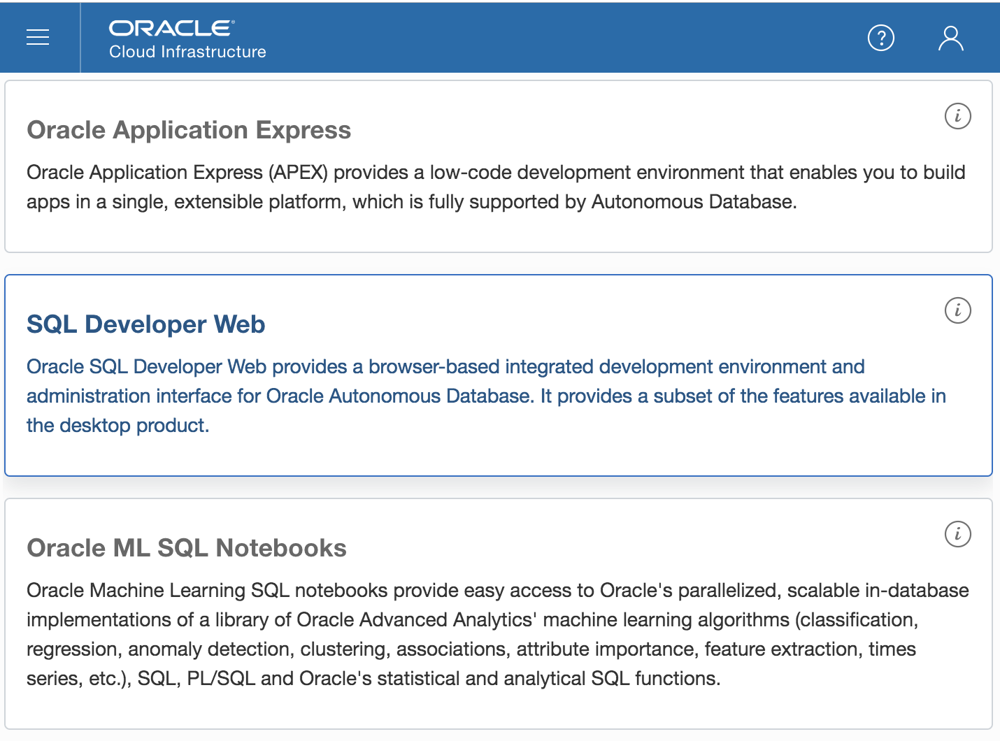

5.  Enter your database admin username from the previous exercise and login to your ADW instance.
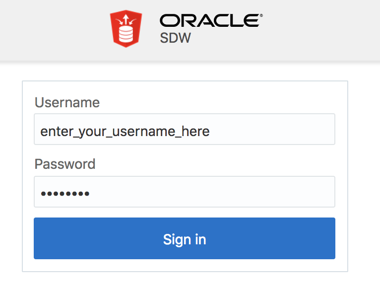

6. SQL Developer Web has an interface similar to the installed client.  Note where the Worksheet is and the Query Results.
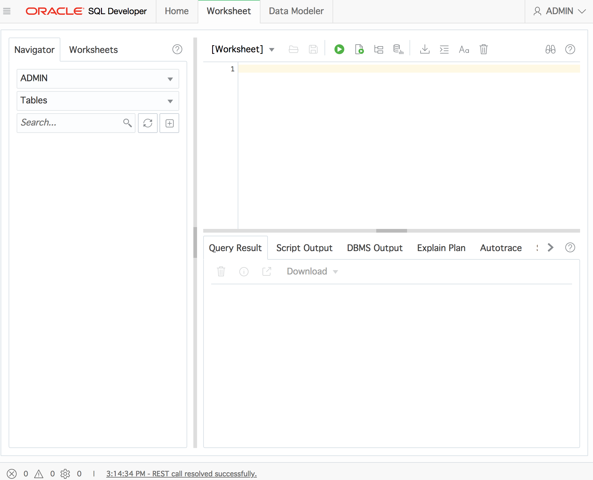

7.   In a SQL Developer worksheet, use the create_credential procedure of the DBMS_CLOUD package to store the object store credentials in your database.  This pl/sql procedure takes in the following arguments:
*  credential name
- Oracle cloud username
- Authorization token created earlier

    Copy the pl/sql procedure below and fill in the username and password.  
    ```
    begin  
    DBMS_CLOUD.create_credential (  
    credential_name => 'OBJ_STORE_CRED',  
    username => '<your username\>',  
    password => '\<your Auth Token\>'  
    ) ;  
    end;  
    /
    ```


8.  Press the green arrow to run the worksheet.  Once the correct information is entered, you should get a message that the ``PL/SQL procedure completed``


9.  Your object store's credentials are stored in
your ADW instance now.  

## Copy Data from Object Store to Autonomous Database Tables##

Before data is copied, the tables and objects need to be created in ADW.  In this lab you will create the target objects.

1. Copy the sql script below to create the CHANNEL table.
````
CREATE TABLE channels (
channel_id NUMBER NOT NULL,
channel_desc VARCHAR2(20) NOT NULL,
channel_class VARCHAR2(20) NOT NULL,
channel_class_id NUMBER NOT NULL,
channel_total VARCHAR2(13) NOT NULL,
channel_total_id NUMBER NOT NULL);
````
2. Paste it in your SQL Developer Web worksheet area overwriting any existing commands.


3.  Select the entire script and press the green play button.


4. Once the script has run review the output to ensure the table has been created successfully.  You should see the CHANNEL table created and altered.


5.  Issue a select statement to see if there are any objects in your table.  Your table should be empty.
    ````
    select * from CHANNELS;
    ````
    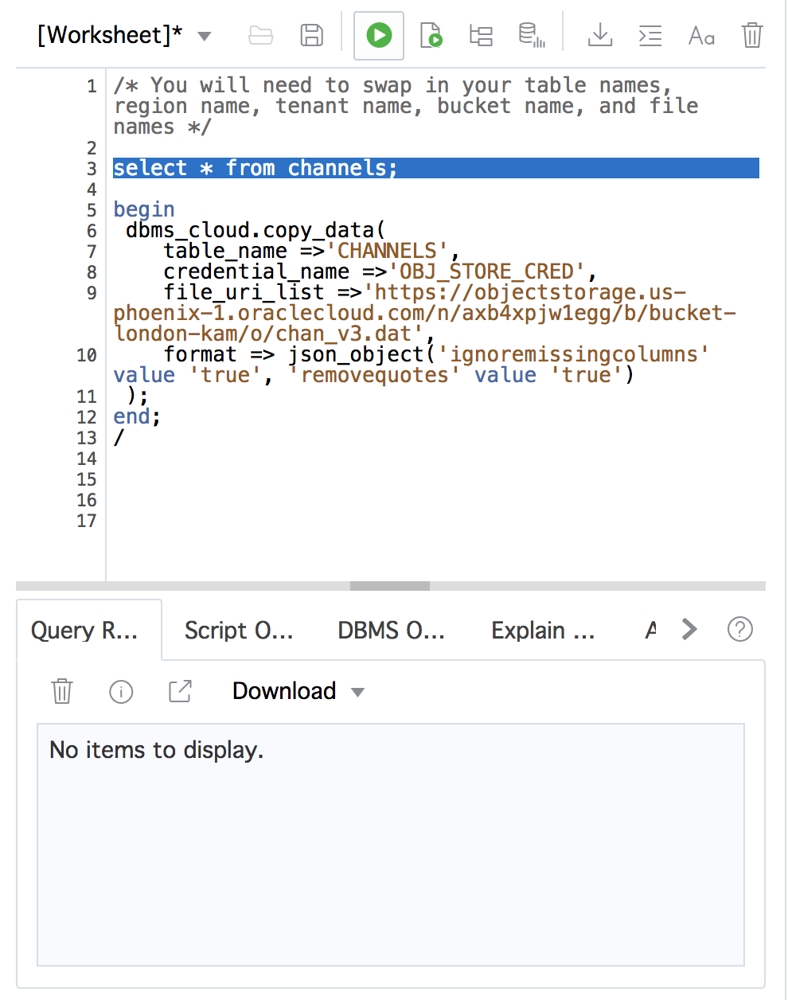

6.  Now that you have created the CHANNEL table in your ADW instance, it's time to copy the data from the staging area (OCI Object Storage) to ADW.  Copy the pl/sql below and paste it into the SQL Worksheet window.  Do NOT press play yet.
    ````
    begin
    dbms_cloud.copy_data(
        table_name =>'CHANNELS',
        credential_name =>'OBJ_STORE_CRED',
        file_uri_list =>'https://swiftobjectstorage.<region name>.oraclecloud.com/v1/<tenant name>/tutorial_load_adwc/chan_v3.dat',
        format => json_object('ignoremissingcolumns' value 'true', 'removequotes' value 'true')
    );
    end;
    /
    ````
    

7. The arguments for the dbms_cloud.copy_data procedure that may change when you are using this procedure are `table_name` and `file_uri_list`. File_uri_list points to the location of the datafile in your object store.  You will need to go back to your Oracle Cloud tab to obtain this information.

    ````
    file_uri_list =>'https://swiftobjectstorage.<region name>.oraclecloud.com/v1/<tenant name>/tutorial_load_adwc/chan_v3.dat'
    ````
8. Select **Object Storage->Object Storage** from the menu.  Select your bucket. 


8.  In the objects section, locate your data file.  Click on the three dots on the right to **View Object Details**
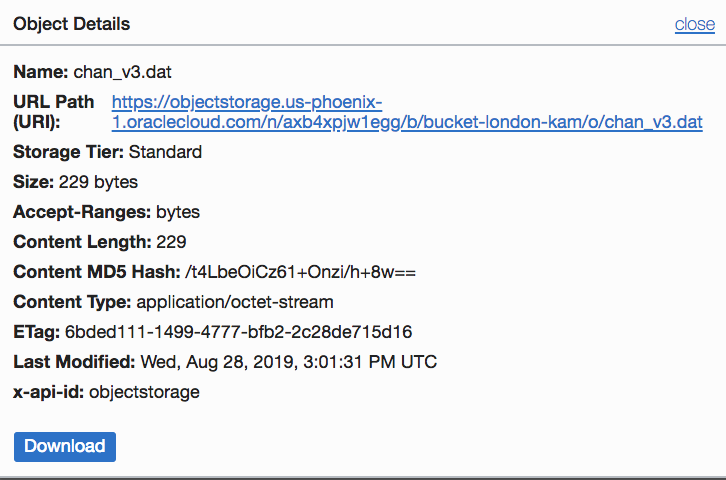

9. Copy the URL Path by pressing `<CTRL-C>`.  

10. On the SQL Worksheet tab replace the file_uri_list with the URL Path you copied.
    

11. Highlight the pl/sql block and press the green play button
    


11. In the Script Output, once you see the message `PL/SQL procedure successfully completed.`, highlight the ````select * from channels;```` statement again.  Success! Notice that the data has been copied from hte object store to the tables in your ADW instance.

    

This can be done for multiple tables providing an easy migration path from your existing databaset to Autonomous Database.

## Want to Learn More? ##
* [Autonomous Cloud Platform Courses](https://learn.oracle.com/pls/web_prod-plq-dad/dl4_pages.getpage?page=dl4homepage&get_params=offering:35573#filtersGroup1=&filtersGroup2=.f667&filtersGroup3=&filtersGroup4=&filtersGroup5=&filtersSearch=) from Oracle University 
* [Autonomous Data Warehouse Cloud Certification]((https://education.oracle.com/en/data-management/autonomous-database/product_817?certPage=true) from Oracle University
* [ADW Test Drive Workshop](https://oracle.github.io/learning-library/workshops/journey4-adwc/?page=README.md)


