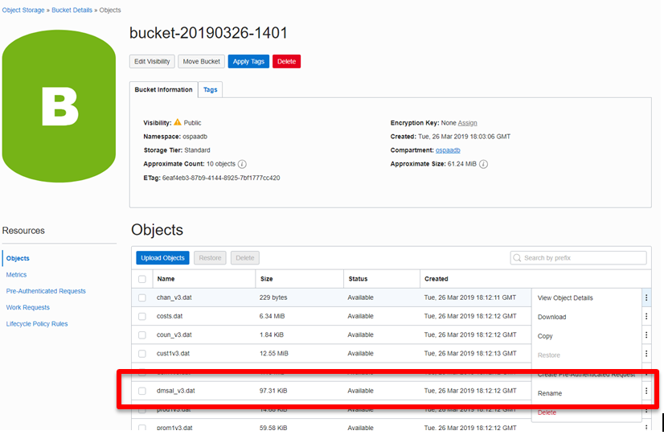
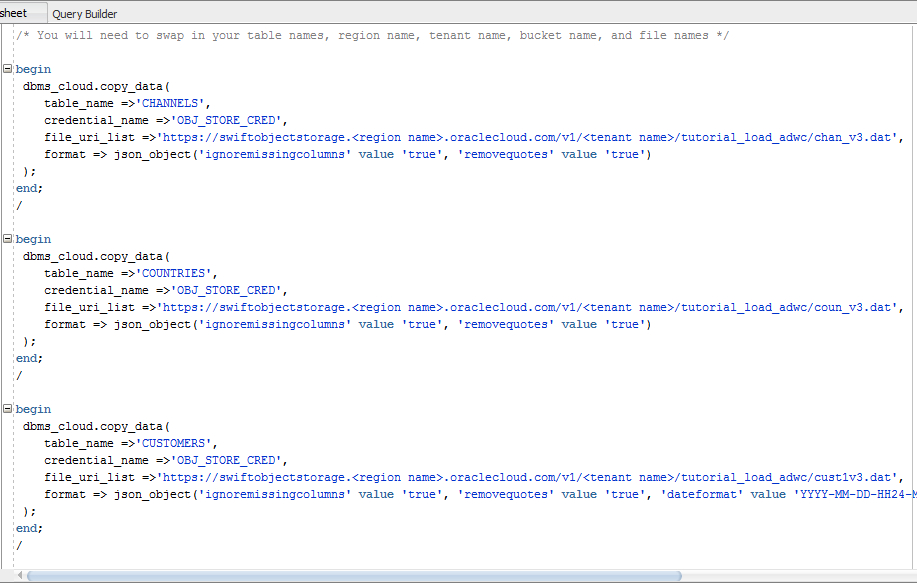

# Loading Data into the Autonomous Database #

## Before You Begin ##
This XX-minute lab walks you through the steps to get load data from external databases into the Oracle Autonomous Data Warehouse (ADW) on Oracle Cloud Infrastructure (OCI). This lab assumes you have already provisioned an ADW instance.

### Background ###
You can load data into Autonomous Database using Oracle Database tools, and
Oracle and 3rd party data integration tools. You can load data:

-   from files local to your client computer, or

-   from files stored in a cloud-based object store

For the fastest data loading experience Oracle recommends uploading the source
files to a cloud-based object store, such as Oracle Cloud Infrastructure Object
Storage, before loading the data into your Autonomous Database.

To load data from files in the cloud into your Autonomous Database database, use
the new PL/SQL **DBMS_CLOUD** package. The DBMS_CLOUD package supports loading
data files from the following Cloud sources: Oracle Cloud Infrastructure Object
Storage, Oracle Cloud Infrastructure Object Storage Classic, and Amazon AWS S3.

This tutorial shows how to load data from Oracle Cloud Infrastructure Object
Storage using two of the procedures in the DBMS_CLOUD package:

-   create_credential: Stores the object store credentials in your Autonomous
    Database schema.

    -   You will use this procedure to create object store credentials in your
        Autonomous Database  adwc_user schema that you defined in a previous
        tutorial.

-   copy_data: Loads the specified source file to a table. The table must
    already exist in Autonomous Database.

    -   You will use this procedure to load tables in the adwc_user schema with
        data from data files staged in the Oracle Cloud Infrastructure Object
        Storage cloud service.

    -   This tutorial shows how to load data to SH tables (sales history tables
        from an Oracle sample schema: SALES, COSTS, TIMES, PRODUCTS, CHANNELS,
        PROMOTIONS, CUSTOMERS, COUNTRIES, SUPPLEMENTARY_DEMOGRAPHICS).

    -   For more information about loading data, see the documentation [Loading
        Data from Files in the
        Cloud](https://www.oracle.com/pls/topic/lookup?ctx=en/cloud/paas/autonomous-data-warehouse-cloud&id=CSWHU-GUID-07900054-CB65-490A-AF3C-39EF45505802).


### What Do You Need? ###
* Access to an instance of Oracle Autonomous Data Warehouse (ADW)


## Load data files to your Object Store ##
Oracle Cloud Infrastructure offers two distinct storage class tiers.  Object Storage, for data which you need fast, immediate and frequent access and Archive Storage, for data which you seldom or rarely access.  In this ziplab you will load data into an object store in the Oracle Cloud Infrastructure Object Storage service.

1.  Log in to your Oracle Cloud Infrastructure Console

2.  Select **Object Storage** -> **Object Storage** from the drop down menu on the top left of the Oracle Cloud Infrastructure console


3.  Select **Create bucket** to create a bucket to load your data in.  This will be your staging area.  Later in this lab you will move the data from this staging area to your ADW instance.
For this lab, we'll use the `root` compartment.


4.  Enter the following information: 
    * **Bucket Name**:  `bucket-[city you were born in]-[your initials]`  (example *bucket-london-kam*)
    * **Storage Tier**:  `Standard`
     * **Encryption**: `Encrypt using Oracle Managed Keys`

     

5. Click **Create Bucket**.

6.  Click on the bucket name you just created.  

    

7. Review the screen. Note you have created an empty bucket with no objects in it and the visibility is set to private. 


8.  Click [here](https://www.oracle.com/webfolder/technetwork/tutorials/obe/cloud/adwc/OBE_Loading%20Your%20Data/files/datafiles_for_sh_tables.zip) to download the zip file with your objects.  Open up your file browser and extract the zip file.

9.  Click **Upload Object** to begin selecting the data files to upload to the bucket.  Click on **select files** to choose your extracted data files.
    


10.  **Select all the files** in the extracted folder and click **ok**


11.  Click **Upload Objects** to load.   

Please be patient, this may take a few seconds to complete.

Once complete, verify all *.dat files have a status of *`Finished`* and click **Close**.


12. Your bucket should have 10 objects loaded.


12.  The final step will be to change the visibility of your bucket. Click the **Edit Visibility** button at the top of your Bucket Details screen.
  

13. Change the visibility to **Public**, accept all other defaults.  Click **Save Changes**
  

14. Your bucket should now be visible and public.  Verify and proceed to setting up your Auth token.
  


## Create an Object Store Auth Token
---------------------------------

To load data from the OCI object store, you need to create an Auth Token for your object store account. The
communication between your Autonomous Database and the object store relies on this Auth Token and username/password authentication.

1.  If you have logged out of Oracle Cloud Infrastructure Object Storage, pleasae log back in.

2.  From the menu on the top left select Identity and users. Once on the Users
    Page click on your username


<p align="center">Figure 2-1</p>

3.  Click **Auth Tokens** under **Resources** on the left of the console.


<p align="center">Figure 2-2</p>

4.  Click **Generate Token**.


<p align="center">Figure 2-3</p>

5.  A pop-up dialog appears. Set the Auth Token by performing the following
    steps:

    -   In the pop-up dialog, enter a description.

    -   Click the **Generate Token** button.

    -   Copy the generated token to a text file. The token does not appear again
        and you WILL NEED this token.

    -   Click **Close**.


<p align="center">Figure 2-4</p>

6. Enter description and click Generate Token


<p align="center">Figure 2-5</p>

7. Copy the generated token, save into a text file, the token will not be displayed again


## Create Object Store Credentials in your Autonomous Database
-----------------------------------------------------------

Now that you have created an object store Auth Token, store in your Autonomous database the credentials of the object store in which your data is staged.

1.  Open SQL Developer and connect to your Autonomous Database as user admin
    with the connection you created in the Connecting to ADB Lab

2.  In a SQL Developer worksheet, use the create_credential procedure of the
    DBMS_CLOUD package to store the object store credentials in your database

    -   Create a credential name. You reference this credential name in the
        copy_data procedure in the next step.

    -   Specify the credentials for your Oracle Cloud Infrastructure Object
        Storage service: The username is your Oracle Cloud Login and the object
        store Auth Token you generated in the previous step.

```
begin  
   DBMS_CLOUD.create_credential (  
   credential_name =\> 'OBJ_STORE_CRED',  
   username =\> '\<your username\>',  
   password =\> '\<your Auth Token\>'  
   ) ;  
end;  
/
```


<p align="center">Figure 3-1</p>


After you run this script, your object store's credentials are stored in
your Autonomous Database.

## Copy Data from Object Store to Autonomous Database Tables
---------------------------------------------------------

The copy_data procedure of the DBMS_CLOUD package requires that target tables
must already exist in in your Autonomous database. To create the appropriate
tables, run the code below in SQL Developer.

1. Copy and paste all this code into the SQL worksheet window in SQL Developer Web.


Running the create statements and results will look like this in SQL Developer.


<p align="center">Figure 4-1</p>

Now run the copy_data procedure to copy the data staged in your object store to
your Autonomous Database tables. 

In a SQL Developer worksheet, use the copy_data procedure of the DBMS_CLOUD
package to copy the data staged in your object store.

For credential_name, specify the name of the credential you defined in the
Create Object Store Credentials earlier.

For file_uri_list, specify the URL that points to the location of the file
staged in your object store. See screenshots below for how to obtain this.

[Click
here](https://www.oracle.com/webfolder/technetwork/tutorials/obe/cloud/adwc/OBE_Loading%20Your%20Data/files/data%20loading%20script.txt)
for an example script. In the script, the only line you need to change for each
table is the file_uri_list parameter IF the credential you created is called
OBJ_STORE_CRED. If you called your credential a different name, you also need to
change the credential_name line.

To obtain the file_uri_list for each file you want to load, go to your storage
bucket (as described above when you created it), and for each object to load,
click on the 3 dots to the right and select, View Object Details:


<p align="center">Figure 4-2</p>

The object details windows appears, copy the URL Path (URI), then past this on
the corresponding dbms_cloud.copy_data statement as shown below


<p align="center">Figure 4-3</p>

2. Below is an example of what your statement should look like when you run it, filled in with your information instead. Remember, one statement per table being loaded.

```
begin
dbms_cloud.copy_data(table_name =\>'CHANNELS',credential_name=\>'OBJ_STORE_CRED',
file_uri_list=\>'https://objectstorage.us-ashburn-1.oraclecloud.com/n/ospaadb/b/bucket-20190326-1401/o/chan_v3.dat',format =\> json_object('ignoremissingcolumns' value 'true', 'removequotes' value 'true')
);
end;
/
```


<p align="center">Figure 4-4</p>

[](https://www.oracle.com/webfolder/technetwork/tutorials/obe/cloud/adwc/OBE_Loading%20Your%20Data/files/data_loading_script.txt)

3. After you run the procedure, observe that the data has been copied from the
object store to the tables in your Autonomous database by clicking the table
name in SQL Developer


<p align="center">Figure 4-5</p>

[Back to Top](#table-of-contents) 

## Module 5:  Confirm Your Data Loads
----------------------

All data load operations done using the PL/SQL package DBMS_CLOUD are logged in
the tables dba_load_operations and user_load_operations. These tables contain
the following:

-   dba_load_operations: shows all load operations.

-   user_load_operations: shows the load operations in your schema.
1. Query these tables to see information about ongoing and completed data
    loads. For example:

```
SELECT table_name, owner_name, type, status, start_time, update_time,  
logfile_table, badfile_table
FROM user_load_operations WHERE type = 'COPY';
```

2.  Examine the results. The log and bad files are accessible as tables:

TABLE_NAME STATUS ROWS_LOADED LOGFILE_TABLE   BADFILE_TABLE  
---------- ------------ ----------- -------------   -------------  
  CHANNELS FAILED COPY\$1_LOG      COPY\$1_BAD  
 CHANNELS COMPLETED 5   COPY\$2_LOG COPY\$2_BAD

## Want to Learn More? ##
* [Autonomous Cloud Platform Courses](https://learn.oracle.com/pls/web_prod-plq-dad/dl4_pages.getpage?page=dl4homepage&get_params=offering:35573#filtersGroup1=&filtersGroup2=.f667&filtersGroup3=&filtersGroup4=&filtersGroup5=&filtersSearch=) from Oracle University 
* [Autonomous Data Warehouse Cloud Certification]((https://education.oracle.com/en/data-management/autonomous-database/product_817?certPage=true) from Oracle University
* [ADW Test Drive Workshop](https://oracle.github.io/learning-library/workshops/journey4-adwc/?page=README.md)


