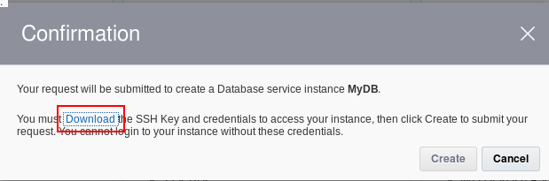

# Developing a Business Application by Using Oracle Visual Builder Cloud Service #

## Before You Begin ##

This tutorial shows you how to quickly develop a business app by using Oracle Visual Builder Cloud Service. This tutorial takes approximately 20 minutes to complete.

### Background ###

Oracle Visual Builder Cloud Service is a visual development tool for creating web and mobile apps by simply dragging and dropping user interface (UI) components onto a page. 

### What Do You Need? ###

* Access to an instance of Oracle Visual Builder Cloud Service

## Log In to Oracle Visual Builder Cloud Service ## 

1. In a web browser, go to [https://cloud.oracle.com/home](https://cloud.oracle.com/home) and click **Sign In**.
2. From the **Cloud Account** drop-down menu, select **Cloud Account with Identity Cloud Service**.
3. Enter your Cloud Account Name and click **My Services**.
4. Enter your cloud account credentials and click **Sign In**.
5. If Database and Visual Builder Cloud Service aren't listed on the dashboard, click **Customize Dashboard**.
6. Select **Show** for **Database** and for **Visual Builder** and close the dialog box.

## Create a Database Instance ##

1. In the **Database** tile, click on **Action** and select **Open Service Console**.
2. On the title bar, click on **Quick Starts**.
3. Enter **MyDB** as the **Instance Name**, and click on **Create** on the **Standard Edition** tile.
4. In the **Confirmation** window, click **Download** to save the generated SSH key, save the key to your local file system, and click **Create**. 

    

    [Description of the illustration dbaas-confirmation.png](files/dbaas-confirmation.txt)
5. Refresh the browser until the instance is created.

    <b>Note</b>: The process will take several minutes. 

## Ceate a Visual Builder Instance ##

1. In the **Visual Builder** tile, click **Action** and select **Open Service Console**.
2. Click on the **Instances** tab, then click **Create Instance**.
3. Enter **MyVB** as the **Instance Name**.
4. Enter an optional description.
5. Beside the **SSH Public Key** field, click **Edit**. 
6. Select **Create a New Key**, and then click **Enter**. A message appears to confirm that your SSH Key pair was successfully created. 
7. Click **Download**, save the file, and then click **Done**.
8. Click **Next**.

## Design the Application UI ##

1. On the **Oracle Visual Builder Cloud Service** page, click **New Web Application**. 
2. On the **Create Application** page, enter `Books Tracker` in the **Application Name** field and click **Next**. 
3. In the **Application Template** field, select `Oracle Alta UI`, click **Next**, and then click **Finish**. 
4. From the main toolbar, click **Home** and then click **New Page**. 
5. In the **Create Page** wizard, in the **Page Title** field, enter `Book Catalog`, click **Edit**, and then click **Next**. 

    

    [Description of the illustration abcs-05.png](files/abcs-05.txt)
6. Click **New Business Object**, enter `Book_Catalog_BO` in the **Business Object Name** field, and click **Accept** . 
7. Click **Create** to save the changes.

## Add a Table Component to the Form ##

1. On the **Application Designer** page, in the **Filter Box** field of the components panel, enter `table`, and drag and drop the **table** component onto the **Book Catalog** form. 

    

    [Description of the illustration abcs-07.png](files/abcs-07.txt)
2. On the **Table Creation** Wizard page, select **Book_Catalog_BO** as the business object. 

    

    [Description of the illustration abcs-08.png](files/abcs-08.txt)
3. On the **Table Creation** Wizard page, click **New Field**. In the **New Field** dialog box, enter `Book Title` and click **finish** . Repeat these actions to add the `Author`, `ISBN`, and `Published Date` fields. 
4. In the **Available** list, drag and drop **Id** to the first position in the **Selected** list, and click **Finish**. 

    

    [Description of the illustration abcs-09.png](files/abcs-09.txt)
5. On the **Table Designer** page, click **Actions** (the hand icon) to open the list of available actions for the table.
6. On the **Application Designer** page, in the **Create Book_Catalog_BO** tile, click **Edit** . 
7. On the **Configure Action** page, in the **Save Book_Catalog_BO** tile, click **Remove this item (X)** to remove the save action. Click **Done**. 
8. On the **Application Designer** page, click **Test Application** to run your web app on the **Runtime** page.
9. On your running **Book Catalog** web app page, click **Create**, enter the values for the following fields, and then click **Save and Close**: 
    * <code><strong>Book Title</strong>: Oracle ABCS For Beginners</code>
    * <code><strong>Author</strong>: Oracle Press</code>
    * <code><strong>ISBN</strong>: 123-456-789-0 </code>
    * <code><strong>Published Date</strong>: today's date </code>
    
    The row is displayed in the books table on the **Book Catalog** page of your web app.

    

    [Description of the illustration abcs-12.png](files/abcs-12.txt)

## Complete and Test the App ##

1. On the **Runtime** page, click **Back To Designer**.
2. On the Application Designer page, click **Home**.
3. Clear **Filter**, click the picture component in the components panel, and then drag and drop it onto the Home page of your web app. 

    

    [Description of the illustration abcs-15.png](files/abcs-15.txt)
4. In the active window, click **select from Image Gallery**. 
5. On the **Image Gallery** tab, click **Application Menu**, click the **navi_library** image, and then click **Select**. 

    

    [Description of the illustration abcs-17.png](files/abcs-17.txt)
6. In the **Select from Image Gallery** dialog box, click **Create** . 
7. On the **Application Designer** page, click **Actions**, and then click **Add Action**. 

    

    [Description of the illustration abcs-18.png](files/abcs-18.txt)
8. On the **Configure Action** page, select **Navigate to Page** in the **Suggested** panel and drag and drop it onto the **THEN DO SOMETHING ELSE** section. 

    

    [Description of the illustration abcs-19.png](files/abcs-19.txt)
9. On the **Configure Action** page, select `Book Catalog` from the **Page to Open** drop-down list, and click **Done**. 
10. On the **Application Designer** page, click **Test Application** . 

    Your running app should look like the following image:

    

    [Description of the illustration abcs-21.png](files/abcs-21.txt)

## Want to Learn More? ##
* [Oracle Visual Builder Cloud Service: Get Started](http://www.oracle.com/pls/topic/lookup?ctx=en/cloud/paas/app-builder-cloud&id=abcsgs)