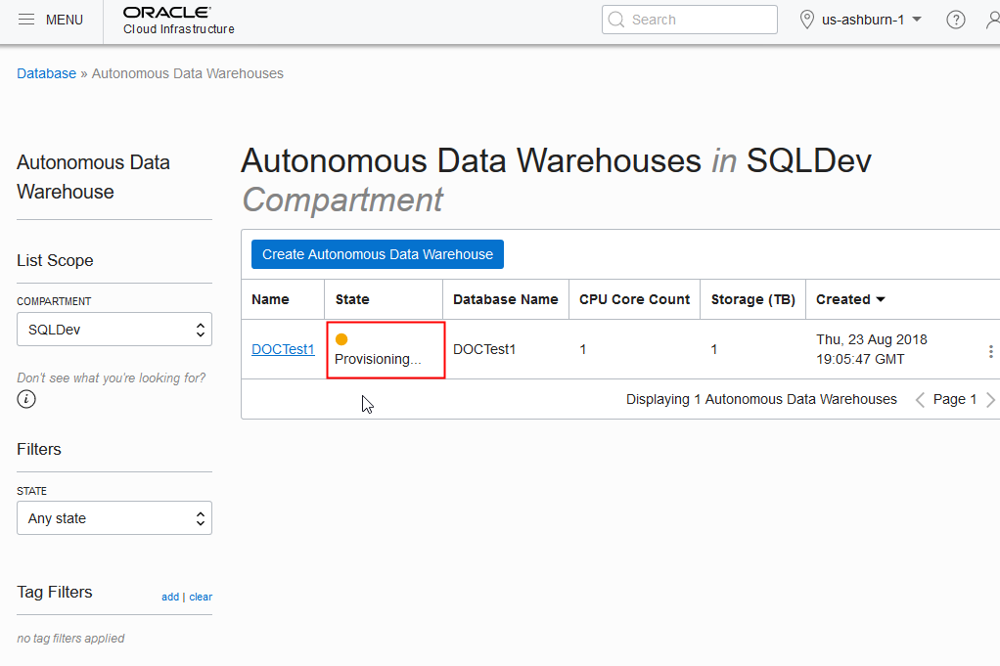
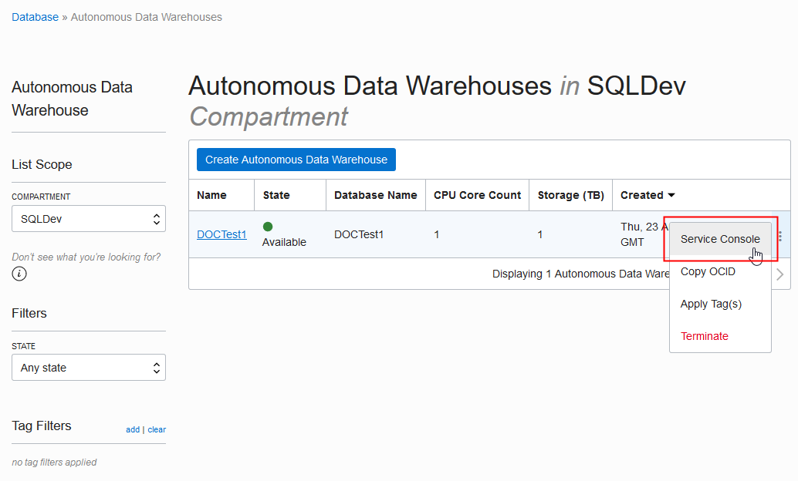

# Provisioning Autonomous Data Warehouse Cloud #

## Before You Begin ##
This 15-minute lab walks you through the steps to get started using the Oracle Autonomous Data Warehouse Cloud (ADWC) on Oracle Infrastructure Cloud (OCI). You will provision a new ADWC database and connect to the database using Oracle SQL Developer.

### Background ###
Autonomous Data Warehouse Cloud is built around the market leading Oracle database and comes with fully automated data warehouse specific features that deliver outstanding query performance.  This environment is delivered as a fully managed cloud service running on optimized high-end Oracle hardware systems.  You don’t need to spend time thinking about how you should store your data, when or how to back it up or how to tune your queries.  We take care of everything for you.  You can select the exact combination of storage and CPUs to fit your project and your budget. We keep all of your data safe and secure.  It’s always backed up and always encrypted in Oracle’s cloud.  Using our client tools you load all kinds of different types of data from worksheets on your computer, webstore log files to data files stored in Oracle’s cloud-based object store and load that data into your Autonomous Data Warehouse cloud.

Oracle’s Autonomous Data Warehouse Cloud is the perfect quick-start service for fast data loading and sophisticated data reporting and analysis.  Oracle manages everything for you so you can focus on your data.

### What Do You Need? ###
* Access to an instance of Oracle Autonomous Data Warehouse Cloud
* [Oracle SQL Developer 18.2](http://www.oracle.com/technetwork/developer-tools/sql-developer/overview/index.html)  (already installed)
* [Oracle's Java Development Kit 8 (JDK 8)](http://www.oracle.com/technetwork/java/javase/downloads/index.html) (already installed)

## Create an ADWC Instance ##
1. Sign in to the Oracle Cloud Platform. 
2. Click the menu icon to expand the menu on the left edge of the screen.
3. Click **Services**.
4. Click **Autonomous Date Warehouse**.

    

    [Description of the illustration MyServicesMenu.png](files/MyServicesMenu.txt)

5. Click the **Create Autonomous Date Warehouse** button to start the instance creation process.
6. In the Create Autonomous Data Warehouse dialog, enter the following information:
     * **Compartment**: For this lab, we'll use the root compartment.
     * **Display Name**: `ADW Finance Mart`
     * **Database Name**: `ADWFINANCE`
     * **CPU Core Count**: `1`
     * **Storage (TB)**:  `1`
     * **Administrator Credentials**: Create a password for the ADMIN user of the service instance. The password must meet the following requirements:
        * The password must be between 12 and 60 characters long and must include at least one uppercase letter, one lowercase letter, and one numeric character.
        * The password cannot contain the double quote (") character.
        * The password must be different from the last 4 passwords used.
     * **License Type**: `My organization already owns Oracle database software licenses`
     * **Tags**: (Optional) You don't need to enter anything here.
7. Click the **Create Autonomous Data Warehouse** button to start provisioning the instance. 
8. The Create Autonomous Data Warehouse dialog closes. On the console, the State field indicates that the data warehouse is **Provisioning**. When creation is completed, the State field changes from **Provisioning** to **Available**. 

    

    [Description of the illustration adw_provisioning_state.png](files/adw_provisioning_state.txt)

## Download the Credentials Zip File ##
Once you have created the data warehouse, download the credentials zip file for client access to that data warehouse. As ADWC only accepts secure connections to the database, you need to download a wallet file containing your credentials first. You will use this file in the next tutorial to connect SQL Developer to your Autonomous Data Warehouse database.

1. In the console, in the menu across from the name of your new data warehouse, select **Service Console**.

    

    [Description of the illustration open_service_console.png](files/open_service_console.txt)

2. A dialog opens to sign in to the service console. Enter the following information:
     * **Username**: `admin`
     * **Password**: Enter the administrator password you specified when you created your service instance.
3. The service console opens in the **Overview** mode. Click **Administration** in the left navigation pane.
4. Click **Download Client Credentials**.
5. You are prompted to create a password for the credentials zip file. Enter a password and click **Download**.
6. Store the zip file. You will use the zip file in the next step to define a SQL Developer connection to your Autonomous Data Warehouse Cloud database.

Note: Version 18.2.0 of SQL Developer drops the requirement to enter the Autonomous Data Warehouse keystore password and does not provide the keystore password field in the dialog for creating a connection. If using SQL Developer version 18.2.0 or newer, you do not use this password.

## Connect to the Database using SQL Developer ##
1. Open SQL Developer on your local computer. 
2. In the Connections panel, right-click **Connections** and select **New Connection**.

    

    [Description of the illustration select_new_connection.png](files/select_new_connection.txt)
    
3. Fill in the connection details:
     * **Connection Name**: `admin_low`
     * **Username**: `admin`
     * **Password**: Enter the admin user's password that you or your Autonomous Data Warehouse Cloud administrator specified when creating the service instance.
     * **Connection Type**: `Cloud PDB`
     * **Configuration File**: Click **Browse**, and select the **Client Credentials** zip file, downloaded from the Autonomous Data Warehouse Cloud service console by you.
     * **Keystore Password**:
        * **For SQL Developer 18.2.0 or newer**: Starting with version 18.2.0, SQL Developer does not require that you enter a Keystore Password and does not provide the Keystore Password field.
        * **For SQL Developer older version**: Enter the password that was generated when you downloaded the Client Credentials zip file from the Autonomous Data Warehouse Cloud console.
     * **Service**: There are 3 pre-configured database services for each database. Pick `<databasename>_low`. These service levels map to the LOW, MEDIUM, and HIGH consumer groups, which provide different levels of performance and concurrency.
4. Click **Test**. "Status: Success" should display at the left-most bottom of the New/Select Database Connection dialog.
5. Click **Save** to save the connecton information.
6. Click **Connect** to connect the database. An entry for the new connection appears under Connections.
7. Repeat the previous steps to create another connection. Use the same information as before with, with the following exceptions:
    * **Connection Name**: `admin_high`
    * **Service**: `<databasename>_high`

Keep SQL Developer open. You'll need it in the next lab when you examine the differences between low and high database service levels.

## Want to Learn More? ##
* [Autonomous Cloud Platform Courses](https://learn.oracle.com/pls/web_prod-plq-dad/dl4_pages.getpage?page=dl4homepage&get_params=offering:35573#filtersGroup1=&filtersGroup2=.f667&filtersGroup3=&filtersGroup4=&filtersGroup5=&filtersSearch=) from Oracle University 
* [Autonomous Data Warehouse Cloud Certification](https://education.oracle.com/es/data-management/autonomous-data-warehouse-cloud/product_807?certPage=true) from Oracle University
* [ADWC Test Drive Workshop](https://oracle.github.io/learning-library/workshops/journey4-adwc/?page=README.md)

