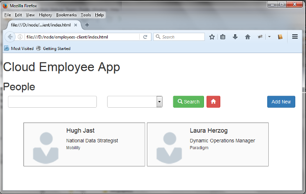
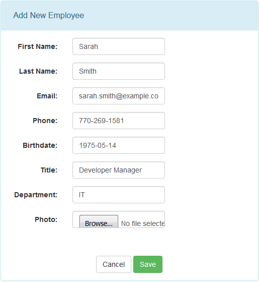
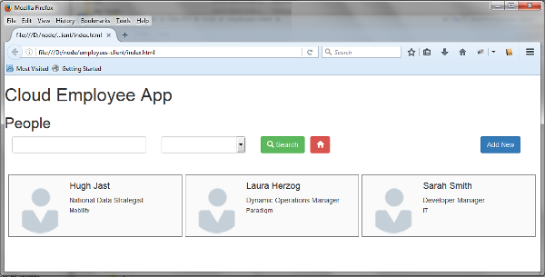

# Deploy a Dropwizard Application to Oracle Cloud #

## Before You Begin ##
This 10-minute tutorial shows you how to deploy a web service to Oracle Application Container Cloud Service using the Dropwizard framework. 

### Background ###
Dropwizard is an open source Java framework that you can use to quickly create RESTful web services. Dropwizard integrates several components and Java frameworks that can help you build more robust applications.

In this tutorial, you create and deploy a web service for an employee directory application to Oracle Application Container Cloud Service. Data for the application is stored in an in-memory database. You test the REST service by using an HTML5 JavaScript client.

### What Do You Need? ###
* Access to an instance of Oracle Application Container Cloud Service
* [Oracle's Java Development Kit 8 (JDK 8)](http://www.oracle.com/technetwork/java/javase/downloads/index.html)
* [Apache Maven 3.0+](http://maven.apache.org/download.cgi)
* The HTML5 JavaScript client files: [employees-client.zip](files/employees-client.zip)
* The Dropwizard Maven project: [employee-service-dropwizard.zip](files/employee-service-dropwizard.zip)
* [A storage replication policy for your service instance](https://docs.oracle.com/en/cloud/iaas/storage-cloud/cssto/selecting-replication-policy-your-account.html)
* [A storage container](https://docs.oracle.com/en/cloud/iaas/storage-cloud/cssto/creating-containers.html)

## Create the Java Project with Maven ##

1. Unzip the Dropwizard Maven project.

    <pre><code>unzip employee-service-dropwizard.zip</code></pre>

2. Change directories to the `employee-service-dropwizard` directory.
3. In the command line window, build your application by typing the maven command:

    <pre><code>mvn clean package</code></pre>

## Deploy the Application ##
1. In a web browser, go to [https://cloud.oracle.com/home](https://cloud.oracle.com/home) and click **Sign In**.
2. From the **Cloud Account** drop-down menu, select **Cloud Account with Identity Cloud Service**.
3. Enter your Cloud Account Name and click **My Services**.
4. Enter your cloud account credentials and click **Sign In**.
5. In the **Application Container** tile, click **Action** and select **Open Service Console**.
6. In the **Applications** list view, click **Create Application** and then select **Java SE**.
7. On the **Create Application** page, enter `DropwizardSample` for the name. On **Application**, be sure **Upload Archive** is selected and click **Browse**.
8. On the **File Upload** page, select your application archive `employee-service-dropwizard-1.0-SNAPSHOT.zip` in the `target` directory, and click **Open**.
9. Click **Create**.
10. When the application is created, make note of the URL.

## Test the Application ##
1. Extract the `employees-client.zip` file in your local system.
2. Using a text editor, open `EmployeeController.js` file.
3. Edit `urlService` by inserting the generated URL link of your application and appending `/employees`. 

    <pre><code>$scope.urlService = "<var><strong>https://your URL</strong></var>/employees";</code></pre>
4. In a web browser open `index.html` file and then click **Add New**.

    

    [Description of the illustration testing-01.png](files/testing-01.txt)
5. Enter the **First Name**, **Last Name**, **Email**, **Phone**, **Birthdate**, **Title**, and **Department** values.

    

    [Description of the illustration testing-02.png](files/testing-02.txt)

6. Beside photo click **Browse...** and then select an image file located in the `photos` folder.

    

    [Description of the illustration testing-03.png](files/testing-03.txt)
7. Click **Save**.

    

    [Description of the illustration testing-04.png](files/testing-04.txt)
8. Test the delete, update, and search options.

## Want to Learn More? ##
* [Oracle Application Container Cloud Service](http://www.oracle.com/pls/topic/lookup?ctx=cloud&id=apaasgs) in the Oracle Help Center
* Dropwizard website [dropwizard.io](http://www.dropwizard.io/)

