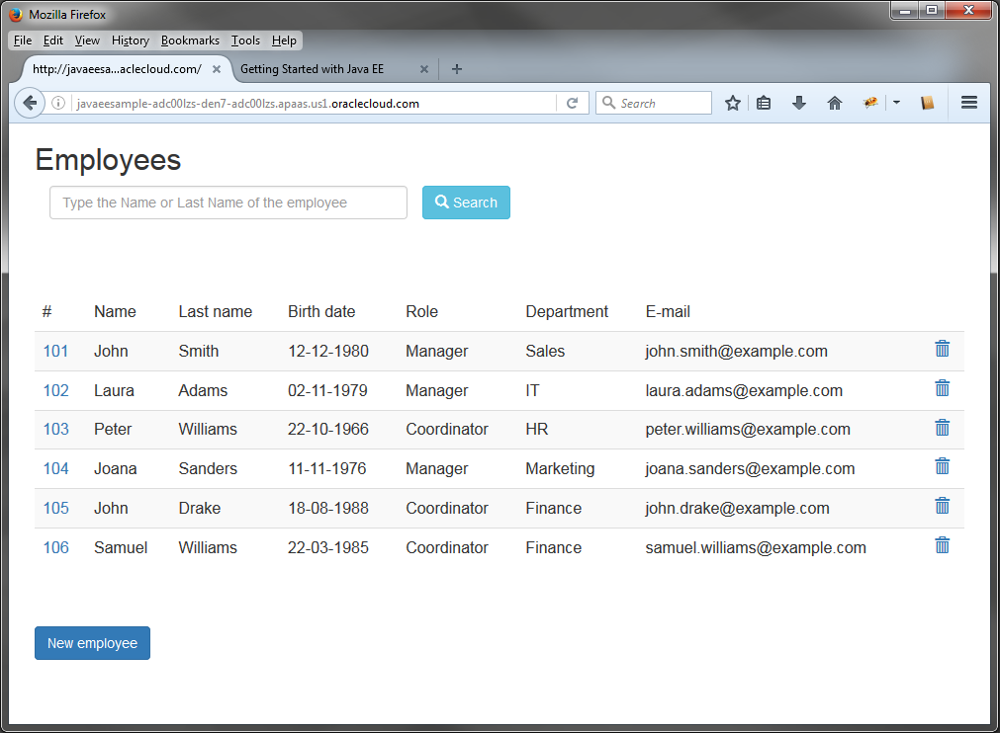

# Deploy a Java EE Application to Oracle Cloud #

## Before You Begin ##
This 10-minute tutorial shows you how to deploy a Java EE application to Oracle Application Container Cloud Service.

### Background ###
Oracle Application Container Cloud Service lets you deploy Java SE, Node.js, PHP, Python, Ruby, and Java EE applications to the Oracle Cloud.

### What Do You Need? ###

* Access to an instance of Oracle Application Container Cloud Service
* Employee sample application: [employees-app.zip](files/employees-app.zip)
* [A storage replication policy for your service instance](https://docs.oracle.com/en/cloud/iaas/storage-cloud/cssto/selecting-replication-policy-your-account.html)
* [A storage container](https://docs.oracle.com/en/cloud/iaas/storage-cloud/cssto/creating-containers.html)

## Deploy Your Application to Oracle Application Container Cloud Service ##

1. Extract the content of the `employees-app.zip` file in your local system.

    <pre><code>unzip employees-app.zip</code></pre>

2. In a web browser, go to [https://cloud.oracle.com/home](https://cloud.oracle.com/home) and click **Sign In**.
3. From the **Cloud Account** drop-down menu, select **Cloud Account with Identity Cloud Service**.
4. Enter your Cloud Account Name and click **My Services**.
5. Enter your cloud account credentials and click **Sign In**.
6. In the **Oracle Cloud My Services** dashboard, click **Action** and select **Oracle Application Container Cloud Service**.
7. In the **Applications** list view, click **Create Application** and select **Java EE**.
8. In the **Application** section, enter `EmployeeApp` for your application and click **Browse**.
9. On the **File Upload** dialog box, select the `employee-app.war` file located in the `target` directory and click **Open**.
10. Keep the default values in the **Instances** and **Memory** fields and click **Create**.
11. Wait until the application is created. The URL is enabled when the creation is completed.
12. Click the URL of your application.

    

    [Description of the illustration java-ee-app-test.png](files/java-ee-app.test.txt)

## Want to Learn More? ##
* [Oracle Application Container Cloud Service](http://docs.oracle.com/en/cloud/paas/app-container-cloud/index.html) in the Oracle Help Center
