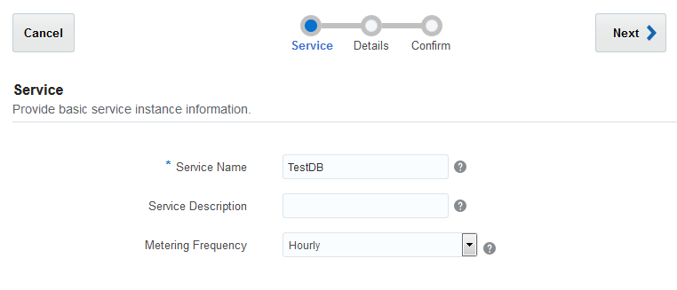
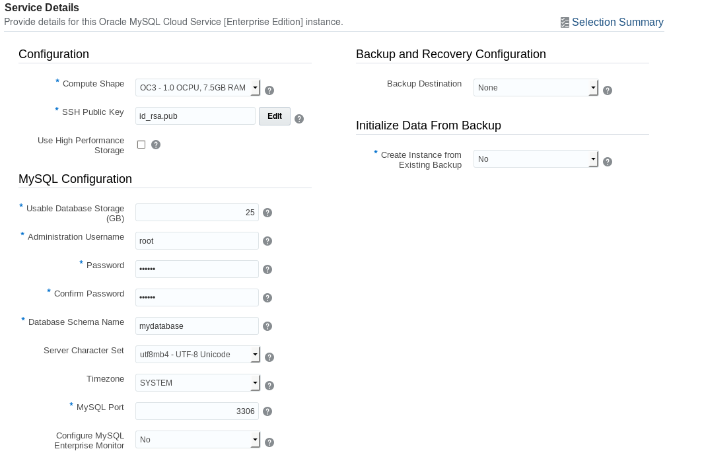
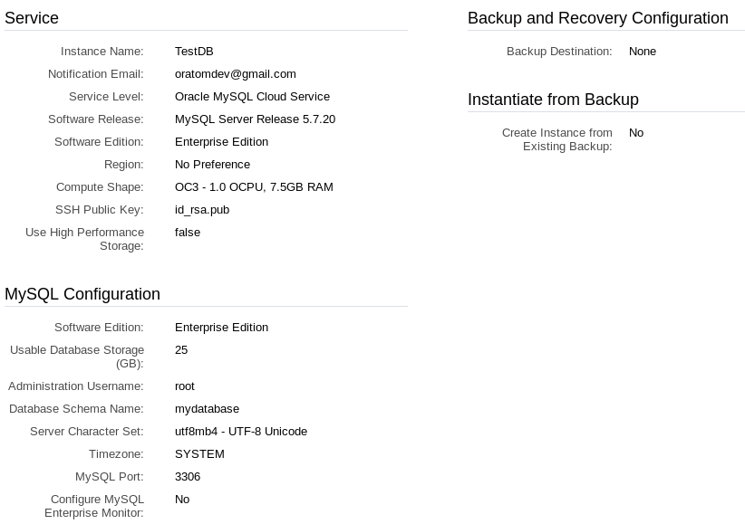
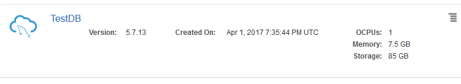

# Creating an Instance of Oracle MySQL Cloud Service #

## Before You Begin ##
This Oracle By Example (OBE) lab shows you how to create an Instance of Oracle MySQL Cloud Service.
                            
### Background ###
With Oracle MySQL Cloud Service, you can deploy MySQL servers to the cloud, with each deployment containing a single MySQL server. You have full access to the features and operations available with a MySQL server. To simplify maintenance and management operations, Oracle provides the computing power, physical storage, and tooling.

When you create an instance of Oracle MySQL Cloud Service, you must associate a Secure Shell (SSH) public key with the compute infrastructure supporting the deployment. When you use an SSH client to connect to the instance, you must provide the private key that matches the public key.

### What Do You Need? ###
- An Oracle Cloud account

## Create an Instance of Oracle MySQL Cloud Service ##
1. In a web browser, go to [https://cloud.oracle.com/home](https://cloud.oracle.com/home) and click **Sign In**.
2. From the **Cloud Account** drop-down menu, select **Cloud Account with Identity Cloud Service**.
3. Enter your Cloud Account Name and click **My Services**.
4. Enter your cloud account credentials and click **Sign In**.
5. Click **Customize Dashboard**.
6. Select **Show** for **MySQL Cloud Service**.
7. Close the **Customize Dashboard** window.
8. On the **MySQL Cloud Service** tile, click the **Action Menu Action Menu** and select **Open Service Console**.
9. If there are no existing services, click the **Instances** tab.
10. Click **Create Instance**.
11. Enter or select the following information, and then click **Next**:
     * **Instance Name**: `TestDB`
     * **Description**: (optional)
     * **Notification Email**: (default)
     * **Region**: No Preference

    

    [Description of the illustration mysql04.png](files/mysql04.txt)
12. Generate the SSH Public Key
    * Beside the **SSH Public Key** field, click **Edit**. 
    * Select **Create a New Key**, and then click **Enter**. A message appears to confirm that your SSH Key pair was successfully created. 
    * Click **Download**, save the file, and then click **Done**.
13. Enter or select the following information, and then click **Next**:
     * **Compute Shape: OC3-1.0 OCPU, 7.5GB RAM**
     * **Usable Database Storage(GB)**: 25
     * **Administration User**: root
     * **Administration Password** (Be sure to use a password with at least 8 characters, one upper case character, one number and one special character.)
     * **Confirm Administration Password**
     * **Database Schema Name**: `mydatabase`
     * **Server Character Set**: `utf8mb4 - UTF-8 Unicode`
     * **Configure MySQL Enterprise Monitor**: `No`
     * **Backup Destination**: None
     * **Create Instance from Existing Backup**: No

    

    [Description of the illustration mysql05.png](files/mysql05.txt)  
14. Review the details of your instance and then click **Create**.

    

    [Description of the illustration mysql06.png](files/mysql06.txt) 
15. Wait until the instance is created.

    

    [Description of the illustration mysql06.png](files/mysql07.txt) 

## Want to Learn More? ##

   * [Using Oracle MySQL Cloud Service](http://docs.oracle.com/cloud/latest/mysql-cloud/UOMCS/toc.htm) in the Oracle Help Center
   * [Deploying a PHP Application to Oracle Application Container Cloud Service](https://apexapps.oracle.com/pls/apex/f?p=44785:112:0::::P112_CONTENT_ID:19923) OBE
