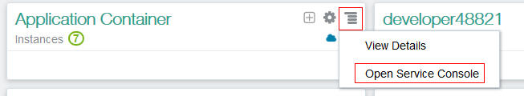
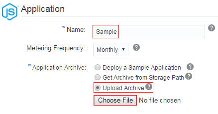
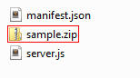

# Creating a Node.js RESTful Application in Oracle Application Container Cloud Service #

## Before You Begin ##
This 10 minute tutorial shows you how to develop a simple message board application. Using REST calls, you can read existing comments and create new comments on the message board.

### Background ###
Oracle Application Container Cloud Service provides a lightweight infrastructure that lets you deploy Java Platform, Standard Edition (SE), PHP, and Node.js applications to Oracle Cloud. You can use Node.js cloud service in Oracle Application Container Cloud Service to develop RESTful web services, and then integrate them with your client applications.

### What Do You Need? ###

* [Node.js](https://nodejs.org/en/)
* [Git](https://git-scm.com/downloads) (Git CMD shell to execute cURL commands)
* Access to an instance of Oracle Application Container Cloud Service
* [A storage replication policy for your service instance](https://docs.oracle.com/en/cloud/iaas/storage-cloud/cssto/selecting-replication-policy-your-account.html)
* [A storage container](https://docs.oracle.com/en/cloud/iaas/storage-cloud/cssto/creating-containers.html)

## Develop a Sample RESTful Node.js Service ##
1. Create a JavaScript file and name it `server.js`.
2. Open `server.js` in an editor and create a simple Node.js server.

   ````javascript
   var http = require('http');
   var PORT = 8089; 
   var server = http.createServer(function (request, response) {
      response.end("LATER ON, YOU WILL PLACE CODE HERE");
   });

   server.listen(PORT, function () {
      console.log('Server running...');
   });
   ````
   This code fragment creates a service that listens on `HTTP` port `8089`. In a later step, you will change this port with an Oracle Application Container Cloud Service variable.
3. Test your server.

    <pre><code>node server.js</code></pre>
4. In a browser window, go to http://localhost:8089 and look for the following message: `"LATER ON, YOU WILL PLACE CODE HERE."`
5. To stop the server, press CTRL+C.
6. Add the following variable declarations after the `var PORT` declaration: 

   ````javascript
   var topicList = [];
   var topicDetail = {};
   var currentId = 123;
   ````
7. Add the following functions after the variable declarations: 

   ````javascript
   function addTopic(tTitle, tText) {
      console.log("addTopic(" + tTitle + "," + tText + ")");
      var topicId = ++currentId;
      topicList.push({title: tTitle, id: topicId});
      topicDetail[topicId] = {title: tTitle, text: tText, comments: []};
      return topicId;
   }

   function addComment(topicId, text) {
      console.log("addComment(" + topicId + "," + text + ")");
      topicDetail[topicId].comments.push(text);
   } 
   ````
8. Create sample messages. 

   ````javascript
   var id1 = addTopic("Topic 1","Topic 1 content");
   var id2 = addTopic("Topic 2","Topic 2 content");
   addComment(id1, "Good topic");
   addComment(id2, "This is a comment");
   addComment(id2, "This is another comment");
   ````
9. Replace the `http.createServer` function with the following code: 

   ````javascript
   var server = http.createServer(function (request, response) {
      response.setHeader('Access-Control-Allow-Origin', '*');
      response.setHeader('Access-Control-Allow-Methods', 'GET, POST, OPTIONS, PUT, PATCH, DELETE');
      response.setHeader('Access-Control-Allow-Headers', 'X-Requested-With,content-type');
      response.setHeader('Access-Control-Allow-Credentials', true);

      console.log('TopicList=' + JSON.stringify(topicList));
      console.log('TopicDetail=' + JSON.stringify(topicDetail));
      var requestBody = '';

      request.on('data', function (data) {
         requestBody += data;
      });

      request.on('end', function () {
         handleRequest(request, response, requestBody);
      });
   });
   ````  
10. Add this function to handle the HTTP requests: 

    ````javascript
    function handleRequest(request, response, requestBody) {
       console.log(request.method + ":" + request.url + ' >>' +  requestBody);

      if (request.url == '/') {
          if (request.method == 'POST') {
            var jsonMsg = JSON.parse(requestBody);
            addTopic(jsonMsg.title, jsonMsg.text);
            response.end();
          } else {
            response.end(JSON.stringify(topicList));
          }
      } else {
          var topicId = request.url.substring(1);
          if (request.method == 'POST') {
            var jsonMsg = JSON.parse(requestBody);
            addComment(jsonMsg.topicId, jsonMsg.text);
            response.end();
          } else {
            response.end(JSON.stringify(topicDetail[topicId]));
          }
      }
    }  
    ````
11. Your application must listen to requests on a port provided by an Oracle Application Container Cloud Service environment variable. In your `server.js` file, update the `var PORT` variable declaration.

    ````javascript
    var PORT = process.env.PORT || 80;
    ````

##  Prepare the Package for deployment ##
Oracle Application Container Cloud Service requires a `manifest.json` file, which contains information about which Node.js command the service should run.

1. Create a `manifest.json` file and add: 

   ````json
   {
      "runtime":{
      "majorVersion":"4"
   },
      "command": "node server.js",
      "release": {},
     "notes": ""
   }
   ````
2. Compress the `server.js` and `manifest.json` files and bundle them into a single zip file named `sample.zip`.

    <pre><code>zip sample.zip server.js manifest.json</code></pre>

## Open the Oracle Application Container Cloud Service Console ##
1. In a web browser, go to [https://cloud.oracle.com/home](https://cloud.oracle.com/home) and click **Sign In**.
2. From the **Cloud Account** drop-down menu, select **Cloud Account with Identity Cloud Service**.
3. Enter your Cloud Account Name and click **My Services**.
4. Enter your cloud account credentials and click **Sign In**.
5. If Oracle Application Container Cloud Service isn't listed in the dashboard, click **Customize Dashboard**.
6. Under **Java**, find **Application Container**, select **Show**, and close the **Customize Dashboard** tab.
7. In the **Application Container** tile, click **Action** and select **Open Service Console**.

   

   [Description of the illustration deploy-node-accs-03.jpg](files/deploy-node-accs-03.jpg)

## Deploy the Sample Application to Oracle Application Container Cloud Service ##
1. On the **Applications** tab, click **Create Application**.
2. Select **Node** as the application platform.
3. On the **Create Application** page, enter `Sample` for the name. On **Application**, be sure **Upload Archive** is selected and click **Browse**.

   

   [Description of the illustration deploy-node-accs-04.jpg](files/deploy-node-accs-04.jpg)
4. In the opened file browser, navigate to the folder where you created sample.zip, select the file, and click **Open**.

   

   [Description of the illustration deploy-sample-accs-04.jpg](files/deploy-sample-accs-04.jpg)
5. Click **Create**. Processing takes a few minutes. 

## Test your Node.js RESTful Service using cURL ##
1. On the **Applications** tab, refresh the page repeatedly until your application is created.
2. Copy the application URL.

   

   [Description of the illustration test-sample-accs-07.jpg](files/test-sample-accs-07.jpg)
3. In a Git CMD window, access the URL as a REST endpoint:

   <pre><code>curl -i -X GET <i>application URL</i></code></pre>

   The sample data that you entered in `server.js` is displayed.

   ````
   HTTP/1.1 200 OK
   Server: Oracle-Traffic-Director/11.1.1.9
   Date: Fri, 07 Apr 2017 18:27:41 GMT
   Access-control-allow-origin: *
   Access-control-allow-methods: GET, POST, OPTIONS, PUT, PATCH, DELETE
   Access-control-allow-headers: X-Requested-With,content-type
   Access-control-allow-credentials: true
   Content-length: 59
   Via: 1.1 net-apaasotd
   Proxy-agent: Oracle-Traffic-Director/11.1.1.9

   [{"title":"Topic 1","id":124},{"title":"Topic 2","id":125}]
   ````

4. Add a message.

   <pre><code>curl -i -X POST -H "Content-Type: application/json" -d '{"title":"Hello", "id":126}' <b><i>application URL</i></b></code></pre>

5. Repeat step 2. The sample data is updated.

   ````
   HTTP/1.1 200 OK
   Server: Oracle-Traffic-Director/11.1.1.9
   Date: Wed, 12 Apr 2017 17:19:25 GMT
   Access-control-allow-origin: *
   Access-control-allow-methods: GET, POST, OPTIONS, PUT, PATCH, DELETE
   Access-control-allow-headers: X-Requested-With,content-type
   Access-control-allow-credentials: true
   Content-length: 86
   Via: 1.1 net-apaasotd
   Proxy-agent: Oracle-Traffic-Director/11.1.1.9

   [{"title":"Topic 1","id":124},{"title":"Topic 2","id":125},{"title":"Hello","id":126}]
   ````

## Want to Learn More ##

* Node.js website [nodejs.org](https://nodejs.org/)
* [Using Oracle Application Container Cloud Service](http://docs.oracle.com/cloud/latest/apaas_gs/CSJSE/toc.htm)