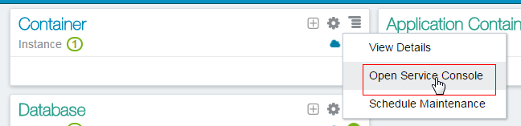
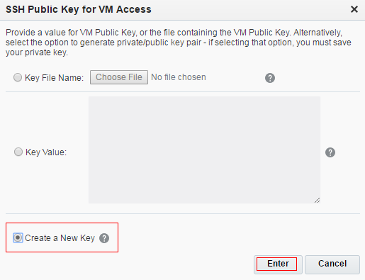
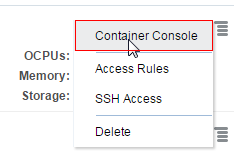
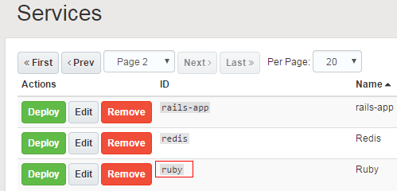
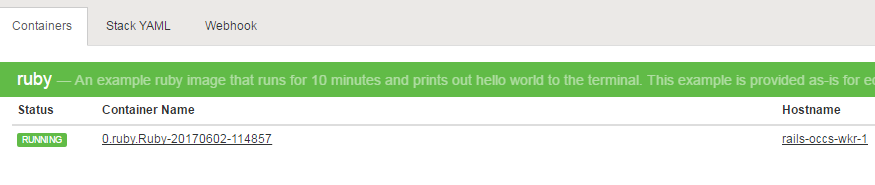

# Deploying a Ruby Docker image to Oracle Container Cloud Service #

## Before You Begin ##

This 10 minute tutorial shows you how to create an Oracle Container Cloud Service instance, and deploy a sample Ruby Docker image as a Docker container. 

### Background ###

Use Oracle Container Cloud Service to deploy a Ruby Docker image.

### What Do You Need ###

* [An Oracle Cloud subscription](https://cloud.oracle.com/en_US/container) that includes Oracle Container Cloud Service.

## Create a Service Instance in Oracle Container Cloud Service ##

1. In a web browser, go to [https://cloud.oracle.com/home](https://cloud.oracle.com/home) and click **Sign In**.
2. From the **Cloud Account** drop-down menu, select **Cloud Account with Identity Cloud Service**.
3. Enter your Cloud Account Name and click **My Services**.
4. Enter your cloud account credentials and click **Sign In**.
5. If Oracle Container Cloud Service isn't listed on the dashboard, click **Customize Dashboard**.
6. Under **Application Development**, find **Container Classic**, click **Show**, and then close the **Customize Dashboard** page.
7. In the **Container** tile, click **Action**, and then select **Open Service Console**.

    

    [Description of the illustration open_service_console.png]
    (files/open_service_console.txt)

8. Click on the **Instances** tab, and then click **Create Service**.
9. Enter `RubySample` as the **Service Name**.
10. Enter an optional description.
11. Beside the **SSH Public Key** field, click **Edit**. 
12. Select **Create a New Key**, and then click **Enter**. A message appears to confirm that your SSH Key pair was successfully created. 

    

    [Description of the illustration ssh_key.png](files/ssh_key.txt)

13. Click **Download**, save the file, and then click **Done**. 
14. Enter a password and select the default options for **Worker node Compute Shape**, **Number of worker nodes** and **Worker node data volume**, and then click **Next**.
15. On the **Confirmation** page, verify that all the information you entered is correct, then click **Create**. This process could take several minutes. After your service instance is created, you can click the **Instances** tab to see the new service.

## Log in to the Container Console ##

1. When the service instance is created, click **Action**, and then select **Container Console**. 

    

    [Description of the illustration container_console.png](files/container_console.txt)
2. Log in to the **Container Console** by using the credentials that you defined after you generated your SSH key. 

    <b>Note</b>: You may need to confirm a browser security exception.

## Deploy and Run a Ruby Container Image ##

1. On the **Container Console** page, click **Services** to display the Services page. This page shows a list of preconfigured sample services. 
2. Click **Next**, and then locate the Ruby image. 

    

    [Description of the illustration services_page.png](files/services_page.txt)
3. Click **Deploy** for the Ruby service. A dialog box opens and shows the orchestration options. 
4. Enter `RubyDeployment` as the **Deployment Name**, and `default` for the **Resource Pool** value. Leave the remaining options with their default values and click **Deploy**. 
5. When your deployment is completed, you can see that your container is listed as `running` and that your deployment is healthy.

    

    [Description of the illustration deployment_ready.png](files/deployment_ready.txt)

## Test Your Deployment ##

1. On the Container Console page, click **Deployments**, and then click the deployment name. The page opens and displays the **Containers** tab.
2. Click the container name, and then click **View Logs**. The description for this container says it runs for 10 minutes and prints `Hello world` to the terminal. The information that it prints is also displayed in the logs. Verify that the log contains several `Hello world` messages with a timestamp. 
3. After you verify the log, to stop the container, click **Deployments**, and then click **Stop**.
4. When the container stops running, click **Remove**.

## Want to Learn More? ##

* [Deploying a Service with Oracle Container Cloud Service](http://www.oracle.com/pls/topic/lookup?ctx=cloud&id=CONTU-GUID-2FC7C25D-8CC4-4239-8A8B-0855BC14A3F8)
* [Creating an Oracle Container Cloud Service Instance](http://apexapps.oracle.com/pls/apex/f?p=44785:112:0::::P112_CONTENT_ID:17462)
* [Running a Docker Container with Oracle Container Cloud Service in Three Easy Steps](http://apexapps.oracle.com/pls/apex/f?p=44785:112:0::::P112_CONTENT_ID:19220)