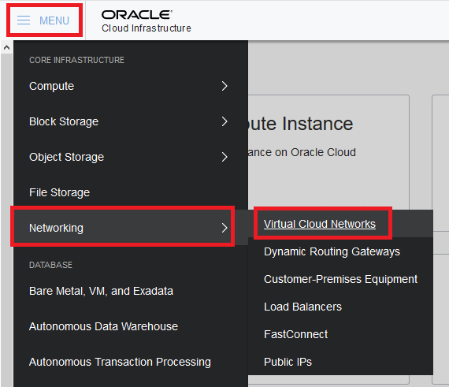
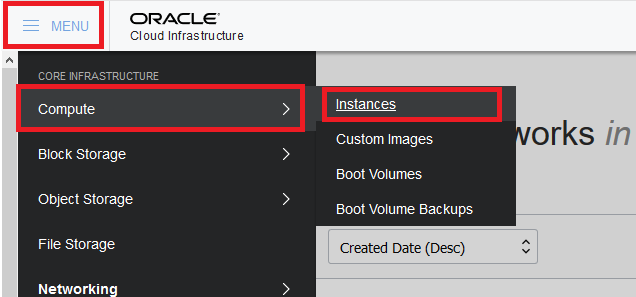
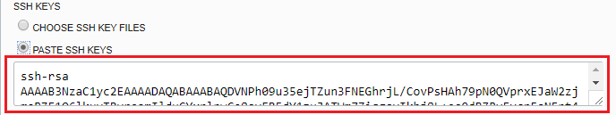

# Create a Virtual Machine Instance Using Oracle Cloud Infrastructure Compute #

## Before You Begin ##
This 20-minute tutorial shows you how to create a Virtual Machine (VM) instance using Oracle Cloud Infrastructure (OCI) Compute Service. Before you can create a VM, you'll create a Virual Cloud Network (VCN).

### Background ###
Oracle Cloud Infrastructure Compute Service lets you create Virtual Machine instances on which you can run your mission-critical applications with high availability.

Before you can launch an instance, you need to have a VCN to launch it into. In the VCN, you launch the instance into a subnet. A subnet is a subdivision of your VCN that you define in a single Availability Domain. The subnet directs traffic according to a route table. In this tutorial, you'll access the instance over the internet using its public IP address, so your route table will direct traffic to an Internet Gateway. The subnet also uses a security list to control traffic in and out of the instance.

### What Do You Need? ###
* Access to an instance of Oracle Cloud Infrastructure Compute Service
* A Virtual Cloud Network in the compartment in which the instance will run
* An SSH key pair (if creating a Linux VM)

## Create a Virtual Cloud Network ##
1. Log in to the Oracle Cloud Platform.
2. Click the menu icon to expand the menu on the left edge of the screen.
3. Click **Services**.
4. Click **Compute**.

    
    [Description of the illustration MyServicesMenu.png](files/MyServicesMenu.txt)

5. Click the OIC menu icon to expand the menu on the left edge of the screen.
6. Select **Networking**.
7. Click **Virtual Cloud Networks**.
    
    
    [Description of the illustration OCIMenu1.png](files/OCIMenu1.txt)

8. Select the root compartment from the Compartment dropdown menu.

    
    [Description of the illustration Compartment.png](files/Compartment.txt)

9. Click the button **Create Virtual Cloud Network**.
10. In the Create Virtual Cloud Network dialog box, enter the following information:
     * **Create in Compartment**: Select the root compartment.
     * **Name**: `user01_Network`
     * Select **Create Virtual Vloud Network Plus Related Resources**.
     * Check the box to **Use DNS Host Names in this VCN**.
     * Scroll down and check the box to **View detail page after this resource is created**.
11. Click the button **Create Virtual Cloud Network** to close the dialog box. A confirmation page with the details of the cloud network is diplayed. The cloud network has the following resources and characteristics:
     * CIDR block range of 10.0.0.0/16
     * An Internet Gateway
     * A route table with a default route rule to enable traffic to and from the Internet Gateway
     * A default security list
     * A public subnet in each Availability Domain
     * The VCN will automatically use the Internet and VCN Resolver for DNS
12. Click **Close**.

## Create a Virtual Machine Instance ##
1. Click the OIC menu icon to expand the menu on the left edge of the screen.
2. Select **Compute**.
3. Click **Instances**.
    
    
    [Description of the illustration OCIMenu2.png](files/OCIMenu2.txt)

4. Ensure the root compartment is still selected in the Compartment dropdown menu.

    
    [Description of the illustration Compartment.png](files/Compartment.txt)

5. Click the button **Create Virtual Cloud Network**.
6. In the Create Instance dialog box, enter the following information:
     * **Name**: Keep the default value.
     * **Availability Domain**: Keep the default value.
     * **Boot Volume**: `Oracle-Provided OS Image`
     * **Image Operating System**: Choose the most recent version of `Oracle-Linux`.
     * **Shape Type**: `Virtual Machine`
     * **Shape**: `VM.Standard1.4`
     * **Image Version**: Choose the most recent version of `Oracle-Linux`.
     * **Boot Volume Configuration**: Keep the default values.
     * **SSH Key**: Select `Paste SSH Keys`. An example SSH key is: 
     <pre><code>ssh-rsa AAAAB3NzaC1yc2EAAAADAQABAAABAQDVNPh09u35ejTZun3FNEGhrjL/CovPsHAh79pN0QVprxEJaW2zjmaBZF1Q6lkuyTRvraomIlduCYxrlnwCe8oyER5dY1zuJATWm7ZiqgsvIkhj8L+ea9dBZRvFvcnFsNFnt4ALZYkW2nB2EeTdvqVMHERjFKfbRMCcO0dusmBUEsvaaqLtrvVuHBjwoXIDKkT/PFkix4DWRZRkZIjmZ/y9kwrHO4W1FYsFi4LP1xIB1c9y2H4w0SBXAMv4NCSFEIgWPQly2NywMsgEbddjW+zPz+7YjYqjWfz5Fgchu7+N1gejsIdzg1/aLvDpze6TN9xLcZx5gt04jA3TR+xfs2Ab Tim@Corsair</code></pre>
         
    
    [Description of the illustration pastesshkey.png](files/pastesshkey.txt)

     * Keep the remaining default values
7. Scroll down and click the button **Create Instance** to close the dialog box.
     * While the instance is being created, its state is displayed as "PROVISIONING".
     * The status changes to "RUNNING" when the instance is fully operational.

## Want to Learn More? ##
* [Oracle Cloud Infrastructure Training](https://education.oracle.com/learn/iaas/pPillar_640) from Oracle University 
* [Oracle Cloud Infrastructure 2018 Architect Associate Certification](https://education.oracle.com/es/oracle-cloud-infrastructure-2018-architect-associate/pexam_1Z0-932) from Oracle University