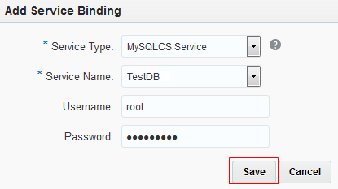
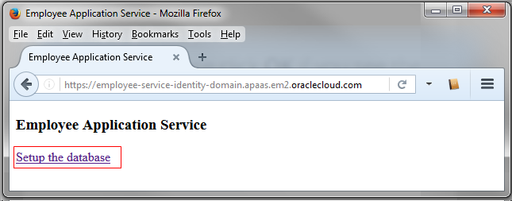

# Deploying a PHP Application to Oracle Application Container Cloud Service #

## Before You Begin ##
This Oracle By Example (OBE) lab shows you how to deploy a PHP application to Oracle Application Container Cloud Service and how to integrate Oracle MySQL Service to your application.

### Background ###
Oracle Application Container Cloud Service provides a lightweight infrastructure so that you can run Java, PHP, and Node.js applications in Oracle Cloud. To develop more robust applications, you can integrate this cloud service with other Oracle services (for example, Oracle MySQL Cloud Service).

### What Do You Need? ###
* Access to an instance of Oracle Application Container Cloud
* [A storage replication policy for your service instance](https://docs.oracle.com/en/cloud/iaas/storage-cloud/cssto/selecting-replication-policy-your-service-instance.html).
* Completion of [Creating an Instance of Oracle MySQL Cloud Service](https://apexapps.oracle.com/pls/apex/f?p=44785:112:0::::P112_CONTENT_ID:19922)
* [Git](https://git-scm.com/downloads) (Git CMD shell to execute cURL commands)
* PHP Employee application service [employee-service.zip](files/employee-service.zip)


## Deploy Your Application to Oracle Application Container Cloud Service ##
1. Log in to Oracle Cloud at http://cloud.oracle.com/. Enter your account credentials in the **Identity Domain**, **User Name**, and **Password** fields. 
2. To open the Oracle Application Container Cloud Service console, click **Instances** in the dashboard. 
<br>
<br>[Description of the illustration open_console.png](files/open_console.txt)
3. In the **Applications** list view, click **Create Application**. 
4. In the **Create Application** dialog box, click **PHP**. 
5. In the **Application** section, enter `EmployeeService` for the name of your application. Click **Browse** next to **Archive**. 
<br>
<br>[Description of the illustration create_application_01.png](files/create_application_01.txt)
6. In the **File Upload** dialog box, select the `employee-service.zip` file, and click **Open**. 
7. Keep the default values in the **Instances** section and click **Create**. Processing takes a few minutes. 
<br>
<br>[Description of the illustration processing_archive.png](files/processing_archive.txt)
8. Click **OK** in the confirmation dialog box. 


## Add the MySQLCS Service Binding ##
1. Wait until the application is created and click the application name and make note of the application URL. 
<br>
<br>[Description of the illustration employee_service_app.png](files/employee_service_app.txt)
2. Click the **Deployments** tab. In the **Service Binding** section, click **Add**. 
<br>
<br>[Description of the illustration deployments_tab.png](files/deployments_tab.txt)
3. In the **Service Type** field, select **MySQLCS Service**. Enter or select values in the **Service Name**, **Username**, and **Password** fields, and click **Save**. 
<br>
<br>[Description of the illustration add_service_binding.png](files/add_service_binding.txt)
4. In the **Deployments** dialog box, click **Apply Edits**. 
<br>
<br>[Description of the illustration deployments_dialog_box.png](files/deployments_dialog_box.txt)
5. Wait until the application is restarted. 


## Test the Application ##
1. In the Oracle Application Container Cloud Service console click the URL of your application.
2. Click **Setup the database**. 
<br>
<br>[Description of the illustration index-page.png](files/index-page.txt)
<br>The `EMPLOYEE` table is created with five employee records.
<br>
<br>[Description of the illustration setup_database.png](files/setup_database.txt)
3. Open a Git command-line window (or terminal in Linux).
4. Query all employee entities. **Replace *app_endpoint* with the URL of your application.**
```shell
curl app_endpoint/employees-rest-api.php/employees
```
5. Create an employee record. 
```shell
curl -i -X POST -H "Content-Type:application/json" -d "{ \"firstName\" : \"John\",  \"lastName\" : \"Smith\",\"birthDate\":\"1957-10-14\", \"phone\":\"193-754-4112\",\"email\":\"john.smith@example.com\",\"title\" : \"Manager\",\"dept\" : \"Sales\" }" app_endpoint/employees-rest-api.php/employees
```
Because five records were already inserted in the table, the ID of the new record is 6.. 
6. Get the employee by ID. 
```shell
curl app_endpoint/employees-rest-api.php/employees/6
```
7. Update the employee. 
```shell
url -i -X PUT -H "Content-Type:application/json" -d "{ \"firstName\" : \"John\",  \"lastName\" : \"Smith\",\"birthDate\":\"1957-12-08\", \"phone\":\"193-124-8212\",\"email\":\"john.smith@example.com\",\"title\" : \"Manager\",\"dept\" : \"IT\" }" app_endpoint/employees-rest-api.php/employees/6
```
8. Delete the employee. 
```shell
curl -i -X DELETE app_endpoint/employees-rest-api.php/employees/6
```

## Want to Learn More? ##
* [Oracle Application Container Cloud Service](http://docs.oracle.com/en/cloud/paas/app-container-cloud/index.html) in the Oracle Help Center
* [Oracle Application Container Cloud Service: Building a RESTful API with PHP](https://apexapps.oracle.com/pls/apex/f?p=44785:112:10556495222365::::P112_CONTENT_ID:17099) OBE
* [Oracle Application Cloud Container: Creating a PHP REST Application Using Laravel and MySQL](https://apexapps.oracle.com/pls/apex/f?p=44785:112:0::::P112_CONTENT_ID:18797) OBE

