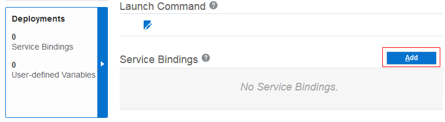
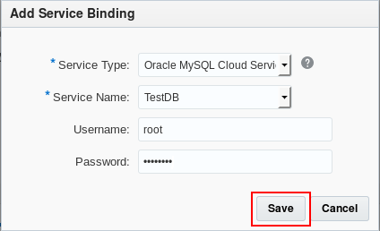

# Connect a Python Application to Oracle MySQL Cloud Service #

## Before You Begin ##
This 10-minute tutorial shows you how to deploy a Python application to Oracle Application Container Cloud Service and then integrate Oracle MySQL Cloud Service with your application.
                            
### Background ###
Oracle Application Container Cloud Service provides a lightweight infrastructure so that you can run Java, PHP, Node.js, Ruby, and Python applications in Oracle Cloud. 

### What Do You Need? ###

* Access to an instance of Oracle Application Container Cloud Service (Make a note of your account information: identity domain, user name, and password.)
* Access to an instance of Oracle MySQL Cloud Service. (See [Creating an Instance of Oracle MySQL Cloud Service](https://apexapps.oracle.com/pls/apex/f?p=44785:112:0::::P112_CONTENT_ID:19922))
* [Python 3.6+](https://www.python.org/downloads/)
* The [pip](https://pip.pypa.io/en/stable/installing/) package management system
* Python Employee application project [employee-python-app.zip](files/employee-python-app.zip)
* [cURL 7.0+](http://curl.haxx.se/download.html) with SSL support
* [A storage replication policy for your service instance](https://docs.oracle.com/en/cloud/iaas/storage-cloud/cssto/selecting-replication-policy-your-account.html)
* [A storage container](https://docs.oracle.com/en/cloud/iaas/storage-cloud/cssto/creating-containers.html)

## Download the Project Dependencies ##
1. Extract the contents of the `employee-python-app.zip` file in your local system.

    <pre><code>unzip employee-python-app.zip</code></pre>

2. Open a command-line window (or terminal in Linux) and change directories to the `employee-python-app` directory.
3. Install the project dependencies.

   <pre><code>pip install -r requirements.txt -t modules</code></pre>
4. Create the `python-service-dist.zip` file with the content of the `employee-python-app` directory. Make sure that the zip file contains the `manifest.json`, `myapp.py`, `start.sh` and `modules` directory in the root of the zip file.

    <pre><code>zip -r ../python-service-dist.zip .</code></pre>

## Deploy Your Application to Oracle Application Container Cloud Service ##
1. In a web browser, go to [https://cloud.oracle.com/home](https://cloud.oracle.com/home) and click **Sign In**.
2. From the **Cloud Account** drop-down menu, select **Cloud Account with Identity Cloud Service**.
3. Enter your Cloud Account Name and click **My Services**.
4. Enter your cloud account credentials and click **Sign In**.
5. In the **Oracle Cloud My Services** dashboard, click **Action** and select **Oracle Application Container Cloud Service**.
6. In the Applications list view, click **Create Application**.
7. In the **Create Application** dialog, click **Python**.
8. In the **Application** section, enter `EmployeeService` for the name of your application. Be sure **Upload Archive** is selected and click **Browse**.
9. In the **File Upload** dialog, select `python-service-dist.zip` and click **Open**.
10. Keep the remaining default values and click **Create**. Processing takes a few minutes.

## Add the MySQLCS Service Binding ##
1. Wait until the application is created.
2. Click on **EmployeeService** to open the application services window.
3. Click the **Deployments** tab. In the **Service Binding** section, click **Add**.

   

   [Description of the illustration deployments_tab.png](files/deployments_tab.txt)

4. In the **Service Type** field, select **Oracle MySQL Cloud Service**. Enter or select values in the **Service Name**, **Username**, and **Password** fields, and click **Save**.

   

   [Description of the illustration add_service_binding.png](files/add_service_binding.txt)

5. In the **Deployments** dialog, click **Apply Edits**.
6. Leave the default **Rolling Restart** selected and click **Restart**.
7. Wait until the application is restarted and then copy the URL of your application. You'll use it in the next section.

## Test Your Application ##
1. Open a command-line window (or terminal in Linux).
2. Create the EMPLOYEE table. Replace the app_endpoint placeholder with the URL

   <pre><code>curl -X GET -i <strong>app_endpoint</strong>/employees/setupdb</code></pre>

3. Create an employee. 
   
   <pre><code>curl -X POST -i -H "Content-Type: application/json" -d "{\"firstName\":\"Luis\",\"lastName\":\"Gray\",\"email\":\"john.gray@example.com\",\"phone\":\"1203123\",\"birthDate\":\"1975-05-14\",\"title\":\"Developer Manager\",\"dept\":\"IT\"}" <strong>app_endpoint</strong>/employees</code></pre>

4. Get all employees.

   <pre><code>curl -X GET -i <strong>app_endpoint</strong>/employees</code></pre>

5. Delete the employee.

   <pre><code>curl -X DELETE -i <strong>app_endpoint</strong>/employees/1</code></pre>

6. Get the employee by ID.

   <pre><code>curl -X GET -i <strong>app_endpoint</strong>/employees/1</code></pre>

## Want to Learn More ##

* [Oracle Application Container Cloud Service Get Started](http://www.oracle.com/pls/topic/lookup?ctx=cloud&id=apaasgs) in the Oracle Help Center
* [Creating a Python Application Using Oracle MySQL Cloud Service on Oracle Application Container Cloud Service](https://apexapps.oracle.com/pls/apex/f?p=44785:112:16396753825687::::P112_CONTENT_ID:20165) OBE
