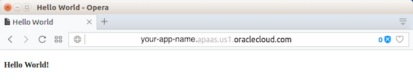

# Deploy a Ruby Application to Oracle Cloud #

## Before You Begin ##
This 10-minute tutorial shows you how to deploy a basic Ruby application in Oracle Application Container Cloud Service.

### Background ###
Oracle Application Container Cloud Service lets you deploy Java Platform, Standard Edition and Enterprise Edition, Node.js, PHP, Python, and Ruby applications to Oracle Cloud.

### What Do You Need? ###
* Access to an instance of Oracle Application Container Cloud Service
* [app.zip](app.zip) (The file contains the Ruby source code and `manifest.json` metadata file needed to launch a Ruby application.)

## Deploy Your Application to Oracle Application Container Cloud Service ##

1. Sign in to your instance of Oracle Application Container Cloud Service.
2. In the **Oracle Cloud Services** dashboard, click **Action**  and select **Oracle Application Container Cloud Service.**
3. To open the Oracle Application Container Cloud Service console, click **Services.**
4. In the **Applications** list view, click **Create Application** and select **Ruby**.
5. In the **Application** section, enter `app` for your application name and click **Browse.**
6. In the **File Upload** dialog box, select the `app.zip` file that you downloaded and click **Open.**
7. Keep the default values in the **Instances** and **Memory** fields and click **Create.**
8. Wait until the application is created. The URL is enabled after the application is created.

## Test Your Application ##

Click the URL of your application. "Hello World!" is displayed in the browser.

   

   [Description of the illustration ruby-app-response.png](files/ruby-app-response.txt)

## Want to Learn More? ##
* [About Your Application and Oracle Application Container Cloud Service](http://www.oracle.com/pls/topic/lookup?ctx=cloud&id=DVCJV-GUID-B477F7D6-C132-4CAF-97F4-75C13EFC538E) in the Oracle Help Center
* [The Ruby Programming Language](https://www.ruby-lang.org/)
